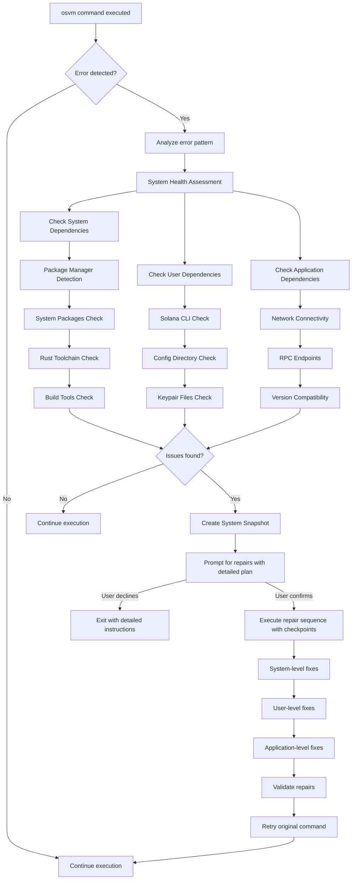
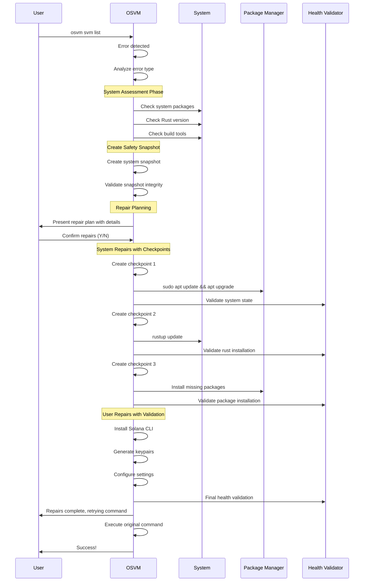
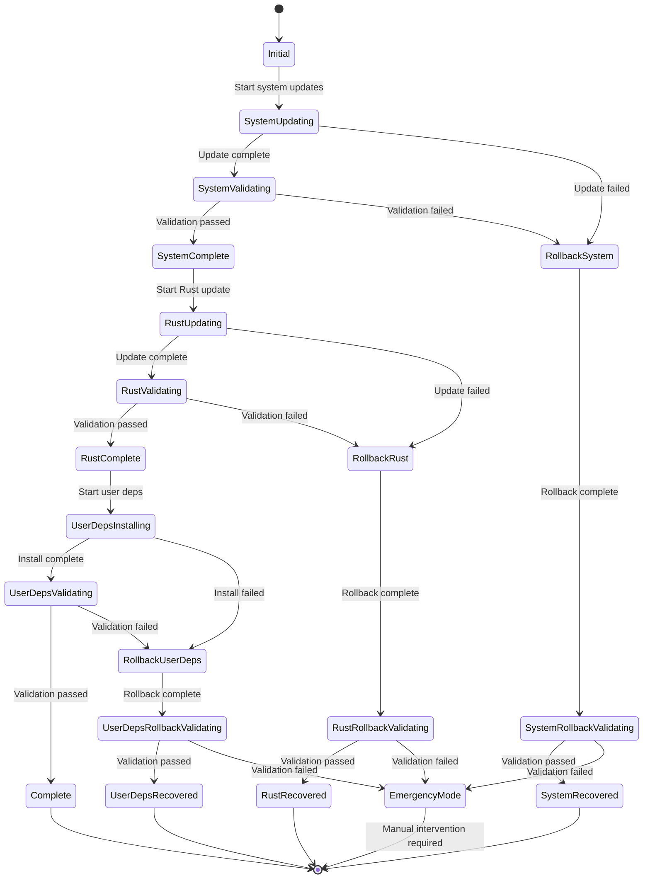

# OSVM Self-Repair System - Comprehensive Implementation Plan

## Executive Summary

This document outlines the implementation plan for a comprehensive self-repair system for the OSVM CLI tool. The system will automatically detect, diagnose, and repair dependency issues at both system and user levels, with robust error recovery and rollback mechanisms.

## Problem Analysis

### Current Issues
- **Keypair file errors**: [`main.rs:70`](src/main.rs:70) fails when `~/.config/solana/id.json` doesn't exist
- **Missing Solana CLI**: Users may not have Solana CLI installed
- **Outdated dependencies**: Rust, system packages, and build tools may be outdated
- **System-level dependencies**: Missing build tools, OpenSSL, pkg-config

### Error Pattern Example
```bash
➜ osvm svm list
Error: "Error reading keypair file /home/larp/.config/solana/id.json: No such file or directory (os error 2)"
```

## System Architecture

### High-Level Architecture


## Implementation Plan

### Phase 1: Multi-Level Dependency Infrastructure

#### Module Structure
```
src/utils/
├── self_repair/
│   ├── mod.rs                 # Main repair orchestrator
│   ├── system_deps.rs         # System-level dependency management
│   ├── user_deps.rs           # User-level dependency management
│   ├── package_managers.rs    # Cross-platform package manager support
│   ├── repair_strategies.rs   # Repair execution strategies
│   └── snapshots.rs           # Backup and restore functionality
└── diagnostics/
    ├── mod.rs                 # Diagnostic coordinator
    ├── system_health.rs       # System health assessment
    ├── version_checker.rs     # Version compatibility checking
    ├── connectivity.rs        # Network and endpoint testing
    └── rollback_validator.rs  # Post-rollback health validation
```

#### Core Data Structures
```rust
pub enum RepairableError {
    // System-level
    OutdatedSystemPackages,
    MissingBuildTools,
    OutdatedRustToolchain,
    MissingSystemDependencies(Vec<String>),
    
    // User-level
    MissingSolanaCli,
    OutdatedSolanaCli,
    MissingKeypair(String),
    InvalidConfig,
    
    // Network-level
    ConnectivityIssues,
    RpcEndpointFailure(String),
    
    // Permissions
    InsufficientPermissions(String),
}

pub enum PackageManager {
    Apt,        // Debian/Ubuntu
    Yum,        // RHEL/CentOS (legacy)
    Dnf,        // Fedora/RHEL 8+
    Pacman,     // Arch Linux
    Homebrew,   // macOS
    Chocolatey, // Windows
    Snap,       // Ubuntu Snap
    Flatpak,    // Universal Linux
}
```

### Phase 2: Enhanced Error Detection & Auto-Repair

#### Error Interception in main.rs
Replace direct `read_keypair_file()` call with wrapped version:

```rust
// Current code (line 70):
let signer = match solana_sdk::signature::read_keypair_file(&keypair_path) {
    Ok(signer) => signer,
    Err(err) => {
        return Err(format!("Error reading keypair file {}: {}", keypair_path, err).into());
    }
};

// Enhanced code:
let signer = match read_keypair_with_repair(&keypair_path).await {
    Ok(signer) => signer,
    Err(err) => return Err(err),
};
```

#### Multi-Stage Repair Process


### Phase 3: Enhanced Doctor Command

#### Command Line Interface
Add to [`clparse.rs`](src/clparse.rs):
```rust
.subcommand(
    Command::new("doctor")
        .about("Comprehensive system health check and repair")
        .arg(
            Arg::new("check-all")
                .long("check-all")
                .action(ArgAction::SetTrue)
                .help("Run comprehensive health check")
        )
        .arg(
            Arg::new("fix")
                .long("fix")
                .action(ArgAction::SetTrue)
                .help("Attempt to fix detected issues automatically")
        )
        .arg(
            Arg::new("system-only")
                .long("system-only")
                .action(ArgAction::SetTrue)
                .help("Check only system-level dependencies")
        )
        .arg(
            Arg::new("user-only")
                .long("user-only")
                .action(ArgAction::SetTrue)
                .help("Check only user-level dependencies")
        )
        .arg(
            Arg::new("verbose")
                .long("verbose")
                .short('v')
                .action(ArgAction::SetTrue)
                .help("Detailed diagnostic output")
        )
)
```

#### Doctor Command Output Example
```bash
$ osvm doctor --check-all
🩺 OSVM Comprehensive System Health Check
==========================================

🖥️  SYSTEM LEVEL
├── 📦 Package Manager: apt (Ubuntu 20.04)
├── 🔄 System Updates: 
│   ├── Available updates: 23 packages
│   └── Security updates: 5 packages
├── 🦀 Rust Toolchain:
│   ├── Version: 1.75.0 (stable)
│   ├── Status: ⚠️  Update available (1.76.0)
│   └── Components: rustc, cargo, rustfmt, clippy
└── 🛠️  Build Tools:
    ├── gcc: ✅ v9.4.0
    ├── pkg-config: ✅ v0.29.1
    ├── openssl-dev: ❌ Missing
    └── git: ✅ v2.25.1

👤 USER LEVEL  
├── 🌐 Solana CLI:
│   ├── Version: ❌ Not installed
│   └── Required for: keypair management, network config
├── 📁 Configuration:
│   ├── Config directory: ❌ Missing (~/.config/solana/)
│   └── Keypair files: ❌ Missing (id.json)
└── 🔧 OSVM Config:
    ├── Config file: ✅ ~/.config/osvm/config.yml
    └── Permissions: ✅ Readable

🌐 CONNECTIVITY
├── 📡 Internet: ✅ Connected
├── 🔗 Solana Mainnet: ✅ https://api.mainnet-beta.solana.com
├── 🔗 Solana Testnet: ✅ https://api.testnet.solana.com
└── 🔗 Solana Devnet: ✅ https://api.devnet.solana.com

⚠️  ISSUES FOUND: 4 issues require attention

🛠️  REPAIR RECOMMENDATIONS:
1. System package updates available
2. Rust toolchain update recommended  
3. Missing system dependency: libssl-dev
4. Solana CLI installation required

Would you like to fix these issues automatically? (Y/n)
```

### Phase 4: Cross-Platform System Updates

#### Platform-Specific Update Strategies

**Linux (Debian/Ubuntu):**
```bash
sudo apt update && sudo apt upgrade -y
sudo apt install -y build-essential pkg-config libssl-dev git curl
```

**Linux (RHEL/Fedora):**
```bash
sudo dnf update -y
sudo dnf groupinstall -y "Development Tools"
sudo dnf install -y openssl-devel git curl
```

**macOS:**
```bash
brew update && brew upgrade
xcode-select --install
brew install openssl pkg-config
```

**Windows:**
```powershell
choco upgrade all -y
# Visual Studio Build Tools installation
# Git, OpenSSL via chocolatey
```

### Phase 5: Advanced Safety & Recovery System

#### System Snapshot Framework
```rust
pub struct SystemSnapshot {
    snapshot_id: String,
    timestamp: DateTime<Utc>,
    system_state: SystemState,
    package_list: Vec<PackageInfo>,
    rust_version: String,
    solana_config: Option<SolanaConfig>,
    backup_paths: Vec<BackupItem>,
}

pub struct BackupItem {
    original_path: PathBuf,
    backup_path: PathBuf,
    checksum: String,
    operation_type: BackupType,
}
```

#### Atomic Operation Framework
```rust
pub struct RepairTransaction {
    id: String,
    operations: Vec<RepairOperation>,
    checkpoints: Vec<Checkpoint>,
    rollback_plan: RollbackPlan,
    state: TransactionState,
}

impl RepairTransaction {
    pub async fn execute(&mut self) -> Result<(), RepairError> {
        self.begin_transaction()?;
        
        for operation in &self.operations {
            match self.execute_operation(operation).await {
                Ok(_) => {
                    self.create_checkpoint(operation.checkpoint_type())?;
                    self.validate_system_health().await?; // Auto-validation
                }
                Err(e) => {
                    self.rollback_to_last_checkpoint().await?;
                    self.validate_rollback_success().await?; // Auto-validation after rollback
                    return Err(e);
                }
            }
        }
        
        self.commit_transaction()
    }
}
```

#### Enhanced Rollback with Automatic Health Validation



#### Post-Rollback Health Validation
```rust
pub struct RollbackValidator {
    critical_checks: Vec<Box<dyn HealthCheck>>,
    warning_checks: Vec<Box<dyn HealthCheck>>,
    timeout: Duration,
}

impl RollbackValidator {
    pub async fn validate_rollback_success(&self, checkpoint: &Checkpoint) -> Result<ValidationResult, ValidationError> {
        let mut results = ValidationResults::new();
        
        // Critical system functionality
        results.add(self.check_package_manager_functional().await?);
        results.add(self.check_rust_toolchain_functional().await?);
        results.add(self.check_system_services_running().await?);
        results.add(self.check_network_connectivity().await?);
        
        // Application-specific checks
        if checkpoint.contains_solana_changes() {
            results.add(self.check_solana_cli_functional().await?);
            results.add(self.check_solana_config_valid().await?);
        }
        
        // File system integrity
        results.add(self.check_backup_integrity().await?);
        results.add(self.check_restored_files().await?);
        
        if results.has_critical_failures() {
            Err(ValidationError::CriticalSystemFailure(results))
        } else {
            Ok(ValidationResult::Success(results))
        }
    }
}
```

#### Rollback Execution with Health Validation
```bash
❌ Operation failed at step 3/6: Rust toolchain update
🔄 Initiating rollback to checkpoint 2...

[1/4] 🦀 Reverting Rust toolchain changes...
rustup toolchain uninstall 1.76.0
rustup default 1.75.0
✅ Rust toolchain reverted to 1.75.0

[2/4] 📦 Restoring package manager state...
sudo apt-mark hold <held-packages>
✅ Package holds restored

[3/4] 🔍 Validating rollback success...
├── Package manager: ✅ Functional
├── Rust toolchain: ✅ v1.75.0 working
├── Build tools: ✅ All components functional
├── System services: ✅ All running normally
├── Network connectivity: ✅ All endpoints accessible
└── File integrity: ✅ All backups verified

[4/4] 🎯 System health validation complete
✅ Rollback completed successfully - System fully functional

⚠️  Your system has been restored to its previous working state.
📋 Issue: Rust update failed due to conflicting toolchain components
💡 Suggestion: Try manual update with: rustup update --force
🔧 Alternative: Use 'osvm doctor --fix' to attempt guided repair
```

### Phase 6: User Experience Enhancement

#### Progressive Repair with Detailed Feedback
```bash
$ osvm svm list
Error: "Error reading keypair file /home/larp/.config/solana/id.json: No such file or directory"

🔧 OSVM Self-Repair System Activated
=====================================

📊 Analyzing your system...
├── Detecting package manager... ✅ apt (Ubuntu)
├── Checking system packages... ⚠️  23 updates available
├── Checking Rust toolchain... ⚠️  Update available (1.75.0 → 1.76.0)
├── Checking build tools... ❌ libssl-dev missing
├── Checking Solana CLI... ❌ Not installed
└── Checking network... ✅ All endpoints accessible

📸 Creating system snapshot...
✅ Snapshot created: snap_20241213_071233

📋 REPAIR PLAN:
┌─ SYSTEM LEVEL (requires sudo)
│  ├── Update system packages (apt update && upgrade)
│  ├── Install libssl-dev for crypto operations
│  └── Update Rust toolchain to latest stable
├─ USER LEVEL
│  ├── Install Solana CLI v1.18.x
│  ├── Create configuration directory
│  └── Generate new keypair
└─ ESTIMATED TIME: ~5-10 minutes

⚠️  Some operations require administrator privileges.
🛡️  All operations are safe and reversible.
🔙 Rollback available via snapshot: snap_20241213_071233

Proceed with automatic repair? (Y/n): Y

🔄 Starting repair sequence...

[1/6] 🔒 Updating system packages...
│ Creating checkpoint: pre_system_update
│ sudo apt update && apt upgrade -y
│ ✅ System packages updated (23 packages)
│ 🔍 Validating system state... ✅ All systems functional

[2/6] 📦 Installing missing dependencies...
│ Creating checkpoint: pre_deps_install
│ sudo apt install -y libssl-dev
│ ✅ libssl-dev installed successfully
│ 🔍 Validating dependencies... ✅ All dependencies functional

[3/6] 🦀 Updating Rust toolchain...
│ Creating checkpoint: pre_rust_update
│ rustup update stable
│ ✅ Rust updated to 1.76.0
│ 🔍 Validating Rust installation... ✅ Rust toolchain functional

[4/6] 🌐 Installing Solana CLI...
│ Creating checkpoint: pre_solana_install
│ curl --proto '=https' --tlsv1.2 -sSfL https://solana-install.solana.workers.dev | bash
│ ✅ Solana CLI v1.18.23 installed
│ 🔍 Validating Solana CLI... ✅ Solana CLI functional

[5/6] 📁 Creating configuration directory...
│ mkdir -p ~/.config/solana
│ ✅ Configuration directory created
│ 🔍 Validating permissions... ✅ Directory accessible

[6/6] 🔑 Generating keypair...
│ solana-keygen new -o ~/.config/solana/id.json --no-passphrase
│ ✅ New keypair generated: 7xKz...9Abc
│ 🔍 Validating keypair... ✅ Keypair functional

🎉 All repairs completed successfully!
🔍 Final system validation... ✅ All systems operational
🔄 Retrying your original command...

Available SVMs in the chain:
[Command output continues...]
```

### Phase 7: Emergency Recovery Mode

#### Safe Mode Operation
```bash
⚠️  OSVM Emergency Recovery Mode
==============================

A critical error occurred during system repair.
OSVM is now running in safe mode with limited functionality.

🔒 Safe Mode Features:
├── Read-only operations only
├── No system modifications allowed
├── Limited network operations
├── Backup/restore functionality available
└── Diagnostic tools accessible

🛠️  Recovery Options:
[1] Restore from latest snapshot
[2] Restore from specific snapshot
[3] Manual system diagnosis
[4] Export diagnostic report
[5] Contact support with logs
[6] Exit and manual recovery

Current snapshots available:
├── snap_20241213_071233 (20 min ago) ✅ Verified, pre-repair
├── snap_20241213_065012 (45 min ago) ✅ Verified, daily backup
└── snap_20241212_143022 (1 day ago) ✅ Verified, working state

🔍 Recommended: Option 1 (restore latest snapshot)
   This will restore your system to its state before the failed repair.

Choose recovery option (1-6):
```

## Implementation Timeline

### Phase 1: Core Infrastructure (Week 1-2)
- [ ] Create module structure
- [ ] Implement basic error detection
- [ ] Add package manager detection
- [ ] Create snapshot system

### Phase 2: System-Level Repairs (Week 3-4)
- [ ] Implement cross-platform system updates
- [ ] Add Rust toolchain management
- [ ] Create build tools verification
- [ ] Add permission handling

### Phase 3: User-Level Repairs (Week 5-6)
- [ ] Implement Solana CLI installation
- [ ] Add configuration management
- [ ] Create keypair generation
- [ ] Add network validation

### Phase 4: Advanced Safety Features (Week 7-8)
- [ ] Implement atomic operations
- [ ] Add rollback mechanisms
- [ ] Create health validation system
- [ ] Add emergency recovery mode

### Phase 5: Doctor Command (Week 9-10)
- [ ] Implement comprehensive diagnostics
- [ ] Add manual repair options
- [ ] Create detailed reporting
- [ ] Add scheduled health checks

### Phase 6: Testing & Polish (Week 11-12)
- [ ] Cross-platform testing
- [ ] Edge case handling
- [ ] Performance optimization
- [ ] Documentation completion

## Testing Strategy

### Unit Tests
- Individual repair functions
- Error pattern matching
- Package manager detection
- Health validation logic

### Integration Tests
- Complete repair workflows
- Cross-platform compatibility
- Network failure scenarios
- Permission edge cases

### Safety Tests
- Rollback functionality
- Snapshot integrity
- Recovery mechanisms
- Emergency mode operation

### User Experience Tests
- Interactive prompts
- Progress reporting
- Error messaging
- Documentation clarity

## Success Criteria

1. **Automatic Error Detection**: System detects and categorizes 95% of common dependency issues
2. **Successful Repairs**: 90% of detected issues can be automatically resolved
3. **Safe Operations**: 100% of operations can be safely rolled back if needed
4. **Cross-Platform Support**: Works on Linux, macOS, and Windows
5. **User Experience**: Clear progress reporting and helpful error messages
6. **Recovery Guarantee**: System can always be restored to a working state

## Future Enhancements

1. **Proactive Monitoring**: Scheduled health checks and notifications
2. **Advanced Diagnostics**: Performance analysis and optimization recommendations
3. **Cloud Backup**: Remote backup storage for critical configurations
4. **Community Packages**: Support for additional SVM ecosystems
5. **Integration**: Package manager integration (apt, brew, chocolatey)

---

*This comprehensive plan ensures that OSVM becomes a truly self-maintaining tool that can handle the complex dependency requirements of modern SVM development environments while maintaining the highest standards of system safety and user experience.*