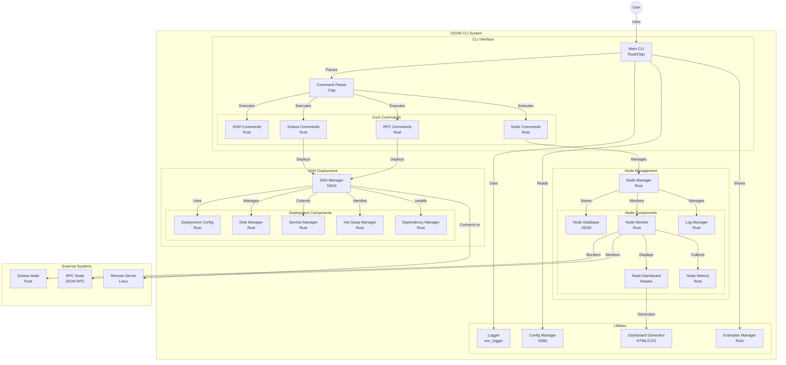

# OSVM CLI. pvv4fu1RvQBkKXozyH5A843sp1mt6gTy9rPoZrBBAGS 🚀

[](LICENSE)
[](https://www.rust-lang.org/)
[](https://solana.com/)

A powerful command-line interface for managing Solana Virtual Machines (SVMs) across various networks. Monitor, deploy, and manage your SVM infrastructure with a single tool.

## 📚 Documentation

For comprehensive documentation, please visit the [docs](docs/) directory:

- **[📖 Complete Documentation Index](docs/README.md)** - Start here for all documentation
- **[🚀 Quick Start Guide](docs/installation.md)** - Installation and setup
- **[💡 Examples & Patterns](docs/examples.md)** - Usage examples and workflows
- **[⚙️ Configuration Guide](docs/configuration.md)** - Configuration management

### Core Features Documentation

- **[🖥️ SVM Management](docs/svm-management.md)** - Manage Solana Virtual Machines
- **[🏗️ Node Management](docs/node-management.md)** - Deploy and monitor nodes
- **[🌐 SSH Deployment](docs/ssh-deployment.md)** - Remote deployment capabilities
- **[🔗 RPC Manager](docs/rpc-manager.md)** - RPC node management
- **[📊 Dashboard](docs/dashboard.md)** - Interactive monitoring interfaces

### Advanced Features Documentation

- **[🔧 Self-Repair System](docs/self-repair-system.md)** - Automated maintenance
- **[📋 Log Monitoring](docs/log-monitoring.md)** - Real-time log analysis
- **[⚡ Validator Enhancements](docs/validator-enhancements.md)** - Performance optimization
- **[📦 eBPF Deployment](docs/ebpf-deployment.md)** - Smart contract deployment



## ⚡ One-Line Installation

### Linux/macOS

```bash
curl -sSf https://raw.githubusercontent.com/opensvm/osvm-cli/main/install.sh | sh
```

### Windows

```bash
powershell -Command "Invoke-WebRequest -Uri 'https://raw.githubusercontent.com/opensvm/osvm-cli/main/install.ps1' -OutFile 'install.ps1'; .\install.ps1"
```

### Docker

Run OSVM CLI in a Docker container without installing it locally:

```bash
# Pull the latest image
docker pull ghcr.io/opensvm/osvm-cli:latest

# Run with version check
docker run --rm ghcr.io/opensvm/osvm-cli:latest --version

# Run with interactive mode (mount current directory)
docker run --rm -it -v $(pwd):/workspace ghcr.io/opensvm/osvm-cli:latest

# Use as an alias
alias osvm='docker run --rm -it -v $(pwd):/workspace ghcr.io/opensvm/osvm-cli:latest'
```

## 🌟 Key Features

- **SVM Management**: List and inspect Solana Virtual Machines
- **Node Deployment**: Deploy validator or dedicated RPC nodes with a single command
- **Interactive Dashboard**: Real-time monitoring with a terminal-based UI
- **Network Configuration**: Configure nodes for mainnet, testnet, or devnet
- **Performance Metrics**: Track TPS, latency, and system requirements
- **Colorized Output**: Enhanced readability with consistent color-coding for status, commands, and data
- **Command Examples**: Built-in examples for common workflows and operations
- **SSH Deployment**: Remote deployment and management capabilities

## 🚀 GitHub Actions Integration

OSVM CLI now includes a dedicated GitHub Action for seamless CI/CD integration! Deploy SVM nodes directly from your workflows with minimal configuration.

### Quick Start

```yaml
- name: Deploy SVM Node
  uses: ./.github/actions/svm-deploy
  with:
    svm-name: 'my-svm'
    host: 'user@example.com'
    ssh-private-key: ${{ secrets.SSH_PRIVATE_KEY }}
    network: 'devnet'
    node-type: 'validator'
```

### Features

- 🔒 **Secure**: Uses GitHub Secrets for sensitive data
- 🎯 **Configurable**: Support for different networks and node types  
- 📊 **Detailed Logging**: Comprehensive deployment logs
- 🔄 **Reusable**: Includes reusable workflows for common patterns

[📖 View Complete Documentation](.github/actions/svm-deploy/README.md) | [🔧 See Examples](examples/github-actions/)

---

## 📋 Command Reference

### SVM Management

```bash
# List all SVMs installed in the chain
osvm svm list

# Get detailed information about a specific SVM
osvm svm get sonic

# Launch interactive dashboard
osvm svm dashboard
```

### Command Examples and Help

```bash
# Show examples for all command categories
osvm examples

# Show examples for a specific category
osvm examples --category svm

# Available categories: basic, svm, node, monitoring, workflow

# List all available example categories
osvm examples --list-categories
```

### Node Deployment

```bash
# Deploy a validator node to a remote server (mainnet)
osvm user@host --svm sonic --node-type validator --network mainnet

# Deploy an RPC node to a remote server (testnet)
osvm user@host --svm sonic --node-type rpc --network testnet

# Deploy a Sonic RPC node to a remote server
osvm rpc sonic root@host.example.com --network mainnet

# Deploy multiple SVMs to a single server
osvm user@host --svm sonic,solana,eclipse,soon --node-type validator --network devnet

# Deploy an eBPF binary to all available SVM networks
osvm deploy ./path/to/ebpf.so --program-id ./path/to/program-address.json --owner ./path/to/program-owner.json --fee ./path/to/deployment-fee-payer.json --publish-idl
```

### RPC Node Deployment

```bash
# Deploy a Sonic RPC node to a remote server (mainnet)
osvm rpc sonic user@host --network mainnet

# Deploy a Sonic RPC node to a remote server (testnet)
osvm rpc sonic user@host --network testnet

# Deploy a Sonic RPC node to a remote server (devnet)
osvm rpc sonic user@host --network devnet

# Monitor devnet RPC node logs (automatically finds the most recent log file)
osvm rpc-manager devnet --logs

# Show specific number of recent log lines
osvm rpc-manager devnet --logs --lines 100

# Follow logs in real-time (similar to tail -f)
osvm rpc-manager devnet --logs --follow

# Start a local test validator for development (guaranteed to work)
osvm rpc-manager test --background --reset

# Check test validator status
osvm rpc-manager test --status

# Stop test validator
osvm rpc-manager test --stop
```

The `rpc-manager` command provides comprehensive RPC node management:

- **Test Validator**: Local development validator with guaranteed RPC functionality
  - Instant startup with no external dependencies
  - Built-in faucet for SOL airdrops
  - Perfect for local development and testing
  - Full Solana RPC API support
- **Devnet RPC**: Real devnet validator that syncs with live blockchain
  - Auto-repair system with real-time log monitoring
  - System parameter tuning (network limits, file descriptors, etc.)
  - External reachability fixes using ngrok tunnels
  - Port conflict resolution and memory optimization
- **Sonic RPC**: Deploys Sonic RPC nodes using Docker containers
- **Network Selection**: Choose between mainnet, testnet, or devnet environments
- **Automatic Configuration**: Handles all dependencies and configuration automatically
- **Comprehensive Logging**: Structured JSON logging to `osvm.log` for debugging

### eBPF Program Deployment

```bash
# Deploy an eBPF binary to all available SVM networks
osvm deploy ./path/to/ebpf.so --program-id ./path/to/program-address.json --owner ./path/to/program-owner.json --fee ./path/to/deployment-fee-payer.json --publish-idl

# Deploy with custom Anchor IDL file
osvm deploy ./path/to/ebpf.so --program-id ./path/to/program-address.json --owner ./path/to/program-owner.json --fee ./path/to/deployment-fee-payer.json --publish-idl --idl-file ./path/to/program.json

# Deploy to a specific network only
osvm deploy ./path/to/ebpf.so --program-id ./path/to/program-address.json --owner ./path/to/program-owner.json --fee ./path/to/deployment-fee-payer.json --network mainnet
```

The `deploy` command provides a streamlined way to deploy eBPF programs:

- **Multi-network Deployment**: Deploy to all SVM networks with one command
- **Network Selection**: Choose between mainnet, testnet, devnet, or all networks
- **IDL Publishing**: Option to publish the IDL along with the program
  - Auto-generated basic IDL (default)
  - Custom Anchor IDL JSON file support via `--idl-file` option
- **Required Files**:
  - eBPF binary (.so file)
  - **Program ID file**: 
    - For **new deployments**: Must be a keypair JSON file (contains private key)
    - For **upgrades**: Can be either a keypair file or pubkey-only JSON file
  - **Program owner keypair**: JSON file containing private key (required for all deployments)
  - **Fee payer keypair**: JSON file containing private key (pays for deployment transaction)

### File Format Requirements

**Keypair files** (generated with `solana-keygen new`):
```json
[123,45,67,89,...,234]  // Array of 64 bytes containing private key
```

**Pubkey-only files** (for upgrades only):
```json
{"programId": "HN4tEEGheziD9dqcWg4xZd29htcerjXKGoGiQXM5hxiS"}
```
or plain string:
```
HN4tEEGheziD9dqcWg4xZd29htcerjXKGoGiQXM5hxiS
```

## 🔧 Detailed Installation

### Prerequisites

- Rust 1.80.0 or later
- Solana CLI tools 1.14.29 or later

### From Source

```bash
# Clone the repository
git clone https://github.com/opensvm/osvm-cli.git
cd osvm-cli

# Build the project
cargo build --release

# Install the binary
sudo cp target/release/osvm /usr/local/bin/
```

## 📊 Dashboard Features

The interactive dashboard provides real-time monitoring of your SVM infrastructure, including:

- Overview of all installed SVMs with status indicators
- Network details for each SVM (mainnet, testnet, devnet)
- Performance metrics with real-time visualization
- Node status monitoring with resource usage
- Aggregated logs from all nodes

Launch the dashboard with:

```bash
osvm svm dashboard
```

### Keyboard Controls

- `Tab`, `Right Arrow`, `Left Arrow`: Switch between tabs
- `Up Arrow`, `Down Arrow`: Navigate through items
- `n`: Select next SVM
- `v`: Toggle verbosity level (affects displayed information detail)
- `p`: Select previous SVM
- `h`: Toggle help overlay
- `q` or `Ctrl+C`: Quit the dashboard

## 📚 Documentation

- [📖 GitHub Actions Integration](.github/actions/svm-deploy/README.md) - Complete guide for CI/CD integration
- [🔧 GitHub Actions Examples](examples/github-actions/) - Ready-to-use workflow examples
- [📋 Command Reference](#-command-reference) - All available commands and options
- [🎯 Usage Examples](#-usage-examples) - Common use cases and scenarios
- [🔧 Installation Guide](#-detailed-installation) - Step-by-step setup instructions
- [📊 Dashboard Features](#-dashboard-features) - Interactive monitoring capabilities

For complete documentation, visit [our official documentation](https://docs.opensvm.org).

## 🤝 Contributing

Contributions are welcome! Please feel free to submit a Pull Request.

### Development Setup

To ensure code quality and consistency, this project uses pre-commit hooks that enforce code formatting and linting.

#### Installing Pre-commit Hooks

Run the following command from the project root to install the pre-commit hooks:

```bash
./install-pre-commit-hook.sh
```

This will install a git hook that automatically runs:
- `cargo fmt --all -- --check` - Ensures code is properly formatted
- `cargo clippy` - Runs linting checks

#### Manual Code Quality Checks

You can also run these checks manually:

```bash
# Format your code
cargo fmt --all

# Check formatting without modifying files
cargo fmt --all -- --check

# Run clippy linting
cargo clippy --all-targets --all-features
```

#### Skipping Pre-commit Hooks

If you need to skip the pre-commit hook for a specific commit (not recommended), use:

```bash
git commit --no-verify -m "your message"
```

## 📄 License

This project is licensed under the MIT License - see the [LICENSE](LICENSE) file for details.
