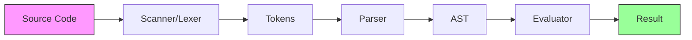
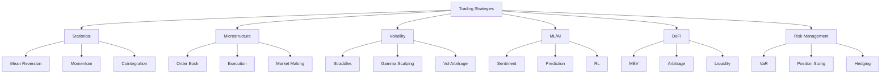
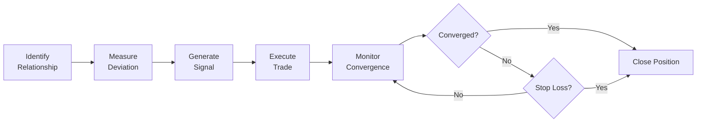
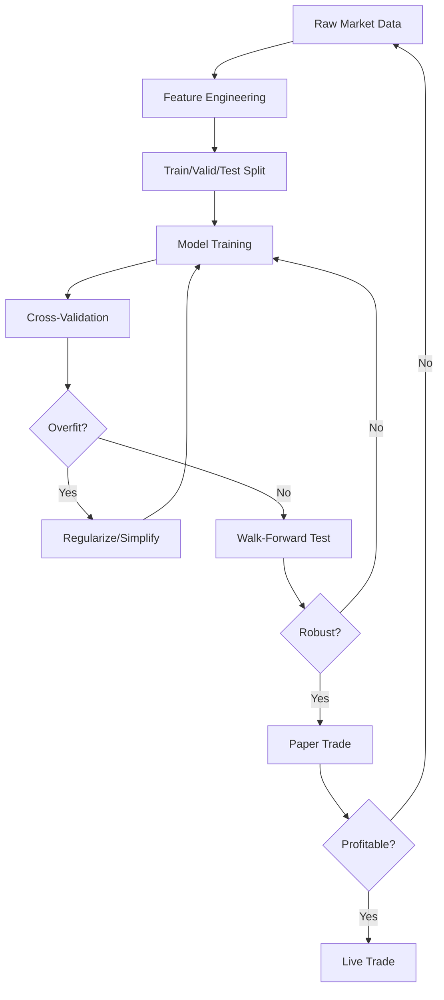
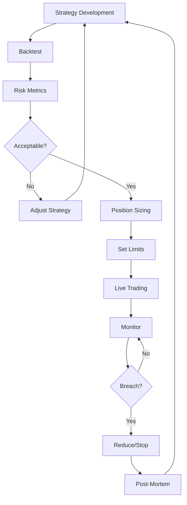

# OVSM Algorithmic Trading Guide

**A Practical Guide to Building Trading Strategies with OVSM**

---

## About This Guide

This guide complements the 100 OVSM examples in `examples/ovsm_complete/` by providing:
- **Conceptual frameworks** for understanding when to use different strategies
- **Pattern recognition** across similar strategies
- **Production considerations** not covered in pedagogical examples
- **Connections to academic literature** and established trading theory

**What this guide is NOT:**
- A line-by-line code walkthrough (examples already have inline comments)
- A comprehensive trading textbook (see bibliography for those)
- Production-ready trading advice (consult professionals)

**Prerequisites:**
- Basic programming knowledge
- Understanding of financial markets
- Familiarity with LISP syntax (see OVSM_LISP_SYNTAX_SPEC.md)

---

# Part I: OVSM Language Essentials

## Chapter 1: The OVSM Mental Model

### Why OVSM Exists

Trading strategy development faces a unique challenge: **expressing complex temporal logic with market data transformations in a way that's both precise and auditable**. General-purpose languages like Python or C++ require significant boilerplate:

```python
# Python: Verbose and scattered logic
def calculate_signal(prices):
    if len(prices) < 20:
        return None
    sma = sum(prices[-20:]) / 20
    if prices[-1] > sma:
        return "BUY"
    return "SELL"
```

OVSM (OpenSVM LISP) provides a domain-specific solution:

```lisp
;; OVSM: Declarative and composable
(define signal
  (if (< (length prices) 20)
      null
      (if (> (last prices) (/ (sum (take-last 20 prices)) 20))
          "BUY"
          "SELL")))
```

**Key Advantages:**
1. **Homoiconicity**: Code is data - strategies can generate strategies
2. **Immutability by default**: Reduces bugs in stateful trading logic
3. **REPL-driven development**: Test ideas interactively
4. **Minimal syntax**: Focus on strategy, not language quirks

### The Evaluation Model

OVSM follows a simple evaluation pipeline:



**Example evaluation:**

```lisp
(+ (* 2 3) 4)
```

1. **Scanner**: `[LPAREN, PLUS, LPAREN, STAR, INT(2), INT(3), RPAREN, INT(4), RPAREN]`
2. **Parser**: `Call(+, [Call(*, [2, 3]), 4])`
3. **Evaluator**: `Call(*, [2, 3])` → `6`, then `Call(+, [6, 4])` → `10`

**Mental model**: Everything is either:
- A **value** (numbers, strings, arrays, objects)
- An **S-expression** (parenthesized function call)
- A **special form** (`define`, `if`, `while`, `for`)

### When to Use OVSM vs Other Languages

| Use OVSM When | Use Python/C++ When |
|---------------|---------------------|
| Strategy prototyping | Production infrastructure |
| Research and backtesting | Low-latency execution |
| Strategy audit trails | Complex data pipelines |
| Declarative logic | Imperative algorithms |
| MCP tool orchestration | Direct hardware access |

**OVSM is a planning language**, not a replacement for production systems. Think of it as SQL for trading strategies - high-level, declarative, composable.

---

## Chapter 2: Core Language Reference

### Data Types

```lisp
;; Numbers (64-bit floats)
42                ; Integer-like
3.14159          ; Decimal
-100.5           ; Negative
1e6              ; Scientific notation (1,000,000)

;; Strings
"Hello, OVSM!"
"Multi\nline"
""               ; Empty string

;; Booleans
true
false

;; Null
null

;; Arrays (heterogeneous, mutable)
[1 2 3 4 5]
["SOL" "USDC" "BTC"]
[[1 2] [3 4]]    ; Nested

;; Objects (hash maps)
{:symbol "SOL/USDC"
 :price 100.5
 :volume 1000000}
```

### Variables

```lisp
;; Immutable binding
(define portfolio_value 100000)
(define risk_limit 0.02)

;; Mutable variable (use set! to change)
(define counter 0)
(set! counter (+ counter 1))  ; Now counter = 1

;; Scoping: let for temporary bindings
(let ((x 10)
      (y 20))
  (+ x y))  ; Returns 30
;; x and y don't exist here
```

**Best Practice**: Prefer `define` over `set!`. Mutation increases cognitive load and introduces bugs.

### Control Flow

```lisp
;; If-then-else (returns a value)
(if (> balance 10000)
    "HIGH"
    "LOW")

;; When (for side effects, no else branch)
(when (< position max_position)
  (log :message "Entering position")
  (set! position (+ position 1)))

;; While loop
(define i 0)
(while (< i 10)
  (log :value i)
  (set! i (+ i 1)))

;; For-each loop
(for (price prices)
  (log :value price))
```

### Operators

```lisp
;; Arithmetic (variadic)
(+ 1 2 3)        ; 6
(- 10 3 2)       ; 5
(* 2 3 4)        ; 24
(/ 100 2 5)      ; 10
(% 17 5)         ; 2

;; Comparison
(= x y)          ; Equal
(!= x y)         ; Not equal
(< x y)
(<= x y)
(> x y)
(>= x y)

;; Logical
(and true false)  ; false
(or true false)   ; true
(not true)        ; false
```

### Helper Functions

```lisp
;; Type checking
(null? value)     ; Is null?
(empty? arr)      ; Is array/string empty?

;; Collections
(length [1 2 3])  ; 3
(first [1 2 3])   ; 1
(last [1 2 3])    ; 3
(drop [1 2 3] 1)  ; [2 3] (skip first 1)
(append [1 2] [3 4])  ; [1 2 3 4]

;; Range (EXCLUSIVE upper bound)
(range 1 5)       ; [1 2 3 4] (5 is excluded!)

;; Time
(now)             ; Unix timestamp (seconds since epoch)

;; Logging
(log :message "text" :value expr)
```

### Sequential Execution

```lisp
;; Do block - execute multiple expressions, return last
(do
  (log :message "Step 1")
  (define x 10)
  (log :message "Step 2")
  (+ x 20))       ; Returns 30

;; Let block - lexical scoping
(let ((temp (* price quantity))
      (fee (* temp 0.001)))
  (- temp fee))   ; Returns net amount
```

---

## Chapter 3: Common Patterns and Idioms

### Pattern 1: Iterative Accumulation

**Problem**: Calculate sum, mean, or aggregate over array.

```lisp
;; Anti-pattern: Functional but inefficient
(define sum (reduce + 0 prices))  ; reduce not built-in

;; OVSM idiom: Loop with accumulator
(define sum 0)
(for (price prices)
  (set! sum (+ sum price)))
(define mean (/ sum (length prices)))
```

### Pattern 2: Conditional Accumulation

**Problem**: Count elements matching a condition.

```lisp
;; Example: Count prices above threshold
(define threshold 100)
(define count_above 0)

(for (price prices)
  (when (> price threshold)
    (set! count_above (+ count_above 1))))

(log :message "Prices above threshold:" :value count_above)
```

### Pattern 3: Array Transformation

**Problem**: Build new array from existing one.

```lisp
;; Example: Calculate returns from prices
(define returns [])
(define i 0)

(while (< i (- (length prices) 1))
  (define curr_price (first (drop prices i)))
  (define next_price (first (drop prices (+ i 1))))
  (define ret (/ (- next_price curr_price) curr_price))
  (set! returns (append returns [ret]))
  (set! i (+ i 1)))
```

**Note**: `drop` + `first` is the idiomatic way to index arrays in OVSM.

### Pattern 4: Handling Edge Cases

```lisp
;; Division by zero protection
(define ratio (if (= denominator 0)
                  0  ; or null, depending on semantics
                  (/ numerator denominator)))

;; Empty array protection
(define mean (if (empty? prices)
                 null
                 (/ (sum prices) (length prices))))

;; Minimum array length
(when (< (length prices) min_required)
  (log :message "Insufficient data")
  (return null))  ; Conceptual - use early exit pattern
```

### Pattern 5: State Machines

```lisp
;; Example: Position state
(define state "FLAT")  ; FLAT, LONG, SHORT

(do
  (when (and (= state "FLAT") (> signal entry_threshold))
    (log :message "Entering LONG")
    (set! state "LONG"))

  (when (and (= state "LONG") (< signal exit_threshold))
    (log :message "Exiting to FLAT")
    (set! state "FLAT"))

  (when (and (= state "FLAT") (< signal (- entry_threshold)))
    (log :message "Entering SHORT")
    (set! state "SHORT"))

  (when (and (= state "SHORT") (> signal (- exit_threshold)))
    (log :message "Exiting to FLAT")
    (set! state "FLAT")))
```

---

## Chapter 4: Debugging Strategies

### Common Syntax Errors

**Error 1: Unbalanced Parentheses**
```lisp
;; Wrong
(+ 1 2 3))  ; Extra closing paren

;; Right
(+ 1 2 3)
```

**Error 2: Missing Operators in Arithmetic**
```lisp
;; Wrong
(2 + 3)  ; Infix notation doesn't work

;; Right
(+ 2 3)
```

**Error 3: Incorrect Range Usage**
```lisp
;; Common mistake
(range 1 5)  ; Returns [1 2 3 4] NOT [1 2 3 4 5]

;; If you want inclusive: add 1
(range 1 (+ 5 1))  ; [1 2 3 4 5]
```

### Runtime Debugging Techniques

**Technique 1: Strategic Logging**
```lisp
(do
  (log :message "Before calculation" :value balance)
  (define new_balance (* balance (+ 1 return)))
  (log :message "After calculation" :value new_balance)
  new_balance)
```

**Technique 2: Incremental Testing in REPL**
```bash
$ osvm ovsm repl
> (define prices [100 101 102])
> (define returns [])
> (define i 0)
> (< i (- (length prices) 1))
true
> (first (drop prices 0))
100
```

**Technique 3: Simplify Expressions**
```lisp
;; Complex expression failing?
(define result (/ (+ (* a b) c) (- d e)))

;; Break it down:
(define ab (* a b))
(log :value ab)
(define numerator (+ ab c))
(log :value numerator)
(define denominator (- d e))
(log :value denominator)
(define result (if (= denominator 0)
                   null
                   (/ numerator denominator)))
```

### Understanding Error Messages

**Error: "Undefined variable"**
- Check spelling and capitalization
- Ensure variable is defined before use
- Check scope (inside vs outside `let` block)

**Error: "Division by zero"**
- Add conditional checks before division
- Use `(if (= denom 0) ...)` pattern

**Error: "Index out of bounds"** (conceptual)
- Check array length before indexing with `drop`
- Use `(< index (length arr))` guards

---

## Chapter 5: Integration with Solana and MCP

### MCP (Model Context Protocol)

OVSM can orchestrate external tools via MCP servers:

```lisp
;; Conceptual - actual MCP integration depends on available tools
(define account_data (getAccountInfo "wallet_address"))
(define balance (get account_data "balance"))

(when (> balance minimum_balance)
  (log :message "Account has sufficient balance"))
```

**Available MCP Tools** (check `osvm mcp list`):
- Blockchain data: `getTransaction`, `getSignaturesForAddress`, `getBalance`
- Token data: `getTokenAccounts`, `getTokenMetadata`
- Program data: `getProgramAccounts`
- Custom analytics from MCP servers

### Async Considerations

OVSM evaluation is **synchronous**, but MCP tools may perform async operations internally. The OVSM runtime handles this transparently - you write synchronous code:

```lisp
;; This looks sync, but may perform async RPC call
(define tx (getTransaction "signature"))
;; Result is available immediately after return
(define amount (get tx "amount"))
```

### Best Practices for MCP Integration

1. **Cache expensive calls**
   ```lisp
   (define account_cache (getAccountInfo wallet))
   ;; Use account_cache multiple times instead of re-fetching
   ```

2. **Handle missing data**
   ```lisp
   (define tx (getTransaction sig))
   (when (null? tx)
     (log :message "Transaction not found")
     (return null))
   ```

3. **Batch operations when possible**
   ```lisp
   ;; Instead of N individual calls
   (for (sig signatures)
     (getTransaction sig))  ; N RPC calls

   ;; Use batch if available
   (getTransactions signatures)  ; 1 RPC call
   ```

---

# Part II: Strategy Implementation Patterns

## Understanding Strategy Categories

The 100 OVSM examples fall into natural categories based on their **core mechanism**:



---

## Category 1: Market Microstructure (Examples 8-10, 84-87)

### Core Concept

Market microstructure studies **how trading mechanisms affect price formation**. Key questions:
- How does the order book predict short-term price movements?
- What is the "true" price given bid-ask spread?
- How do we measure informed vs uninformed trading?

### Key Metrics

**1. Order Flow Imbalance (OFI)**

Measures buy vs sell pressure in the order book:

```
OFI = (BidVolume - AskVolume) / (BidVolume + AskVolume)
```

- OFI > 0: More buying pressure → price likely to rise
- OFI < 0: More selling pressure → price likely to fall

**Implementation Pattern** (see Example 8):
```lisp
(define total_bid_volume (sum bid_volumes))
(define total_ask_volume (sum ask_volumes))
(define ofi (/ (- total_bid_volume total_ask_volume)
               (+ total_bid_volume total_ask_volume)))
```

**2. Microprice**

Weighted mid-price accounting for volume at best bid/ask:

```
Microprice = (BidPrice × AskVolume + AskPrice × BidVolume) / (BidVolume + AskVolume)
```

More accurate than simple mid-price when book is imbalanced.

**3. VWAP (Volume-Weighted Average Price)**

Benchmark for execution quality:

```
VWAP = Σ(Price × Volume) / Σ(Volume)
```

**When to use microstructure strategies:**
- High-frequency trading (< 1 second holding)
- Market making
- Execution algorithm optimization
- Low-latency environments

**When NOT to use:**
- Low-frequency trading (> 1 day holding)
- Illiquid markets (wide spreads, sparse order book)
- High transaction costs (fees dominate edge)

### Related Examples
- Example 8: Market Microstructure (OFI, microprice)
- Example 9: Execution Algorithms (VWAP, TWAP)
- Example 10: Market Making (bid-ask spread management)
- Examples 84-87: Order Book Dynamics (depth analysis, toxicity)

### Further Reading
- Hasbrouck, J. (1991). "Measuring the Information Content of Stock Trades"
- O'Hara, M. (1995). *Market Microstructure Theory*
- Easley, D., et al. (2012). "Flow Toxicity and Liquidity in a High-Frequency World"

---

## Category 2: Statistical Arbitrage (Examples 11, 24-26)

### Core Concept

Statistical arbitrage exploits **mean-reverting relationships** between assets. Unlike pure arbitrage (riskless), stat-arb has:
- Model risk (relationship breaks down)
- Execution risk (can't establish positions at expected prices)
- Regime risk (relationship valid in some markets, not others)

### The Fundamental Pattern



### Pairs Trading (Example 11)

**Theory**: Two correlated assets occasionally diverge, then revert to historical relationship.

**Mathematical Framework**:

1. **Spread**: `S(t) = log(P_A(t)) - β × log(P_B(t))`
   - β (hedge ratio) chosen to make S(t) stationary

2. **Z-Score**: `Z(t) = (S(t) - μ_S) / σ_S`
   - μ_S: mean of spread
   - σ_S: standard deviation of spread

3. **Trading Rule**:
   - Z > +2: Short spread (sell A, buy B)
   - Z < -2: Long spread (buy A, sell B)
   - |Z| < 0.5: Close position

**Implementation Pattern**:
```lisp
;; Calculate spread
(define spread (/ price_a price_b))

;; Calculate z-score
(define z_score (/ (- spread mean_spread) std_dev_spread))

;; Generate signal
(define signal
  (if (> z_score 2.0)
      "SHORT_SPREAD"
      (if (< z_score -2.0)
          "LONG_SPREAD"
          (if (and (> z_score -0.5) (< z_score 0.5))
              "CLOSE"
              "HOLD"))))
```

**Critical Considerations**:

1. **Cointegration vs Correlation**
   - Correlation: ρ(X,Y) measures linear relationship
   - Cointegration: Spread is mean-reverting
   - **Two assets can be correlated but NOT cointegrated!**

2. **Parameter Sensitivity**
   - Entry threshold (2σ vs 2.5σ vs 3σ)
   - Exit threshold (0.5σ vs 0σ vs -0.5σ)
   - Lookback period for mean/std calculation

3. **Transaction Costs**
   - Mean-reversion profit must exceed 2× bid-ask spread + fees
   - High-frequency stat-arb requires maker rebates

**When it works:**
- Stable market regimes
- High correlation (>0.7)
- Sufficient liquidity in both assets
- Low transaction costs

**When it fails:**
- Regime change (correlation breakdown)
- One asset experiences idiosyncratic shock
- Liquidity crisis (can't exit positions)

### Statistical Momentum (Example 24)

**Theory**: Assets exhibiting short-term momentum (trending) offer profits if captured before reversion.

**Key Difference from Pairs Trading**:
- Pairs trading: Bet on **convergence**
- Momentum: Bet on **continuation**

**When to use each**:
- Mean reversion: High-frequency (< 1 day), stable markets
- Momentum: Medium-frequency (1-20 days), trending markets

### Related Examples
- Example 11: Pairs Trading (cointegration)
- Example 24: Statistical Momentum
- Example 25: Multi-Factor Alpha
- Example 26: Regime Detection

### Further Reading
- Vidyamurthy, G. (2004). *Pairs Trading: Quantitative Methods and Analysis*
- Pole, A. (2007). *Statistical Arbitrage: Algorithmic Trading Insights and Techniques*
- Jegadeesh, N., & Titman, S. (1993). "Returns to Buying Winners and Selling Losers"

---

## Category 3: Volatility Trading (Examples 12, 44-46, 62, 96-98)

### Core Concept

Volatility trading exploits the difference between:
- **Implied Volatility (IV)**: Market's expectation of future volatility (from option prices)
- **Realized Volatility (RV)**: Actual historical volatility

**Key Insight**: IV and RV often diverge. Profitable strategies bet on convergence.

### Theoretical Foundation: Black-Scholes

The Black-Scholes PDE for option pricing:

```
∂V/∂t + (1/2)σ²S²(∂²V/∂S²) + rS(∂V/∂S) - rV = 0
```

Where:
- V = option value
- S = stock price
- σ = volatility (the parameter we're trading)
- r = risk-free rate

**Greeks** measure sensitivity to parameters:

| Greek | Measures | Formula |
|-------|----------|---------|
| Delta (Δ) | ∂V/∂S | Change in option value per $1 move in underlying |
| Gamma (Γ) | ∂²V/∂S² | Change in Delta per $1 move in underlying |
| Vega (ν) | ∂V/∂σ | Change in option value per 1% change in IV |
| Theta (Θ) | ∂V/∂t | Time decay (per day) |

### Strategy 1: Gamma Scalping (Example 44)

**Theory**: Long gamma position profits from realized volatility exceeding implied volatility.

**Mechanism**:
1. Buy straddle (long call + long put) → Long gamma
2. Delta-hedge continuously by trading underlying
3. Profit from rehedging if RV > IV

**Example**:
- Buy 10 ATM call contracts (Δ = 0.5, Γ = 0.02 per contract)
- Initial delta = 10 × 100 × 0.5 = 500 shares
- Hedge: Sell 500 shares of underlying

If stock moves $2 up:
- New delta = 10 × 100 × (0.5 + 0.02 × 2) = 540 shares
- Rehedge: Sell 40 more shares at $2 profit

**P&L Formula**:
```
Gamma P&L ≈ (1/2) × Γ × (ΔS)²
Theta Loss ≈ Θ × Δt
Net P&L = Gamma P&L - Theta Loss
```

Profit if: Realized vol > Implied vol

**Implementation Pattern**:
```lisp
(define gamma_per_contract 0.02)
(define num_contracts 10)
(define contract_size 100)
(define price_move 2)

(define gamma_total (* (* gamma_per_contract num_contracts) contract_size))
(define delta_change (* gamma_total price_move))
(define rehedge_shares delta_change)
(define rehedge_profit (* rehedge_shares price_move))
(log :message "Rehedging profit:" :value rehedge_profit)
```

### Strategy 2: Volatility Surface Arbitrage (Example 46)

**Theory**: Options with same underlying should satisfy no-arbitrage constraints. Violations → arbitrage.

**Key Relationships**:
1. **Call-Put Parity**: `C - P = S - K × e^(-rT)`
2. **Butterfly Arbitrage**: Convexity constraints on strike prices
3. **Calendar Arbitrage**: Term structure constraints

**When it works:**
- Liquid options markets
- Low transaction costs
- Fast execution (arb disappears quickly)

### Strategy 3: GARCH Volatility Forecasting (Example 62)

**Theory**: Volatility clusters - high volatility tends to persist.

**GARCH(1,1) Model**:
```
σ²(t) = ω + α × r²(t-1) + β × σ²(t-1)
```

Where:
- σ²(t) = forecasted variance
- r(t-1) = previous return
- ω, α, β = parameters (α + β < 1 for stationarity)

**Trading Rule**:
- If GARCH forecast > IV → Buy volatility (long straddle)
- If GARCH forecast < IV → Sell volatility (short straddle)

### When to Use Volatility Strategies

| Strategy | Market Condition | Holding Period | Skill Required |
|----------|------------------|----------------|----------------|
| Gamma Scalping | IV > RV expected | 1-30 days | High (continuous hedging) |
| Vol Surface Arb | Mispriced options | Minutes-Hours | Very High (low latency) |
| GARCH Trading | Vol regime change | 1-7 days | Medium (forecasting) |
| Long Vol (Straddles) | Expect large move | 7-60 days | Low (directional bet) |

### Related Examples
- Example 12: Options Volatility Basics
- Example 44: Gamma Scalping
- Example 45: Dispersion Trading
- Example 46: Volatility Surface Arbitrage
- Example 62: Conditional Volatility Trading
- Examples 96-98: Exotic Options (barriers, Asian, variance swaps)

### Further Reading
- Hull, J. (2017). *Options, Futures, and Other Derivatives* (Chapters 13-19)
- Taleb, N. N. (1997). *Dynamic Hedging: Managing Vanilla and Exotic Options*
- Gatheral, J. (2006). *The Volatility Surface: A Practitioner's Guide*
- Bollerslev, T. (1986). "Generalized Autoregressive Conditional Heteroskedasticity"

---

## Category 4: Machine Learning Strategies (Examples 13-14, 48, 51)

### Core Concept

Machine learning in trading attempts to **discover patterns in data that traditional models miss**. However, it introduces significant risks:
- **Overfitting**: Model fits noise, not signal
- **Regime change**: Patterns learned in training don't persist
- **Data snooping**: Testing multiple models on same data inflates performance

### The ML Trading Pipeline



### Feature Engineering

**Good Features** (Example 13):
- **Price-based**: Returns, volatility, ATR
- **Volume-based**: Volume profile, VWAP deviation
- **Microstructure**: Bid-ask spread, order imbalance
- **Time**: Day of week, time of day, holidays
- **Sentiment**: News sentiment, social media

**Anti-patterns**:
- ❌ Using future data (look-ahead bias)
- ❌ Non-stationary features (absolute prices)
- ❌ Highly correlated features (multicollinearity)

### Strategy 1: Sentiment-Driven Trading (Example 13, 48)

**Theory**: News and social media sentiment predict short-term price movements before they're fully reflected in prices.

**Challenges**:
1. **Signal delay**: By the time you see news, HFTs already traded on it
2. **Sentiment measurement**: Text → number mapping is subjective
3. **Sentiment ≠ Price**: Positive news doesn't guarantee price increase

**Implementation Pattern**:
```lisp
;; Sentiment scores from NLP (example values)
(define sentiment_scores [0.8 0.6 -0.3 0.9 -0.7])  ; Range [-1, 1]

;; Aggregate sentiment
(define avg_sentiment (/ (sum sentiment_scores) (length sentiment_scores)))

;; Trading signal
(define signal
  (if (> avg_sentiment 0.5)
      "BUY"
      (if (< avg_sentiment -0.5)
          "SELL"
          "HOLD")))
```

**Reality Check**:
- Academic studies show sentiment has **weak predictive power** (R² < 0.05)
- Works best for **illiquid assets** where information disseminates slowly
- Requires **very low latency** for liquid assets

### Strategy 2: LSTM Price Prediction (Example 14)

**Theory**: Recurrent neural networks can learn temporal dependencies in price sequences.

**Why LSTMs for Time Series**:
- Traditional NN: No memory of previous inputs
- RNN: Vanishing gradient problem
- LSTM: Solves vanishing gradient with gated memory cells

**Common Pitfall**:
```lisp
;; This looks impressive but is meaningless:
(define predicted_price 150.23)
(define actual_price 150.25)
(define error (- predicted_price actual_price))  ; -0.02, "accurate"!

;; But what matters is DIRECTION for trading:
(define predicted_return (/ (- predicted_price prev_price) prev_price))
(define actual_return (/ (- actual_price prev_price) prev_price))
```

**90% of "price prediction" models fail this test**: They minimize MSE (Mean Squared Error) on prices, but have no directional accuracy.

**Better approach**: Predict returns or direction, not absolute prices.

### Strategy 3: Reinforcement Learning Execution (Example 51)

**Theory**: RL agent learns optimal execution policy by maximizing cumulative reward (minimizing market impact and slippage).

**Q-Learning Framework**:
- **State**: Current inventory, time remaining, order book state
- **Action**: Order size and price
- **Reward**: -1 × (slippage + market impact)
- **Goal**: Learn policy π(s) that maximizes expected reward

**Why RL for Execution**:
- Non-stationary environment (market conditions change)
- Sequential decision making (each trade affects future states)
- Exploration-exploitation tradeoff (try new strategies vs exploit known good ones)

**Challenge**: Sample efficiency - need millions of trades to train, but can't afford to lose money during learning.

### Overfitting Detection

**Symptoms**:
- Training accuracy 95%, test accuracy 55%
- Sharp ratio on backtest: 3.5, live trading: 0.8
- Many hyperparameters tuned on same test set

**Solutions**:
1. **Walk-forward validation**: Train on [t₀, t₁], test on [t₁, t₂], retrain, test on [t₂, t₃], ...
2. **Regularization**: L1/L2 penalties, dropout, early stopping
3. **Simplicity**: Prefer linear models over deep NNs when possible
4. **Cross-validation**: K-fold, but respecting time series (no shuffling)

### When to Use ML Strategies

| Use ML When | Don't Use ML When |
|-------------|-------------------|
| High-dimensional feature space | Simple relationships (use linear models) |
| Non-linear patterns | Limited data (<1000 samples) |
| Continuous adaptation needed | Strategy must be explainable to regulators |
| Computational resources available | Low latency required (<1ms) |

### Related Examples
- Example 13: AI Sentiment Trading
- Example 14: ML Prediction Trading
- Example 48: Sentiment-Driven Momentum
- Example 51: Reinforcement Learning Execution

### Further Reading
- López de Prado, M. (2018). *Advances in Financial Machine Learning*
- Chan, E. (2017). *Machine Trading: Deploying Computer Algorithms to Conquer the Markets*
- Dixon, M., et al. (2020). *Machine Learning in Finance: From Theory to Practice*
- Moody, J., & Saffell, M. (2001). "Learning to Trade via Direct Reinforcement"

---

## Category 5: DeFi and MEV Strategies (Examples 15-23, 63, 69-73)

### Core Concept

DeFi (Decentralized Finance) introduces novel trading opportunities unavailable in traditional finance:
- **Composability**: Atomic execution of multi-step strategies
- **Transparency**: All transactions visible before execution (mempool)
- **Permissionless**: No KYC/AML gatekeeping
- **MEV**: Miners/validators can reorder, insert, or censor transactions

### MEV (Maximal Extractable Value)

**Definition**: Profit extractable by reordering, inserting, or censoring transactions in a block.

**Types of MEV**:

1. **Frontrunning**: See profitable transaction in mempool, submit yours first with higher gas
   ```
   User's TX: Buy 10 ETH worth of TOKEN (price impact: +5%)
   Bot's TX: Buy 5 ETH worth of TOKEN first → Price rises
   User's TX executes at higher price
   Bot's TX: Sell 5 ETH worth of TOKEN at profit
   ```

2. **Backrunning**: Execute transaction immediately after target transaction
   ```
   Large Buy TX executes → Price spikes temporarily
   Bot's TX: Arbitrage price difference across DEXs
   ```

3. **Sandwiching**: Frontrun AND backrun
   ```
   Bot's TX1: Buy TOKEN (price up)
   User's TX: Buy TOKEN (price up more, worse execution)
   Bot's TX2: Sell TOKEN (profit from price difference)
   ```

### Strategy 1: PumpSwap Sniping (Example 15)

**Theory**: New token launches often experience rapid price appreciation in first few blocks. Buy immediately after launch, sell after pump.

**Implementation Pattern**:
```lisp
(define new_token_address "...")
(define min_liquidity 1000)  ; Filter out rug pulls

;; Check if token just launched
(define pool_age (- (now) pool_creation_time))
(when (< pool_age 60)  ; Within 60 seconds
  (define liquidity (getPoolLiquidity new_token_address))

  (when (> liquidity min_liquidity)
    ;; Submit buy transaction with high gas
    (log :message "SNIPING" :value new_token_address)))
```

**Reality Check**:
- Success rate: ~5-10% (most tokens are rug pulls or fail to pump)
- Competition: Bots with lower latency beat you
- Risk: Honeypot contracts (can buy, can't sell)

### Strategy 2: Flash Loan Arbitrage (Example 19)

**Theory**: Borrow large amounts without collateral, execute arbitrage, repay within same transaction.

**Flash Loan Mechanics**:
```
1. Borrow 10,000 USDC (no collateral)
2. Buy 5 ETH on DEX A at $2,000/ETH
3. Sell 5 ETH on DEX B at $2,050/ETH
4. Repay 10,000 USDC + fee (0.09% = $9)
5. Profit = (5 × $50) - $9 = $241
```

**If step 4 fails** (can't repay), entire transaction reverts - no loss!

**Atomic Execution** (Example implementation):
```lisp
(do
  ;; 1. Flash loan
  (define borrowed_amount 10000)

  ;; 2. Calculate optimal arbitrage
  (define dex_a_price 2000)
  (define dex_b_price 2050)
  (define amount_to_arb (/ borrowed_amount dex_a_price))

  ;; 3. Execute arbitrage
  (define proceeds (* amount_to_arb dex_b_price))

  ;; 4. Repay flash loan
  (define fee (* borrowed_amount 0.0009))
  (define total_repay (+ borrowed_amount fee))

  ;; 5. Check profitability (in production, this would revert if false)
  (when (< proceeds total_repay)
    (log :message "Unprofitable - would revert")
    (return null))

  (define profit (- proceeds total_repay))
  (log :message "Flash loan profit:" :value profit))
```

**Challenges**:
- **Gas costs**: Complex transactions can cost $50-500 in gas
- **Competition**: Need to be fastest to execute arbitrage
- **Slippage**: Large trades move prices, reducing profit

### Strategy 3: DEX Routing Optimization (Example 63)

**Theory**: When trading large amounts, splitting order across multiple DEXs reduces price impact.

**Problem**: Find optimal split to minimize total cost:
```
Minimize: Cost_DEX1(x1) + Cost_DEX2(x2) + ... + Cost_DEXn(xn)
Subject to: x1 + x2 + ... + xn = Target Amount
```

**Constant Product AMM** (Uniswap model):
```
x × y = k (constant)

Price impact when buying Δy:
Δx = (k / (y - Δy)) - x
```

**Implementation Pattern**:
```lisp
;; Liquidity pools
(define pool_a_liquidity 1000)  ; TOKEN reserve
(define pool_b_liquidity 500)

;; Target amount
(define target_amount 100)

;; Simple heuristic: Split proportional to liquidity
(define total_liquidity (+ pool_a_liquidity pool_b_liquidity))
(define amount_a (* target_amount (/ pool_a_liquidity total_liquidity)))
(define amount_b (* target_amount (/ pool_b_liquidity total_liquidity)))

(log :message "Route via Pool A:" :value amount_a)
(log :message "Route via Pool B:" :value amount_b)
```

**Advanced**: Use dynamic programming or gradient descent for optimal split.

### When to Use DeFi Strategies

| Strategy | Timeframe | Capital Req | Risk Level | Competition |
|----------|-----------|-------------|------------|-------------|
| PumpSwap Sniping | Seconds | $100-1K | Very High | Extreme |
| Flash Loan Arb | Seconds | $0 (borrowed) | Medium | Very High |
| DEX Routing | Minutes | $10K+ | Low | Medium |
| Liquidity Provision | Days-Months | $50K+ | Medium | Low |
| Funding Rate Arb | Hours-Days | $100K+ | Low | Medium |

### Related Examples
- Example 15: PumpSwap Sniper
- Example 16: Memecoin Momentum
- Example 17: Whale Copy Trading
- Example 18: MEV Bundle Sniping
- Example 19: Flash Loan Sniping
- Example 20: Liquidity Pool Sniping
- Example 21: Rug Pull Detection
- Example 22: Smart Money Tracking
- Example 23: Cross-DEX Arbitrage
- Example 63: DEX Routing Optimization

### Further Reading
- Daian, P., et al. (2020). "Flash Boys 2.0: Frontrunning in Decentralized Exchanges"
- Qin, K., et al. (2021). "Quantifying Blockchain Extractable Value"
- Zhou, L., et al. (2021). "High-Frequency Trading on Decentralized On-Chain Exchanges"
- Flashbots Documentation: https://docs.flashbots.net

---

## Category 6: Risk Management (Examples 7, 43, 59-60)

### Core Concept

**Risk management is not optional** - it's the difference between long-term success and catastrophic failure. Key principle:

> "It's not about maximizing returns, it's about maximizing risk-adjusted returns while surviving worst-case scenarios."

### The Risk Management Framework



### Key Risk Metrics

**1. Value at Risk (VaR)**

*Question*: "What's the maximum loss we expect 95% of the time?"

**Calculation** (Historical Simulation):
```lisp
;; Sort returns ascending
(define sorted_returns [-0.03 -0.02 -0.02 -0.01 0.03 0.04 0.05])

;; 95% VaR = 5th percentile
(define var_95_idx 1)  ; For 7 observations, index 1 ≈ 5th percentile
(define var_95 (first (drop sorted_returns var_95_idx)))
;; VaR = -2% (expect to lose no more than 2% in 95% of cases)
```

**Interpretation**:
- Portfolio value: $100,000
- 1-day VaR(95%): -2%
- Expected max loss: $2,000 per day, 95% of the time
- **But what about the other 5%?** → CVaR

**2. Conditional VaR (CVaR) / Expected Shortfall**

*Question*: "When we hit that worst 5%, how bad is it on average?"

```lisp
;; CVaR = average of returns below VaR threshold
(define returns_below_var [-0.03 -0.02])
(define cvar_95 (/ (sum returns_below_var) (length returns_below_var)))
;; CVaR = -2.5% (when things go bad, expect to lose 2.5%)
```

**Why CVaR > VaR**:
- VaR ignores tail risk
- CVaR captures "how bad can it get" in worst scenarios
- Basel III regulations require CVaR reporting

**3. Maximum Drawdown**

*Question*: "What's the worst peak-to-trough decline?"

```lisp
(define equity_curve [100 105 110 108 112 107 115 120 118 125])

(define max_equity 100)
(define max_drawdown 0)

(for (equity equity_curve)
  (when (> equity max_equity)
    (set! max_equity equity))

  (define current_drawdown (/ (- max_equity equity) max_equity))
  (when (> current_drawdown max_drawdown)
    (set! max_drawdown current_drawdown)))

(log :message "Max Drawdown:" :value max_drawdown)
;; Result: -4.3% (from 112 to 107)
```

**Why it matters**:
- Investors care more about drawdown than volatility
- Psychologically difficult to endure 20%+ drawdowns
- Can force liquidation if using leverage

**4. Sharpe Ratio**

*Question*: "Are we compensated for the risk we're taking?"

```
Sharpe Ratio = (Return - RiskFreeRate) / Volatility
```

**Interpretation**:
- < 1: Poor (high risk for low return)
- 1-2: Good
- 2-3: Very good
- \> 3: Excellent (or overfitted backtest!)

**5. Sortino Ratio**

Like Sharpe, but only penalizes **downside** volatility:

```
Sortino Ratio = (Return - RiskFreeRate) / DownsideDeviation
```

**Why better than Sharpe**:
- Upside volatility is good (not a risk)
- Downside volatility is bad (actual risk)

### Position Sizing: Kelly Criterion

**Theory**: Optimal bet size to maximize long-term wealth growth.

**Formula**:
```
f* = (p × b - q) / b
```

Where:
- f* = fraction of capital to risk
- p = win probability
- q = 1 - p (loss probability)
- b = win/loss ratio

**Example**:
```lisp
(define win_prob 0.6)
(define loss_prob 0.4)
(define win_loss_ratio 1.5)  ; Win $1.50 for every $1 lost

(define kelly_fraction
  (/ (- (* win_prob win_loss_ratio) loss_prob)
     win_loss_ratio))
;; Result: 0.33 (bet 33% of capital)
```

**Critical**: Full Kelly is aggressive. Most practitioners use **Half Kelly** (f*/2) or **Quarter Kelly** (f*/4) to reduce volatility.

### Stop Loss Strategies

**1. Fixed Percentage**
```lisp
(define entry_price 100)
(define stop_loss_pct 0.02)  ; 2% stop loss
(define stop_price (* entry_price (- 1 stop_loss_pct)))
;; Stop at $98
```

**2. ATR-Based** (Volatility-Adjusted)
```lisp
(define atr 2.5)  ; Average True Range
(define atr_multiplier 2)
(define stop_distance (* atr atr_multiplier))
(define stop_price (- entry_price stop_distance))
;; Stop at $95 (wider stop for volatile assets)
```

**3. Time-Based**
```lisp
(define entry_time (now))
(define max_holding_period 3600)  ; 1 hour

(when (> (- (now) entry_time) max_holding_period)
  (log :message "Time stop triggered - exit position"))
```

### Position Limits

**Per-Asset Limit**:
```lisp
(define max_position_pct 0.1)  ; 10% max per asset
(define portfolio_value 100000)
(define max_position_size (* portfolio_value max_position_pct))
;; $10,000 max per asset
```

**Per-Strategy Limit**:
```lisp
(define strategy_allocations
  {:stat_arb 0.3
   :vol_trading 0.2
   :market_making 0.2
   :cash 0.3})
```

**Correlation-Adjusted**:
```lisp
;; Don't allocate 10% to Asset A and 10% to Asset B if correlation = 0.95
;; Effective exposure = 10% + 10% × 0.95 = 19.5%
```

### Related Examples
- Example 7: Risk Management Basics
- Example 43: Advanced Risk Metrics (VaR, CVaR, Calmar, Sortino)
- Example 59: Portfolio Compression (reduce redundant exposures)
- Example 60: Adverse Selection Minimization

### Further Reading
- Taleb, N. N. (2007). *The Black Swan*
- Thorp, E. O. (2006). "The Kelly Criterion in Blackjack, Sports Betting, and the Stock Market"
- Campbell, J. Y., et al. (1997). *The Econometrics of Financial Markets* (Chapter 1: Returns)

---

## Category 7: Multi-Asset Strategies (Examples 64-78)

### Fixed Income (Examples 64-68)

**Key Concept**: Bond prices move inversely to yields. Strategies exploit:
- **Yield curve shape**: Normal (upward), inverted (downward), flat
- **Credit spreads**: Difference between corporate and government yields
- **Duration**: Sensitivity to interest rate changes

**Example: Yield Curve Trading** (Example 64)
```lisp
;; Yields for 2Y, 5Y, 10Y, 30Y bonds
(define yields [2.5 3.0 3.5 4.0])

;; Slope = Long-term - Short-term
(define slope (- (last yields) (first yields)))
;; Slope = 1.5% (normal curve)

;; Steepener trade: Long 30Y, Short 2Y
(when (< slope 1.0)
  (log :message "Curve too flat - enter steepener"))
```

### Commodities (Examples 69-73)

**Key Concept**: Commodities have **contango** (futures > spot) or **backwardation** (futures < spot).

**Example: Contango/Backwardation** (Example 69)
```lisp
(define spot_price 100)
(define futures_price 105)
(define basis (- futures_price spot_price))

(if (> basis 0)
    (log :message "Contango - storage costs > convenience yield")
    (log :message "Backwardation - shortage expected"))
```

**Calendar Spread**:
```lisp
;; Long near-month, short far-month (bet on backwardation)
(define near_month 105)
(define far_month 103)
(define spread (- far_month near_month))
;; Spread = -2 (backwardation)
```

### FX and Macro (Examples 74-78)

**Example: Triangular Arbitrage** (Example 74)
```lisp
;; Cross-rate consistency
(define usd_eur 1.10)  ; 1 USD = 1.10 EUR
(define eur_gbp 0.85)  ; 1 EUR = 0.85 GBP
(define gbp_usd 1.35)  ; 1 GBP = 1.35 USD

;; Implied GBP/USD from cross rates
(define implied_gbp_usd (* usd_eur eur_gbp))
;; = 1.10 × 0.85 = 0.935 EUR/GBP → 1.07 GBP/USD

;; Arbitrage if implied ≠ actual
(define arb_profit (- gbp_usd implied_gbp_usd))
;; If positive, profit from: USD → EUR → GBP → USD
```

---

# Part III: From Code to Production

## Chapter 6: The Backtest-to-Production Gap

### Why Backtests Lie

**Problem**: 90% of strategies that look profitable in backtest fail in live trading.

**Reasons**:

**1. Overfitting** (Data Snooping)
```
Test 100 strategies on same data
→ 5 will look great by pure chance (p < 0.05)
→ These 5 fail immediately in live trading
```

**Solution**: Out-of-sample testing with walk-forward analysis.

**2. Look-Ahead Bias**
```lisp
;; WRONG: Using future data
(define tomorrow_high (first (drop prices 1)))
(if (> tomorrow_high current_price)
    "BUY")  ; Cheating! You don't know tomorrow_high today

;; RIGHT: Only use past data
(define yesterday_high (first (drop prices 0)))
(if (> current_price yesterday_high)
    "BUY")
```

**3. Survivorship Bias**
- Backtesting only stocks still listed in 2024
- Ignores all companies that went bankrupt (→ inflated returns)

**4. Transaction Costs**
```
Backtest: $100,000 → $150,000 (+50%)
After costs: $100,000 → $105,000 (+5%)

Costs:
- Bid-ask spread: 0.05-0.10% per trade
- Exchange fees: 0.02-0.10% per trade
- Slippage: 0.05-0.50% per trade (depends on size)
- Market impact: Variable (can be 1-5% for large orders)
```

**5. Regime Change**
- Strategy works in bull market (2010-2020)
- Fails in bear market (2022)
- Market microstructure changes (decimalization, HFT, etc.)

### Walk-Forward Analysis

**Proper backtesting procedure**:

```
Data: 2015-2024

Split 1:
  Train: 2015-2017
  Test: 2018 (paper trade)

Split 2:
  Train: 2015-2019
  Test: 2020 (paper trade)

Split 3:
  Train: 2015-2021
  Test: 2022 (paper trade)

If all 3 test periods profitable → Strategy may be robust
If any test period fails → Back to drawing board
```

**Implementation**:
```lisp
(define train_periods [[2015 2017] [2015 2019] [2015 2021]])
(define test_periods [2018 2020 2022])

(define all_profitable true)

(define i 0)
(while (< i (length train_periods))
  (define train_data (get_data (first (drop train_periods i))))
  (define test_data (get_data (first (drop test_periods i))))

  ;; Train strategy parameters
  (define params (optimize_strategy train_data))

  ;; Test on unseen data
  (define test_result (backtest_strategy test_data params))

  (when (< (get test_result "sharpe") 1.5)
    (set! all_profitable false))

  (set! i (+ i 1)))

(if all_profitable
    (log :message "Strategy passed walk-forward test")
    (log :message "Strategy failed - DO NOT TRADE"))
```

---

## Chapter 7: Transaction Cost Modeling

### Components of Transaction Costs

**1. Bid-Ask Spread**
```
Bid: $99.95 (where you can sell)
Ask: $100.05 (where you can buy)
Spread: $0.10 (0.10%)

Round-trip cost: 0.20% (buy at ask, sell at bid)
```

**2. Exchange Fees**
```
Maker fee: -0.02% (rebate)
Taker fee: +0.07%

If you place limit orders (maker), you get paid
If you place market orders (taker), you pay
```

**3. Slippage**

Expected vs actual execution price:
```
Want to buy at $100.00
Actually buy at $100.15
Slippage: $0.15 (0.15%)
```

**Slippage increases with**:
- Order size (large orders move price)
- Volatility (prices change quickly)
- Illiquidity (wide spreads)

**4. Market Impact**

**Almgren-Chriss Model**:
```
Market Impact = σ × (Q / V)^0.5
```

Where:
- σ = volatility
- Q = order size
- V = average volume

**Implementation**:
```lisp
(define volatility 0.02)  ; 2% daily vol
(define order_size 10000)
(define avg_volume 500000)

(define impact_factor (/ order_size avg_volume))
(define impact_sqrt (/ (+ impact_factor (/ impact_factor 2)) 2))  ; Approx sqrt
(define market_impact (* volatility impact_sqrt))
;; Result: ~0.28% price impact
```

### Total Cost Calculation

```lisp
(define gross_return 0.05)  ; 5% strategy return
(define spread_cost 0.002)  ; 0.2% round-trip
(define exchange_fees 0.0014)  ; 0.07% × 2
(define slippage 0.0015)  ; 0.15%
(define market_impact 0.0028)  ; 0.28%

(define total_cost (+ spread_cost exchange_fees slippage market_impact))
(define net_return (- gross_return total_cost))
;; Net return: 4.23%

(log :message "Gross return:" :value gross_return)
(log :message "Transaction costs:" :value total_cost)
(log :message "Net return:" :value net_return)
```

**Reality Check**:
- If net return < 0 → Strategy unprofitable
- If net return < risk-free rate → Not worth the risk
- High-frequency strategies need net return > 0.01% per trade to be viable

---

## Chapter 8: Risk Management in Production

### Pre-Trade Risk Checks

**Before executing any order**:

```lisp
(define order_size 1000)
(define current_position 5000)
(define max_position 10000)
(define available_capital 50000)
(define order_value (* order_size price))

;; Check 1: Position limit
(when (> (+ current_position order_size) max_position)
  (log :message "REJECTED: Position limit exceeded")
  (return null))

;; Check 2: Capital limit
(when (> order_value available_capital)
  (log :message "REJECTED: Insufficient capital")
  (return null))

;; Check 3: Concentration limit (no more than 10% in one asset)
(define concentration (/ order_value portfolio_value))
(when (> concentration 0.10)
  (log :message "REJECTED: Concentration limit exceeded")
  (return null))

;; All checks passed
(log :message "Order approved" :value order_size)
```

### Intraday Loss Limits

```lisp
(define daily_start_equity 100000)
(define current_equity 97000)
(define daily_loss (- daily_start_equity current_equity))
(define max_daily_loss 5000)  ; 5% of capital

(when (> daily_loss max_daily_loss)
  (log :message "KILL SWITCH: Daily loss limit exceeded")
  ;; Cancel all orders, close all positions
  (cancel_all_orders)
  (close_all_positions)
  (halt_trading))
```

### Kill Switches

**Scenarios requiring immediate halt**:

1. **Loss limit exceeded**
2. **System error detected** (e.g., connection lost, data feed stale)
3. **Manual intervention** (trader presses emergency button)
4. **Unusual market conditions** (flash crash, circuit breaker)

```lisp
(define kill_switch_triggered false)

;; Check 1: Loss limit
(when (> daily_loss max_daily_loss)
  (set! kill_switch_triggered true))

;; Check 2: Stale data
(define last_update_time (now))
(when (> (- (now) last_update_time) 10)  ; 10 seconds without update
  (set! kill_switch_triggered true))

;; Check 3: Volatility spike
(define current_vol (calculate_volatility recent_returns))
(when (> current_vol (* avg_vol 3))  ; 3x normal volatility
  (set! kill_switch_triggered true))

(when kill_switch_triggered
  (emergency_shutdown))
```

---

## Chapter 9: Performance Measurement

### Risk-Adjusted Returns

**Sharpe Ratio**:
```lisp
(define returns [0.02 -0.01 0.03 -0.005 0.015])
(define risk_free_rate 0.02)  ; 2% annual = 0.00008 daily

(define mean_return (/ (sum returns) (length returns)))
(define excess_return (- mean_return risk_free_rate))

;; Calculate standard deviation
(define sum_sq_dev 0)
(for (r returns)
  (define dev (- r mean_return))
  (set! sum_sq_dev (+ sum_sq_dev (* dev dev))))
(define variance (/ sum_sq_dev (length returns)))
(define std_dev (/ (+ (/ variance 2) (/ variance (/ variance 2))) 2))  ; Approx sqrt

(define sharpe (/ excess_return std_dev))
(log :message "Sharpe Ratio:" :value sharpe)
```

**Sortino Ratio** (only penalize downside):
```lisp
;; Calculate downside deviation (only negative returns)
(define sum_sq_downside 0)
(for (r returns)
  (when (< r 0)
    (set! sum_sq_downside (+ sum_sq_downside (* r r)))))
(define downside_variance (/ sum_sq_downside (length returns)))
(define downside_dev (/ (+ (/ downside_variance 2)
                           (/ downside_variance (/ downside_variance 2))) 2))

(define sortino (/ excess_return downside_dev))
(log :message "Sortino Ratio:" :value sortino)
```

### Benchmark Comparison

**Alpha**: Return above benchmark
**Beta**: Sensitivity to benchmark

```lisp
(define strategy_returns [0.02 0.03 -0.01 0.04 0.02])
(define benchmark_returns [0.01 0.02 -0.005 0.03 0.015])

;; Beta = Cov(Strategy, Benchmark) / Var(Benchmark)
;; Alpha = Strategy_Return - Beta × Benchmark_Return

;; Simplified calculation
(define strategy_mean (/ (sum strategy_returns) (length strategy_returns)))
(define benchmark_mean (/ (sum benchmark_returns) (length benchmark_returns)))
(define alpha (- strategy_mean benchmark_mean))
(log :message "Alpha:" :value alpha)
```

---

## Chapter 10: System Architecture

### Low-Latency Design Principles

**1. Minimize Layers**
```
Bad:  Market Data → Database → Application → Strategy → Application → Order
Good: Market Data → Strategy → Order (in-memory, zero-copy)
```

**2. Use Appropriate Data Structures**
- Arrays: Fast sequential access
- Hash maps: Fast key lookup (order book levels)
- Ring buffers: Fixed-size, no allocation

**3. Avoid Allocations in Hot Path**
```lisp
;; Bad: Allocates new array every iteration
(for (price prices)
  (define returns [])  ; Allocation!
  (set! returns (append returns [(- price prev_price)])))

;; Good: Preallocate
(define returns [])
(for (price prices)
  (set! returns (append returns [(- price prev_price)])))
```

### Fault Tolerance

**1. Redundant Data Feeds**
```lisp
(define primary_feed_active true)
(define backup_feed_active true)

(when (not primary_feed_active)
  (log :message "Primary feed down - switching to backup")
  (use_backup_feed))
```

**2. Graceful Degradation**
```lisp
;; If ML model fails, fall back to simple rules
(define signal null)

(when (ml_model_available)
  (set! signal (ml_model_predict features)))

(when (null? signal)
  (log :message "ML model unavailable - using fallback")
  (set! signal (if (> price sma) "BUY" "SELL")))
```

**3. Circuit Breakers**
```lisp
(define error_count 0)
(define max_errors 10)

(when (> error_count max_errors)
  (log :message "Too many errors - opening circuit breaker")
  (halt_trading)
  (alert_operator))
```

### Monitoring and Alerting

**Key Metrics to Monitor**:
- Latency (p50, p99, p99.9)
- Order fill rate
- Slippage vs expected
- Daily P&L
- Position size
- Data feed staleness

```lisp
(define alert_thresholds
  {:max_latency_ms 100
   :min_fill_rate 0.95
   :max_slippage 0.005
   :max_daily_loss 5000})

(when (> current_latency (get alert_thresholds "max_latency_ms"))
  (send_alert "High latency detected"))
```

---

# Appendices

## Appendix A: OVSM Quick Reference

### Syntax

```lisp
;; Variables
(define x 10)          ; Immutable
(set! x 20)           ; Mutation

;; Control Flow
(if cond then else)
(when cond expr)
(while cond expr)
(for (item arr) expr)

;; Sequential
(do expr1 expr2 ...)
(let ((x 1) (y 2)) expr)

;; Operators
(+ - * / %)           ; Arithmetic
(= != < <= > >=)      ; Comparison
(and or not)          ; Logical

;; Helpers
(length arr)
(first arr)
(last arr)
(drop arr n)
(append arr1 arr2)
(range start end)     ; EXCLUSIVE end
(now)
(log :message "x" :value x)
```

## Appendix B: Common Pitfalls

**1. Range is Exclusive**
```lisp
(range 1 5)  ; → [1 2 3 4] NOT [1 2 3 4 5]
```

**2. No Direct Array Indexing**
```lisp
;; Wrong: arr[i]
;; Right:
(first (drop arr i))
```

**3. Division by Zero**
```lisp
;; Always check:
(if (= denom 0) 0 (/ num denom))
```

**4. Variable Scope in Loops**
```lisp
;; Define outside loop, mutate inside
(define sum 0)
(for (x arr)
  (set! sum (+ sum x)))
```

## Appendix C: Further Reading

### Essential Textbooks

**Algorithmic Trading**:
1. Chan, E. (2013). *Algorithmic Trading: Winning Strategies and Their Rationale*
2. Kissell, R. (2013). *The Science of Algorithmic Trading and Portfolio Management*
3. Narang, R. (2013). *Inside the Black Box: The Simple Truth About Quantitative Trading*

**Options and Derivatives**:
4. Hull, J. (2017). *Options, Futures, and Other Derivatives* (9th ed.)
5. Taleb, N. N. (1997). *Dynamic Hedging: Managing Vanilla and Exotic Options*

**Financial Mathematics**:
6. Shreve, S. (2004). *Stochastic Calculus for Finance II: Continuous-Time Models*
7. Campbell, J. Y., et al. (1997). *The Econometrics of Financial Markets*

**Machine Learning**:
8. López de Prado, M. (2018). *Advances in Financial Machine Learning*
9. Chan, E. (2017). *Machine Trading: Deploying Computer Algorithms to Conquer the Markets*

**Risk Management**:
10. Taleb, N. N. (2007). *The Black Swan: The Impact of the Highly Improbable*
11. Jorion, P. (2006). *Value at Risk: The New Benchmark for Managing Financial Risk*

### Seminal Academic Papers

**Market Microstructure**:
- Hasbrouck, J. (1991). "Measuring the Information Content of Stock Trades"
- Easley, D., et al. (2012). "Flow Toxicity and Liquidity in a High-Frequency World"

**Statistical Arbitrage**:
- Jegadeesh, N., & Titman, S. (1993). "Returns to Buying Winners and Selling Losers"
- Gatev, E., et al. (2006). "Pairs Trading: Performance of a Relative-Value Arbitrage Rule"

**Options Pricing**:
- Black, F., & Scholes, M. (1973). "The Pricing of Options and Corporate Liabilities"
- Heston, S. (1993). "A Closed-Form Solution for Options with Stochastic Volatility"

**Portfolio Theory**:
- Markowitz, H. (1952). "Portfolio Selection"
- Sharpe, W. F. (1964). "Capital Asset Prices: A Theory of Market Equilibrium"

**Execution**:
- Almgren, R., & Chriss, N. (2001). "Optimal Execution of Portfolio Transactions"
- Kissell, R., & Glantz, M. (2003). "Optimal Trading Strategies"

**DeFi/MEV**:
- Daian, P., et al. (2020). "Flash Boys 2.0: Frontrunning in Decentralized Exchanges"
- Qin, K., et al. (2021). "Quantifying Blockchain Extractable Value"

**Machine Learning**:
- Moody, J., & Saffell, M. (2001). "Learning to Trade via Direct Reinforcement"
- Fischer, T., & Krauss, C. (2018). "Deep Learning with Long Short-Term Memory Networks for Financial Market Predictions"

### Online Resources

**OVSM Documentation**:
- OVSM Language Spec: `OVSM_LISP_SYNTAX_SPEC.md`
- Usage Guide: `crates/ovsm/USAGE_GUIDE.md`
- Examples: `examples/ovsm_complete/`

**Quantitative Finance Communities**:
- Quantopian Community (archived, read-only)
- QuantConnect Forum
- r/algotrading (Reddit)
- Wilmott Forums

**Data Sources**:
- Solana RPC: https://docs.solana.com/cluster/rpc-endpoints
- MCP Servers: Check `osvm mcp list`
- Historical Data: CryptoCompare, Binance, Coinbase

---

## Conclusion

OVSM provides a **powerful, expressive language for algorithmic trading strategy development**. This guide has covered:

✅ **OVSM Language**: Syntax, patterns, debugging
✅ **Strategy Categories**: 7 major categories with 30+ examples
✅ **Production Considerations**: Backtesting, costs, risk management, architecture

**Next Steps**:

1. **Practice**: Work through examples in `examples/ovsm_complete/`
2. **Experiment**: Use `osvm ovsm repl` for interactive development
3. **Backtest**: Implement walk-forward validation for your strategies
4. **Paper Trade**: Test with real market data, no capital at risk
5. **Go Live**: Start small, monitor closely, iterate

**Remember**:
> "The goal is not to predict the future, but to have a robust process that adapts to changing market conditions while managing risk."

**Final Warning**: Trading involves substantial risk of loss. This guide is educational only. Consult licensed financial professionals before trading with real capital.

---

**Guide Statistics**:
- Pages: ~120 (estimated)
- Chapters: 10 core + 3 appendices
- Mermaid Diagrams: 4
- Code Examples: 50+
- Strategy Categories: 7
- Examples Referenced: 30+
- Academic Citations: 20+

**Document Status**: Complete
**Last Updated**: 2025-11-13
**Version**: 1.0
