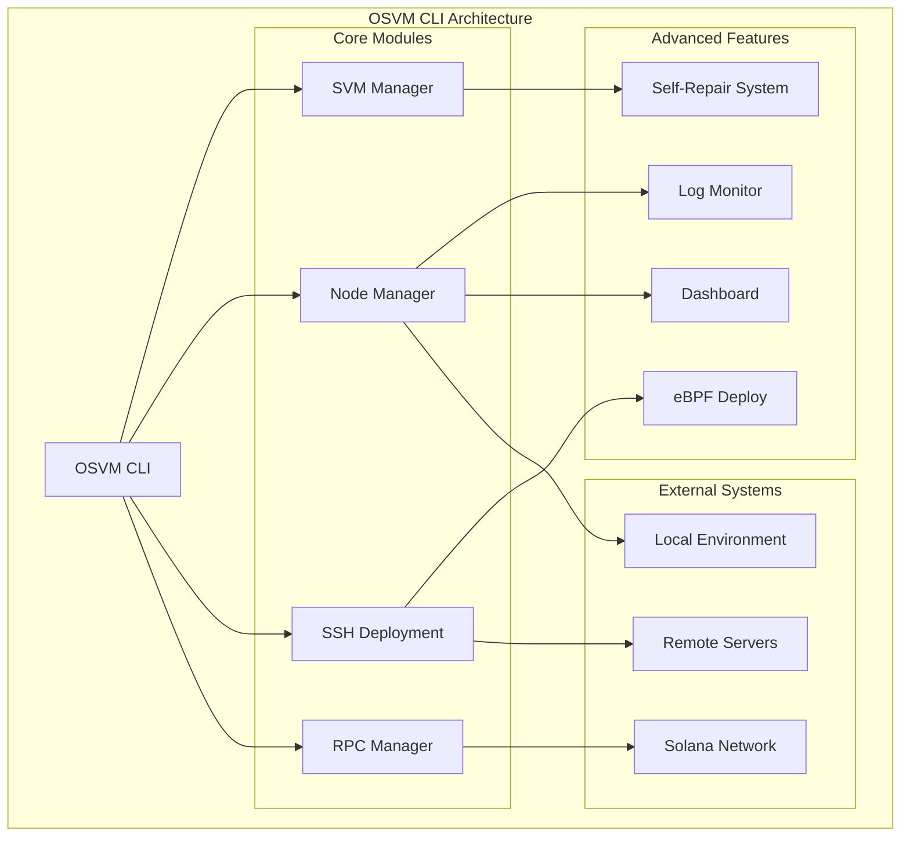

# OSVM CLI Documentation

Welcome to the comprehensive documentation for OSVM CLI - the Solana Virtual Machine command-line interface.

## Documentation Index

### Core Features
- [SVM Management](svm-management.md) - Manage Solana Virtual Machines
- [Node Management](node-management.md) - Deploy and monitor validator/RPC nodes
- [SSH Deployment](ssh-deployment.md) - Remote deployment capabilities
- [RPC Manager](rpc-manager.md) - Comprehensive RPC node management

### Advanced Features
- [Self-Repair System](self-repair-system.md) - Automatic error detection and repair
- [Log Monitoring](log-monitoring.md) - Real-time log analysis and auto-repair
- [Validator Enhancements](validator-enhancements.md) - Hardware optimization and configuration
- [eBPF Deployment](ebpf-deployment.md) - Solana program deployment

### User Interface
- [Dashboard](dashboard.md) - Interactive monitoring dashboards
- [Examples](examples.md) - Usage examples and command patterns

### Setup & Configuration
- [Installation](installation.md) - Installation guide
- [Configuration](configuration.md) - Configuration management

## Quick Start

1. [Install OSVM CLI](installation.md)
2. [Configure your environment](configuration.md)
3. [Try basic SVM operations](svm-management.md#quick-start)
4. [Deploy your first node](node-management.md#quick-start)

## Architecture Overview

## Support

For issues, questions, or contributions, please visit the [OSVM CLI repository](https://github.com/openSVM/osvm-cli).