# Chapter 6: Stochastic Processes and Simulation

## Introduction

Financial markets exhibit randomness that defies simple deterministic models. Prices jump on news events, volatility clusters during crises, and mean reversion dominates certain asset classes. **Stochastic processes**—mathematical models of random evolution over time—capture these behaviors with elegant precision.

This chapter explores the stochastic processes foundational to quantitative finance: Brownian motion (the building block of continuous-time models), jump-diffusion (for discontinuous shocks), GARCH (for time-varying volatility), and Ornstein-Uhlenbeck (for mean reversion). We implement each in OVSM and demonstrate Monte Carlo simulation techniques essential for pricing, risk management, and strategy backtesting.


**Figure 6.1**: Evolution of stochastic modeling approaches in quantitative finance, from Einstein's Brownian motion to modern machine learning-enhanced frameworks.

---

## 6.1 Brownian Motion

### 6.1.1 Mathematical Foundation

**Standard Brownian Motion** (Wiener process) $W_t$ satisfies:

1. $W_0 = 0$
2. Independent increments: $W_t - W_s$ independent of $W_u - W_v$ for non-overlapping intervals
3. Normal increments: $W_t - W_s \sim \mathcal{N}(0, t-s)$
4. Continuous paths with probability 1

**Properties:**

- **Expected value**: $\mathbb{E}[W_t] = 0$
- **Variance**: $\text{Var}(W_t) = t$
- **Quadratic variation**: $[W]_t = t$ (important for Itô calculus)

```lisp
;; Simulate standard Brownian motion
(define (brownian-motion n-steps dt)
  (let ((path [0])  ;; W_0 = 0
        (current 0))

    (for (i (range 0 n-steps))
      (let ((dW (* (sqrt dt) (standard-normal))))  ;; √dt * Z, Z ~ N(0,1)
        (set! current (+ current dW))
        (set! path (append path current))))

    path))

;; Standard normal random variable (Box-Muller transform)
(define (standard-normal)
  (let ((u1 (random))  ;; Uniform [0,1]
        (u2 (random)))
    (* (sqrt (* -2 (log u1)))
       (cos (* 2 3.14159 u2)))))

;; Example: 1000 steps, dt = 0.01
(define bm-path (brownian-motion 1000 0.01))
```

💡 **Key Insight**: Brownian motion's variance grows linearly with time. This $\sqrt{t}$ scaling underpins option pricing—variance of returns scales with holding period.

### 6.1.2 Geometric Brownian Motion (GBM)

Stock prices cannot go negative, so we model log-prices with Brownian motion:

$$dS_t = \mu S_t dt + \sigma S_t dW_t$$

Solution (Itô's lemma):

$$S_t = S_0 \exp\left(\left(\mu - \frac{\sigma^2}{2}\right)t + \sigma W_t\right)$$

```lisp
;; Simulate Geometric Brownian Motion
(define (gbm initial-price mu sigma n-steps dt)
  (let ((prices [initial-price])
        (current-price initial-price))

    (for (i (range 0 n-steps))
      (let ((dW (* (sqrt dt) (standard-normal)))
            (drift (* mu dt))
            (diffusion (* sigma dW)))

        ;; S_{t+dt} = S_t * exp((μ - σ²/2)dt + σ dW)
        (set! current-price
              (* current-price
                 (exp (+ (- drift (* 0.5 sigma sigma dt))
                        diffusion))))

        (set! prices (append prices current-price))))

    prices))

;; Example: Simulate SOL price for 1 year (252 trading days)
(define sol-simulation
  (gbm 100.0        ;; S_0 = $100
       0.15         ;; μ = 15% annual drift
       0.50         ;; σ = 50% annual volatility
       252          ;; 252 days
       (/ 1 252)))  ;; dt = 1 day

;; Extract final price
(define final-price (last sol-simulation))
```

📊 **Statistical Properties of GBM**:

| Property | Formula | Interpretation |
|----------|---------|----------------|
| Expected price | $S_0 e^{\mu t}$ | Grows exponentially at rate $\mu$ |
| Price variance | $S_0^2 e^{2\mu t}(e^{\sigma^2 t} - 1)$ | Variance explodes with volatility |
| Log-return mean | $\mu - \frac{\sigma^2}{2}$ | Drift adjusted for volatility drag |
| Log-return variance | $\sigma^2 t$ | Scales linearly with time |

```mermaid
graph TD
    A[Stock Price S_t] --> B[Log Price ln S_t]
    B --> C[Brownian Motion + Drift]
    C --> D[μt + σW_t]
    D --> E[Exponentiate]
    E --> F[S_t = S_0 exp(...)]

    style A fill:#e1f5ff
    style F fill:#c3f0c3
```

### 6.1.3 Multi-Asset GBM with Correlation

Correlated assets require correlated Brownian motions:

```lisp
;; Cholesky decomposition for correlation
;; Given correlation matrix R, find L such that L * L^T = R
(define (cholesky-2x2 rho)
  ;; For 2x2: [[1, rho], [rho, 1]]
  ;; L = [[1, 0], [rho, sqrt(1-rho^2)]]
  [[1 0]
   [rho (sqrt (- 1 (* rho rho)))]])

;; Simulate 2 correlated GBMs
(define (correlated-gbm-2 S0-1 S0-2 mu1 mu2 sigma1 sigma2 rho n-steps dt)
  (let ((L (cholesky-2x2 rho))
        (prices-1 [S0-1])
        (prices-2 [S0-2])
        (current-1 S0-1)
        (current-2 S0-2))

    (for (i (range 0 n-steps))
      ;; Generate independent normals
      (let ((Z1 (standard-normal))
            (Z2 (standard-normal)))

        ;; Correlate using Cholesky: [W1, W2] = L * [Z1, Z2]
        (let ((W1 (+ (* (nth (nth L 0) 0) Z1)
                    (* (nth (nth L 0) 1) Z2)))
              (W2 (+ (* (nth (nth L 1) 0) Z1)
                    (* (nth (nth L 1) 1) Z2))))

          ;; Update prices
          (let ((drift1 (- mu1 (* 0.5 sigma1 sigma1)))
                (drift2 (- mu2 (* 0.5 sigma2 sigma2))))

            (set! current-1
                  (* current-1
                     (exp (+ (* drift1 dt) (* sigma1 (sqrt dt) W1)))))

            (set! current-2
                  (* current-2
                     (exp (+ (* drift2 dt) (* sigma2 (sqrt dt) W2)))))

            (set! prices-1 (append prices-1 current-1))
            (set! prices-2 (append prices-2 current-2))))))

    {:asset-1 prices-1 :asset-2 prices-2}))

;; Example: SOL and BTC with 70% correlation
(define corr-sim
  (correlated-gbm-2
    100.0 50000.0  ;; Initial prices
    0.15 0.12      ;; Drifts
    0.50 0.40      ;; Volatilities
    0.70           ;; Correlation
    252            ;; Steps
    (/ 1 252)))    ;; dt
```

💻 **Correlation Verification**:

```lisp
;; Verify correlation of simulated returns
(define (verify-correlation sim)
  (let ((returns-1 (log-returns (sim :asset-1)))
        (returns-2 (log-returns (sim :asset-2))))

    (correlation returns-1 returns-2)))

;; Should be close to 0.70
(verify-correlation corr-sim)
```

---

## 6.2 Jump-Diffusion Processes

### 6.2.1 Merton Jump-Diffusion Model

Real markets exhibit **jumps**—sudden discontinuous price changes from news, liquidations, or black swan events. Merton (1976) model combines continuous diffusion with Poisson jumps:

$$dS_t = \mu S_t dt + \sigma S_t dW_t + S_t dJ_t$$

Where $J_t$ is a compound Poisson process:
- Jumps arrive with intensity $\lambda$ (average jumps per unit time)
- Jump sizes $Y_i \sim \mathcal{N}(\mu_J, \sigma_J^2)$

```lisp
;; Merton jump-diffusion simulation
(define (merton-jump-diffusion S0 mu sigma lambda mu-jump sigma-jump n-steps dt)
  (let ((prices [S0])
        (current-price S0))

    (for (i (range 0 n-steps))
      ;; Diffusion component (Brownian motion)
      (let ((dW (* (sqrt dt) (standard-normal)))
            (drift-component (* mu dt))
            (diffusion-component (* sigma dW)))

        ;; Jump component (Poisson process)
        (let ((n-jumps (poisson-random (* lambda dt))))  ;; Number of jumps in dt

          (let ((total-jump 0))
            ;; Sum all jump sizes
            (for (j (range 0 n-jumps))
              (let ((jump-size (* (+ mu-jump (* sigma-jump (standard-normal)))
                                 current-price)))
                (set! total-jump (+ total-jump jump-size))))

            ;; Update price: drift + diffusion + jumps
            (set! current-price
                  (* current-price
                     (exp (+ (- drift-component (* 0.5 sigma sigma dt))
                            diffusion-component))))

            (set! current-price (+ current-price total-jump))
            (set! prices (append prices current-price))))))

    prices))

;; Poisson random variable (inverse CDF method)
(define (poisson-random lambda)
  (let ((L (exp (- lambda)))
        (k 0)
        (p 1))

    (while (> p L)
      (set! k (+ k 1))
      (set! p (* p (random))))

    (- k 1)))

;; Example: SOL with crash risk
(define jump-sim
  (merton-jump-diffusion
    100.0      ;; S_0
    0.15       ;; μ (drift)
    0.30       ;; σ (volatility)
    2.0        ;; λ (2 jumps per year on average)
    -0.05      ;; μ_J (jumps are 5% down on average)
    0.10       ;; σ_J (jump size volatility)
    252
    (/ 1 252)))
```

💡 **Jump Detection**: Identify jumps in simulated path:

```lisp
(define (detect-jumps prices threshold)
  (let ((returns (log-returns prices))
        (jumps []))

    (for (i (range 0 (length returns)))
      (if (> (abs (nth returns i)) threshold)
          (set! jumps (append jumps {:index i
                                     :return (nth returns i)
                                     :price (nth prices (+ i 1))}))
          null))

    jumps))

;; Find jumps larger than 3 standard deviations
(define detected-jumps
  (detect-jumps jump-sim (* 3 (std-dev (log-returns jump-sim)))))
```

### 6.2.2 Double Exponential Jump-Diffusion

Kou (2002) model uses asymmetric double-exponential jump sizes (up-jumps differ from down-jumps):

$$P(\text{Jump size} > x) = \begin{cases}
p \eta_1 e^{-\eta_1 x} & x > 0 \\
(1-p) \eta_2 e^{\eta_2 x} & x < 0
\end{cases}$$

Where:
- $p$ = probability of up-jump
- $\eta_1$ = decay rate of up-jumps
- $\eta_2$ = decay rate of down-jumps

```lisp
;; Double exponential jump size generator
(define (double-exponential-jump p eta1 eta2)
  (if (< (random) p)
      ;; Up-jump: exponential with rate eta1
      (/ (- (log (random))) eta1)

      ;; Down-jump: exponential with rate eta2 (negative)
      (- (/ (- (log (random))) eta2))))

;; Kou jump-diffusion
(define (kou-jump-diffusion S0 mu sigma lambda p eta1 eta2 n-steps dt)
  (let ((prices [S0])
        (current-price S0))

    (for (i (range 0 n-steps))
      (let ((dW (* (sqrt dt) (standard-normal)))
            (drift (* mu dt))
            (diffusion (* sigma dW))
            (n-jumps (poisson-random (* lambda dt))))

        (let ((total-jump-pct 0))
          (for (j (range 0 n-jumps))
            (set! total-jump-pct (+ total-jump-pct
                                   (double-exponential-jump p eta1 eta2))))

          ;; Price update with percentage jumps
          (set! current-price
                (* current-price
                   (exp (+ (- drift (* 0.5 sigma sigma dt))
                          diffusion
                          total-jump-pct))))

          (set! prices (append prices current-price)))))

    prices))

;; Example: Asymmetric jumps (small up, large down)
(define kou-sim
  (kou-jump-diffusion
    100.0      ;; S_0
    0.10       ;; μ
    0.25       ;; σ
    3.0        ;; λ (3 jumps/year)
    0.4        ;; p (40% up-jumps)
    50.0       ;; η_1 (small up-jumps: avg 2%)
    10.0       ;; η_2 (large down-jumps: avg 10%)
    252
    (/ 1 252)))
```

📊 **Jump Statistics Comparison**:

| Model | Up-Jump Prob | Up-Jump Avg | Down-Jump Avg | Use Case |
|-------|--------------|-------------|---------------|----------|
| Merton | 50% | μ_J | μ_J | Symmetric shocks |
| Kou (equity) | 40% | +2% | -10% | Stock crashes |
| Kou (crypto) | 45% | +5% | -15% | High volatility |

---

## 6.3 GARCH Models

### 6.3.1 GARCH(1,1) Process

**Volatility clustering**: Large price changes tend to cluster. GARCH (Generalized AutoRegressive Conditional Heteroskedasticity) models time-varying volatility:


**Figure 6.2**: Comparison of mean reversion speeds in Ornstein-Uhlenbeck processes versus random walk and trending processes. Strong mean reversion (θ=2.0) quickly returns to the mean, while weak mean reversion (θ=0.1) exhibits persistent deviations. This visualization demonstrates why pairs trading relies on identifying strongly mean-reverting spreads.

$$\begin{aligned}
r_t &= \mu + \sigma_t \epsilon_t, \quad \epsilon_t \sim \mathcal{N}(0,1) \\
\sigma_t^2 &= \omega + \alpha r_{t-1}^2 + \beta \sigma_{t-1}^2
\end{aligned}$$

Where:
- $\omega$ = baseline variance
- $\alpha$ = weight on previous return shock
- $\beta$ = weight on previous volatility (persistence)

**Stationarity**: Requires $\alpha + \beta < 1$

```lisp
;; GARCH(1,1) simulation
(define (garch-11 n-steps mu omega alpha beta initial-sigma)
  (let ((returns [])
        (volatilities [initial-sigma])
        (current-sigma initial-sigma))

    (for (i (range 0 n-steps))
      (let ((epsilon (standard-normal))
            (return (+ mu (* current-sigma epsilon))))

        (set! returns (append returns return))

        ;; Update volatility: σ²_t = ω + α*r²_{t-1} + β*σ²_{t-1}
        (let ((prev-return (if (> i 0) (nth returns (- i 1)) 0)))
          (let ((sigma-squared (+ omega
                                 (* alpha prev-return prev-return)
                                 (* beta current-sigma current-sigma))))

            (set! current-sigma (sqrt sigma-squared))
            (set! volatilities (append volatilities current-sigma))))))

    {:returns returns :volatilities volatilities}))

;; Example: Typical equity GARCH parameters
(define garch-sim
  (garch-11
    1000       ;; n_steps
    0.0005     ;; μ (daily mean return)
    0.000005   ;; ω (baseline variance)
    0.08       ;; α (shock weight)
    0.90       ;; β (persistence)
    0.015))    ;; Initial σ (1.5% daily vol)

;; Verify volatility clustering
(define returns (garch-sim :returns))
(define vols (garch-sim :volatilities))
```

💡 **Volatility Persistence**: $\alpha + \beta$ close to 1 implies long memory—shocks decay slowly.

```lisp
;; Calculate half-life of volatility shocks
(define (volatility-half-life alpha beta)
  (let ((persistence (+ alpha beta)))
    (/ (log 2) (log (/ 1 persistence)))))

;; Example: α=0.08, β=0.90 → persistence=0.98
;; Half-life ≈ 34 periods (shocks persist for ~1.5 months)
(volatility-half-life 0.08 0.90)  ;; → ~34
```

### 6.3.2 GARCH Option Pricing

GARCH-implied volatility surface differs from Black-Scholes:

```lisp
;; Price European call under GARCH via Monte Carlo
(define (garch-option-price S0 K r T n-sims mu omega alpha beta sigma0)
  (let ((payoffs []))

    (for (sim (range 0 n-sims))
      ;; Simulate GARCH returns for T periods
      (let ((garch-result (garch-11 T mu omega alpha beta sigma0)))

        ;; Convert returns to price path
        (let ((price-path (returns-to-prices S0 (garch-result :returns))))

          (let ((final-price (last price-path))
                (payoff (max 0 (- final-price K))))

            (set! payoffs (append payoffs payoff))))))

    ;; Discount expected payoff
    (* (exp (- (* r T))) (average payoffs))))

;; Convert returns to prices
(define (returns-to-prices S0 returns)
  (let ((prices [S0])
        (current-price S0))

    (for (r returns)
      (set! current-price (* current-price (exp r)))
      (set! prices (append prices current-price)))

    prices))
```

### 6.3.3 EGARCH for Leverage Effect

```mermaid
%%{init: {'theme':'base', 'themeVariables': { 'primaryColor':'#ff6b6b','secondaryColor':'#4ecdc4','tertiaryColor':'#ffe66d'}}}%%
sankey-beta

Low Volatility,Medium Volatility,35
Low Volatility,High Volatility,10
Low Volatility,Low Volatility,55

Medium Volatility,Low Volatility,20
Medium Volatility,Medium Volatility,40
Medium Volatility,High Volatility,40

High Volatility,Medium Volatility,50
High Volatility,High Volatility,30
High Volatility,Low Volatility,20
```

**Figure 6.4**: Volatility clustering flow showing transitions between volatility regimes in GARCH models. Width represents transition probability. High volatility tends to persist (30% self-loop) but eventually decays to medium volatility (50%). Low volatility is highly stable (55% persistence), explaining why calm markets tend to stay calm. This diagram illustrates the autocorrelation in volatility that GARCH models capture, essential for option pricing and risk management.

**Exponential GARCH** captures leverage effect (volatility increases more after negative shocks):

$$\log(\sigma_t^2) = \omega + \alpha \left(\frac{\epsilon_{t-1}}{\sigma_{t-1}}\right) + \gamma \left(\left|\frac{\epsilon_{t-1}}{\sigma_{t-1}}\right| - \mathbb{E}\left[\left|\frac{\epsilon_{t-1}}{\sigma_{t-1}}\right|\right]\right) + \beta \log(\sigma_{t-1}^2)$$

Where $\gamma < 0$ produces asymmetry.

```lisp
;; EGARCH(1,1) simulation
(define (egarch-11 n-steps mu omega alpha gamma beta initial-log-sigma2)
  (let ((returns [])
        (log-sigma2s [initial-log-sigma2])
        (current-log-sigma2 initial-log-sigma2))

    (for (i (range 0 n-steps))
      (let ((sigma (sqrt (exp current-log-sigma2)))
            (epsilon (standard-normal))
            (return (+ mu (* sigma epsilon))))

        (set! returns (append returns return))

        ;; EGARCH volatility update
        (let ((standardized-error (/ epsilon sigma))
              (expected-abs-error 0.79788))  ;; E[|Z|] for Z ~ N(0,1)

          (let ((log-sigma2-next
                 (+ omega
                    (* alpha standardized-error)
                    (* gamma (- (abs standardized-error) expected-abs-error))
                    (* beta current-log-sigma2))))

            (set! current-log-sigma2 log-sigma2-next)
            (set! log-sigma2s (append log-sigma2s log-sigma2-next))))))

    {:returns returns
     :volatilities (map log-sigma2s (lambda (ls2) (sqrt (exp ls2))))}))
```

---

## 6.4 Ornstein-Uhlenbeck Process

### 6.4.1 Mean Reversion Dynamics

```mermaid
stateDiagram-v2
    [*] --> BullMarket
    BullMarket --> BearMarket: P(0.15) Correction Shock
    BullMarket --> Sideways: P(0.20) Consolidation
    BullMarket --> BullMarket: P(0.65) Continue Rally

    BearMarket --> BullMarket: P(0.10) Recovery
    BearMarket --> Sideways: P(0.25) Stabilization
    BearMarket --> BearMarket: P(0.65) Continue Decline

    Sideways --> BullMarket: P(0.35) Breakout Up
    Sideways --> BearMarket: P(0.15) Breakout Down
    Sideways --> Sideways: P(0.50) Range-Bound

    note right of BullMarket
        High volatility regime
        θ = 0.8 (fast reversion)
        σ = 0.25
    end note

    note right of BearMarket
        Extreme volatility
        θ = 1.2 (very fast)
        σ = 0.40
    end note

    note right of Sideways
        Low volatility regime
        θ = 0.3 (slow reversion)
        σ = 0.15
    end note
```



**Figure 6.3**: Markov chain representation of market regimes with transition probabilities. This three-state model captures regime-switching behavior where mean reversion speed (θ) and volatility (σ) vary by state. Used in pairs trading to adjust entry/exit thresholds based on current market regime.

**Ornstein-Uhlenbeck (OU)** process models mean reversion:

$$dX_t = \theta(\mu - X_t)dt + \sigma dW_t$$

Where:
- $\mu$ = long-term mean
- $\theta$ = speed of mean reversion
- $\sigma$ = volatility

**Solution**:

$$X_t = X_0 e^{-\theta t} + \mu(1 - e^{-\theta t}) + \sigma \int_0^t e^{-\theta(t-s)} dW_s$$

```lisp
;; Ornstein-Uhlenbeck simulation (exact discretization)
(define (ornstein-uhlenbeck X0 theta mu sigma n-steps dt)
  (let ((path [X0])
        (current-X X0))

    (for (i (range 0 n-steps))
      (let ((drift (* theta (- mu current-X) dt))
            (diffusion (* sigma (sqrt dt) (standard-normal))))

        (set! current-X (+ current-X drift diffusion))
        (set! path (append path current-X))))

    path))

;; Example: Pairs trading spread (mean-reverting)
(define spread-sim
  (ornstein-uhlenbeck
    0.0      ;; X_0 (start at mean)
    2.0      ;; θ (fast mean reversion: half-life ~ 0.35 years)
    0.0      ;; μ (mean = 0)
    0.1      ;; σ (volatility)
    252
    (/ 1 252)))

;; Half-life of mean reversion
(define (ou-half-life theta)
  (/ (log 2) theta))

(ou-half-life 2.0)  ;; → 0.3466 years ≈ 87 days
```

💡 **Trading Strategy**: Enter when spread deviates >2σ from mean, exit at mean:

```lisp
(define (ou-trading-strategy spread threshold)
  (let ((signals []))

    (for (i (range 0 (length spread)))
      (let ((value (nth spread i)))

        (if (> value threshold)
            (set! signals (append signals "short"))  ;; Spread too high
            (if (< value (- threshold))
                (set! signals (append signals "long"))   ;; Spread too low
                (set! signals (append signals "hold"))))))

    signals))

(define trading-signals (ou-trading-strategy spread-sim 0.2))
```

### 6.4.2 Vasicek Interest Rate Model

OU process models short-term interest rates:

$$dr_t = \theta(\mu - r_t)dt + \sigma dW_t$$

```lisp
;; Vasicek model simulation
(define (vasicek r0 theta mu sigma n-steps dt)
  (ornstein-uhlenbeck r0 theta mu sigma n-steps dt))

;; Example: Fed Funds rate
(define interest-rate-sim
  (vasicek
    0.05     ;; r_0 = 5%
    0.5      ;; θ (moderate mean reversion)
    0.04     ;; μ (long-term rate = 4%)
    0.01     ;; σ (1% volatility)
    252
    (/ 1 252)))
```

⚠️ **Vasicek Limitation**: Rates can go negative (realistic post-2008, but problematic for some models).

### 6.4.3 CIR Process (Non-Negative Rates)

Cox-Ingersoll-Ross (CIR) model ensures non-negative rates via square-root diffusion:

$$dr_t = \theta(\mu - r_t)dt + \sigma \sqrt{r_t} dW_t$$

```lisp
;; CIR simulation (Euler-Maruyama discretization)
(define (cir r0 theta mu sigma n-steps dt)
  (let ((path [r0])
        (current-r r0))

    (for (i (range 0 n-steps))
      (let ((drift (* theta (- mu current-r) dt))
            (diffusion (* sigma (sqrt (max current-r 0)) (sqrt dt)
                         (standard-normal))))

        (set! current-r (max 0 (+ current-r drift diffusion)))  ;; Floor at 0
        (set! path (append path current-r))))

    path))

;; Example
(define cir-sim
  (cir 0.03 0.5 0.04 0.05 252 (/ 1 252)))
```

💻 **Feller Condition**: $2\theta\mu \geq \sigma^2$ ensures process stays strictly positive.

---

## 6.5 Monte Carlo Methods

### 6.5.1 Variance Reduction Techniques

**Antithetic Variates**: Use negated random numbers to reduce variance:

```lisp
;; Standard Monte Carlo
(define (monte-carlo-standard payoff-fn n-sims)
  (let ((payoffs []))

    (for (i (range 0 n-sims))
      (let ((Z (standard-normal))
            (payoff (payoff-fn Z)))
        (set! payoffs (append payoffs payoff))))

    (average payoffs)))

;; Antithetic variates
(define (monte-carlo-antithetic payoff-fn n-sims)
  (let ((payoffs []))

    (for (i (range 0 (/ n-sims 2)))
      (let ((Z (standard-normal))
            (payoff1 (payoff-fn Z))
            (payoff2 (payoff-fn (- Z))))  ;; Antithetic: -Z

        (set! payoffs (append payoffs payoff1))
        (set! payoffs (append payoffs payoff2))))

    (average payoffs)))

;; Example: European call option
(define (gbm-call-payoff S0 K r sigma T Z)
  (let ((ST (* S0 (exp (+ (* (- r (* 0.5 sigma sigma)) T)
                         (* sigma (sqrt T) Z))))))
    (max 0 (- ST K))))

(define standard-price
  (monte-carlo-standard
    (lambda (Z) (gbm-call-payoff 100 110 0.05 0.2 1 Z))
    10000))

(define antithetic-price
  (monte-carlo-antithetic
    (lambda (Z) (gbm-call-payoff 100 110 0.05 0.2 1 Z))
    10000))

;; Antithetic has ~40% lower variance for same number of paths
```

📊 **Variance Reduction**:

| Method | Variance | Speedup | Complexity |
|--------|----------|---------|------------|
| Standard MC | σ²/n | 1x | Low |
| Antithetic | 0.6σ²/n | 1.67x | Low |
| Control Variates | 0.3σ²/n | 3.33x | Medium |
| Importance Sampling | 0.1σ²/n | 10x | High |

### 6.5.2 Control Variates

Use known analytical solution to reduce variance:

```lisp
;; Control variate: Asian option using European as control
(define (mc-asian-with-control S0 K r sigma T n-steps n-sims)
  (let ((asian-payoffs [])
        (european-payoffs []))

    (for (sim (range 0 n-sims))
      ;; Simulate price path
      (let ((path (gbm S0 r sigma n-steps (/ T n-steps))))

        ;; Asian payoff (average price)
        (let ((avg-price (average path))
              (asian-pay (max 0 (- avg-price K))))
          (set! asian-payoffs (append asian-payoffs asian-pay)))

        ;; European payoff (final price)
        (let ((final-price (last path))
              (european-pay (max 0 (- final-price K))))
          (set! european-payoffs (append european-payoffs european-pay)))))

    ;; Control variate adjustment
    (let ((asian-mean (average asian-payoffs))
          (european-mean (average european-payoffs))
          (european-exact (black-scholes-call S0 K r sigma T)))

      ;; Adjusted estimator: Asian + c*(Exact - European_MC)
      (let ((c (/ (covariance asian-payoffs european-payoffs)
                 (variance european-payoffs))))

        (+ asian-mean (* c (- european-exact european-mean)))))))

;; Black-Scholes call (analytical control)
(define (black-scholes-call S K r sigma T)
  (let ((d1 (/ (+ (log (/ S K)) (* (+ r (* 0.5 sigma sigma)) T))
              (* sigma (sqrt T))))
        (d2 (- d1 (* sigma (sqrt T)))))

    (- (* S (normal-cdf d1))
       (* K (exp (- (* r T))) (normal-cdf d2)))))
```

### 6.5.3 Quasi-Monte Carlo

Low-discrepancy sequences (Sobol, Halton) cover sample space more uniformly:

```lisp
;; Van der Corput sequence (simple low-discrepancy sequence)
(define (van-der-corput n base)
  (let ((vdc 0)
        (denom 1))

    (while (> n 0)
      (set! denom (* denom base))
      (set! vdc (+ vdc (/ (% n base) denom)))
      (set! n (floor (/ n base))))

    vdc))

;; Generate quasi-random normal using inverse CDF
(define (quasi-normal n)
  (let ((u (van-der-corput n 2)))  ;; Uniform [0,1]
    (inverse-normal-cdf u)))

;; Quasi-Monte Carlo option pricing
(define (qmc-option-price payoff-fn n-sims)
  (let ((payoffs []))

    (for (i (range 1 (+ n-sims 1)))
      (let ((Z (quasi-normal i))
            (payoff (payoff-fn Z)))
        (set! payoffs (append payoffs payoff))))

    (average payoffs)))

;; Convergence: QMC is O(1/n) vs standard MC's O(1/√n)
```

💡 **QMC Advantage**: For smooth payoffs, QMC converges 10-100x faster than standard MC.

---

## 6.6 Calibration and Estimation

### 6.6.1 Historical Volatility Estimation

```lisp
;; Calculate historical volatility (annualized)
(define (historical-volatility prices periods-per-year)
  (let ((returns (log-returns prices)))
    (let ((daily-vol (std-dev returns)))
      (* daily-vol (sqrt periods-per-year)))))

;; Example: Daily prices → annualized volatility
(define annual-vol (historical-volatility prices 252))
```

### 6.6.2 GARCH Parameter Estimation (MLE)

Maximum Likelihood Estimation for GARCH(1,1):

```lisp
;; Log-likelihood for GARCH(1,1)
(define (garch-log-likelihood returns omega alpha beta)
  (let ((n (length returns))
        (sigma-squared (/ (variance returns) (- 1 alpha beta)))  ;; Initial
        (log-lik 0))

    (for (i (range 0 n))
      (let ((r (nth returns i)))

        ;; Add to log-likelihood: -0.5*(log(2π) + log(σ²) + r²/σ²)
        (set! log-lik (- log-lik
                        (* 0.5 (+ 1.8378770  ;; log(2π)
                                 (log sigma-squared)
                                 (/ (* r r) sigma-squared)))))

        ;; Update variance for next period
        (set! sigma-squared (+ omega
                              (* alpha r r)
                              (* beta sigma-squared)))))

    log-lik))

;; Grid search for optimal parameters (simplified MLE)
(define (estimate-garch returns)
  (let ((best-params null)
        (best-lik -999999))

    ;; Grid search over parameter space
    (for (omega [0.000001 0.000005 0.00001])
      (for (alpha [0.05 0.08 0.10 0.15])
        (for (beta [0.85 0.90 0.92])

          (if (< (+ alpha beta) 1)  ;; Stationarity constraint
              (let ((lik (garch-log-likelihood returns omega alpha beta)))
                (if (> lik best-lik)
                    (do
                      (set! best-lik lik)
                      (set! best-params {:omega omega :alpha alpha :beta beta}))
                    null))
              null))))

    best-params))
```

### 6.6.3 Mean Reversion Speed Calibration

Estimate OU parameters from spread data:

```lisp
;; Estimate θ (mean reversion speed) via OLS
(define (estimate-ou-theta spread)
  (let ((n (length spread))
        (sum-x 0)
        (sum-y 0)
        (sum-xx 0)
        (sum-xy 0))

    ;; Regression: ΔX_t = θ*(μ - X_{t-1})*Δt + ε
    ;; Rearrange: ΔX_t = (θ*μ*Δt) - θ*Δt*X_{t-1} + ε
    ;; OLS: ΔX_t on X_{t-1}

    (for (i (range 1 n))
      (let ((x (nth spread (- i 1)))    ;; X_{t-1}
            (y (- (nth spread i) (nth spread (- i 1)))))  ;; ΔX_t

        (set! sum-x (+ sum-x x))
        (set! sum-y (+ sum-y y))
        (set! sum-xx (+ sum-xx (* x x)))
        (set! sum-xy (+ sum-xy (* x y)))))

    ;; Slope = -θ*Δt (assuming Δt=1)
    (let ((n-minus-1 (- n 1)))
      (let ((slope (/ (- sum-xy (/ (* sum-x sum-y) n-minus-1))
                     (- sum-xx (/ (* sum-x sum-x) n-minus-1)))))

        (- slope)))))  ;; θ = -slope

;; Example
(define theta-hat (estimate-ou-theta spread-sim))
```

---

## 6.7 Practical Applications

### 6.7.1 Option Pricing with Stochastic Volatility

```lisp
;; Heston model: Stochastic volatility
;; dS = μ S dt + √V S dW^S
;; dV = κ(θ - V) dt + σ_v √V dW^V
;; Corr(dW^S, dW^V) = ρ

(define (heston-simulation S0 V0 kappa theta sigma-v rho mu n-steps dt)
  (let ((prices [S0])
        (variances [V0])
        (current-S S0)
        (current-V V0))

    (for (i (range 0 n-steps))
      ;; Correlated Brownian motions
      (let ((Z1 (standard-normal))
            (Z2 (standard-normal)))

        (let ((W-S Z1)
              (W-V (+ (* rho Z1) (* (sqrt (- 1 (* rho rho))) Z2))))

          ;; Update variance (CIR dynamics)
          (let ((dV (+ (* kappa (- theta current-V) dt)
                      (* sigma-v (sqrt (max current-V 0)) (sqrt dt) W-V))))

            (set! current-V (max 0.0001 (+ current-V dV)))

            ;; Update price
            (let ((dS (+ (* mu current-S dt)
                        (* (sqrt current-V) current-S (sqrt dt) W-S))))

              (set! current-S (+ current-S dS))
              (set! prices (append prices current-S))
              (set! variances (append variances current-V)))))))

    {:prices prices :variances variances}))

;; Price European call under Heston
(define (heston-call-price S0 K r T V0 kappa theta sigma-v rho n-sims)
  (let ((payoffs []))

    (for (sim (range 0 n-sims))
      (let ((result (heston-simulation S0 V0 kappa theta sigma-v rho r 252 (/ T 252))))
        (let ((ST (last (result :prices)))
              (payoff (max 0 (- ST K))))
          (set! payoffs (append payoffs payoff)))))

    (* (exp (- (* r T))) (average payoffs))))
```

### 6.7.2 Risk Metrics (VaR, CVaR)

```lisp
;; Value at Risk via Monte Carlo
(define (portfolio-var S0 mu sigma T confidence n-sims)
  (let ((final-values []))

    ;; Simulate portfolio values
    (for (sim (range 0 n-sims))
      (let ((ST (last (gbm S0 mu sigma 252 (/ T 252)))))
        (set! final-values (append final-values ST))))

    ;; Sort and find percentile
    (let ((sorted (sort final-values))
          (var-index (floor (* n-sims (- 1 confidence)))))

      (let ((var-level (nth sorted var-index)))
        {:VaR (- S0 var-level)
         :VaR-percent (/ (- S0 var-level) S0)}))))

;; Conditional VaR (Expected Shortfall)
(define (portfolio-cvar S0 mu sigma T confidence n-sims)
  (let ((var-result (portfolio-var S0 mu sigma T confidence n-sims))
        (final-values []))

    ;; Re-simulate (in practice, reuse from VaR calculation)
    (for (sim (range 0 n-sims))
      (let ((ST (last (gbm S0 mu sigma 252 (/ T 252)))))
        (set! final-values (append final-values ST))))

    ;; CVaR = average loss beyond VaR threshold
    (let ((var-threshold (- S0 (var-result :VaR)))
          (tail-losses []))

      (for (val final-values)
        (if (< val var-threshold)
            (set! tail-losses (append tail-losses (- S0 val)))
            null))

      {:CVaR (average tail-losses)
       :CVaR-percent (/ (average tail-losses) S0)})))

;; Example: 95% VaR and CVaR
(define risk-metrics (portfolio-cvar 100000 0.10 0.25 (/ 10 252) 0.95 10000))
```

---

## 6.8 Key Takeaways


🎯 **Model Selection Guide**:

| Market Behavior | Recommended Process | Parameters |
|-----------------|-------------------|------------|
| Equity indices | GARCH + jumps | α≈0.08, β≈0.90, λ≈2 |
| Crypto assets | Kou jump-diffusion | High σ, asymmetric jumps |
| Interest rates | CIR | Non-negative constraint |
| Commodity spreads | Ornstein-Uhlenbeck | Estimate θ from data |
| Options pricing | Heston stochastic vol | Calibrate to IV surface |

⚠️ **Common Pitfalls**:

- **Ignoring fat tails**: GBM underestimates extreme events—add jumps for risk management
- **Constant volatility assumption**: Use GARCH for realistic vol dynamics
- **Calibration overfitting**: Out-of-sample validation essential
- **Discretization error**: Small Δt required for accurate simulations (Δt ≤ 1/252 for daily data)

💻 **Computational Considerations**:

| Task | Method | Efficiency |
|------|--------|-----------|
| Single path | Direct simulation | Fast |
| 10K paths | Standard MC | Moderate |
| 100K paths | Antithetic MC | 1.5x faster |
| High accuracy | QMC + control variates | 10x faster |
| Complex payoffs | GPU parallelization | 100x faster |

---

## Further Reading

1. Glasserman, P. (2003). *Monte Carlo Methods in Financial Engineering*. Springer.

2. Cont, R., & Tankov, P. (2004). *Financial Modelling with Jump Processes*. Chapman & Hall.

3. Shreve, S. (2004). *Stochastic Calculus for Finance II: Continuous-Time Models*. Springer.

4. Tsay, R. S. (2010). *Analysis of Financial Time Series* (3rd ed.). Wiley.

5. Heston, S. (1993). "A Closed-Form Solution for Options with Stochastic Volatility". *Review of Financial Studies*, 6(2), 327-343.

---

**Next Chapter Preview**: [Chapter 7: Optimization Algorithms](#) covers techniques for parameter tuning, portfolio optimization, and strategy calibration—from gradient descent to evolutionary algorithms.
