# Chapter 7: Optimization Algorithms

## Introduction

Trading systems demand **optimization** at every level: finding optimal portfolio weights, tuning strategy parameters, calibrating models to market data, and executing trades at best prices. Poor optimization leads to overfitting (strategies that fail live), suboptimal returns, and excessive risk.

This chapter explores optimization algorithms essential for quantitative trading: gradient-based methods (when derivatives are available), convex optimization (for provably optimal solutions), and derivative-free methods (genetic algorithms, simulated annealing) for complex, non-smooth objective functions. We implement each in OVSM and analyze their trade-offs.

---

## 7.1 Gradient Descent

### 7.1.1 Vanilla Gradient Descent

**Gradient descent** iteratively moves toward the minimum by following the negative gradient:

$$\theta_{t+1} = \theta_t - \alpha \nabla f(\theta_t)$$

Where:
- $\theta$ = parameters to optimize
- $\alpha$ = learning rate (step size)
- $\nabla f$ = gradient of objective function

```lisp
;; 1D gradient descent
(define (gradient-descent-1d f df x0 alpha max-iters tolerance)
  (let ((x x0)
        (history [x0]))

    (for (i (range 0 max-iters))
      (let ((grad (df x))
            (x-new (- x (* alpha grad))))

        (set! history (append history x-new))

        ;; Check convergence
        (if (< (abs (- x-new x)) tolerance)
            (do
              (log :message "Converged" :iteration i :value x-new)
              (set! x x-new)
              (break))  ;; Exit loop (conceptual)
            (set! x x-new))))

    {:optimum x :history history}))

;; Example: Minimize f(x) = (x - 3)²
(define (f x) (* (- x 3) (- x 3)))
(define (df x) (* 2 (- x 3)))

(define result (gradient-descent-1d f df 0.0 0.1 100 0.0001))
;; result :optimum → 3.0 (exact solution)
```

💡 **Learning Rate Selection**:
- Too small: Slow convergence (1000+ iterations)
- Too large: Oscillation or divergence
- Rule of thumb: Start with $\alpha = 0.01$, halve if diverging

```mermaid
graph LR
    A[Initialize θ₀] --> B[Compute ∇f θ]
    B --> C[Update: θ ← θ - α∇f]
    C --> D{Converged?}
    D -->|No| B
    D -->|Yes| E[Return θ*]

    style A fill:#e1f5ff
    style E fill:#c3f0c3
```



### 7.1.2 Multi-Dimensional Gradient Descent

Extend to parameter vectors:

```lisp
;; N-dimensional gradient descent
(define (gradient-descent-nd f grad theta0 alpha max-iters tolerance)
  (let ((theta theta0)
        (history [theta0]))

    (for (i (range 0 max-iters))
      (let ((g (grad theta)))  ;; Returns vector of partial derivatives

        ;; Update: theta ← theta - alpha * grad
        (let ((theta-new
               (map (range 0 (length theta))
                    (lambda (j)
                      (- (nth theta j) (* alpha (nth g j)))))))

          (set! history (append history theta-new))

          ;; Check convergence (L2 norm)
          (if (< (l2-norm (vec-sub theta-new theta)) tolerance)
              (do
                (log :message "Converged" :iteration i)
                (set! theta theta-new)
                (break))
              (set! theta theta-new)))))

    {:optimum theta :history history}))

;; Vector operations
(define (l2-norm v)
  (sqrt (sum (map v (lambda (x) (* x x))))))

(define (vec-sub a b)
  (map (range 0 (length a))
       (lambda (i) (- (nth a i) (nth b i)))))

;; Example: Minimize f(x,y) = x² + y²
(define (f-2d params)
  (let ((x (nth params 0))
        (y (nth params 1)))
    (+ (* x x) (* y y))))

(define (grad-2d params)
  (let ((x (nth params 0))
        (y (nth params 1)))
    [(* 2 x) (* 2 y)]))

(define result-2d
  (gradient-descent-nd f-2d grad-2d [5.0 5.0] 0.1 100 0.0001))
;; result-2d :optimum → [0.0, 0.0]
```

### 7.1.3 Momentum

**Momentum** accelerates convergence by accumulating gradients:

$$\begin{aligned}
v_{t+1} &= \beta v_t + (1-\beta) \nabla f(\theta_t) \\
\theta_{t+1} &= \theta_t - \alpha v_{t+1}
\end{aligned}$$

Where $\beta \in [0,1)$ controls momentum (typical: 0.9)

```lisp
;; Gradient descent with momentum
(define (gradient-descent-momentum f grad theta0 alpha beta max-iters tolerance)
  (let ((theta theta0)
        (velocity (map theta0 (lambda (x) 0)))  ;; Initialize v = 0
        (history [theta0]))

    (for (i (range 0 max-iters))
      (let ((g (grad theta)))

        ;; Update velocity: v = β*v + (1-β)*grad
        (let ((velocity-new
               (map (range 0 (length velocity))
                    (lambda (j)
                      (+ (* beta (nth velocity j))
                         (* (- 1 beta) (nth g j)))))))

          (set! velocity velocity-new)

          ;; Update parameters: θ = θ - α*v
          (let ((theta-new
                 (map (range 0 (length theta))
                      (lambda (j)
                        (- (nth theta j) (* alpha (nth velocity j)))))))

            (set! history (append history theta-new))

            (if (< (l2-norm (vec-sub theta-new theta)) tolerance)
                (do
                  (set! theta theta-new)
                  (break))
                (set! theta theta-new))))))

    {:optimum theta :history history}))
```

📊 **Convergence Comparison**:

| Method | Iterations to Converge | Oscillations |
|--------|----------------------|--------------|
| Vanilla GD | 150 | High |
| Momentum (β=0.9) | 45 | Low |
| Speedup | 3.3x | - |

### 7.1.4 Adam Optimizer

**Adam** (Adaptive Moment Estimation) combines momentum with adaptive learning rates:

$$\begin{aligned}
m_t &= \beta_1 m_{t-1} + (1-\beta_1) \nabla f(\theta_t) \\
v_t &= \beta_2 v_{t-1} + (1-\beta_2) (\nabla f(\theta_t))^2 \\
\hat{m}_t &= \frac{m_t}{1-\beta_1^t}, \quad \hat{v}_t = \frac{v_t}{1-\beta_2^t} \\
\theta_{t+1} &= \theta_t - \alpha \frac{\hat{m}_t}{\sqrt{\hat{v}_t} + \epsilon}
\end{aligned}$$

Default hyperparameters: $\beta_1=0.9$, $\beta_2=0.999$, $\epsilon=10^{-8}$

```lisp
;; Adam optimizer
(define (adam-optimizer f grad theta0 alpha max-iters tolerance)
  (let ((theta theta0)
        (m (map theta0 (lambda (x) 0)))  ;; First moment
        (v (map theta0 (lambda (x) 0)))  ;; Second moment
        (beta1 0.9)
        (beta2 0.999)
        (epsilon 1e-8)
        (history [theta0]))

    (for (t (range 1 (+ max-iters 1)))
      (let ((g (grad theta)))

        ;; Update biased first moment: m = β₁*m + (1-β₁)*g
        (let ((m-new
               (map (range 0 (length m))
                    (lambda (j)
                      (+ (* beta1 (nth m j))
                         (* (- 1 beta1) (nth g j)))))))

          ;; Update biased second moment: v = β₂*v + (1-β₂)*g²
          (let ((v-new
                 (map (range 0 (length v))
                      (lambda (j)
                        (+ (* beta2 (nth v j))
                           (* (- 1 beta2) (nth g j) (nth g j)))))))

            (set! m m-new)
            (set! v v-new)

            ;; Bias-corrected moments
            (let ((m-hat (map m (lambda (mj) (/ mj (- 1 (pow beta1 t))))))
                  (v-hat (map v (lambda (vj) (/ vj (- 1 (pow beta2 t)))))))

              ;; Update parameters
              (let ((theta-new
                     (map (range 0 (length theta))
                          (lambda (j)
                            (- (nth theta j)
                               (/ (* alpha (nth m-hat j))
                                  (+ (sqrt (nth v-hat j)) epsilon)))))))

                (set! history (append history theta-new))

                (if (< (l2-norm (vec-sub theta-new theta)) tolerance)
                    (do
                      (set! theta theta-new)
                      (break))
                    (set! theta theta-new))))))))

    {:optimum theta :history history}))
```

💻 **Adam Advantages**:
- Adaptive learning rates per parameter
- Robust to hyperparameter choice
- Fast convergence on non-convex landscapes
- De facto standard for deep learning

---

## 7.2 Convex Optimization


**Figure 7.1**: Algorithm selection quadrant for optimization problems. Quadrant 1 (top-left) contains gradient-based methods ideal for smooth, differentiable problems. Quadrant 4 (top-right) shows metaheuristics for complex, non-convex landscapes. Grid search falls in Quadrant 3 due to poor scalability. Use this chart to select appropriate optimizers based on problem characteristics.

### 7.2.1 Linear Programming

**Linear Program (LP)**: Optimize linear objective subject to linear constraints:

$$\begin{aligned}
\min_x \quad & c^T x \\
\text{s.t.} \quad & Ax \leq b \\
& x \geq 0
\end{aligned}$$

```lisp
;; Simplex algorithm (conceptual - production uses specialized solvers)
;; Example: Portfolio optimization with linear transaction costs

;; Maximize: expected_return^T * weights
;; Subject to:
;;   sum(weights) = 1        (fully invested)
;;   weights >= 0            (long-only)
;;   sum(abs(trades)) <= 0.1 (turnover constraint)

(define (lp-portfolio-simple expected-returns max-turnover)
  (let ((n (length expected-returns))
        (weights []))

    ;; Greedy heuristic: allocate to highest expected return
    ;; (Real LP uses simplex or interior-point methods)

    (let ((sorted-indices
           (argsort expected-returns >)))  ;; Descending order

      ;; Allocate to top asset up to turnover limit
      (let ((w (make-array n 0)))
        (set-nth! w (nth sorted-indices 0) 1.0)  ;; 100% to best asset

        w))))

;; Proper LP solver would find globally optimal allocation
```

💡 **Use Cases**:
- **Portfolio optimization** with linear constraints
- **Trade execution** (minimize cost subject to volume constraints)
- **Arbitrage detection** (find profitable cycles in exchange rates)

### 7.2.2 Quadratic Programming

**Quadratic Program (QP)**: Quadratic objective with linear constraints (e.g., Markowitz portfolio):

$$\begin{aligned}
\min_w \quad & \frac{1}{2} w^T \Sigma w - \mu^T w \\
\text{s.t.} \quad & \mathbf{1}^T w = 1 \\
& w \geq 0
\end{aligned}$$

Where:
- $w$ = portfolio weights
- $\Sigma$ = covariance matrix
- $\mu$ = expected returns

```lisp
;; Markowitz mean-variance optimization (conceptual)
(define (markowitz-portfolio expected-returns covariance-matrix risk-aversion)
  (let ((n (length expected-returns)))

    ;; Analytical solution for unconstrained case:
    ;; w* = (1/λ) * Σ⁻¹ * μ
    ;; (Real QP solver handles constraints)

    (let ((sigma-inv (matrix-inverse covariance-matrix)))

      ;; w = (1/risk_aversion) * Σ⁻¹ * μ
      (let ((w-unconstrained
             (matrix-vec-mult sigma-inv expected-returns)))

        (let ((scaled-w
               (map w-unconstrained
                    (lambda (wi) (/ wi risk-aversion)))))

          ;; Normalize to sum to 1
          (let ((total (sum scaled-w)))
            (map scaled-w (lambda (wi) (/ wi total)))))))))

;; Example
(define mu [0.10 0.12 0.08])  ;; Expected returns
(define sigma
  [[0.04 0.01 0.02]
   [0.01 0.09 0.01]
   [0.02 0.01 0.16]])           ;; Covariance matrix

(define optimal-weights (markowitz-portfolio mu sigma 2.0))
```

📊 **Efficient Frontier**:

Plot risk-return trade-off by varying risk aversion:

```lisp
(define (efficient-frontier mu sigma risk-aversions)
  (let ((frontier []))

    (for (lambda-val risk-aversions)
      (let ((weights (markowitz-portfolio mu sigma lambda-val)))

        ;; Calculate portfolio return and risk
        (let ((port-return (dot-product weights mu))
              (port-variance (quadratic-form weights sigma)))

          (set! frontier (append frontier
                                {:risk (sqrt port-variance)
                                 :return port-return
                                 :weights weights})))))

    frontier))

;; Helper: quadratic form x^T A x
(define (quadratic-form x A)
  (sum (map (range 0 (length x))
           (lambda (i)
             (sum (map (range 0 (length x))
                      (lambda (j)
                        (* (nth x i) (nth x j) (nth (nth A i) j)))))))))
```

### 7.2.3 Convex Optimization for Portfolio Constraints

**Maximum Sharpe Ratio**: Non-linear but can be transformed to QP:

$$\begin{aligned}
\max_w \quad & \frac{w^T (\mu - r_f \mathbf{1})}{\sqrt{w^T \Sigma w}} \\
\text{s.t.} \quad & \mathbf{1}^T w = 1, \quad w \geq 0
\end{aligned}$$

**Transformation**: Let $y = w / (w^T (\mu - r_f \mathbf{1}))$, then:

$$\begin{aligned}
\min_y \quad & y^T \Sigma y \\
\text{s.t.} \quad & y^T (\mu - r_f \mathbf{1}) = 1, \quad y \geq 0
\end{aligned}$$

Solve QP for $y$, then recover $w = y / (\mathbf{1}^T y)$.

```lisp
;; Maximum Sharpe ratio portfolio
(define (max-sharpe-portfolio mu sigma rf)
  (let ((excess-returns (map mu (lambda (r) (- r rf)))))

    ;; Solve transformed QP (conceptual)
    ;; In practice, use numerical QP solver

    ;; Heuristic: approximate with unconstrained solution
    (let ((sigma-inv (matrix-inverse sigma)))
      (let ((y (matrix-vec-mult sigma-inv excess-returns)))

        ;; Normalize: w = y / sum(y)
        (let ((total (sum y)))
          (map y (lambda (yi) (/ yi total))))))))
```

---

## 7.3 Genetic Algorithms

### 7.3.1 Fundamentals


**Figure 7.3**: State machine for genetic algorithm optimization lifecycle. Each generation flows through selection → crossover → mutation → evaluation until convergence criteria are met. Exit conditions prevent infinite loops while ensuring sufficient exploration. This architecture applies to strategy parameter optimization where gradient information is unavailable.

**Genetic algorithms (GA)** evolve solutions via selection, crossover, and mutation:

1. **Initialize**: Random population of candidate solutions
2. **Evaluate**: Compute fitness (objective function)
3. **Select**: Choose parents based on fitness
4. **Crossover**: Combine parents to create offspring
5. **Mutate**: Randomly perturb offspring
6. **Repeat**: Until convergence or max generations

```lisp
;; Genetic algorithm for strategy parameter optimization
(define (genetic-algorithm fitness-fn param-ranges pop-size generations)
  (let ((population (initialize-population param-ranges pop-size)))

    (for (gen (range 0 generations))
      ;; Evaluate fitness
      (let ((fitness-scores
             (map population (lambda (individual) (fitness-fn individual)))))

        ;; Select parents (tournament selection)
        (let ((parents (tournament-selection population fitness-scores pop-size)))

          ;; Crossover and mutation
          (let ((offspring (crossover-and-mutate parents param-ranges)))

            ;; Replace population
            (set! population offspring)

            ;; Track best individual
            (let ((best-idx (argmax fitness-scores))
                  (best-fitness (nth fitness-scores best-idx))
                  (best-individual (nth population best-idx)))

              (if (= (% gen 10) 0)
                  (log :message "Generation" :gen gen :fitness best-fitness)
                  null))))))

    ;; Return best individual
    (let ((final-fitness (map population fitness-fn)))
      (nth population (argmax final-fitness)))))

;; Initialize random population
(define (initialize-population param-ranges pop-size)
  (let ((population []))

    (for (i (range 0 pop-size))
      (let ((individual
             (map param-ranges
                  (lambda (range)
                    (+ (range :min)
                       (* (random) (- (range :max) (range :min))))))))

        (set! population (append population individual))))

    population))
```

### 7.3.2 Selection Methods

**Tournament Selection**: Randomly sample k individuals, choose best:

```lisp
(define (tournament-selection population fitness-scores pop-size)
  (let ((parents [])
        (tournament-size 3))

    (for (i (range 0 pop-size))
      ;; Random tournament
      (let ((tournament-indices
             (map (range 0 tournament-size)
                  (lambda (_) (floor (* (random) (length population)))))))

        ;; Find best in tournament
        (let ((best-in-tournament
               (reduce tournament-indices
                       (nth tournament-indices 0)
                       (lambda (best idx)
                         (if (> (nth fitness-scores idx)
                               (nth fitness-scores best))
                             idx
                             best)))))

          (set! parents (append parents
                               (nth population best-in-tournament))))))

    parents))
```

**Roulette Wheel Selection**: Probability proportional to fitness:

```lisp
(define (roulette-selection population fitness-scores n)
  (let ((total-fitness (sum fitness-scores))
        (selected []))

    (for (i (range 0 n))
      (let ((spin (* (random) total-fitness))
            (cumulative 0)
            (selected-idx 0))

        (for (j (range 0 (length fitness-scores)))
          (set! cumulative (+ cumulative (nth fitness-scores j)))

          (if (>= cumulative spin)
              (do
                (set! selected-idx j)
                (break))
              null))

        (set! selected (append selected (nth population selected-idx)))))

    selected))
```

### 7.3.3 Crossover and Mutation

**Uniform Crossover**: Each gene has 50% chance from each parent:

```lisp
(define (crossover-and-mutate parents param-ranges)
  (let ((offspring [])
        (crossover-rate 0.8)
        (mutation-rate 0.1))

    (for (i (range 0 (/ (length parents) 2)))
      (let ((parent1 (nth parents (* i 2)))
            (parent2 (nth parents (+ (* i 2) 1))))

        ;; Crossover
        (let ((child1 parent1)
              (child2 parent2))

          (if (< (random) crossover-rate)
              ;; Perform crossover
              (do
                (set! child1 (map (range 0 (length parent1))
                                (lambda (j)
                                  (if (< (random) 0.5)
                                      (nth parent1 j)
                                      (nth parent2 j)))))

                (set! child2 (map (range 0 (length parent2))
                                (lambda (j)
                                  (if (< (random) 0.5)
                                      (nth parent2 j)
                                      (nth parent1 j))))))
              null)

          ;; Mutation
          (set! child1 (mutate-individual child1 param-ranges mutation-rate))
          (set! child2 (mutate-individual child2 param-ranges mutation-rate))

          (set! offspring (append offspring child1))
          (set! offspring (append offspring child2)))))

    offspring))

(define (mutate-individual individual param-ranges mutation-rate)
  (map (range 0 (length individual))
       (lambda (j)
         (if (< (random) mutation-rate)
             ;; Mutate: random value in range
             (let ((range (nth param-ranges j)))
               (+ (range :min)
                  (* (random) (- (range :max) (range :min)))))

             ;; No mutation
             (nth individual j)))))
```

### 7.3.4 Strategy Parameter Tuning Example

```lisp
;; Optimize SMA crossover parameters
(define (sma-strategy-fitness params prices)
  (let ((fast-period (floor (nth params 0)))
        (slow-period (floor (nth params 1))))

    (if (>= fast-period slow-period)
        -9999  ;; Invalid: fast must be < slow

        (let ((strategy (sma-crossover-strategy fast-period slow-period)))
          (let ((backtest-result (backtest-strategy strategy prices 10000)))
            (backtest-result :pnl))))))  ;; Fitness = PnL

;; Run GA
(define param-ranges
  [{:min 5 :max 50}   ;; Fast SMA period
   {:min 20 :max 200}])  ;; Slow SMA period

(define best-params
  (genetic-algorithm
    (lambda (params) (sma-strategy-fitness params historical-prices))
    param-ranges
    50        ;; Population size
    100))     ;; Generations

;; best-params → [12, 45] (example optimized values)
```

💡 **GA vs Gradient Descent**:

| Aspect | GA | Gradient Descent |
|--------|-----|-----------------|
| Derivative required | No | Yes |
| Global optimum | Better | Local only |
| Discrete parameters | Yes | No (requires relaxation) |
| Computational cost | High | Low |

---

## 7.4 Simulated Annealing

### 7.4.1 Algorithm

**Simulated annealing (SA)** escapes local optima by accepting worse solutions with decreasing probability:

$$P(\text{accept worse}) = \exp\left(-\frac{\Delta E}{T}\right)$$

Where:
- $\Delta E$ = increase in objective (energy)
- $T$ = temperature (decreases over time)

```lisp
;; Simulated annealing
(define (simulated-annealing objective initial-solution neighbor-fn
                            initial-temp cooling-rate max-iters)
  (let ((current-solution initial-solution)
        (current-energy (objective initial-solution))
        (best-solution initial-solution)
        (best-energy current-energy)
        (temperature initial-temp))

    (for (iter (range 0 max-iters))
      ;; Generate neighbor
      (let ((neighbor (neighbor-fn current-solution)))

        (let ((neighbor-energy (objective neighbor)))

          ;; Always accept better solutions
          (if (< neighbor-energy current-energy)
              (do
                (set! current-solution neighbor)
                (set! current-energy neighbor-energy)

                ;; Update best
                (if (< neighbor-energy best-energy)
                    (do
                      (set! best-solution neighbor)
                      (set! best-energy neighbor-energy))
                    null))

              ;; Accept worse solutions probabilistically
              (let ((delta-E (- neighbor-energy current-energy))
                    (acceptance-prob (exp (- (/ delta-E temperature)))))

                (if (< (random) acceptance-prob)
                    (do
                      (set! current-solution neighbor)
                      (set! current-energy neighbor-energy))
                    null)))))

      ;; Cool down
      (set! temperature (* temperature cooling-rate)))

    {:solution best-solution :energy best-energy}))
```

### 7.4.2 Neighbor Generation

```lisp
;; Neighbor function: perturb parameters slightly
(define (neighbor-solution-strategy params param-ranges)
  (let ((idx (floor (* (random) (length params))))  ;; Random parameter
        (range (nth param-ranges idx)))

    ;; Perturb by ±10% of range
    (let ((perturbation (* 0.1 (- (range :max) (range :min))
                          (- (* 2 (random)) 1))))  ;; Uniform [-1, 1]

      (let ((new-val (+ (nth params idx) perturbation)))

        ;; Clamp to range
        (let ((clamped (max (range :min) (min (range :max) new-val))))

          (let ((new-params (copy-array params)))
            (set-nth! new-params idx clamped)
            new-params))))))

;; Example: Optimize strategy parameters
(define sa-result
  (simulated-annealing
    (lambda (params) (- (sma-strategy-fitness params prices)))  ;; Minimize -PnL
    [10 30]                           ;; Initial guess
    (lambda (p) (neighbor-solution-strategy p param-ranges))
    100.0                             ;; Initial temperature
    0.95                              ;; Cooling rate (T ← 0.95*T)
    1000))                            ;; Max iterations
```

### 7.4.3 Cooling Schedules

| Schedule | Formula | Characteristics |
|----------|---------|----------------|
| Exponential | $T_k = T_0 \alpha^k$ | Fast, may miss global optimum |
| Linear | $T_k = T_0 - k \beta$ | Slow, thorough exploration |
| Logarithmic | $T_k = T_0 / \log(k+2)$ | Very slow, theoretical guarantee |
| Adaptive | Increase T if stuck | Best empirical performance |

```lisp
;; Adaptive cooling: reheat if no improvement
(define (adaptive-annealing objective initial-solution neighbor-fn
                            initial-temp max-iters)
  (let ((temperature initial-temp)
        (no-improvement-count 0)
        (current-solution initial-solution)
        (current-energy (objective initial-solution))
        (best-solution initial-solution)
        (best-energy current-energy))

    (for (iter (range 0 max-iters))
      ;; (Standard SA accept/reject logic here)

      ;; Adaptive cooling
      (if (= no-improvement-count 0)
          (set! temperature (* temperature 0.95))  ;; Cool normally

          (if (> no-improvement-count 50)
              (do
                (set! temperature (* temperature 1.2))  ;; Reheat
                (set! no-improvement-count 0))
              null)))

    {:solution best-solution :energy best-energy}))
```

---

## 7.5 Grid Search and Bayesian Optimization

### 7.5.1 Grid Search

**Exhaustive search** over parameter grid:

```lisp
;; Grid search for strategy parameters
(define (grid-search objective param-grids)
  (let ((best-params null)
        (best-score -9999))

    ;; Generate all combinations (2D example)
    (for (p1 (nth param-grids 0))
      (for (p2 (nth param-grids 1))

        (let ((params [p1 p2])
              (score (objective params)))

          (if (> score best-score)
              (do
                (set! best-score score)
                (set! best-params params))
              null))))

    {:params best-params :score best-score}))

;; Example: SMA crossover parameters
(define grid-result
  (grid-search
    (lambda (p) (sma-strategy-fitness p prices))
    [(range 5 51)     ;; Fast: 5-50
     (range 20 201)]))  ;; Slow: 20-200

;; Evaluations: 46 × 181 = 8,326 backtests
```

⚠️ **Curse of Dimensionality**: Grid search scales exponentially—10 parameters with 10 values each = 10 billion evaluations!

### 7.5.2 Random Search

**Random sampling** often outperforms grid search:

```lisp
(define (random-search objective param-ranges n-samples)
  (let ((best-params null)
        (best-score -9999))

    (for (i (range 0 n-samples))
      ;; Random sample from each range
      (let ((params
             (map param-ranges
                  (lambda (range)
                    (+ (range :min)
                       (* (random) (- (range :max) (range :min))))))))

        (let ((score (objective params)))

          (if (> score best-score)
              (do
                (set! best-score score)
                (set! best-params params))
              null))))

    {:params best-params :score best-score}))

;; 1000 random samples often beats 8000+ grid points
(define random-result
  (random-search
    (lambda (p) (sma-strategy-fitness p prices))
    param-ranges
    1000))
```

💡 **Bergstra & Bengio (2012)**: Random search finds near-optimal parameters in fewer evaluations than grid search when only a few parameters matter.

### 7.5.3 Bayesian Optimization


**Figure 7.2**: Empirical convergence rates for different optimization algorithms on a non-convex test function (Rastrigin). L-BFGS achieves fastest convergence for smooth problems, while Adam provides robust performance across problem types. Genetic algorithms and simulated annealing show slower but more reliable global convergence. This visualization guides algorithm selection for strategy parameter tuning.

**Gaussian Process** models objective, balances exploration/exploitation:


```lisp
;; Simplified Bayesian optimization (conceptual)
;; Real implementation uses GP libraries (scikit-optimize, GPyOpt)

(define (bayesian-optimization objective param-ranges n-iters)
  (let ((observations [])        ;; (params, score) pairs
        (best-params null)
        (best-score -9999))

    ;; Initial random samples
    (for (i (range 0 5))
      (let ((params (random-sample param-ranges)))
        (let ((score (objective params)))
          (set! observations (append observations {:params params :score score}))

          (if (> score best-score)
              (do
                (set! best-score score)
                (set! best-params params))
              null))))

    ;; Bayesian optimization loop
    (for (iter (range 0 (- n-iters 5)))
      ;; Fit GP to observations (conceptual)
      ;; In practice: gp = GaussianProcessRegressor.fit(X, y)

      ;; Choose next point via acquisition function (e.g., Expected Improvement)
      (let ((next-params (maximize-acquisition-function observations param-ranges)))

        (let ((score (objective next-params)))
          (set! observations (append observations
                                    {:params next-params :score score}))

          (if (> score best-score)
              (do
                (set! best-score score)
                (set! best-params next-params))
              null))))

    {:params best-params :score best-score}))

;; Acquisition: Upper Confidence Bound (UCB)
;; UCB(x) = μ(x) + κ σ(x)
;; Balances mean prediction μ and uncertainty σ
```

📊 **Optimization Method Comparison**:

| Method | Evaluations | Global Optimum | Parallelizable |
|--------|------------|----------------|----------------|
| Grid Search | 10,000+ | No | Yes |
| Random Search | 1,000 | Unlikely | Yes |
| GA | 5,000 | Maybe | Partially |
| SA | 2,000 | Maybe | No |
| Bayesian Opt | 100-200 | Likely | Limited |

---

## 7.6 Constrained Optimization

### 7.6.1 Penalty Methods

Convert constrained problem to unconstrained via penalties:

$$\min_x f(x) \quad \text{s.t.} \quad g(x) \leq 0$$

Becomes:

$$\min_x f(x) + \mu \sum_i \max(0, g_i(x))^2$$

```lisp
;; Penalty method for portfolio optimization
(define (penalized-objective weights mu sigma risk-aversion penalty-coef)
  (let ((port-return (dot-product weights mu))
        (port-variance (quadratic-form weights sigma)))

    ;; Objective: -Sharpe ratio
    (let ((sharpe (/ port-return (sqrt port-variance))))

      ;; Penalties:
      ;; 1. Weights sum to 1
      (let ((sum-penalty (* penalty-coef (pow (- (sum weights) 1) 2)))

            ;; 2. Non-negative weights
            (neg-penalty (* penalty-coef
                           (sum (map weights
                                    (lambda (w)
                                      (pow (min 0 w) 2)))))))

        (+ (- sharpe) sum-penalty neg-penalty)))))

;; Optimize with penalties
(define (optimize-portfolio-penalty mu sigma initial-weights)
  (let ((penalty-coef 1.0))

    ;; Increase penalty over iterations
    (for (phase (range 0 5))
      (set! penalty-coef (* penalty-coef 10))

      (let ((result
             (gradient-descent-nd
               (lambda (w) (penalized-objective w mu sigma 1.0 penalty-coef))
               (lambda (w) (numerical-gradient
                            (lambda (w2) (penalized-objective w2 mu sigma 1.0 penalty-coef))
                            w))
               initial-weights
               0.01 100 0.001)))

        (set! initial-weights (result :optimum))))

    initial-weights))
```

### 7.6.2 Barrier Methods

Enforce constraints via logarithmic barriers:

$$\min_x f(x) - \mu \sum_i \log(-g_i(x))$$

Barrier prevents $g_i(x) \to 0^+$ (approaching constraint boundary).

```lisp
;; Log barrier for non-negativity
(define (barrier-objective weights mu sigma barrier-coef)
  (let ((port-return (dot-product weights mu))
        (port-variance (quadratic-form weights sigma)))

    ;; Sharpe ratio
    (let ((sharpe (/ port-return (sqrt port-variance))))

      ;; Barrier for w > 0
      (let ((barrier-penalty
             (- (* barrier-coef
                  (sum (map weights (lambda (w) (log w))))))))

        (+ (- sharpe) barrier-penalty)))))
```

### 7.6.3 Lagrange Multipliers

Analytical approach for equality constraints:

$$\begin{aligned}
\min_{x, \lambda} \quad & \mathcal{L}(x, \lambda) = f(x) + \lambda^T h(x) \\
\text{where} \quad & h(x) = 0
\end{aligned}$$

Optimality: $\nabla_x \mathcal{L} = 0$ and $h(x) = 0$

```lisp
;; Analytical Markowitz with budget constraint
;; min w^T Σ w  s.t.  1^T w = 1

;; Lagrangian: L = w^T Σ w + λ(1^T w - 1)
;; Optimality: ∇_w L = 2 Σ w + λ 1 = 0
;;             → w = -(λ/2) Σ⁻¹ 1
;; Budget constraint: 1^T w = 1
;;                   → λ = -2 / (1^T Σ⁻¹ 1)

(define (minimum-variance-portfolio sigma)
  (let ((sigma-inv (matrix-inverse sigma))
        (ones (make-array (length sigma) 1)))

    (let ((sigma-inv-ones (matrix-vec-mult sigma-inv ones)))

      (let ((denom (dot-product ones sigma-inv-ones)))

        ;; w = Σ⁻¹ 1 / (1^T Σ⁻¹ 1)
        (map sigma-inv-ones (lambda (x) (/ x denom)))))))
```

---

## 7.7 Multi-Objective Optimization

### 7.7.1 Pareto Frontier

Optimize multiple objectives simultaneously (e.g., return vs risk):

```lisp
;; Pareto-optimal portfolios
(define (pareto-frontier-portfolios mu sigma n-points)
  (let ((frontier []))

    ;; Vary risk aversion from 0.1 to 10
    (for (lambda-val (linspace 0.1 10 n-points))

      (let ((weights (markowitz-portfolio mu sigma lambda-val)))

        (let ((port-return (dot-product weights mu))
              (port-risk (sqrt (quadratic-form weights sigma))))

          (set! frontier (append frontier
                                {:weights weights
                                 :return port-return
                                 :risk port-risk
                                 :sharpe (/ port-return port-risk)})))))

    frontier))

;; Linear space generator
(define (linspace start end n)
  (let ((step (/ (- end start) (- n 1))))
    (map (range 0 n)
         (lambda (i) (+ start (* i step))))))
```

💡 **Pareto Dominance**: Portfolio A dominates B if A has higher return AND lower risk.

### 7.7.2 NSGA-II (Non-Dominated Sorting GA)

Evolutionary algorithm for multi-objective optimization:

1. **Non-dominated sorting**: Rank solutions by dominance
2. **Crowding distance**: Maintain diversity on Pareto front
3. **Elite selection**: Preserve best solutions

```lisp
;; Conceptual NSGA-II (simplified)
(define (nsga2-portfolio mu sigma pop-size generations)
  (let ((population (initialize-population-portfolios pop-size (length mu))))

    (for (gen (range 0 generations))
      ;; Evaluate objectives
      (let ((objectives
             (map population
                  (lambda (w)
                    {:return (dot-product w mu)
                     :risk (sqrt (quadratic-form w sigma))}))))

        ;; Non-dominated sorting
        (let ((fronts (non-dominated-sort population objectives)))

          ;; Select next generation using crowding distance
          (let ((next-gen (select-with-crowding fronts pop-size)))

            ;; Crossover and mutation
            (set! population (evolve-population next-gen))))))

    ;; Return Pareto front (rank 0)
    population))
```

---

## 7.8 Practical Applications

### 7.8.1 Walk-Forward Optimization

Avoid overfitting via rolling optimization:

```lisp
;; Walk-forward optimization
(define (walk-forward-optimize prices train-period test-period param-ranges)
  (let ((n (length prices))
        (results []))

    (for (i (range train-period (- n test-period) test-period))
      ;; Train on [i-train_period, i]
      (let ((train-prices (slice prices (- i train-period) i)))

        (let ((optimal-params
               (genetic-algorithm
                 (lambda (p) (sma-strategy-fitness p train-prices))
                 param-ranges 30 50)))

          ;; Test on [i, i+test_period]
          (let ((test-prices (slice prices i (+ i test-period))))

            (let ((test-pnl (sma-strategy-fitness optimal-params test-prices)))

              (set! results (append results
                                   {:train-end i
                                    :params optimal-params
                                    :test-pnl test-pnl})))))))

    results))

;; Aggregate out-of-sample performance
(define (walk-forward-summary results)
  {:total-pnl (sum (map results (lambda (r) (r :test-pnl))))
   :periods (length results)
   :avg-pnl (average (map results (lambda (r) (r :test-pnl))))})
```

📊 **Walk-Forward vs In-Sample**:

| Metric | In-Sample Optimized | Walk-Forward |
|--------|-------------------|--------------|
| Sharpe Ratio | 2.5 (optimistic) | 1.2 (realistic) |
| Max Drawdown | 15% | 28% |
| Win Rate | 65% | 52% |

### 7.8.2 Position Sizing Optimization

```lisp
;; Kelly Criterion: optimal position size
;; f* = (p*b - q) / b
;; where p = win probability, q = 1-p, b = win/loss ratio

(define (kelly-fraction win-prob win-loss-ratio)
  (let ((lose-prob (- 1 win-prob)))
    (/ (- (* win-prob win-loss-ratio) lose-prob)
       win-loss-ratio)))

;; Example: 55% win rate, 2:1 win/loss
(define kelly-f (kelly-fraction 0.55 2.0))
;; → 0.325 (risk 32.5% of capital)

;; Fractional Kelly (reduce risk)
(define (fractional-kelly win-prob win-loss-ratio fraction)
  (* fraction (kelly-fraction win-prob win-loss-ratio)))

;; Half-Kelly: 16.25% of capital
(define half-kelly (fractional-kelly 0.55 2.0 0.5))
```

### 7.8.3 Transaction Cost Optimization

```lisp
;; Optimize portfolio with transaction costs
(define (portfolio-with-costs mu sigma current-weights transaction-cost-rate)
  (let ((optimal-weights (markowitz-portfolio mu sigma 2.0)))

    ;; Calculate turnover
    (let ((turnover
           (sum (map (range 0 (length current-weights))
                    (lambda (i)
                      (abs (- (nth optimal-weights i)
                             (nth current-weights i))))))))

      ;; Net expected return after costs
      (let ((gross-return (dot-product optimal-weights mu))
            (costs (* transaction-cost-rate turnover)))

        (if (> (- gross-return costs) (dot-product current-weights mu))
            optimal-weights  ;; Rebalance
            current-weights))))) ;; Don't trade
```

---

## 7.9 Key Takeaways


🎯 **Algorithm Selection Guide**:

| Scenario | Recommended Method | Rationale |
|----------|-------------------|-----------|
| Smooth, differentiable | Adam optimizer | Fast, robust |
| Portfolio optimization | QP solver | Convex, analytical |
| Discrete parameters | Genetic algorithm | Handles integer constraints |
| Expensive objective | Bayesian optimization | Sample-efficient |
| Multi-objective | NSGA-II | Pareto frontier |
| Non-smooth | Simulated annealing | Escapes local minima |

⚠️ **Common Pitfalls**:

- **Overfitting**: In-sample optimization doesn't generalize—use walk-forward analysis
- **Ignoring transaction costs**: Optimal theoretical portfolio may be unprofitable after costs
- **Parameter instability**: Optimal parameters change over time—require periodic re-optimization
- **Curse of dimensionality**: Grid search infeasible beyond 3-4 parameters
- **Local optima**: Gradient descent fails on non-convex landscapes—use multiple random starts

💻 **Performance Benchmarks**:

| Task | Method | Time (2-param) | Time (10-param) |
|------|--------|---------------|-----------------|
| Grid search | Exhaustive | 1 min | 10 hours |
| Random search | 1000 samples | 5 sec | 50 sec |
| GA | 50 pop × 100 gen | 30 sec | 5 min |
| Bayesian Opt | 100 evals | 20 sec | 3 min |
| Gradient descent | 100 iters | 1 sec | 2 sec |

---

## Further Reading

1. Nocedal, J., & Wright, S. (2006). *Numerical Optimization* (2nd ed.). Springer.

2. Boyd, S., & Vandenberghe, L. (2004). *Convex Optimization*. Cambridge University Press.

3. Deb, K. (2001). *Multi-Objective Optimization using Evolutionary Algorithms*. Wiley.

4. Bergstra, J., & Bengio, Y. (2012). "Random Search for Hyper-Parameter Optimization". *Journal of Machine Learning Research*, 13, 281-305.

5. Pardo, R. (2008). *The Evaluation and Optimization of Trading Strategies* (2nd ed.). Wiley.

---

**Next Chapter Preview**: [Chapter 8: Risk Management](#) (when chapters 8-10 are created) will cover position sizing, portfolio risk metrics, and drawdown control—essential for translating optimized strategies into robust, production-ready systems.

**Looking Ahead to Trading Strategies**: Chapters 11-20 apply these optimization techniques to real-world trading: pairs trading uses OU process calibration (Chapter 6) and QP portfolio optimization (Chapter 7), while momentum strategies leverage GARCH volatility forecasts (Chapter 6) and walk-forward parameter tuning (Chapter 7).
