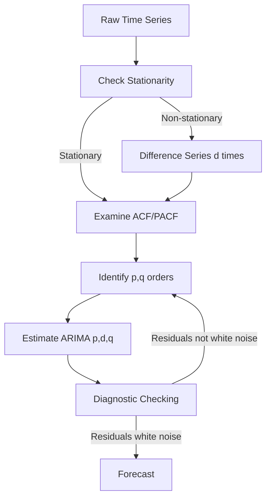

# Chapter 8: Time Series Analysis

Time series analysis forms the backbone of quantitative trading. Unlike cross-sectional data, time series exhibit temporal dependencies, trends, and cyclical patterns that require specialized statistical techniques. This chapter covers the mathematical foundations and practical implementations of time series methods used in algorithmic trading.

---

## 8.1 Stationarity and Unit Roots

### 8.1.1 The Concept of Stationarity

A time series is **strictly stationary** if its statistical properties are invariant under time shifts. More practically, we use **weak stationarity** (or covariance stationarity):

$$
\begin{align}
E[X_t] &= \mu \quad \text{(constant mean)} \\
\text{Var}(X_t) &= \sigma^2 \quad \text{(constant variance)} \\
\text{Cov}(X_t, X_{t-k}) &= \gamma_k \quad \text{(autocovariance depends only on lag k)}
\end{align}
$$

**Why Stationarity Matters:**
- Non-stationary series lead to spurious regressions
- Statistical inference breaks down without stationarity
- Most time series models (ARIMA, GARCH) assume stationarity
- Trading strategies on non-stationary data produce misleading backtest results

💡 **Key Insight**: Price levels are typically non-stationary (they trend), but price returns are often stationary. This is why we trade on returns or spreads rather than raw prices.

---

### 8.1.2 Unit Root Tests

#### Augmented Dickey-Fuller (ADF) Test

Tests the null hypothesis that a unit root is present:

$$
\Delta y_t = \alpha + \beta t + \gamma y_{t-1} + \sum_{i=1}^{p} \delta_i \Delta y_{t-i} + \epsilon_t
$$

- **Null hypothesis**: $\gamma = 0$ (unit root exists, series is non-stationary)
- **Alternative**: $\gamma < 0$ (series is stationary)
- **Test statistic**: Compare to Dickey-Fuller critical values

**OVSM Implementation:**

```lisp
;; Augmented Dickey-Fuller Test
(define (adf-test series :lags 12 :trend "c")
  (do
    ;; Compute first differences
    (define diffs (diff series))

    ;; Lag the original series
    (define y-lag (lag series 1))

    ;; Create lagged differences for augmentation
    (define lag-diffs
      (for (i (range 1 (+ lags 1)))
        (lag diffs i)))

    ;; Build regression matrix
    (define X (if (= trend "c")
                  (hstack (ones (length diffs))  ; Constant
                          y-lag
                          lag-diffs)
                  (if (= trend "ct")
                      (hstack (ones (length diffs))  ; Constant + trend
                              (range 1 (+ (length diffs) 1))
                              y-lag
                              lag-diffs)
                      (hstack y-lag lag-diffs))))  ; No constant

    ;; OLS regression
    (define regression (ols diffs X))

    ;; Extract coefficient and std error for y-lag
    (define gamma (get regression :coef (if (= trend "c") 1
                                             (if (= trend "ct") 2 0))))
    (define se (get regression :stderr (if (= trend "c") 1
                                            (if (= trend "ct") 2 0))))

    ;; Compute test statistic
    (define adf-stat (/ gamma se))

    ;; Critical values (MacKinnon, 1996)
    (define crit-values
      (if (= trend "c")
          {:1% -3.43 :5% -2.86 :10% -2.57}
          (if (= trend "ct")
              {:1% -3.96 :5% -3.41 :10% -3.12}
              {:1% -2.56 :5% -1.94 :10% -1.62})))

    ;; Return results
    {:statistic adf-stat
     :p-value (adf-p-value adf-stat trend (length series))
     :critical-values crit-values
     :lags lags
     :trend trend
     :reject-null (< adf-stat (get crit-values :5%))}))

;; Helper: ADF p-value approximation (MacKinnon)
(define (adf-p-value stat trend n)
  (define tau-coeffs
    (if (= trend "c")
        [-2.86 -2.57 -2.28]  ; 5%, 10%, 25%
        (if (= trend "ct")
            [-3.41 -3.12 -2.76]
            [-1.94 -1.62 -1.28])))

  (cond
    ((< stat (get tau-coeffs 0)) 0.01)   ; p < 1%
    ((< stat (get tau-coeffs 1)) 0.05)   ; p < 5%
    ((< stat (get tau-coeffs 2)) 0.10)   ; p < 10%
    (true 0.15)))                         ; p > 10%
```

---

#### KPSS Test

The **Kwiatkowski-Phillips-Schmidt-Shin (KPSS)** test reverses the null hypothesis:

- **Null hypothesis**: Series is stationary
- **Alternative**: Unit root exists

This provides a complementary perspective to ADF:

| ADF Result | KPSS Result | Interpretation |
|------------|-------------|----------------|
| Reject H₀  | Don't reject H₀ | **Stationary** |
| Don't reject H₀ | Reject H₀ | **Non-stationary** |
| Reject H₀ | Reject H₀ | **Trend-stationary** |
| Don't reject H₀ | Don't reject H₀ | **Inconclusive** |

```lisp
;; KPSS Test for Stationarity
(define (kpss-test series :lags null :trend "c")
  (do
    ;; Auto-select lags if not provided (Schwert, 1989)
    (define p (if (null? lags)
                  (floor (* 12 (pow (/ (length series) 100) 0.25)))
                  lags))

    ;; Detrend the series
    (define residuals
      (if (= trend "c")
          (subtract series (mean series))  ; Remove mean
          (let ((t (range 1 (+ (length series) 1)))
                (reg (ols series (hstack (ones (length series)) t))))
            (get reg :residuals))))  ; Remove linear trend

    ;; Compute partial sums
    (define S (cumsum residuals))

    ;; Compute long-run variance using Newey-West
    (define s2-long (newey-west-variance residuals p))

    ;; KPSS statistic
    (define kpss-stat (/ (sum (map (lambda (s) (* s s)) S))
                          (* (length series) (length series) s2-long)))

    ;; Critical values
    (define crit-values
      (if (= trend "c")
          {:10% 0.347 :5% 0.463 :1% 0.739}
          {:10% 0.119 :5% 0.146 :1% 0.216}))

    {:statistic kpss-stat
     :critical-values crit-values
     :lags p
     :trend trend
     :reject-null (> kpss-stat (get crit-values :5%))}))

;; Newey-West long-run variance estimator
(define (newey-west-variance residuals lags)
  (define n (length residuals))
  (define gamma0 (/ (sum (map (lambda (r) (* r r)) residuals)) n))

  (define autocovariances
    (for (k (range 1 (+ lags 1)))
      (let ((prod (for (t (range k n))
                    (* (get residuals t) (get residuals (- t k))))))
        (/ (sum prod) n))))

  (define weighted-sum
    (sum (for (k (range 1 (+ lags 1)))
           (let ((weight (- 1 (/ k (+ lags 1)))))
             (* 2 weight (get autocovariances (- k 1)))))))

  (+ gamma0 weighted-sum))
```

---

### 8.1.3 Stationarity Transformations

⚠️ **Common Transformations:**

1. **First Differencing**: $\Delta y_t = y_t - y_{t-1}$
2. **Log Returns**: $r_t = \log(P_t / P_{t-1})$
3. **Detrending**: Remove linear or polynomial trend
4. **Seasonal Differencing**: $\Delta_s y_t = y_t - y_{t-s}$

```lisp
;; Automatic stationarity transformation
(define (make-stationary series :max-diffs 2)
  (define (try-transform data diffs-applied)
    (if (>= diffs-applied max-diffs)
        {:data data :transformations diffs-applied :stationary false}
        (let ((adf-result (adf-test data))
              (kpss-result (kpss-test data)))
          (if (and (get adf-result :reject-null)
                   (not (get kpss-result :reject-null)))
              ;; Stationary
              {:data data
               :transformations diffs-applied
               :stationary true}
              ;; Apply differencing
              (try-transform (diff data) (+ diffs-applied 1))))))

  (try-transform series 0))
```

---

## 8.2 ARIMA Models

### 8.2.1 Autoregressive (AR) Models

An **AR(p)** model expresses the current value as a linear combination of past values:

$$
y_t = c + \phi_1 y_{t-1} + \phi_2 y_{t-2} + \cdots + \phi_p y_{t-p} + \epsilon_t
$$

Where:
- $p$ = order (number of lags)
- $\phi_i$ = autoregressive coefficients
- $\epsilon_t$ = white noise error

**Stationarity Condition**: All roots of $1 - \phi_1 z - \phi_2 z^2 - \cdots - \phi_p z^p = 0$ must lie outside the unit circle.

```lisp
;; AR(p) Model Estimation
(define (ar-model data :order 1 :method "ols")
  (do
    ;; Create lagged matrices
    (define y (slice data order (length data)))
    (define X (hstack (ones (length y))
                      (for (p (range 1 (+ order 1)))
                        (slice data (- order p) (- (length data) p)))))

    ;; Estimate via OLS
    (define regression (ols y X))

    ;; Extract parameters
    (define const (get regression :coef 0))
    (define phi-coeffs (slice (get regression :coef) 1 (+ order 1)))

    ;; Compute residuals
    (define fitted (matmul X (get regression :coef)))
    (define residuals (subtract y fitted))

    ;; Information criteria
    (define n (length y))
    (define k (+ order 1))
    (define sigma2 (/ (sum (map (lambda (r) (* r r)) residuals)) n))
    (define aic (+ (* n (log sigma2)) (* 2 k)))
    (define bic (+ (* n (log sigma2)) (* k (log n))))

    {:type "AR"
     :order order
     :constant const
     :coefficients phi-coeffs
     :residuals residuals
     :sigma sigma2
     :aic aic
     :bic bic
     :fitted fitted}))
```

---

### 8.2.2 Moving Average (MA) Models

An **MA(q)** model expresses the current value as a linear combination of past errors:

$$
y_t = \mu + \epsilon_t + \theta_1 \epsilon_{t-1} + \theta_2 \epsilon_{t-2} + \cdots + \theta_q \epsilon_{t-q}
$$

**Invertibility Condition**: All roots of $1 + \theta_1 z + \theta_2 z^2 + \cdots + \theta_q z^q = 0$ must lie outside the unit circle.

**Estimation Challenge**: MA models require iterative estimation (MLE or conditional least squares) since errors are not directly observable.

```lisp
;; MA(q) Model Estimation via Conditional MLE
(define (ma-model data :order 1 :max-iter 100 :tol 1e-6)
  (do
    ;; Initialize theta coefficients
    (define theta (zeros order))
    (define mu (mean data))

    ;; Iterative estimation
    (define (iterate params iter)
      (if (>= iter max-iter)
          params
          (let ((errors (compute-ma-errors data mu (get params :theta)))
                (gradient (compute-ma-gradient data errors (get params :theta)))
                (hessian (compute-ma-hessian errors))
                (delta (solve hessian gradient)))

            ;; Newton-Raphson update
            (define new-theta (subtract (get params :theta) delta))

            (if (< (norm delta) tol)
                {:theta new-theta :mu mu :converged true :iterations iter}
                (iterate {:theta new-theta :mu mu} (+ iter 1))))))

    (define result (iterate {:theta theta :mu mu} 0))

    ;; Compute final residuals
    (define errors (compute-ma-errors data (get result :mu) (get result :theta)))

    {:type "MA"
     :order order
     :mean (get result :mu)
     :coefficients (get result :theta)
     :residuals errors
     :converged (get result :converged)
     :iterations (get result :iterations)}))

;; Helper: Compute MA errors recursively
(define (compute-ma-errors data mu theta)
  (define errors (zeros (length data)))

  (for (t (range 0 (length data)))
    (define error (- (get data t) mu))
    (for (j (range 1 (+ (length theta) 1)))
      (if (>= (- t j) 0)
          (set! error (- error (* (get theta (- j 1)) (get errors (- t j)))))))
    (set-at! errors t error))

  errors)
```

---

### 8.2.3 ARIMA Models

The **ARIMA(p,d,q)** model combines:
- **AR(p)**: Autoregressive component
- **I(d)**: Integration (differencing)
- **MA(q)**: Moving average component

$$
\phi(L) (1 - L)^d y_t = c + \theta(L) \epsilon_t
$$

Where:
- $L$ is the lag operator: $L y_t = y_{t-1}$
- $\phi(L) = 1 - \phi_1 L - \cdots - \phi_p L^p$
- $\theta(L) = 1 + \theta_1 L + \cdots + \theta_q L^q$

---

### 8.2.4 Box-Jenkins Methodology

📊 **Systematic ARIMA Model Selection:**



**Step 1: Identification**
- Plot ACF (autocorrelation function) and PACF (partial autocorrelation function)
- ACF cuts off at lag q → MA(q)
- PACF cuts off at lag p → AR(p)
- Both decay exponentially → ARMA(p,q)

**Step 2: Estimation**
- Use MLE or conditional least squares

**Step 3: Diagnostic Checking**
- Ljung-Box test for residual autocorrelation
- Normality tests (Jarque-Bera)
- Plot residual ACF

```lisp
;; Complete Box-Jenkins ARIMA Implementation
(define (arima-model data :p 1 :d 1 :q 1 :seasonal false :period 12)
  (do
    ;; Step 1: Difference the series d times
    (define diff-data data)
    (for (_ (range 0 d))
      (set! diff-data (diff diff-data)))

    ;; Step 2: Apply seasonal differencing if needed
    (if seasonal
        (set! diff-data (seasonal-diff diff-data period)))

    ;; Step 3: Estimate ARMA(p,q) on differenced data
    (define arma-result (estimate-arma diff-data p q))

    ;; Step 4: Diagnostic checking
    (define residuals (get arma-result :residuals))
    (define ljung-box (ljung-box-test residuals :lags 20))
    (define jb-test (jarque-bera-test residuals))

    {:type "ARIMA"
     :orders {:p p :d d :q q}
     :seasonal {:enabled seasonal :period period}
     :ar-coeffs (get arma-result :ar-coeffs)
     :ma-coeffs (get arma-result :ma-coeffs)
     :constant (get arma-result :constant)
     :sigma2 (get arma-result :sigma2)
     :aic (get arma-result :aic)
     :bic (get arma-result :bic)
     :diagnostics {:ljung-box ljung-box
                   :jarque-bera jb-test}
     :residuals residuals}))

;; ARMA estimation (combines AR and MA)
(define (estimate-arma data p q)
  ;; Use Hannan-Rissanen algorithm for initial estimates
  (define ar-init (if (> p 0) (ar-model data :order p) null))
  (define ma-init (if (> q 0) (ma-model data :order q) null))

  ;; Refine with conditional MLE
  (arma-mle data p q ar-init ma-init))

;; Ljung-Box Q test for autocorrelation
(define (ljung-box-test residuals :lags 10)
  (define n (length residuals))
  (define acf-vals (acf residuals :nlags lags))

  (define Q (* n (+ n 2)
               (sum (for (k (range 1 (+ lags 1)))
                      (/ (* (get acf-vals k) (get acf-vals k))
                         (- n k))))))

  ;; Chi-square distribution with 'lags' degrees of freedom
  (define p-value (chi2-cdf Q lags :upper-tail true))

  {:statistic Q
   :p-value p-value
   :lags lags
   :reject-null (< p-value 0.05)})
```

---

### 8.2.5 Seasonal ARIMA (SARIMA)

For seasonal data, use **SARIMA(p,d,q)(P,D,Q)ₛ**:

$$
\phi_p(L) \Phi_P(L^s) (1-L)^d (1-L^s)^D y_t = \theta_q(L) \Theta_Q(L^s) \epsilon_t
$$

Where:
- $(p,d,q)$ = non-seasonal orders
- $(P,D,Q)$ = seasonal orders
- $s$ = seasonal period (e.g., 12 for monthly data)

---

## 8.3 Cointegration

### 8.3.1 The Concept of Cointegration

Two non-stationary series $X_t$ and $Y_t$ are **cointegrated** if a linear combination is stationary:

$$
Z_t = Y_t - \beta X_t \sim I(0)
$$

This forms the basis of **pairs trading** and **statistical arbitrage**.

💡 **Economic Intuition**: Cointegration captures long-run equilibrium relationships. Even if prices wander, their spread reverts to a mean.

---

### 8.3.2 Engle-Granger Two-Step Method

**Step 1**: Estimate cointegrating vector via OLS:
$$
Y_t = \alpha + \beta X_t + u_t
$$

**Step 2**: Test residuals for stationarity:
$$
\Delta u_t = \rho u_{t-1} + \epsilon_t
$$

If $u_t$ is stationary (reject unit root), series are cointegrated.

```lisp
;; Engle-Granger Cointegration Test
(define (engle-granger-test y x :alpha 0.05)
  (do
    ;; Step 1: Cointegrating regression
    (define X-matrix (hstack (ones (length x)) x))
    (define regression (ols y X-matrix))
    (define residuals (get regression :residuals))

    ;; Extract cointegrating vector
    (define const (get regression :coef 0))
    (define beta (get regression :coef 1))

    ;; Step 2: ADF test on residuals (no constant/trend)
    (define adf-result (adf-test residuals :trend "nc"))

    ;; Critical values adjusted for cointegration (MacKinnon, 1991)
    (define crit-values-coint
      {:1% -3.90 :5% -3.34 :10% -3.04})

    (define cointegrated
      (< (get adf-result :statistic) (get crit-values-coint :5%)))

    {:method "Engle-Granger"
     :cointegrating-vector {:constant const :beta beta}
     :adf-statistic (get adf-result :statistic)
     :critical-values crit-values-coint
     :cointegrated cointegrated
     :residuals residuals}))
```

---

### 8.3.3 Johansen Test

The **Johansen test** extends to multiple series and estimates the number of cointegrating relationships.

For a VAR(p) system:
$$
\Delta Y_t = \Pi Y_{t-1} + \sum_{i=1}^{p-1} \Gamma_i \Delta Y_{t-i} + \epsilon_t
$$

Where $\Pi = \alpha \beta^T$ has rank $r$ (number of cointegrating vectors).

**Two test statistics:**
1. **Trace statistic**: $\lambda_{\text{trace}}(r) = -T \sum_{i=r+1}^{n} \log(1 - \hat{\lambda}_i)$
2. **Max eigenvalue**: $\lambda_{\text{max}}(r) = -T \log(1 - \hat{\lambda}_{r+1})$

```lisp
;; Johansen Cointegration Test
(define (johansen-test data :lags 1 :det-order 1)
  (do
    ;; data is (n x k) matrix of k time series
    (define n (nrows data))
    (define k (ncols data))

    ;; Form differenced and lagged matrices
    (define Y0 (diff data))  ; Delta Y_t
    (define Y1 (lag data 1)) ; Y_{t-1}

    ;; Include lagged differences if p > 1
    (define Z (if (> lags 1)
                  (hstack (for (i (range 1 lags))
                            (lag (diff data) i)))
                  null))

    ;; Add deterministic components
    (define det-terms
      (cond
        ((= det-order 0) null)               ; No constant
        ((= det-order 1) (ones (nrows Y0)))  ; Constant
        ((= det-order 2) (hstack (ones (nrows Y0))   ; Constant + trend
                                 (range 1 (+ (nrows Y0) 1))))))

    ;; Combine regressors
    (define X (if (and Z det-terms)
                  (hstack Z det-terms)
                  (if Z Z det-terms)))

    ;; Residuals from regressing Y0 and Y1 on X
    (define R0 (if X (residuals-from-regression Y0 X) Y0))
    (define R1 (if X (residuals-from-regression Y1 X) Y1))

    ;; Product moment matrices
    (define S00 (matmul (transpose R0) R0))
    (define S11 (matmul (transpose R1) R1))
    (define S01 (matmul (transpose R0) R1))
    (define S10 (transpose S01))

    ;; Solve generalized eigenvalue problem
    (define eigenvalues (generalized-eig
                          (matmul S10 (solve S00 S01))
                          S11))

    ;; Sort eigenvalues descending
    (define sorted-eigs (sort eigenvalues :descending true))

    ;; Compute test statistics
    (define trace-stats
      (for (r (range 0 k))
        (let ((remaining (slice sorted-eigs r k)))
          (* -1 n (sum (map (lambda (lam) (log (- 1 lam))) remaining))))))

    (define max-stats
      (for (r (range 0 k))
        (* -1 n (log (- 1 (get sorted-eigs r))))))

    ;; Critical values (Osterwald-Lenum, 1992)
    (define trace-crit-5pct [15.41 20.04 29.68 42.77 59.46])
    (define max-crit-5pct [14.07 17.86 21.58 25.56 29.75])

    {:method "Johansen"
     :eigenvalues sorted-eigs
     :trace-statistics trace-stats
     :max-statistics max-stats
     :trace-critical-values trace-crit-5pct
     :max-critical-values max-crit-5pct
     :num-cointegrating-vectors
       (count-cointegrating-vectors trace-stats trace-crit-5pct)}))
```

---

### 8.3.4 Error Correction Models (ECM)

Once cointegration is established, use an **error correction model**:

$$
\Delta Y_t = \alpha + \gamma (Y_{t-1} - \beta X_{t-1}) + \sum_{i=1}^{p} \phi_i \Delta Y_{t-i} + \sum_{j=1}^{q} \theta_j \Delta X_{t-j} + \epsilon_t
$$

The term $(Y_{t-1} - \beta X_{t-1})$ is the **error correction term** (ECT):
- $\gamma < 0$ means deviations from equilibrium are corrected
- $|\gamma|$ measures speed of mean reversion (half-life = $\frac{\log(0.5)}{\log(1+\gamma)}$)

```lisp
;; Vector Error Correction Model (VECM)
(define (vecm-model data cointegrating-vectors :lags 1)
  (do
    ;; data: (n x k) matrix
    ;; cointegrating-vectors: (k x r) matrix of r cointegrating relationships

    (define n (nrows data))
    (define k (ncols data))
    (define r (ncols cointegrating-vectors))

    ;; Compute error correction terms
    (define ect (matmul (lag data 1) cointegrating-vectors))

    ;; Differenced data
    (define dy (diff data))

    ;; Lagged differences
    (define lagged-diffs
      (hstack (for (i (range 1 lags))
                (lag dy i))))

    ;; Regression matrix: [ECT, lagged differences]
    (define X (hstack ect lagged-diffs))

    ;; Estimate VECM for each equation
    (define equations
      (for (j (range 0 k))
        (let ((y (get-column dy j))
              (reg (ols y X)))
          {:variable j
           :alpha (slice (get reg :coef) 0 r)  ; Loading coefficients
           :gamma (slice (get reg :coef) r (ncols X))  ; Short-run dynamics
           :residuals (get reg :residuals)
           :r-squared (get reg :r-squared)})))

    ;; Half-life of mean reversion
    (define alpha-mean (mean (map (lambda (eq) (mean (get eq :alpha))) equations)))
    (define half-life (if (< alpha-mean 0)
                          (/ (log 0.5) (log (+ 1 alpha-mean)))
                          null))

    {:type "VECM"
     :cointegrating-rank r
     :lags lags
     :equations equations
     :half-life half-life}))
```

---

## 8.4 Kalman Filters

### 8.4.1 State Space Representation

The **Kalman filter** handles dynamic, partially observable systems:

**State equation** (unobservable):
$$
\mathbf{x}_t = \mathbf{F}_t \mathbf{x}_{t-1} + \mathbf{w}_t, \quad \mathbf{w}_t \sim \mathcal{N}(0, \mathbf{Q}_t)
$$

**Observation equation** (observable):
$$
\mathbf{y}_t = \mathbf{H}_t \mathbf{x}_t + \mathbf{v}_t, \quad \mathbf{v}_t \sim \mathcal{N}(0, \mathbf{R}_t)
$$

Where:
- $\mathbf{x}_t$ = hidden state (e.g., true hedge ratio)
- $\mathbf{y}_t$ = observations (e.g., price spread)
- $\mathbf{F}_t$ = state transition matrix
- $\mathbf{H}_t$ = observation matrix
- $\mathbf{Q}_t$ = process noise covariance
- $\mathbf{R}_t$ = measurement noise covariance

---

### 8.4.2 The Kalman Filter Algorithm

**Prediction Step:**
$$
\begin{align}
\hat{\mathbf{x}}_{t|t-1} &= \mathbf{F}_t \hat{\mathbf{x}}_{t-1|t-1} \\
\mathbf{P}_{t|t-1} &= \mathbf{F}_t \mathbf{P}_{t-1|t-1} \mathbf{F}_t^T + \mathbf{Q}_t
\end{align}
$$

**Update Step:**
$$
\begin{align}
\mathbf{K}_t &= \mathbf{P}_{t|t-1} \mathbf{H}_t^T (\mathbf{H}_t \mathbf{P}_{t|t-1} \mathbf{H}_t^T + \mathbf{R}_t)^{-1} \\
\hat{\mathbf{x}}_{t|t} &= \hat{\mathbf{x}}_{t|t-1} + \mathbf{K}_t (\mathbf{y}_t - \mathbf{H}_t \hat{\mathbf{x}}_{t|t-1}) \\
\mathbf{P}_{t|t} &= (\mathbf{I} - \mathbf{K}_t \mathbf{H}_t) \mathbf{P}_{t|t-1}
\end{align}
$$

```lisp
;; Kalman Filter Implementation
(define (kalman-filter observations F H Q R :x0 null :P0 null)
  (do
    ;; Dimensions
    (define n-obs (length observations))
    (define n-states (nrows F))

    ;; Initialize
    (define x-prior (if x0 x0 (zeros n-states)))
    (define P-prior (if P0 P0 (eye n-states)))

    ;; Storage
    (define x-filtered (zeros n-obs n-states))
    (define P-filtered (zeros n-obs n-states n-states))
    (define innovations (zeros n-obs))

    ;; Filter loop
    (for (t (range 0 n-obs))
      (let ((y (get observations t))

            ;; Prediction step
            (x-pred (matmul F x-prior))
            (P-pred (add (matmul (matmul F P-prior) (transpose F)) Q))

            ;; Innovation
            (innov (- y (matmul H x-pred)))
            (S (add (matmul (matmul H P-pred) (transpose H)) R))

            ;; Kalman gain
            (K (matmul (matmul P-pred (transpose H)) (inverse S)))

            ;; Update step
            (x-post (add x-pred (matmul K innov)))
            (P-post (matmul (subtract (eye n-states) (matmul K H)) P-pred)))

        ;; Store results
        (set-at! x-filtered t x-post)
        (set-at! P-filtered t P-post)
        (set-at! innovations t innov)

        ;; Update for next iteration
        (set! x-prior x-post)
        (set! P-prior P-post)))

    {:states x-filtered
     :covariances P-filtered
     :innovations innovations
     :log-likelihood (compute-log-likelihood innovations
                                             (for (t (range 0 n-obs))
                                               (add (matmul (matmul H (get P-filtered t))
                                                            (transpose H))
                                                    R)))}))
```

---

### 8.4.3 Dynamic Hedge Ratio Estimation

Apply Kalman filter to track time-varying hedge ratios:

$$
\begin{align}
\beta_t &= \beta_{t-1} + w_t \\
Y_t &= \beta_t X_t + v_t
\end{align}
$$

```lisp
;; Dynamic Hedge Ratio using Kalman Filter
(define (dynamic-hedge-ratio y x :delta 1e-4 :var-eta 1e-3)
  (do
    ;; State space setup
    (define F (matrix [[1]]))         ; Random walk for beta
    (define Q (matrix [[var-eta]]))   ; Process noise
    (define R (matrix [[delta]]))     ; Measurement noise (spread variance)

    ;; Initialize
    (define beta-ols (/ (covariance y x) (variance x)))
    (define x0 (matrix [[beta-ols]]))
    (define P0 (matrix [[1]]))

    ;; Run Kalman filter with time-varying H
    (define betas (zeros (length y)))
    (define spreads (zeros (length y)))

    (define x-prior x0)
    (define P-prior P0)

    (for (t (range 0 (length y)))
      (let ((H (matrix [[(get x t)]]))  ; Observation matrix changes each period

            ;; Prediction
            (x-pred (matmul F x-prior))
            (P-pred (add (matmul (matmul F P-prior) (transpose F)) Q))

            ;; Innovation
            (y-pred (matmul H x-pred))
            (innov (- (get y t) (get y-pred 0 0)))
            (S (add (matmul (matmul H P-pred) (transpose H)) R))

            ;; Kalman gain
            (K (matmul (matmul P-pred (transpose H)) (inverse S)))

            ;; Update
            (x-post (add x-pred (scale K innov)))
            (P-post (matmul (subtract (eye 1) (matmul K H)) P-pred)))

        (set-at! betas t (get x-post 0 0))
        (set-at! spreads t innov)

        (set! x-prior x-post)
        (set! P-prior P-post)))

    {:hedge-ratios betas
     :spreads spreads
     :mean-reversion-speed (estimate-mean-reversion spreads)}))
```

---

## 8.5 Spectral Analysis

### 8.5.1 Frequency Domain Representation

Decompose time series into sinusoidal components:

$$
y_t = \sum_{j=1}^{N/2} [A_j \cos(\omega_j t) + B_j \sin(\omega_j t)]
$$

Where $\omega_j = 2\pi j / N$ are Fourier frequencies.

**Spectral Density**: Power at each frequency
$$
S(\omega) = \frac{1}{2\pi} \sum_{k=-\infty}^{\infty} \gamma_k e^{-i\omega k}
$$

Where $\gamma_k$ is the autocovariance at lag $k$.

---

### 8.5.2 Periodogram

The **periodogram** estimates spectral density:

$$
I(\omega_j) = \frac{1}{2\pi N} \left| \sum_{t=1}^{N} y_t e^{-i\omega_j t} \right|^2
$$

```lisp
;; Periodogram Estimation
(define (periodogram series)
  (do
    (define n (length series))

    ;; Remove mean
    (define y (subtract series (mean series)))

    ;; Compute FFT
    (define fft-result (fft y))

    ;; Compute periodogram (squared magnitude / n)
    (define freqs (for (k (range 0 (/ n 2)))
                    (/ k n)))

    (define power (for (k (range 0 (/ n 2)))
                    (let ((re (get-real fft-result k))
                          (im (get-imag fft-result k)))
                      (/ (+ (* re re) (* im im)) n))))

    {:frequencies freqs
     :power power
     :dominant-freq (get freqs (argmax power))}))

;; Identify Cycles
(define (detect-cycles series :min-period 5 :max-period 100)
  (do
    (define pgrm (periodogram series))
    (define freqs (get pgrm :frequencies))
    (define power (get pgrm :power))

    ;; Filter by period range
    (define valid-indices
      (filter (range 0 (length freqs))
              (lambda (i)
                (let ((period (/ 1 (get freqs i))))
                  (and (>= period min-period) (<= period max-period))))))

    (define filtered-power (map (lambda (i) (get power i)) valid-indices))
    (define filtered-freqs (map (lambda (i) (get freqs i)) valid-indices))

    ;; Find peaks
    (define peaks (find-peaks filtered-power :threshold 0.1))

    (map (lambda (idx)
           {:frequency (get filtered-freqs idx)
            :period (/ 1 (get filtered-freqs idx))
            :power (get filtered-power idx)})
         peaks)))
```

---

### 8.5.3 Smoothed Spectral Estimation

The raw periodogram is inconsistent (variance doesn't decrease with sample size). Use **smoothing**:

**Daniell window**:
$$
\hat{S}(\omega_j) = \sum_{k=-m}^{m} w_k I(\omega_{j+k})
$$

Where $w_k$ are smoothing weights.

```lisp
;; Smoothed Periodogram (Daniell Window)
(define (smoothed-periodogram series :window-size 5)
  (do
    (define raw-pgrm (periodogram series))
    (define power (get raw-pgrm :power))

    ;; Daniell weights (uniform)
    (define m (floor (/ window-size 2)))
    (define weights (repeat (/ 1 (+ (* 2 m) 1)) (+ (* 2 m) 1)))

    ;; Convolve with weights
    (define smoothed-power
      (for (j (range m (- (length power) m)))
        (sum (for (k (range (- m) (+ m 1)))
               (* (get weights (+ k m)) (get power (+ j k)))))))

    {:frequencies (slice (get raw-pgrm :frequencies) m (- (length power) m))
     :power smoothed-power}))
```

---

## 8.6 OVSM Time Series Toolkit

### 8.6.1 Complete Workflow Example

```lisp
;; Complete Time Series Analysis Pipeline
(define (analyze-pair asset1 asset2 :lookback 252 :test-coint true)
  (do
    (log :message "========================================")
    (log :message "PAIRS TRADING TIME SERIES ANALYSIS")
    (log :message "========================================")

    ;; 1. Load data
    (define prices1 (get-historical-prices asset1 :days lookback))
    (define prices2 (get-historical-prices asset2 :days lookback))

    ;; 2. Stationarity tests
    (log :message "\n[1] STATIONARITY ANALYSIS")
    (define adf1 (adf-test prices1))
    (define adf2 (adf-test prices2))
    (log :message (format "  {} ADF: {:.3f} (p={:.3f})"
                          asset1
                          (get adf1 :statistic)
                          (get adf1 :p-value)))
    (log :message (format "  {} ADF: {:.3f} (p={:.3f})"
                          asset2
                          (get adf2 :statistic)
                          (get adf2 :p-value)))

    ;; 3. Cointegration test
    (if test-coint
        (do
          (log :message "\n[2] COINTEGRATION ANALYSIS")
          (define eg-test (engle-granger-test prices1 prices2))
          (define beta (get (get eg-test :cointegrating-vector) :beta))
          (log :message (format "  Hedge Ratio: {:.4f}" beta))
          (log :message (format "  ADF on Spread: {:.3f}"
                                (get eg-test :adf-statistic)))
          (log :message (format "  Cointegrated: {}"
                                (get eg-test :cointegrated)))))

    ;; 4. Kalman filter for dynamic hedge ratio
    (log :message "\n[3] DYNAMIC HEDGE RATIO (KALMAN)")
    (define kalman-result (dynamic-hedge-ratio prices1 prices2))
    (define latest-beta (get (get kalman-result :hedge-ratios) -1))
    (log :message (format "  Latest Hedge Ratio: {:.4f}" latest-beta))

    ;; 5. Spread statistics
    (define spread (get kalman-result :spreads))
    (define spread-mean (mean spread))
    (define spread-std (std spread))
    (define z-score (/ (- (get spread -1) spread-mean) spread-std))

    (log :message "\n[4] SPREAD STATISTICS")
    (log :message (format "  Mean: {:.4f}" spread-mean))
    (log :message (format "  Std Dev: {:.4f}" spread-std))
    (log :message (format "  Current Z-Score: {:.2f}" z-score))

    ;; 6. ARIMA forecast
    (log :message "\n[5] ARIMA FORECAST (1 step ahead)")
    (define arima-model (auto-arima spread :max-p 3 :max-q 3))
    (define forecast (arima-forecast arima-model :steps 1))
    (log :message (format "  Predicted Spread: {:.4f}" (get forecast 0)))

    ;; 7. Spectral analysis
    (log :message "\n[6] CYCLE DETECTION")
    (define cycles (detect-cycles spread :min-period 5 :max-period 50))
    (if (> (length cycles) 0)
        (for (cycle cycles)
          (log :message (format "  Period: {:.1f} days, Power: {:.4f}"
                                (get cycle :period)
                                (get cycle :power))))
        (log :message "  No significant cycles detected"))

    ;; 8. Trading signal
    (define signal
      (cond
        ((> z-score 2.0) "SHORT_SPREAD")
        ((< z-score -2.0) "LONG_SPREAD")
        (true "NEUTRAL")))

    (log :message "\n[7] TRADING SIGNAL")
    (log :message (format "  Action: {}" signal))

    ;; Return complete results
    {:assets [asset1 asset2]
     :hedge-ratio latest-beta
     :spread {:current (get spread -1)
              :mean spread-mean
              :std spread-std
              :z-score z-score}
     :cointegrated (if test-coint (get eg-test :cointegrated) null)
     :signal signal
     :arima-model arima-model
     :cycles cycles}))
```

---

### 8.6.2 Auto-ARIMA Model Selection

```lisp
;; Automatic ARIMA Order Selection
(define (auto-arima data :max-p 5 :max-q 5 :max-d 2 :ic "aic")
  (do
    ;; Determine differencing order via KPSS/ADF
    (define d (auto-diff-order data :max-d max-d))

    ;; Difference the data
    (define diff-data data)
    (for (_ (range 0 d))
      (set! diff-data (diff diff-data)))

    ;; Grid search over (p, q)
    (define best-model null)
    (define best-ic Infinity)

    (for (p (range 0 (+ max-p 1)))
      (for (q (range 0 (+ max-q 1)))
        (let ((model (arima-model data :p p :d d :q q))
              (current-ic (get model (keyword ic))))

          (if (< current-ic best-ic)
              (do
                (set! best-ic current-ic)
                (set! best-model model))))))

    (log :message (format "Auto-ARIMA selected: ARIMA({},{},{})"
                          (get (get best-model :orders) :p)
                          (get (get best-model :orders) :d)
                          (get (get best-model :orders) :q)))
    (log :message (format "  {}: {:.2f}" (upper ic) best-ic))

    best-model))

;; Automatic differencing order
(define (auto-diff-order data :max-d 2)
  (define d 0)
  (define current-data data)

  (while (and (< d max-d)
              (not (is-stationary current-data)))
    (set! d (+ d 1))
    (set! current-data (diff current-data)))

  d)

;; Combined stationarity test
(define (is-stationary data :alpha 0.05)
  (define adf (adf-test data))
  (define kpss (kpss-test data))

  (and (get adf :reject-null)        ; Reject unit root
       (not (get kpss :reject-null)))) ; Don't reject stationarity
```

---

## 8.7 Practical Considerations

### 8.7.1 Rolling Window Analysis

⚠️ **Avoid Look-Ahead Bias**:

```lisp
;; Rolling Cointegration Test
(define (rolling-cointegration y x :window 252 :step 21)
  (define n (length y))
  (define results (array))

  (for (start (range 0 (- n window) step))
    (let ((end (+ start window))
          (y-window (slice y start end))
          (x-window (slice x start end))
          (test-result (engle-granger-test y-window x-window)))

      (push! results
             {:date (get-date end)
              :hedge-ratio (get (get test-result :cointegrating-vector) :beta)
              :adf-stat (get test-result :adf-statistic)
              :cointegrated (get test-result :cointegrated)})))

  results)
```

---

### 8.7.2 Model Diagnostics Checklist

📊 **Before deploying any time series model:**

| Check | Method | Target |
|-------|--------|--------|
| **Residual Autocorrelation** | Ljung-Box test | p > 0.05 |
| **Residual Normality** | Jarque-Bera test | p > 0.05 |
| **Residual Heteroskedasticity** | ARCH test | p > 0.05 |
| **Structural Breaks** | Chow test | p > 0.05 |
| **Parameter Stability** | Recursive residuals | No pattern |
| **Out-of-Sample Error** | Walk-forward CV | RMSE < in-sample |

---

### 8.7.3 Common Pitfalls

⚠️ **Spurious Regression**:
- Two trending series appear related purely by chance
- **Solution**: Test for stationarity before regression

⚠️ **Overfitting**:
- High-order ARIMA models fit noise
- **Solution**: Use information criteria (AIC/BIC), cross-validation

⚠️ **Regime Changes**:
- Cointegration breaks down during crises
- **Solution**: Rolling window tests, regime-switching models

⚠️ **Non-constant Volatility**:
- ARIMA assumes constant variance
- **Solution**: Use GARCH models (see Chapter 11)

---

## 8.8 Summary

Time series analysis provides the mathematical foundation for quantitative trading:

1. **Stationarity** is required for valid statistical inference
2. **ARIMA models** capture autocorrelation and trends
3. **Cointegration** identifies long-run equilibrium relationships (pairs trading)
4. **Kalman filters** handle time-varying parameters
5. **Spectral analysis** detects cyclical patterns

💻 **Key Takeaways**:
- Always test for stationarity before modeling
- Use multiple tests (ADF + KPSS) for robustness
- Cointegration requires non-stationary inputs but stationary spread
- Kalman filters excel at dynamic parameter tracking
- Diagnostic checking prevents overfitting

**Next Chapter**: We build backtesting frameworks to validate these models on historical data.

---

## References

1. Hamilton, J.D. (1994). *Time Series Analysis*. Princeton University Press.
2. Tsay, R.S. (2010). *Analysis of Financial Time Series* (3rd ed.). Wiley.
3. Box, G.E.P., Jenkins, G.M., & Reinsel, G.C. (2015). *Time Series Analysis: Forecasting and Control* (5th ed.). Wiley.
4. Engle, R.F., & Granger, C.W.J. (1987). Co-integration and error correction. *Econometrica*, 55(2), 251-276.
5. Johansen, S. (1991). Estimation and hypothesis testing of cointegration vectors. *Econometrica*, 59(6), 1551-1580.
6. Kalman, R.E. (1960). A new approach to linear filtering and prediction problems. *Journal of Basic Engineering*, 82(1), 35-45.
7. MacKinnon, J.G. (1996). Numerical distribution functions for unit root and cointegration tests. *Journal of Applied Econometrics*, 11(6), 601-618.
