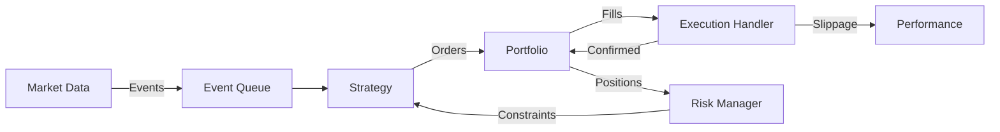
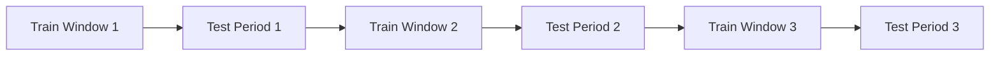

# Chapter 9: Backtesting Frameworks

Backtesting is the bridge between theoretical strategy and live trading. A robust backtesting framework simulates how a strategy would have performed historically, accounting for realistic trading constraints, transaction costs, and market microstructure effects. This chapter covers the architecture, implementation, and pitfalls of professional-grade backtesting systems.

---

## 9.1 Event-Driven Architecture

### 9.1.1 Core Components

An **event-driven backtester** processes historical data as a stream of discrete events, mimicking real-time trading:



**Key Classes:**

1. **Event**: Base class for all events (Market, Signal, Order, Fill)
2. **DataHandler**: Generates market events from historical data
3. **Strategy**: Generates signals based on market events
4. **Portfolio**: Tracks positions, cash, P&L
5. **ExecutionHandler**: Simulates order execution with slippage/fees
6. **Performance**: Calculates metrics (Sharpe, drawdown, etc.)

---

### 9.1.2 Event Types

```lisp
;; Event Type Definitions
(define (create-market-event symbol timestamp data)
  {:type "MARKET"
   :symbol symbol
   :timestamp timestamp
   :open (get data :open)
   :high (get data :high)
   :low (get data :low)
   :close (get data :close)
   :volume (get data :volume)})

(define (create-signal-event symbol timestamp direction strength)
  {:type "SIGNAL"
   :symbol symbol
   :timestamp timestamp
   :direction direction  ; "LONG", "SHORT", "EXIT"
   :strength strength})  ; 0.0 to 1.0

(define (create-order-event symbol timestamp order-type quantity)
  {:type "ORDER"
   :symbol symbol
   :timestamp timestamp
   :order-type order-type  ; "MARKET", "LIMIT"
   :quantity quantity
   :direction (if (> quantity 0) "BUY" "SELL")})

(define (create-fill-event symbol timestamp quantity price commission)
  {:type "FILL"
   :symbol symbol
   :timestamp timestamp
   :quantity quantity
   :price price
   :commission commission
   :total-cost (* quantity price)})
```

---

### 9.1.3 Main Simulation Loop

```lisp
;; Event-Driven Backtest Engine
(define (run-backtest strategy data-handler portfolio execution :start-date null :end-date null)
  (do
    (log :message "=== BACKTEST STARTED ===")

    ;; Initialize
    (define events (queue))
    (define continue true)
    (define heartbeat 0)

    ;; Main loop
    (while continue
      (do
        ;; Update market data bar
        (if (has-next-bar data-handler)
            (do
              (define market-event (get-next-bar data-handler))
              (enqueue! events market-event))
            (set! continue false))

        ;; Process all events in queue
        (while (not (empty? events))
          (let ((event (dequeue! events)))

            (cond
              ;; Market event → Strategy generates signals
              ((= (get event :type) "MARKET")
               (do
                 (update-bars data-handler event)
                 (define signals (calculate-signals strategy
                                                    (get-latest-bars data-handler)))
                 (for (signal signals)
                   (enqueue! events signal))))

              ;; Signal event → Portfolio generates orders
              ((= (get event :type) "SIGNAL")
               (define orders (generate-orders portfolio event))
               (for (order orders)
                 (enqueue! events order)))

              ;; Order event → Execution simulates fills
              ((= (get event :type) "ORDER")
               (define fill (execute-order execution event
                                           (get-latest-bars data-handler)))
               (enqueue! events fill))

              ;; Fill event → Portfolio updates positions
              ((= (get event :type) "FILL")
               (update-from-fill portfolio event
                                 (get event :timestamp))))))

        (set! heartbeat (+ heartbeat 1))))

    (log :message "=== BACKTEST COMPLETED ===")

    ;; Generate performance report
    (define equity-curve (get-equity-curve portfolio))
    (define performance (analyze-performance equity-curve))

    {:portfolio portfolio
     :equity-curve equity-curve
     :performance performance
     :trades (get-all-trades portfolio)}))
```

---

### 9.1.4 Portfolio State Management

```lisp
;; Portfolio Class
(define (create-portfolio initial-capital :symbols [])
  {:cash initial-capital
   :initial-capital initial-capital
   :positions {}         ; symbol → quantity
   :holdings {}          ; symbol → market value
   :equity-curve []      ; [{:timestamp t :equity e}]
   :current-holdings {}
   :trades []})

;; Update portfolio from fill event
(define (update-from-fill portfolio fill timestamp)
  (do
    (define symbol (get fill :symbol))
    (define quantity (get fill :quantity))
    (define price (get fill :price))
    (define commission (get fill :commission))

    ;; Update positions
    (define current-pos (get-or (get portfolio :positions) symbol 0))
    (define new-pos (+ current-pos quantity))
    (set-in! portfolio [:positions symbol] new-pos)

    ;; Update cash
    (define cost (+ (* quantity price) commission))
    (set-in! portfolio [:cash] (- (get portfolio :cash) cost))

    ;; Record trade
    (define trade
      {:timestamp timestamp
       :symbol symbol
       :quantity quantity
       :price price
       :commission commission
       :direction (if (> quantity 0) "BUY" "SELL")})

    (push! (get portfolio :trades) trade)

    portfolio))

;; Update market values
(define (update-holdings portfolio timestamp bars)
  (do
    (define total-equity (get portfolio :cash))

    ;; Calculate holdings value
    (for (symbol (keys (get portfolio :positions)))
      (let ((quantity (get (get portfolio :positions) symbol))
            (current-price (get (get bars symbol) :close))
            (market-value (* quantity current-price)))

        (set-in! portfolio [:holdings symbol] market-value)
        (set! total-equity (+ total-equity market-value))))

    ;; Record equity curve point
    (push! (get portfolio :equity-curve)
           {:timestamp timestamp :equity total-equity})

    portfolio))
```

---

### 9.1.5 Execution Simulation

💡 **Realistic Execution**: Account for slippage, partial fills, and latency.

```lisp
;; Execution Handler with Slippage
(define (execute-order execution order bars)
  (do
    (define symbol (get order :symbol))
    (define quantity (get order :quantity))
    (define order-type (get order :order-type))

    ;; Get current market price
    (define bar (get bars symbol))
    (define base-price (get bar :close))

    ;; Apply slippage model
    (define slippage-factor (get execution :slippage-model))
    (define filled-price
      (if (> quantity 0)
          (* base-price (+ 1 slippage-factor))  ; Buy higher
          (* base-price (- 1 slippage-factor)))) ; Sell lower

    ;; Calculate commission
    (define commission-rate (get execution :commission-rate))
    (define min-commission (get execution :min-commission))
    (define commission (max min-commission
                            (* (abs quantity) filled-price commission-rate)))

    ;; Create fill event
    (create-fill-event symbol
                       (get order :timestamp)
                       quantity
                       filled-price
                       commission)))

;; Advanced Slippage Models
(define (volume-weighted-slippage order bar)
  ;; Slippage increases with order size relative to volume
  (define order-size (abs (get order :quantity)))
  (define avg-volume (get bar :volume))
  (define participation-rate (/ order-size avg-volume))

  ;; Square root market impact model
  (* 0.1 (sqrt participation-rate)))  ; 10 bps base * sqrt(participation)

(define (volatility-adjusted-slippage order bar)
  ;; Higher volatility → more slippage
  (define returns (compute-returns (get-historical-bars bar 20)))
  (define volatility (std returns))

  (* volatility 0.5))  ; Half the volatility as slippage
```

---

## 9.2 Vectorized Backtesting

### 9.2.1 Matrix Operations for Speed

**Vectorized backtesting** trades flexibility for speed by computing all signals at once using matrix operations:

```lisp
;; Vectorized Moving Average Crossover
(define (vectorized-ma-crossover prices :fast 50 :slow 200)
  (do
    ;; Compute moving averages (vectorized)
    (define ma-fast (rolling-mean prices fast))
    (define ma-slow (rolling-mean prices slow))

    ;; Generate signals (1 = long, -1 = short, 0 = neutral)
    (define signals
      (for (i (range 0 (length prices)))
        (cond
          ((> (get ma-fast i) (get ma-slow i)) 1)
          ((< (get ma-fast i) (get ma-slow i)) -1)
          (true 0))))

    ;; Compute position changes (entries/exits)
    (define positions (diff signals))

    ;; Calculate returns
    (define returns (pct-change prices))

    ;; Strategy returns = position * returns (look-ahead by 1)
    (define strategy-returns
      (for (i (range 1 (length returns)))
        (* (get signals (- i 1)) (get returns i))))

    ;; Cumulative returns
    (define cumulative-returns (cumsum strategy-returns))

    {:signals signals
     :positions positions
     :returns strategy-returns
     :cumulative-returns cumulative-returns
     :total-return (exp (sum strategy-returns))
     :sharpe-ratio (/ (mean strategy-returns)
                       (std strategy-returns))}))
```

---

### 9.2.2 Vectorized vs Event-Driven Trade-offs

| Aspect | Vectorized | Event-Driven |
|--------|-----------|--------------|
| **Speed** | 10-100x faster | Slower |
| **Realism** | Less realistic | High fidelity |
| **Order Types** | Market only | Limit, stop, etc. |
| **Portfolio Logic** | Simple | Complex (position sizing, risk) |
| **Slippage** | Simplified | Realistic models |
| **Use Case** | Rapid prototyping | Production backtests |

💻 **Best Practice**: Use vectorized for initial exploration, then validate with event-driven.

---

### 9.2.3 Advanced Vectorized Example

```lisp
;; Vectorized Mean Reversion Strategy
(define (vectorized-mean-reversion prices :window 20 :entry-z 2.0 :exit-z 0.5)
  (do
    ;; Compute rolling statistics
    (define rolling-mean (rolling-mean prices window))
    (define rolling-std (rolling-std prices window))

    ;; Z-scores
    (define z-scores
      (for (i (range 0 (length prices)))
        (/ (- (get prices i) (get rolling-mean i))
           (get rolling-std i))))

    ;; Generate signals
    (define signals (zeros (length prices)))

    (for (i (range 1 (length prices)))
      (let ((z-current (get z-scores i))
            (pos-prev (get signals (- i 1))))

        (set-at! signals i
          (cond
            ;; Enter short if z > entry-z
            ((and (= pos-prev 0) (> z-current entry-z)) -1)

            ;; Enter long if z < -entry-z
            ((and (= pos-prev 0) (< z-current (- entry-z))) 1)

            ;; Exit short if z < exit-z
            ((and (= pos-prev -1) (< z-current exit-z)) 0)

            ;; Exit long if z > -exit-z
            ((and (= pos-prev 1) (> z-current (- exit-z))) 0)

            ;; Hold position
            (true pos-prev)))))

    ;; Apply transaction costs
    (define position-changes (abs (diff signals)))
    (define num-trades (sum position-changes))
    (define cost-per-trade 0.001)  ; 10 bps

    ;; Compute returns with costs
    (define returns (pct-change prices))
    (define strategy-returns
      (for (i (range 1 (length returns)))
        (let ((ret (* (get signals (- i 1)) (get returns i)))
              (trade-cost (* (get position-changes i) cost-per-trade)))
          (- ret trade-cost))))

    {:signals signals
     :z-scores z-scores
     :returns strategy-returns
     :num-trades num-trades
     :total-cost (* num-trades cost-per-trade)
     :sharpe-ratio (* (sqrt 252) (/ (mean strategy-returns)
                                     (std strategy-returns)))}))
```

---

## 9.3 Walk-Forward Analysis

### 9.3.1 The Look-Ahead Bias Problem

⚠️ **In-sample overfitting**: Optimizing on entire dataset leads to unrealistic performance.

**Solution**: Walk-forward analysis separates training and testing:



---

### 9.3.2 Rolling Window Implementation

```lisp
;; Walk-Forward Analysis
(define (walk-forward-analysis data strategy-fn
                               :train-window 252
                               :test-window 63
                               :step 63)
  (do
    (define results [])
    (define n (length data))

    (for (start (range 0 (- n (+ train-window test-window)) step))
      (let ((train-end (+ start train-window))
            (test-end (+ train-end test-window))

            ;; Training data
            (train-data (slice data start train-end))

            ;; Optimize parameters on training data
            (optimal-params (optimize-strategy strategy-fn train-data))

            ;; Test on out-of-sample data
            (test-data (slice data train-end test-end))
            (test-result (run-strategy strategy-fn test-data optimal-params)))

        (push! results
               {:train-start start
                :train-end train-end
                :test-start train-end
                :test-end test-end
                :optimal-params optimal-params
                :test-sharpe (get test-result :sharpe-ratio)
                :test-return (get test-result :total-return)})))

    ;; Aggregate out-of-sample results
    (define oos-returns (map (lambda (r) (get r :test-return)) results))
    (define oos-sharpes (map (lambda (r) (get r :test-sharpe)) results))

    {:walk-forward-results results
     :oos-avg-return (mean oos-returns)
     :oos-avg-sharpe (mean oos-sharpes)
     :oos-consistency (/ (count (filter oos-sharpes (lambda (s) (> s 0))))
                          (length oos-sharpes))}))
```

---

### 9.3.3 Expanding Window

Alternative to rolling: **expanding window** (anchored training):

```lisp
;; Expanding Window Analysis
(define (expanding-window-analysis data strategy-fn
                                   :initial-train 252
                                   :test-window 63
                                   :step 63)
  (define results [])

  (for (test-start (range initial-train (- (length data) test-window) step))
    (let ((train-data (slice data 0 test-start))  ; Grows over time
          (test-data (slice data test-start (+ test-start test-window)))

          (optimal-params (optimize-strategy strategy-fn train-data))
          (test-result (run-strategy strategy-fn test-data optimal-params)))

      (push! results
             {:train-size (length train-data)
              :test-start test-start
              :optimal-params optimal-params
              :test-sharpe (get test-result :sharpe-ratio)})))

  results)
```

**Trade-off**: Expanding windows capture regime changes but may include outdated data.

---

### 9.3.4 Combinatorially Symmetric Cross-Validation

📊 **CSCV (Bailey et al., 2016)**: Reduce overfitting in walk-forward analysis by averaging over multiple train/test splits.

```lisp
;; Combinatorially Symmetric Cross-Validation
(define (cscv data strategy-fn :n-groups 10 :n-test-groups 2)
  (do
    ;; Split data into n-groups chunks
    (define group-size (floor (/ (length data) n-groups)))
    (define groups (for (i (range 0 n-groups))
                     (slice data (* i group-size) (* (+ i 1) group-size))))

    ;; Generate all combinations of test groups
    (define test-combos (combinations (range 0 n-groups) n-test-groups))

    (define results [])

    (for (test-indices test-combos)
      (let ((train-indices (filter (range 0 n-groups)
                                   (lambda (i) (not (contains? test-indices i)))))

            (train-data (concat (map (lambda (i) (get groups i)) train-indices)))
            (test-data (concat (map (lambda (i) (get groups i)) test-indices)))

            (params (optimize-strategy strategy-fn train-data))
            (test-perf (run-strategy strategy-fn test-data params)))

        (push! results (get test-perf :sharpe-ratio))))

    {:cscv-sharpe (mean results)
     :cscv-std (std results)
     :cscv-sharpe-ratio (/ (mean results) (std results))}))
```

---

## 9.4 Performance Attribution

### 9.4.1 Decomposing Returns

**Question**: Why did the strategy make/lose money?

**Performance attribution** breaks down returns into components:

$$
R_{\text{total}} = R_{\text{market}} + R_{\text{timing}} + R_{\text{selection}} + R_{\text{interaction}}
$$

---

### 9.4.2 Brinson Attribution

**Brinson-Fachler model** (equity portfolios):

$$
\begin{align}
\text{Allocation} &= \sum_{i} (w_{p,i} - w_{b,i}) R_{b,i} \\
\text{Selection} &= \sum_{i} w_{b,i} (R_{p,i} - R_{b,i}) \\
\text{Interaction} &= \sum_{i} (w_{p,i} - w_{b,i}) (R_{p,i} - R_{b,i})
\end{align}
$$

Where:
- $w_{p,i}$ = portfolio weight in asset $i$
- $w_{b,i}$ = benchmark weight in asset $i$
- $R_{p,i}$ = portfolio return on asset $i$
- $R_{b,i}$ = benchmark return on asset $i$

```lisp
;; Brinson Attribution
(define (brinson-attribution portfolio-weights portfolio-returns
                             benchmark-weights benchmark-returns)
  (do
    (define n (length portfolio-weights))

    (define allocation-effect
      (sum (for (i (range 0 n))
             (* (- (get portfolio-weights i) (get benchmark-weights i))
                (get benchmark-returns i)))))

    (define selection-effect
      (sum (for (i (range 0 n))
             (* (get benchmark-weights i)
                (- (get portfolio-returns i) (get benchmark-returns i))))))

    (define interaction-effect
      (sum (for (i (range 0 n))
             (* (- (get portfolio-weights i) (get benchmark-weights i))
                (- (get portfolio-returns i) (get benchmark-returns i))))))

    {:allocation allocation-effect
     :selection selection-effect
     :interaction interaction-effect
     :total (+ allocation-effect selection-effect interaction-effect)}))
```

---

### 9.4.3 Factor-Based Attribution

Regress returns on risk factors:

$$
R_t = \alpha + \beta_1 F_{1,t} + \beta_2 F_{2,t} + \cdots + \beta_k F_{k,t} + \epsilon_t
$$

```lisp
;; Factor Attribution (Fama-French 3-Factor)
(define (factor-attribution strategy-returns market-returns smb-returns hml-returns)
  (do
    ;; Run multiple regression
    (define X (hstack market-returns smb-returns hml-returns))
    (define regression (ols strategy-returns X))

    (define alpha (get regression :intercept))
    (define beta-market (get regression :coef 0))
    (define beta-smb (get regression :coef 1))
    (define beta-hml (get regression :coef 2))

    ;; Decompose returns
    (define factor-returns
      {:alpha (* alpha (length strategy-returns))
       :market (* beta-market (sum market-returns))
       :size (* beta-smb (sum smb-returns))
       :value (* beta-hml (sum hml-returns))
       :residual (sum (get regression :residuals))})

    {:betas {:market beta-market :size beta-smb :value beta-hml}
     :alpha alpha
     :r-squared (get regression :r-squared)
     :factor-returns factor-returns}))
```

---

### 9.4.4 Trade-Level Attribution

Analyze individual trades:

```lisp
;; Trade Analysis
(define (analyze-trades trades)
  (do
    (define winning-trades (filter trades (lambda (t) (> (get t :pnl) 0))))
    (define losing-trades (filter trades (lambda (t) (<= (get t :pnl) 0))))

    (define avg-win (mean (map (lambda (t) (get t :pnl)) winning-trades)))
    (define avg-loss (mean (map (lambda (t) (get t :pnl)) losing-trades)))
    (define win-rate (/ (length winning-trades) (length trades)))

    (define profit-factor (/ (sum (map (lambda (t) (get t :pnl)) winning-trades))
                              (abs (sum (map (lambda (t) (get t :pnl)) losing-trades)))))

    {:total-trades (length trades)
     :winning-trades (length winning-trades)
     :losing-trades (length losing-trades)
     :win-rate win-rate
     :avg-win avg-win
     :avg-loss avg-loss
     :profit-factor profit-factor
     :expectancy (+ (* win-rate avg-win) (* (- 1 win-rate) avg-loss))}))
```

---

## 9.5 Common Backtesting Pitfalls

### 9.5.1 Look-Ahead Bias

⚠️ **Using future information in signals**:

```lisp
;; WRONG - Look-ahead bias
(define signals
  (for (i (range 0 (length prices)))
    (if (> (get prices (+ i 1)) (get prices i))  ; Uses tomorrow's price!
        1
        0)))

;; CORRECT - Only use past data
(define signals
  (for (i (range 1 (length prices)))
    (if (> (get prices i) (get prices (- i 1)))  ; Uses yesterday's price
        1
        0)))
```

**Common sources**:
- Computing indicators on full dataset, then applying to historical data
- Using end-of-period prices for intraday decisions
- Training on future data in walk-forward analysis

---

### 9.5.2 Survivorship Bias

⚠️ **Testing only on assets that survived**:

**Example**: Backtesting a strategy on current S&P 500 constituents ignores companies that went bankrupt.

**Solution**: Use **point-in-time databases** that include delisted securities.

```lisp
;; Correct: Filter universe at each time point
(define (get-universe-at-date date)
  ;; Returns only assets that existed and were tradable at 'date'
  (filter all-assets
          (lambda (asset)
            (and (>= date (get asset :listing-date))
                 (or (null? (get asset :delisting-date))
                     (< date (get asset :delisting-date)))))))
```

---

### 9.5.3 Data Snooping Bias

⚠️ **Overfitting by trying many strategies**:

**Problem**: Testing 100 strategies → some appear profitable by chance.

**Bonferroni Correction**: Adjust significance level:
$$
\alpha_{\text{adjusted}} = \frac{\alpha}{N}
$$

For $\alpha = 0.05$ and $N = 100$ tests: $\alpha_{\text{adjusted}} = 0.0005$

**Deflated Sharpe Ratio (Bailey & López de Prado, 2014)**:
$$
\text{DSR} = \text{SR} \times \left( 1 - \frac{\mathbb{E}[\text{MaxSR}]}{\text{SR}} \right)
$$

Where $\mathbb{E}[\text{MaxSR}]$ accounts for multiple testing.

```lisp
;; Deflated Sharpe Ratio
(define (deflated-sharpe-ratio observed-sr num-strategies num-observations :skew 0 :kurtosis 3)
  (do
    ;; Expected maximum SR under null (no skill)
    (define expected-max-sr
      (* (sqrt (/ (* 2 (log num-strategies)) num-observations))
         (- 1 (* 0.577 (/ (log (log num-strategies))
                          (log num-strategies))))))  ; Euler-Mascheroni adjustment

    ;; Standard error of SR
    (define sr-std-error
      (sqrt (/ (+ 1 (* 0.5 (- (* observed-sr observed-sr)))
                    (* -1 skew observed-sr)
                    (* (- kurtosis 3) 0.25 (- (* observed-sr observed-sr))))
               (- num-observations 1))))

    ;; Z-score
    (define z-score (/ (- observed-sr expected-max-sr) sr-std-error))

    ;; Deflated SR
    (define dsr (* observed-sr (normal-cdf z-score)))

    {:deflated-sr dsr
     :z-score z-score
     :p-value (- 1 (normal-cdf z-score))
     :expected-max-sr expected-max-sr}))
```

---

### 9.5.4 Transaction Costs Underestimation

⚠️ **Ignoring hidden costs**:

**True cost breakdown**:
1. **Commission**: Explicit fee
2. **Slippage**: Difference between expected and filled price
3. **Market Impact**: Moving price with large orders
4. **Spread**: Bid-ask spread
5. **Opportunity Cost**: Missed fills

```lisp
;; Comprehensive Cost Model
(define (calculate-total-cost order market-state)
  (do
    (define quantity (abs (get order :quantity)))
    (define direction (get order :direction))

    ;; 1. Commission
    (define commission (* quantity 0.0005))  ; 5 bps

    ;; 2. Spread cost
    (define bid (get market-state :bid))
    (define ask (get market-state :ask))
    (define mid (/ (+ bid ask) 2))
    (define spread-cost
      (if (= direction "BUY")
          (* quantity (- ask mid))
          (* quantity (- mid bid))))

    ;; 3. Market impact (square-root model)
    (define adv (get market-state :average-daily-volume))
    (define participation (/ quantity adv))
    (define impact-cost (* mid quantity 0.1 (sqrt participation)))

    ;; 4. Slippage (volatility-based)
    (define volatility (get market-state :volatility))
    (define slippage-cost (* mid quantity volatility 0.5))

    ;; Total cost
    (define total-cost (+ commission spread-cost impact-cost slippage-cost))

    {:commission commission
     :spread spread-cost
     :impact impact-cost
     :slippage slippage-cost
     :total total-cost
     :cost-bps (* 10000 (/ total-cost (* quantity mid)))}))
```

---

### 9.5.5 Overfitting to Noise

⚠️ **High complexity strategies fit noise**:

**Metrics to detect overfitting**:

| Metric | Formula | Healthy Range |
|--------|---------|---------------|
| **In-sample vs OOS Sharpe** | $\frac{\text{SR}_{\text{OOS}}}{\text{SR}_{\text{IS}}}$ | > 0.7 |
| **Parameter Sensitivity** | $\frac{\Delta \text{Sharpe}}{\Delta \text{Parameter}}$ | Low |
| **Number of Trades** | Count | > 100 |
| **AIC / BIC** | Penalize complexity | Lower is better |

```lisp
;; Overfitting Detection
(define (detect-overfitting in-sample-results out-of-sample-results strategy-complexity)
  (do
    (define sr-is (get in-sample-results :sharpe-ratio))
    (define sr-oos (get out-of-sample-results :sharpe-ratio))

    (define degradation (- 1 (/ sr-oos sr-is)))

    (define n-trades-is (get in-sample-results :num-trades))
    (define n-trades-oos (get out-of-sample-results :num-trades))

    (define warnings [])

    (if (> degradation 0.3)
        (push! warnings "Severe performance degradation OOS (>30%)"))

    (if (< n-trades-is 100)
        (push! warnings "Insufficient trades for statistical significance"))

    (if (> strategy-complexity 10)
        (push! warnings "High parameter count increases overfitting risk"))

    {:degradation degradation
     :sharpe-ratio-is sr-is
     :sharpe-ratio-oos sr-oos
     :warnings warnings
     :overfit-likely (> (length warnings) 1)}))
```

---

## 9.6 OVSM Backtest Framework

### 9.6.1 Complete Event-Driven System

```lisp
;; Production-Grade Backtesting Framework
(define (ovsm-backtest strategy-config data-config :initial-capital 100000)
  (do
    (log :message "========================================")
    (log :message "OVSM BACKTESTING FRAMEWORK")
    (log :message "========================================")

    ;; Initialize components
    (define data-handler (create-data-handler data-config))
    (define portfolio (create-portfolio initial-capital
                                        :symbols (get data-config :symbols)))
    (define execution (create-execution-handler
                        :slippage-model "volume-weighted"
                        :commission-rate 0.0005
                        :min-commission 1.0))

    (define strategy (create-strategy strategy-config))
    (define risk-manager (create-risk-manager
                           :max-position-size 0.2
                           :max-portfolio-leverage 1.0
                           :max-drawdown 0.25))

    ;; Run simulation
    (define backtest-results (run-backtest strategy data-handler
                                           portfolio execution))

    ;; Performance analysis
    (define equity-curve (get backtest-results :equity-curve))
    (define trades (get backtest-results :trades))

    (log :message "\n=== PERFORMANCE METRICS ===")

    (define performance (compute-performance-metrics equity-curve trades))

    (log :message (format "Total Return: {:.2f}%"
                          (* 100 (get performance :total-return))))
    (log :message (format "CAGR: {:.2f}%"
                          (* 100 (get performance :cagr))))
    (log :message (format "Sharpe Ratio: {:.2f}"
                          (get performance :sharpe-ratio)))
    (log :message (format "Sortino Ratio: {:.2f}"
                          (get performance :sortino-ratio)))
    (log :message (format "Max Drawdown: {:.2f}%"
                          (* 100 (get performance :max-drawdown))))
    (log :message (format "Calmar Ratio: {:.2f}"
                          (get performance :calmar-ratio)))

    (log :message "\n=== TRADE STATISTICS ===")
    (define trade-stats (analyze-trades trades))

    (log :message (format "Total Trades: {}"
                          (get trade-stats :total-trades)))
    (log :message (format "Win Rate: {:.2f}%"
                          (* 100 (get trade-stats :win-rate))))
    (log :message (format "Profit Factor: {:.2f}"
                          (get trade-stats :profit-factor)))
    (log :message (format "Avg Win: ${:.2f}"
                          (get trade-stats :avg-win)))
    (log :message (format "Avg Loss: ${:.2f}"
                          (get trade-stats :avg-loss)))

    ;; Risk analysis
    (log :message "\n=== RISK ANALYSIS ===")
    (define risk-metrics (analyze-risk equity-curve))

    (log :message (format "Value at Risk (95%): {:.2f}%"
                          (* 100 (get risk-metrics :var-95))))
    (log :message (format "Conditional VaR: {:.2f}%"
                          (* 100 (get risk-metrics :cvar-95))))
    (log :message (format "Avg Daily Vol: {:.2f}%"
                          (* 100 (get risk-metrics :volatility))))

    ;; Return complete results
    {:performance performance
     :trade-stats trade-stats
     :risk-metrics risk-metrics
     :equity-curve equity-curve
     :trades trades
     :portfolio portfolio}))
```

---

### 9.6.2 Strategy Templates

```lisp
;; Momentum Strategy Template
(define (momentum-strategy-config)
  {:type "momentum"
   :lookback 252
   :holding-period 21
   :num-positions 10
   :rebalance-frequency 21})

;; Mean Reversion Strategy Template
(define (mean-reversion-strategy-config)
  {:type "mean-reversion"
   :window 20
   :entry-threshold 2.0
   :exit-threshold 0.5
   :max-holding-period 10})

;; Pairs Trading Strategy Template
(define (pairs-trading-strategy-config)
  {:type "pairs-trading"
   :lookback 252
   :cointegration-test "engle-granger"
   :entry-threshold 2.0
   :exit-threshold 0.0
   :hedge-ratio-method "kalman"})
```

---

### 9.6.3 Monte Carlo Validation

Resample returns to assess robustness:

```lisp
;; Monte Carlo Simulation
(define (monte-carlo-backtest returns :num-simulations 1000 :block-size 21)
  (do
    (define sharpe-ratios [])

    (for (_ (range 0 num-simulations))
      (let ((resampled-returns (block-bootstrap returns block-size))
            (sharpe (* (sqrt 252)
                       (/ (mean resampled-returns)
                          (std resampled-returns)))))

        (push! sharpe-ratios sharpe)))

    ;; Compute confidence intervals
    (define sorted-sharpes (sort sharpe-ratios))
    (define ci-5 (percentile sorted-sharpes 5))
    (define ci-95 (percentile sorted-sharpes 95))

    {:simulated-sharpes sharpe-ratios
     :mean-sharpe (mean sharpe-ratios)
     :std-sharpe (std sharpe-ratios)
     :ci-5pct ci-5
     :ci-95pct ci-95}))

;; Block Bootstrap (preserves autocorrelation)
(define (block-bootstrap returns block-size)
  (define n (length returns))
  (define num-blocks (ceiling (/ n block-size)))

  (define resampled [])

  (for (_ (range 0 num-blocks))
    (let ((start-idx (random-int 0 (- n block-size)))
          (block (slice returns start-idx (+ start-idx block-size))))

      (set! resampled (concat resampled block))))

  (slice resampled 0 n))
```

---

## 9.7 Summary

Rigorous backtesting separates viable strategies from overfitted noise:

1. **Event-driven architecture** provides realistic simulation
2. **Vectorized backtesting** enables rapid prototyping
3. **Walk-forward analysis** prevents look-ahead bias
4. **Performance attribution** identifies return sources
5. **Pitfall awareness** avoids common mistakes

🎯 **Key Takeaways**:
- Use event-driven for production, vectorized for exploration
- Always validate with walk-forward or expanding window
- Account for realistic transaction costs (commission + slippage + impact + spread)
- Test parameter sensitivity and run Monte Carlo simulations
- Beware: survivorship bias, look-ahead bias, data snooping, overfitting

**Next Chapter**: We build production trading systems that execute these strategies in live markets.

---

## References

1. Prado, M.L. (2018). *Advances in Financial Machine Learning*. Wiley.
2. Bailey, D.H., Borwein, J.M., López de Prado, M., & Zhu, Q.J. (2014). Pseudo-mathematics and financial charlatanism. *Notices of the AMS*, 61(5), 458-471.
3. Bailey, D.H., & López de Prado, M. (2014). The deflated Sharpe ratio. *Journal of Portfolio Management*, 40(5), 94-107.
4. Harvey, C.R., Liu, Y., & Zhu, H. (2016). ... and the cross-section of expected returns. *Review of Financial Studies*, 29(1), 5-68.
5. Brinson, G.P., Hood, L.R., & Beebower, G.L. (1986). Determinants of portfolio performance. *Financial Analysts Journal*, 42(4), 39-44.
6. White, H. (2000). A reality check for data snooping. *Econometrica*, 68(5), 1097-1126.
