# Chapter 11: Statistical Arbitrage — Pairs Trading

Pairs trading exploits mean reversion in the price relationship between two cointegrated assets. This market-neutral strategy has generated consistent returns since its development at Morgan Stanley in the 1980s, though profitability has declined due to strategy diffusion and crowding.

---

## 11.1 Introduction and Historical Context

> **💡 Key Concept**
>
> Statistical arbitrage accepts short-term risk to exploit mean-reverting relationships between financial instruments, unlike traditional arbitrage which is riskless.

Statistical arbitrage represents one of the most enduring and theoretically grounded strategies in quantitative finance. Unlike traditional arbitrage—which exploits riskless pricing discrepancies across markets or instruments—statistical arbitrage relies on the mean-reverting properties of relationships between financial instruments.

### 11.1.1 The Morgan Stanley Origin Story

Pairs trading emerged from the quantitative trading group at Morgan Stanley in the mid-1980s. The original strategy was elegantly simple:

1. Identify pairs of stocks that historically moved together
2. Wait for temporary divergences in their price relationship
3. Bet on convergence by longing the underperformer and shorting the outperformer

> **📊 Empirical Result**
>
> Gatev et al. (2006) documented excess returns of **11% annually** with Sharpe ratios near **2.0** over the period 1962-2002. Returns were not explained by standard risk factors, suggesting genuine alpha from mean reversion.

### 11.1.2 Strategy Appeal and Risk Profile

**Attractive Properties:**

1. **Market Neutrality**: Long and short positions offset market exposure, reducing systematic risk
2. **Statistical Foundation**: Mean reversion is mathematically testable and historically robust
3. **Scalability**: The approach applies to thousands of potential pairs across asset classes
4. **Transparency**: Unlike black-box algorithms, pairs trading logic is interpretable

> **⚠️ Warning**
>
> Pairs trading is NOT arbitrage in the classical sense. The spread may diverge further before converging, or may never revert if the historical relationship breaks down permanently.

### 11.1.3 The 1987 Crash: A Harsh Lesson

The October 1987 stock market crash demonstrated pairs trading risk dramatically:

- Many pairs diverged catastrophically as correlations broke down
- Nureddin Zaman (head of Morgan Stanley's quant group) reportedly lost $7 million in one day
- Pairs failed to converge as expected during market stress

> **📊 Historical Evidence**
>
> Despite the 1987 setback, the strategy survived and flourished through the 1990s, generating consistent profits and spawning academic interest.

### 11.1.4 Academic Validation and Decay

Academic attention followed practitioner success:

| Study | Period | Annual Return | Sharpe Ratio |
|-------|--------|---------------|--------------|
| Gatev et al. (2006) | 1962-2002 | 11% | 2.0 |
| Do & Faff (2010) | 1962-2008 | 6.7% (declining) | 0.87 |
| Krauss (2017) meta-analysis | Various | 8-12% | Variable |

> **⚠️ Strategy Decay**
>
> Returns declined over time, particularly after 1990. Gatev et al. attributed deterioration to **strategy crowding**—as more capital pursued pairs opportunities, profitable divergences became rarer and shorter-lived.

### 11.1.5 The August 2007 Quant Quake


**Figure 11.1**: Chronology of the August 2007 quant crisis. The speed of the collapse—20-30% losses in 5 trading days—prevented traditional risk management from functioning. Stop-losses triggered mass liquidations, creating a doom loop. Total estimated losses across quant hedge funds: $100-150 billion in AUM destroyed.

> **⚠️ Critical Lesson**
>
> The August 2007 quant meltdown (Khandani and Lo, 2007) demonstrated that statistical relationships, however robust historically, can **fail precisely when most needed**—during market stress. Multiple quantitative hedge funds suffered simultaneous 20-30% losses. **Correlation is not causation, and cointegration is not immunity.**

### 11.1.6 Modern Enhancements

Despite cautionary episodes, pairs trading remains viable with modern improvements:

- ✅ **Cointegration testing**: Formal statistical tests identify pairs with genuine long-term relationships
- ✅ **Kalman filtering**: Adaptive techniques track time-varying hedge ratios
- ✅ **Machine learning**: Algorithms detect regime changes and prevent trades during structural breaks
- ✅ **Risk management**: Position sizing scales with confidence, stop-losses limit divergence risk

---

## 11.2 Theoretical Foundations: Cointegration

### 11.2.1 Stationarity and Integration

> **💡 Key Concept**
>
> A time series is **stationary** if its statistical properties (mean, variance, autocorrelation) remain constant over time. Stationary series exhibit mean reversion—deviations from the long-run mean are temporary.

**Formal Definition (Weak Stationarity):**

$$
\begin{align}
\mathbb{E}[X_t] &= \mu \quad \text{for all } t \\
\text{Var}(X_t) &= \sigma^2 \quad \text{for all } t \\
\text{Cov}(X_t, X_{t+k}) &= \gamma_k \quad \text{for all } t \text{ and lag } k
\end{align}
$$

**Examples of Stationary Processes:**
- White noise
- AR(1) with $|\phi| < 1$
- MA processes

### Non-Stationary Series and Integration

Most financial asset prices are **non-stationary**—they exhibit trending behavior with current prices strongly influencing future prices.

> **💻 Implementation Note**
>
> A random walk is the canonical non-stationary process: $P_t = P_{t-1} + \epsilon_t$ where $\epsilon_t \sim \mathcal{N}(0, \sigma^2)$

This process is **integrated of order 1**, denoted $I(1)$, because differencing once produces a stationary series:

$$\Delta P_t = P_t - P_{t-1} = \epsilon_t \sim I(0)$$

### The Fundamental Insight

> **💡 Key Insight**
>
> Trading individual $I(1)$ prices for mean reversion **fails**. There is no mean to revert to—prices drift without bound. However, **linear combinations of multiple $I(1)$ series can be stationary** if the series share common stochastic trends. This is **cointegration**.

### 11.2.2 Cointegration Definition

Let $\{X_t\}$ and $\{Y_t\}$ be two $I(1)$ time series (non-stationary). These series are **cointegrated** if there exists a constant $\beta$ such that the linear combination

$$Z_t = Y_t - \beta X_t$$

is stationary, $Z_t \sim I(0)$. The coefficient $\beta$ is the **cointegrating vector** or **hedge ratio**.

**Economic Interpretation:**

Cointegrated series share a common stochastic trend. Individually, $X_t$ and $Y_t$ wander without bound, but their spread $Z_t$ remains bounded.

### Common Cointegrated Relationships

| Relationship | Economic Force |
|--------------|----------------|
| Spot and futures prices | Arbitrage enforces cost-of-carry relationship |
| ADRs and underlying shares | Legal equivalence ensures convergence |
| Companies in same industry | Common demand shocks create correlation |
| Currency exchange rates | Purchasing power parity provides long-run anchor |

> **📊 Economic Principle**
>
> Cointegration arises when economic forces—arbitrage, substitution, equilibrium conditions—prevent two series from drifting apart permanently. Short-run deviations create trading opportunities.

### 11.2.3 Error Correction Representation

Engle and Granger (1987) proved that cointegrated systems admit an **error correction representation**. If $Y_t$ and $X_t$ are cointegrated with spread $Z_t = Y_t - \beta X_t$, then:

$$
\begin{align}
\Delta Y_t &= \alpha_Y + \gamma_Y (Y_{t-1} - \beta X_{t-1}) + \epsilon_{Y,t} \\
\Delta X_t &= \alpha_X + \gamma_X (Y_{t-1} - \beta X_{t-1}) + \epsilon_{X,t}
\end{align}
$$

The lagged spread $(Y_{t-1} - \beta X_{t-1})$ enters as an error correction term. The coefficients $\gamma_Y$ and $\gamma_X$ govern the **speed of adjustment** to equilibrium:

- If $\gamma_Y < 0$: When spread is positive ($Y$ too high relative to $X$), $\Delta Y_t$ is negative (downward pressure on $Y$)
- If $\gamma_X > 0$: When spread is positive, $\Delta X_t$ is positive (upward pressure on $X$)

### Half-Life of Mean Reversion

Both mechanisms push the spread toward zero. The adjustment speed determines the **half-life**:

$$t_{1/2} = \frac{\ln(2)}{|\gamma_Y + \gamma_X|}$$

> **📊 Empirical Finding**
>
> Typical equity pairs exhibit half-lives of **5-20 days** (Gatev et al., 2006). Shorter half-lives are preferable for trading—faster reversion reduces holding period risk.

### 11.2.4 Engle-Granger Two-Step Procedure

The Engle-Granger (1987) method tests for cointegration in two steps:

**Step 1: Estimate hedge ratio via OLS**

Regress $Y_t$ on $X_t$:

$$Y_t = \alpha + \beta X_t + u_t$$

The OLS estimate $\hat{\beta}$ is the hedge ratio. Construct the spread:

$$\hat{Z}_t = Y_t - \hat{\beta} X_t$$

**Step 2: Test spread stationarity**

Apply the Augmented Dickey-Fuller (ADF) test to $\hat{Z}_t$:

$$\Delta \hat{Z}_t = \rho \hat{Z}_{t-1} + \sum_{i=1}^{p} \phi_i \Delta \hat{Z}_{t-i} + \epsilon_t$$

- **Null hypothesis**: $H_0: \rho = 0$ (unit root, non-stationary)
- **Alternative**: $H_1: \rho < 0$ (stationary)

> **💻 Implementation Note**
>
> Critical values differ from standard ADF tests because $\hat{Z}_t$ uses an estimated $\hat{\beta}$ rather than known $\beta$ (Engle & Yoo, 1987).

**Decision Rule:** If test statistic exceeds critical value (typically -3.34 at 5% significance), reject the null and conclude the series are cointegrated.

**Example Calculation:**

| t | $Y_t$ | $X_t$ |
|---|-------|-------|
| 1 | 100 | 50 |
| 2 | 102 | 51 |
| 3 | 104 | 52 |
| 4 | 103 | 51.5 |
| 5 | 105 | 52.5 |

OLS regression yields $\hat{\beta} = 2.0$. The spread:

$$\hat{Z}_t = Y_t - 2.0 \cdot X_t = [0, 0, 0, 0, 0]$$

The spread is perfectly stationary (constant zero), strongly indicating cointegration.

### 11.2.5 Johansen Method

The Johansen (1991) procedure generalizes cointegration testing to systems of $n > 2$ series. While Engle-Granger handles pairs, Johansen allows multiple cointegrating relationships in a vector autoregression (VAR) framework.

**Methodology:**

$$\Delta \mathbf{Y}_t = \Pi \mathbf{Y}_{t-1} + \sum_{i=1}^{p-1} \Gamma_i \Delta \mathbf{Y}_{t-i} + \epsilon_t$$

where $\mathbf{Y}_t$ is an $n$-dimensional vector of prices. The matrix $\Pi$ determines the number of cointegrating relationships.

### Cointegration Rank

The rank $r$ of matrix $\Pi$ gives the cointegration rank:

| Rank | Interpretation |
|------|----------------|
| $r = 0$ | No cointegration |
| $r = n$ | All series stationary (no common trends) |
| $0 < r < n$ | $r$ cointegrating vectors |

**Johansen Test Statistics:**

1. **Trace test**: Tests $H_0: r \leq r_0$ vs. $H_1: r > r_0$
2. **Maximum eigenvalue test**: Tests $H_0: r = r_0$ vs. $H_1: r = r_0 + 1$

> **🎯 Trading Application**
>
> For pairs trading, Johansen offers minimal advantage over Engle-Granger. Its power lies in **basket arbitrage**: constructing portfolios of 3+ assets with stable relationships (e.g., sector indices).

---

## 11.3 The Ornstein-Uhlenbeck Process

### 11.3.1 Continuous-Time Mean Reversion

> **💡 Key Concept**
>
> The **Ornstein-Uhlenbeck (OU) process** provides the canonical continuous-time model for mean-reverting spreads.

The process satisfies the stochastic differential equation:

$$dX_t = \theta(\mu - X_t) dt + \sigma dW_t$$

**Parameters:**
- $X_t$: The spread at time $t$
- $\theta > 0$: Mean reversion speed
- $\mu$: Long-run mean
- $\sigma > 0$: Volatility
- $W_t$: Standard Brownian motion

**Interpretation:**

- **Drift term** $\theta(\mu - X_t) dt$:
  - When $X_t > \mu$, drift is negative (pulls $X_t$ down toward $\mu$)
  - When $X_t < \mu$, drift is positive (pulls $X_t$ up)
  - Rate of mean reversion scales with $\theta$

- **Diffusion term** $\sigma dW_t$: Random shocks of magnitude $\sigma$ per unit time

### 11.3.2 Analytical Properties

The OU process admits closed-form solutions for many quantities of interest.

**Conditional Expectation:**

$$\mathbb{E}[X_t \mid X_0] = \mu + (X_0 - \mu) e^{-\theta t}$$

The expected value decays exponentially toward $\mu$ at rate $\theta$.

**Half-Life:**

$$t_{1/2} = \frac{\ln 2}{\theta}$$

**Conditional Variance:**

$$\text{Var}(X_t \mid X_0) = \frac{\sigma^2}{2\theta} \left(1 - e^{-2\theta t}\right)$$

As $t \to \infty$, variance approaches the stationary distribution variance $\sigma^2 / (2\theta)$.

**Stationary Distribution:**

The process has a unique stationary distribution:

$$X_{\infty} \sim \mathcal{N}\left(\mu, \frac{\sigma^2}{2\theta}\right)$$

All trajectories converge to this distribution regardless of initial condition.

**Transition Density:**

The conditional distribution $X_t \mid X_0$ is Gaussian:

$$X_t \mid X_0 \sim \mathcal{N}\left(\mu + (X_0 - \mu)e^{-\theta t}, \frac{\sigma^2}{2\theta}(1 - e^{-2\theta t})\right)$$

> **💻 Implementation Advantage**
>
> This enables maximum likelihood estimation and analytical option pricing on mean-reverting spreads.

### 11.3.3 Parameter Estimation

Given discrete observations $X_0, X_{\Delta t}, X_{2\Delta t}, \ldots, X_{n\Delta t}$, we estimate parameters $(\theta, \mu, \sigma)$ via maximum likelihood.

**Discrete-Time Approximation (Euler-Maruyama):**

$$X_{t+\Delta t} - X_t = \theta(\mu - X_t)\Delta t + \sigma \sqrt{\Delta t} \, \epsilon_t$$

where $\epsilon_t \sim \mathcal{N}(0,1)$.

Rearranging:

$$X_{t+\Delta t} = (1 - \theta \Delta t) X_t + \theta \mu \Delta t + \sigma \sqrt{\Delta t} \, \epsilon_t$$

Define $a = 1 - \theta \Delta t$ and $b = \theta \mu \Delta t$:

$$X_{t+\Delta t} = a X_t + b + \sigma \sqrt{\Delta t} \, \epsilon_t$$

This is an AR(1) process. OLS regression of $X_{t+\Delta t}$ on $X_t$ yields estimates $\hat{a}$ and $\hat{b}$.

**Parameter Recovery:**

$$
\begin{align}
\hat{\theta} &= \frac{1 - \hat{a}}{\Delta t} \\
\hat{\mu} &= \frac{\hat{b}}{\hat{\theta} \Delta t} = \frac{\hat{b}}{1 - \hat{a}} \\
\hat{\sigma} &= \hat{\sigma}_{\epsilon} / \sqrt{\Delta t}
\end{align}
$$

where $\hat{\sigma}_{\epsilon}$ is the residual standard error from AR(1) regression.

**Example:**

Given spread observations $[0.0, 0.2, -0.1, 0.05, -0.05]$ with $\Delta t = 1$ day:

Regress $X_{t+1}$ on $X_t$:

$$X_{t+1} = 0.6 X_t + 0.02 + \epsilon_t$$

Then:

$$
\begin{align}
\hat{\theta} &= (1 - 0.6) / 1 = 0.4 \text{ day}^{-1} \\
\hat{\mu} &= 0.02 / (1 - 0.6) = 0.05 \\
t_{1/2} &= \ln(2) / 0.4 \approx 1.73 \text{ days}
\end{align}
$$

> **🎯 Trading Insight**
>
> The spread reverts to 0.05 with a half-life of **1.73 days**—fast enough for active trading.

### 11.3.4 Optimal Trading Rules

Elliott, Van Der Hoek, and Malcolm (2005) derived optimal entry/exit thresholds for OU mean reversion under transaction costs.

**Problem Setup:**

Maximize expected profit from mean reversion subject to:
- Transaction cost $c$ per trade (proportional to position size)
- Position limits (maximum long/short exposure)
- Finite trading horizon $T$

**Solution Structure:**

The optimal policy is a two-threshold strategy:

- **Enter long** when $X_t \leq L^*$ (spread below lower threshold)
- **Exit long** when $X_t \geq \mu$ (spread reverts to mean)
- **Enter short** when $X_t \geq U^*$ (spread above upper threshold)
- **Exit short** when $X_t \leq \mu$ (spread reverts to mean)

### Key Results

| Factor | Effect on Thresholds |
|--------|---------------------|
| Higher transaction costs ($c$ ↑) | Wider bands: $L^*$ ↓, $U^*$ ↑ |
| Faster mean reversion ($\theta$ ↑) | Narrower bands (reversion more reliable) |
| Non-zero mean ($\mu \neq 0$) | Asymmetric thresholds |

**Visual Example: XY Chart of Spread Behavior and Trading Signals**


**Figure 11.2**: Goldman Sachs vs Morgan Stanley pair spread over 60 trading days (example data). The spread exhibits clear mean reversion with multiple profitable trading opportunities:
- **Day 5**: Cross above +2σ → SHORT spread (long MS, short GS)
- **Day 9**: Revert to mean → EXIT for ~2σ profit
- **Day 13-14**: Cross below -2σ → LONG spread (long GS, short MS)
- **Day 17**: Revert → EXIT for ~2σ profit
- **Frequency**: 4 complete round-trip trades in 60 days, each capturing 1.5-2.5σ moves
- **Win rate**: 100% (all mean reversions completed within 5-10 days)

Note the half-life of ~6-8 days (spread crosses zero every 15-20 days). This stable mean reversion justifies the pairs strategy, though August 2007 proved this relationship can break catastrophically.

**Practical Approximation:**

Many practitioners use Z-score thresholds based on stationary distribution:

$$Z_t = \frac{X_t - \mu}{\sigma / \sqrt{2\theta}}$$

**Common Trading Rules:**

- ✅ Enter when $|Z_t| > 2$ (2 standard deviations)
- ✅ Exit when $|Z_t| < 0.5$ (within 0.5 standard deviations)

> **💻 Implementation Note**
>
> While not strictly optimal, Z-score rules are robust and interpretable—essential for production systems.

---

## 11.4 Empirical Implementation

### 11.4.1 Pair Selection Methodologies

The first step in pairs trading is identifying candidate pairs. Academic literature proposes several approaches:


### Distance Method (Gatev et al., 2006)

1. Normalize price series: $P_t^* = P_t / P_0$ for each stock
2. Compute sum of squared differences over formation period:
   $$D_{ij} = \sum_{t=1}^{n} (P_{i,t}^* - P_{j,t}^*)^2$$
3. Select pairs with smallest $D_{ij}$ (most similar normalized price paths)

**Pros:** ✅ Simple, computationally efficient, no distributional assumptions
**Cons:** ❌ Doesn't test stationarity, sensitive to formation period, ignores economic relationships

### Cointegration Method (Vidyamurthy, 2004)

1. For each pair $(i,j)$, estimate hedge ratio via OLS: $P_{i,t} = \alpha + \beta P_{j,t} + u_t$
2. Construct spread: $Z_t = P_{i,t} - \hat{\beta} P_{j,t}$
3. Apply ADF test to $Z_t$
4. Select pairs where ADF statistic rejects unit root at 5% significance

**Pros:** ✅ Directly tests mean reversion, economically motivated
**Cons:** ❌ Requires long time series (12-36 months), computationally intensive

### Correlation Method

1. Compute correlation $\rho_{ij}$ over formation period
2. Select pairs with $\rho_{ij} > 0.8$ (high correlation)

**Pros:** ✅ Intuitive, fast computation
**Cons:** ❌ Correlation does NOT imply cointegration (two trending series can have high correlation without mean-reverting spread)

### Machine Learning Methods

1. Apply PCA to correlation matrix of returns
2. Cluster stocks by loadings on principal components
3. Test pairs within clusters for cointegration

This reduces the $O(n^2)$ pair testing problem to $O(kn)$ where $k$ is the number of clusters.

> **🎯 Recommended Practice**
>
> Use **cointegration as primary filter**, augment with correlation and fundamental similarity (same sector, similar market cap) to ensure economic relationship.

### 11.4.2 Formation and Trading Periods

Pairs trading employs a two-period design:

**Formation Period (typically 12 months):**

Historical data used to:
- Identify pairs (distance, cointegration, or other method)
- Estimate hedge ratios
- Calculate spread statistics (mean, std dev)
- Estimate OU parameters if applicable

**Trading Period (typically 6 months):**

Trade selected pairs using formation period parameters. **No recalibration** during trading period (to avoid look-ahead bias in backtests).

**Rolling Windows:**

After 6-month trading period, repeat process:
- New 12-month formation period uses most recent data
- Select new pairs (some may repeat from previous period)
- Update parameters
- Begin new 6-month trading period

> **⚠️ Critical Consideration**
>
> Transaction costs can exceed profits for pairs with infrequent signals. Gatev et al. (2006) required **at least one trading signal** during formation period to qualify a pair.

### 11.4.3 Empirical Results from Academic Literature

### Comparison of Major Studies

| Study | Period | Annual Return | Sharpe Ratio | Observations |
|-------|--------|---------------|--------------|--------------|
| Gatev et al. (2006) | 1962-2002 | 11% | 1.98 | Declining over time |
| Gatev et al. (2006) | 1962-1989 | 12.4% | 2.1+ | Early period |
| Gatev et al. (2006) | 1990-2002 | 9.1% | 1.7 | Later period |
| Do & Faff (2010) | 2003-2008 | 6.7% | 0.87 | Continued decline |

> **📊 Key Finding**
>
> Returns declined over time, with the decline attributed to **strategy crowding** as more capital pursued pairs opportunities.

**Do & Faff (2010) Additional Findings:**

- Transaction costs (15 bps per trade) consumed **3-4% of gross returns annually**
- Strategy remained viable but required careful implementation
- Sharpe ratios fell from 2.0 to 0.87

**Krauss (2017) Meta-Analysis:**

Survey of 26 pairs trading papers found:

- Average reported returns: **8-12% annually**
- Typical holding periods: **5-20 days**
- Success rates: **55-60%** of trades profitable
- Decline in profitability accelerated post-2000

### 11.4.4 The Quant Quake of August 2007

August 2007 provided a natural experiment on pairs trading risks.

**Timeline of Events:**

| Date | Event |
|------|-------|
| Aug 1-3 | Normal market conditions, low volatility |
| Aug 6 | Sudden reversal in quant strategies; pairs diverged rapidly |
| Aug 7-8 | Losses accelerated as fund liquidity worsened |
| Aug 9 | Some funds began forced liquidations |
| Aug 10 | Correlations across quant strategies reached extremes |
| Aug 13-31 | Gradual recovery as liquidations completed |

### Likely Mechanism (Khandani-Lo Hypothesis)


> **⚠️ Key Lessons**
>
> - **Crowding risk**: Similar strategies create correlation in crisis
> - **Liquidity risk**: Mean reversion assumes ability to wait for convergence—forced liquidation precludes this
> - **Regime dependence**: Historical mean reversion does not guarantee future reversion during structural breaks

### Implications for Pairs Trading

1. **Diversify pair selection methods**: Don't rely solely on one metric
2. **Position size limits**: Even high-conviction pairs capped at 2-5% of portfolio
3. **Stop-loss rules**: Exit if spread widens beyond 3-4 standard deviations
4. **Leverage limits**: High leverage amplifies forced liquidation risk
5. **Liquidity reserves**: Maintain cash buffers to avoid liquidating during temporary losses

---

## 11.4.5 State Diagram: Pairs Trading Position Lifecycle

```mermaid
stateDiagram-v2
    [*] --> Monitoring: Initialize strategy
    Monitoring --> Analyzing: Calculate spread & hedge ratio
    Analyzing --> Monitoring: |Z| < 2σ (no signal)

    Analyzing --> EntryLong: Z < -2σ (undervalued)
    Analyzing --> EntryShort: Z > +2σ (overvalued)

    EntryLong --> InPositionLong: Execute long spread
    EntryShort --> InPositionShort: Execute short spread

    InPositionLong --> Monitoring: Z > -0.5σ (mean reversion)
    InPositionLong --> StopLossLong: Z < -3σ (divergence)

    InPositionShort --> Monitoring: Z < +0.5σ (mean reversion)
    InPositionShort --> StopLossShort: Z > +3σ (divergence)

    StopLossLong --> Monitoring: Force exit
    StopLossShort --> Monitoring: Force exit

    Monitoring --> [*]: Strategy shutdown

    note right of Analyzing
        Entry Criteria:
        - |Z| > 2σ
        - ADF test passed
        - Holding < 10 pairs
    end note

    note right of InPositionLong
        Long Spread = Long GS, Short MS
        Monitor: spread, correlation, VaR
        Exit: Z > -0.5σ OR 20 days
    end note

    note right of InPositionShort
        Short Spread = Short GS, Long MS
        Monitor: spread, correlation, VaR
        Exit: Z < +0.5σ OR 20 days
    end note
```



**Figure 11.3**: State machine for pairs trading execution. The strategy cycles through monitoring → analysis → position → exit. Critical design choices:

1. **Entry thresholds (±2σ)**: Balance trade frequency (too wide = missed opportunities) vs. reliability (too narrow = false signals)
2. **Exit strategy (±0.5σ)**: Exit before full reversion to mean to avoid whipsaw
3. **Stop-loss (±3σ)**: Protect against regime shifts (August 2007 scenario)
4. **Time-based exit (20 days)**: Force exit if spread hasn't reverted (possible structural break)

**State Transitions per Month**: Typical active pair cycles through 2-4 complete loops (Monitoring → Position → Exit → Monitoring). During August 2007, many pairs got stuck in `StopLossLong/Short` states as spreads diverged to 5-8σ before market stabilization.

---

## 11.5 OVSM Implementation

This section presents complete OVSM code for pairs trading, progressing from basic spread calculation to production-grade systems.

### 11.5.1 Basic Spread Calculation and Signaling

```lisp
;; ============================================
;; Basic Pairs Trading in OVSM
;; ============================================

(defun calculate-hedge-ratio (prices-a prices-b)
  "Estimate hedge ratio via OLS regression.
   Returns beta from: prices-a = alpha + beta * prices-b"

  ;; Calculate means
  (define n (length prices-a))
  (define mean-a (/ (reduce + prices-a 0.0) n))
  (define mean-b (/ (reduce + prices-b 0.0) n))

  ;; Calculate covariance and variance
  (define cov 0.0)
  (define var-b 0.0)

  (for (i (range 0 n))
    (define a (nth prices-a i))
    (define b (nth prices-b i))
    (set! cov (+ cov (* (- a mean-a) (- b mean-b))))
    (set! var-b (+ var-b (* (- b mean-b) (- b mean-b)))))

  ;; Beta = Cov(A,B) / Var(B)
  (/ cov var-b))

(defun calculate-spread (prices-a prices-b hedge-ratio)
  "Calculate spread: spread[t] = prices-a[t] - hedge-ratio * prices-b[t]"

  (map (lambda (i)
         (define pa (nth prices-a i))
         (define pb (nth prices-b i))
         (- pa (* hedge-ratio pb)))
       (range 0 (length prices-a))))

(defun calculate-spread-stats (spread)
  "Calculate mean and standard deviation of spread"

  (define n (length spread))
  (define mean (/ (reduce + spread 0.0) n))

  ;; Calculate standard deviation
  (define sum-sq-dev
    (reduce +
      (map (lambda (s) (* (- s mean) (- s mean))) spread)
      0.0))

  (define std-dev (sqrt (/ sum-sq-dev n)))

  {:mean mean :std-dev std-dev})

(defun calculate-z-score (current-spread mean std-dev)
  "Calculate Z-score: (current - mean) / std-dev"

  (/ (- current-spread mean) std-dev))

(defun generate-signal (z-score entry-threshold exit-threshold)
  "Generate trading signal based on Z-score
   - Z > entry-threshold: SHORT spread
   - Z < -entry-threshold: LONG spread
   - |Z| < exit-threshold: EXIT position
   - Otherwise: HOLD"

  (cond
    ((> z-score entry-threshold) :short-spread)
    ((< z-score (- entry-threshold)) :long-spread)
    ((< (abs z-score) exit-threshold) :exit-position)
    (else :hold)))
```

> **💻 What This Code Does**
>
> 1. **calculate-hedge-ratio**: Computes OLS beta coefficient
> 2. **calculate-spread**: Constructs the spread time series
> 3. **calculate-spread-stats**: Computes mean and standard deviation
> 4. **calculate-z-score**: Normalizes spread to z-score units
> 5. **generate-signal**: Implements threshold-based entry/exit logic

**Example Usage:**

```lisp
;; ============================================
;; Example Usage
;; ============================================

(define prices-a [100 102 104 103 105 107 106 108 107 109])
(define prices-b [50 51 52 51.5 52.5 53.5 53 54 53.5 54.5])

;; Calculate hedge ratio
(define beta (calculate-hedge-ratio prices-a prices-b))
(log :message "Hedge ratio:" :value beta)
;; Result: beta ≈ 2.0

;; Calculate spread
(define spread (calculate-spread prices-a prices-b beta))
(log :message "Spread:" :value spread)

;; Calculate spread statistics
(define stats (calculate-spread-stats spread))
(log :message "Spread mean:" :value (get stats :mean))
(log :message "Spread std dev:" :value (get stats :std-dev))

;; Current Z-score
(define current-spread (last spread))
(define z (calculate-z-score current-spread
                             (get stats :mean)
                             (get stats :std-dev)))
(log :message "Current Z-score:" :value z)

;; Generate signal
(define signal (generate-signal z 2.0 0.5))
(log :message "Signal:" :value signal)
```

### 11.5.2 Cointegration Testing

```lisp
(defun adf-test (series max-lags)
  "Augmented Dickey-Fuller test for stationarity
   H0: series has unit root (non-stationary)
   H1: series is stationary

   Returns: {:test-stat stat :critical-value cv :is-stationary boolean}"

  ;; First difference series
  (define diffs
    (map (lambda (i)
           (- (nth series i) (nth series (- i 1))))
         (range 1 (length series))))

  ;; Regress diffs on lagged level and lagged diffs
  ;; Δy[t] = ρ*y[t-1] + Σφ[i]*Δy[t-i] + ε[t]

  ;; For simplicity, use lag=1
  (define y-lagged (slice series 0 (- (length series) 1)))
  (define delta-y (slice diffs 0 (length diffs)))

  ;; OLS: regress delta-y on y-lagged
  (define n (length delta-y))
  (define mean-y-lag (/ (reduce + y-lagged 0.0) n))
  (define mean-delta (/ (reduce + delta-y 0.0) n))

  (define cov 0.0)
  (define var-y 0.0)

  (for (i (range 0 n))
    (define y-lag (- (nth y-lagged i) mean-y-lag))
    (define dy (- (nth delta-y i) mean-delta))
    (set! cov (+ cov (* dy y-lag)))
    (set! var-y (+ var-y (* y-lag y-lag))))

  (define rho (/ cov var-y))

  ;; Calculate residuals
  (define residuals
    (map (lambda (i)
           (define predicted (* rho (- (nth y-lagged i) mean-y-lag)))
           (- (- (nth delta-y i) mean-delta) predicted))
         (range 0 n)))

  ;; Standard error of rho
  (define sse (reduce + (map (lambda (r) (* r r)) residuals) 0.0))
  (define se-rho (sqrt (/ sse (* var-y (- n 2)))))

  ;; Test statistic: t = rho / se(rho)
  (define test-stat (/ rho se-rho))

  ;; Critical value at 5% significance
  (define critical-value -2.9)

  ;; Reject H0 if test-stat < critical-value
  (define is-stationary (< test-stat critical-value))

  {:test-stat test-stat
   :critical-value critical-value
   :is-stationary is-stationary
   :rho rho})

;; Test spread stationarity
(define adf-result (adf-test spread 1))
(log :message "ADF test statistic:" :value (get adf-result :test-stat))
(log :message "Critical value:" :value (get adf-result :critical-value))
(log :message "Is stationary:" :value (get adf-result :is-stationary))
```

> **💡 Interpretation**
>
> If `is-stationary` is `true`, the spread passes the ADF test, providing statistical evidence for cointegration. The pair is a candidate for trading.

---

_[Continued in next message due to length...]_
