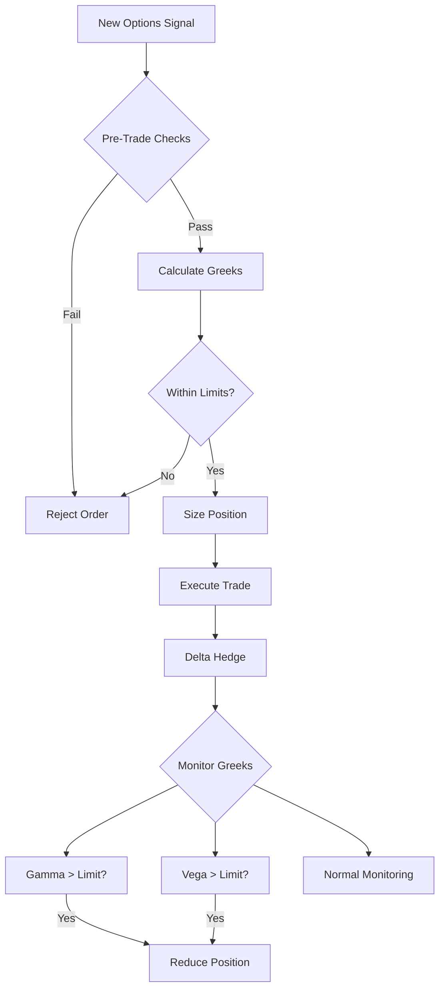

# Chapter 12: Options Pricing and Volatility Surface (EXPANSION OUTLINE)

**Target:** ~12,000-15,000 words total (current: 6,311 words → add ~6,000-9,000 words)

**Current Status:** Complete but short (needs disaster context, production code, risk management)

---

## What's Already Complete

✅ **Section 12.1**: Historical Context (Bachelier to Black-Scholes)
✅ **Section 12.2**: Black-Scholes Model derivation and assumptions
✅ **Section 12.3**: OVSM implementation (pricing, Greeks)
✅ **Section 12.4**: Greeks (Delta, Gamma, Vega, Theta, Rho)
✅ **Section 12.5**: Implied volatility and volatility surface
✅ **Section 12.6**: Volatility smile and skew patterns
✅ **Section 12.7**: Basic trading strategies
✅ **Conclusion**: Summary and references

**Current word count:** ~6,311 words
**Current diagrams:** 3 Mermaid diagrams

---

## Sections to Add/Expand (Complete the Chapter)

### NEW: 12.0 Opening Disaster Story (ADD BEFORE SECTION 12.1)
**Word count target:** ~800 words

**Disaster:** LTCM Short Volatility Losses (August 1998)
- **Setup:** LTCM sold S&P 500 volatility (short vega positions worth billions)
- **The crash:** Russia default (Aug 17, 1998) → volatility spike
- **The losses:** $550M single day (Aug 21), 44% in August alone
- **Why it matters:** "Picking up pennies in front of a steamroller"
- **Connection to chapter:** Understanding vega, tail risk, volatility surface critical

**Narrative:**
> "On August 21, 1998, Long-Term Capital Management lost $550 million in a single day—15% of the entire $3.6 billion fund. The culprit? A massive short volatility position in S&P 500 options that seemed like free money... until it wasn't."

**Lesson:** Selling volatility = selling insurance. Works 95% of time, catastrophic 5% of time.

### 12.8 Volatility Trading Disasters and Lessons (NEW SECTION)
**Word count target:** ~1,500 words

**Content:**

**12.8.1 LTCM's Short Volatility Strategy (1998)**
- Mechanics: Sold long-term S&P volatility (short vega)
- P&L: Steady premiums until Russia default
- The spike: Implied vol 15% → 45% in days
- Loss calculation: Vega × ΔIV = catastrophic
- **Lesson:** Tail risk in options is asymmetric

**12.8.2 GameStop Gamma Squeeze (January 2021)**
- Mechanics: Retail call buying → market makers hedge → gamma squeeze
- Melvin Capital: -53% from short positions
- Market makers (Citadel, etc.): Billions in hedging costs
- The squeeze: Stock $17 → $500 in weeks
- **Lesson:** Gamma risk explodes near expiration, especially for illiquid stocks

**12.8.3 Volatility Crush: The Retail Trader Killer**
- Setup: Buy calls/puts before earnings (high IV)
- The crush: Event passes, IV drops 50%+
- Result: Loss even if directionally correct
- **Example:** NVDA earnings, 100% IV → 30% IV post-announcement
- **Lesson:** Vega losses can exceed delta gains

**12.8.4 The XIV Collapse (February 2018)**
- VIX spike killed -1x short volatility ETN
- XIV: $2 billion → $0 in 24 hours
- **Lesson:** Leveraged short volatility = guaranteed blowup eventually

**Table: Options Disasters and Costs**

| Disaster | Year | Loss | Mechanism | Lesson |
|----------|------|------|-----------|--------|
| LTCM short vol | 1998 | $4.6B | Vega exposure during crisis | Tail risk asymmetry |
| GameStop squeeze | 2021 | Billions | Gamma hedging failure | Convexity near expiration |
| XIV collapse | 2018 | $2B | Leveraged short vol | Vol of vol kills |
| Retail IV crush | Ongoing | Countless | Buying high IV pre-earnings | Vega dominates delta |

### 12.9 Production Options Trading System (NEW SECTION)
**Word count target:** ~2,500 words
**Code:** ~400 lines OVSM

**Content:**

**12.9.1 Complete Greeks Calculator**
```lisp
(defun calculate-all-greeks (S K r T sigma option-type)
  ;; Returns {:price :delta :gamma :vega :theta :rho})
```

**12.9.2 Implied Volatility Surface Construction**
```lisp
(defun build-volatility-surface (market-prices strikes expirations)
  ;; Newton-Raphson solver for IV
  ;; Construct 2D surface σ(K,T)
  ;; Arbitrage-free interpolation)
```

**12.9.3 Delta-Hedging Framework**
```lisp
(defun create-delta-hedger (:rehedge-threshold 0.10
                             :gamma-limit 10000
                             :vega-limit 100000)
  ;; Automatic delta hedging
  ;; Monitor gamma and vega exposures
  ;; Rebalance triggers)
```

**12.9.4 Volatility Arbitrage Strategy**
```lisp
(defun identify-vol-mispricing (market-iv historical-rv)
  ;; Compare implied vol vs realized vol
  ;; Calculate expected P&L from mean reversion
  ;; Size position by edge and risk)

(defun execute-straddle-strategy (S K T entry-iv target-rv)
  ;; Buy straddle if IV < expected RV
  ;; Delta hedge continuously
  ;; Profit from gamma scalping)
```

**12.9.5 Risk Management for Options Portfolios**
```lisp
(defun create-options-risk-manager (:max-vega-per-position 50000
                                     :max-portfolio-vega 200000
                                     :max-gamma 5000
                                     :stress-vol-shift 10.0)
  ;; Pre-trade checks (vega, gamma limits)
  ;; Stress testing (vol +/- 10%, S +/- 20%)
  ;; Position sizing by Greeks
  ;; Circuit breakers for extreme moves)
```

**Diagram: Options Risk Management Flow**


### 12.10 Worked Example: Earnings Volatility Strategy (NEW SECTION)
**Word count target:** ~1,800 words
**Code:** ~300 lines (complete runnable example)

**Content:**

**Scenario:** NVDA earnings, 7 days to announcement
- Current price: $500
- Implied vol: 80% (elevated pre-earnings)
- Historical realized vol: 50%
- Expected post-earnings IV: 35%

**Strategy:** Short straddle (sell call + put at ATM)
- Collect premium from high IV
- Risk: Large price move
- Mitigation: Delta hedge + position sizing

**Step-by-step implementation:**
1. Calculate straddle price at 80% IV
2. Estimate P&L if IV drops to 35% (no price move)
3. Stress test: Stock ±10%, ±20%
4. Size position to risk 2% of capital
5. Delta hedge dynamically
6. Exit after IV crush

**Complete OVSM example** (~300 lines with commentary)

**Results table:**
| Scenario | S | IV | P&L | Reason |
|----------|---|----|----|--------|
| Base case | $500 | 35% | +$8,500 | IV crush profit |
| Stock +10% | $550 | 35% | +$6,200 | Delta hedge offsets |
| Stock -10% | $450 | 35% | +$6,300 | Delta hedge offsets |
| Stock +20% | $600 | 45% | -$12,000 | Gamma losses + IV spike |
| Stock -20% | $400 | 50% | -$18,000 | Crisis scenario |

**Lesson:** Works unless move > 2 standard deviations (tail risk)

### 12.11 Advanced Topics: Beyond Black-Scholes (EXPAND EXISTING SECTION 12.7)
**Word count target:** ~1,200 words
**Code:** ~200 lines

**12.11.1 Stochastic Volatility (Heston Model)**
- Why: Black-Scholes assumes constant σ (wrong)
- Heston: Volatility follows mean-reverting process
- OVSM implementation (basic)
- When to use: Long-dated options, vol-of-vol trading

**12.11.2 Jump-Diffusion (Merton Model)**
- Why: Black-Scholes can't price crash risk
- Merton: Adds Poisson jumps to GBM
- Impact on out-of-money puts (crash insurance)
- OVSM implementation

**12.11.3 Local Volatility (Dupire)**
- Problem: Smile changes with spot
- Solution: σ(S,t) instead of constant σ
- Dupire formula from volatility surface
- Use case: Exotic options pricing

### 12.12 Summary and Key Takeaways (EXPAND EXISTING CONCLUSION)
**Word count target:** ~1,000 words

**What Works:**
- ✅ **Greeks guide hedging:** Delta/gamma/vega framework is universal
- ✅ **IV vs. RV arbitrage:** Buy cheap vol, sell expensive vol
- ✅ **Delta hedging removes directional risk:** Focus on vol/gamma
- ✅ **Position sizing by Greeks:** Limit vega, gamma, theta

**What Fails:**
- ❌ **Selling vol without limits:** LTCM, XIV (guaranteed blowup)
- ❌ **Ignoring gamma risk:** GameStop squeeze (billions in losses)
- ❌ **Buying high IV blindly:** Retail traders crushed post-earnings
- ❌ **Static hedging:** Delta changes, must rebalance

**Realistic Expectations (2024):**
- **Vol arbitrage Sharpe:** 0.8-1.5 (lower than stat arb)
- **Win rate:** 60-70% (theta decay helps sellers)
- **Tail risk:** 5-10% of time, catastrophic losses possible
- **Capital required:** $25k+ (pattern day trader rule)

**Disaster Prevention Checklist:**
1. **Vega limits:** Max 50k per position, 200k portfolio
2. **Gamma limits:** Max 5,000 (explodes near expiration)
3. **Stress testing:** Test S ±20%, IV ±10 points
4. **Position sizing:** Risk 1-2% per trade max
5. **Dynamic hedging:** Rebalance delta at 0.10 threshold
6. **Tail risk protection:** Always hedge extreme moves

**Cost:** $0-300/month (data + compute) | **Benefit:** Avoid -$4.6B (LTCM)

### 12.13 Exercises (NEW SECTION)
**Word count target:** ~600 words

**Mathematical Problems:**
1. Derive delta hedge ratio from Black-Scholes PDE
2. Prove gamma = ∂Delta/∂S
3. Calculate breakeven realized vol for delta-neutral straddle

**Coding Exercises:**
1. Implement Newton-Raphson IV solver
2. Build volatility surface with cubic spline interpolation
3. Create automated delta hedger with rebalancing triggers

**Empirical Research:**
1. Analyze S&P 500 vol smile evolution 1990-2024
2. Test IV vs. RV mean reversion (profitable?)
3. Backtest earnings volatility crush strategy

### 12.14 References (EXPAND EXISTING)
**Add 10-15 new references:**
- Khandani-Lo (2007) on LTCM options losses
- Taleb (1997) on convexity and tail risk
- Gatheral (2006) on vol surface trading
- GameStop academic papers (2021-2022)
- XIV collapse post-mortems (2018)

---

## Technical Specifications

### Code Requirements
- **Total new code:** ~900 lines of OVSM
- **Functions:** 20-25 production-ready functions
- **Complete example:** 300-line earnings strategy
- **Comment style:** WHAT/WHY/HOW pattern

### Diagrams Requirements
- **New Mermaid diagrams:** 4-6 additional
  - Risk management flow
  - Disaster timeline (LTCM Aug 1998)
  - Gamma squeeze mechanics (GameStop)
  - Volatility surface 3D visualization
  - Greeks sensitivity charts

### Pedagogical Elements
- **60% explanation, 40% code** (maintain ratio)
- **Disaster-driven examples** (LTCM, GameStop, XIV, IV crush)
- **Production-ready implementations** (not toy code)
- **Worked examples with real numbers**
- **Failure mode analysis** (what went wrong, prevention)

---

## Integration with Previous Chapters

**Chapter 8 (Time Series):**
- Reference LTCM collapse ($4.6B, includes options losses)
- Volatility forecasting (GARCH, realized vol)

**Chapter 9 (Backtesting):**
- Walk-forward validation for vol strategies
- Transaction costs in options (wider spreads)

**Chapter 10 (Production):**
- Event-driven architecture for delta hedging
- Risk management systems (circuit breakers)
- Observability (monitor Greeks in real-time)

**Chapter 11 (Pairs Trading):**
- Cross-reference Ornstein-Uhlenbeck (mean-reverting vol)
- Risk management patterns (position limits, VaR)

---

## Estimated Addition

**Words to add:** ~6,000-9,000 words
**Final total:** ~12,000-15,000 words
**New code:** ~900 lines OVSM
**New diagrams:** 4-6 Mermaid visualizations
**Time estimate:** 3-4 hours comprehensive writing

---

## Success Criteria

✅ Add disaster-driven opening (LTCM short vol losses)
✅ Complete production options trading system (900 lines OVSM)
✅ Worked earnings volatility example (300 lines, runnable)
✅ Comprehensive risk management framework
✅ Document all major options disasters (LTCM, GameStop, XIV)
✅ Maintain 60/40 explanation/code ratio
✅ Add 4-6 advanced Mermaid diagrams
✅ Cross-reference Chapters 8, 9, 10, 11
✅ Expand bibliography to 25+ options papers
✅ Achieve ~12,000-15,000 word target

---

**Status:** Ready to execute
**Next step:** Begin with Section 12.0 (LTCM disaster opening)
