# Chapter 14: Machine Learning for Price Prediction

---

## Introduction

The dream of predicting future prices has consumed traders since the first exchanges opened. Technical analysts see patterns in candlestick charts. Fundamental analysts project earnings growth. Quantitative traders fit statistical models to historical data. But traditional methods—linear regression, ARIMA, GARCH—impose restrictive assumptions: linearity, stationarity, parametric distributions.

Machine learning shatters these constraints. Random forests capture non-linear interactions between hundreds of features. Gradient boosting sequentially corrects prediction errors. Long short-term memory (LSTM) networks remember patterns across months of price history. Reinforcement learning agents learn optimal trading policies through trial-and-error interaction with markets.

💡 **Key Insight**
The question is no longer *can* ML predict prices, but *how well* and *for how long*. Renaissance Technologies—the most successful quantitative hedge fund in history—reportedly uses ML extensively, generating 66% annualized returns (before fees) from 1988-2018.

Yet the graveyard of failed ML trading funds is vast. The challenge isn't building accurate models—it's building models that remain accurate out-of-sample, after transaction costs, during regime changes, and under adversarial competition from other ML traders.

This chapter develops ML-based price prediction from theoretical foundations through production-ready implementation in OVSM. We'll cover:

1. **Historical context**: Evolution from linear models to deep learning
2. **Feature engineering**: Constructing predictive features from prices, volumes, microstructure
3. **Model zoo**: Linear models, decision trees, random forests, gradient boosting, neural networks
4. **Overfitting prevention**: Walk-forward analysis, cross-validation, regularization
5. **OVSM implementation**: Complete ML pipeline from feature extraction through backtesting
6. **Risk analysis**: Regime change fragility, data snooping bias, execution vs. prediction gap
7. **Advanced extensions**: Deep learning (LSTM, CNN, Transformers), reinforcement learning

---

## 14.1 Historical Context: The Quantitative Revolution

### 14.1.1 Pre-ML Era: Linear Models Dominate (1950-2000)

The foundation of quantitative finance rests on linear models:

**Markowitz Portfolio Theory** (1952): Mean-variance optimization assumes returns are linear combinations of factors with normally distributed noise.

**Capital Asset Pricing Model** (Sharpe, 1964):
$$\mathbb{E}[R_i] = R_f + \beta_i (\mathbb{E}[R_m] - R_f)$$

**Fama-French Three-Factor Model** (1993):
$$R_{i,t} = \alpha_i + \beta_{i,M} R_{M,t} + \beta_{i,SMB} SMB_t + \beta_{i,HML} HML_t + \epsilon_{i,t}$$

⚠️ **Critical Limitation**
These models miss non-linear patterns: volatility clustering, jumps, regime switching, and interaction effects. October 1987 crash (-23% in one day) lies 24 standard deviations from mean—impossible under normal distribution.


### 14.1.2 Renaissance: The Random Forest Revolution (2006-2012)

**Breiman (2001)** introduced random forests—ensembles of decision trees trained on bootstrap samples with random feature subsets.

**First successes in finance**:

**Ballings et al. (2015)**: Random forest for European stock prediction (2000-2012) achieves 5.2% annualized alpha vs. 3.1% for logistic regression.

**Gu, Kelly, and Xiu (2020)**: Comprehensive ML study on U.S. stocks (1957-2016):
- **Sample**: 30,000+ stocks, 94 predictive features, 300M observations
- **Methods**: Linear regression, LASSO, ridge, random forest, gradient boosting, neural networks
- **Result**: ML models outperform by 2-4% annually; gradient boosting performs best

📊 **Performance Comparison**

| Model Type | Annual Alpha | Sharpe Ratio | Complexity |
|------------|--------------|--------------|------------|
| Linear Regression | 1.2% | 0.4 | Low |
| LASSO | 2.1% | 0.7 | Low |
| Random Forest | 3.8% | 1.2 | Medium |
| Gradient Boosting | 4.3% | 1.4 | Medium |
| Neural Networks | 3.9% | 1.3 | High |

### 14.1.3 Deep Learning Era: LSTMs and Transformers (2015-Present)

**Fischer and Krauss (2018)**: LSTM for S&P 500 constituent prediction (1992-2015):
- **Architecture**: 256-unit LSTM → dense layer → sigmoid output
- **Features**: Returns, volume, volatility (last 240 days)
- **Result**: 2.5% monthly return (30% annualized), Sharpe ratio 3.6

🎯 **Current Frontiers**
- **Graph neural networks**: Model correlation networks between stocks
- **Reinforcement learning**: Learn optimal trading policies, not just predictions
- **Meta-learning**: "Learn to learn"—quickly adapt to new market regimes
- **Foundation models**: Pre-train on all financial time series, fine-tune for specific assets


---

## 14.2 Feature Engineering: The 80% Problem

💡 **Quant Aphorism**
"Models are 20% of the work. Features are 80%." Garbage in, garbage out. The finest neural network cannot extract signal from noisy, redundant, or leaked features.

### 14.2.1 Price-Based Features

**Returns** (log returns preferred for additivity):
$$r_t = \log\left(\frac{P_t}{P_{t-1}}\right)$$

**Return moments**:
- **Volatility** (rolling 20-day std dev): $\sigma_t = \sqrt{\frac{1}{20}\sum_{i=1}^{20} (r_{t-i} - \bar{r})^2}$
- **Skewness**: $\frac{1}{20}\sum_{i=1}^{20} \left(\frac{r_{t-i} - \bar{r}}{\sigma_t}\right)^3$ (negative skewness = crash risk)
- **Kurtosis**: $\frac{1}{20}\sum_{i=1}^{20} \left(\frac{r_{t-i} - \bar{r}}{\sigma_t}\right)^4$ (fat tails)

📊 **Technical Indicators Comparison**

| Indicator | Formula | Signal | Lag |
|-----------|---------|--------|-----|
| SMA(20) | Simple moving average | Trend | High |
| EMA(12) | Exponential moving average | Trend | Medium |
| RSI(14) | Relative strength index | Momentum | Low |
| MACD | EMA(12) - EMA(26) | Momentum | Medium |
| Bollinger Bands | MA(20) ± 2σ | Volatility | Medium |

### 14.2.2 Volume-Based Features

**Volume-weighted average price**:
$$\text{VWAP}_t = \frac{\sum_{i=1}^t P_i V_i}{\sum_{i=1}^t V_i}$$

**Amihud illiquidity measure**:
$$\text{ILLIQ}_t = \frac{|r_t|}{V_t}$$
High ILLIQ = large price impact per dollar traded (illiquid)

**Roll's bid-ask spread estimator**:
$$\text{Spread}_t = 2\sqrt{-\text{Cov}(r_t, r_{t-1})}$$

### 14.2.3 Alternative Data Features

💻 **Modern Data Sources**

| Data Type | Example | Predictive Power | Cost |
|-----------|---------|------------------|------|
| Sentiment | Twitter, news NLP | Medium | Low-Medium |
| Web Traffic | Google Trends | Low-Medium | Free |
| Satellite | Retail parking lots | High | Very High |
| Credit Cards | Transaction volumes | Very High | Very High |
| Geolocation | Foot traffic to stores | High | High |

⚠️ **Timing Matters**
All features must be **lagged** to avoid look-ahead bias. If predicting return at close, features must use data available before close (not after).

---

## 14.3 Model Zoo: Algorithms for Prediction

### 14.3.1 Linear Models: The Baseline

**Ridge Regression** (L2 regularization):
$$\min_\beta \sum_{i=1}^N (y_i - \beta^T x_i)^2 + \lambda \sum_{j=1}^p \beta_j^2$$

**LASSO** (L1 regularization):
$$\min_\beta \sum_{i=1}^N (y_i - \beta^T x_i)^2 + \lambda \sum_{j=1}^p |\beta_j|$$

```mermaid
graph TD
    A[Linear Model Strengths] --> B[Fast O p²n + p³ ]
    A --> C[Interpretable Coefficients]
    A --> D[Statistical Theory]

    E[Linear Model Weaknesses] --> F[Assumes Linearity]
    E --> G[Multicollinearity Issues]
    E --> H[Overfitting p > n]

    style A fill:#d4edda
    style E fill:#f8d7da
```



### 14.3.2 Random Forests: Bagging Trees

**Algorithm** (Breiman, 2001):
1. For b = 1 to B (e.g., B = 500):
   - Draw bootstrap sample of size n
   - Train tree using random subset of p/3 features at each split
2. Prediction: Average predictions of all B trees

**Why it works**:
- **Bias-variance tradeoff**: Individual trees have high variance but low bias. Averaging reduces variance.
- **Decorrelation**: Random feature selection ensures trees are different
- **Out-of-bag error**: Unbiased error estimate without separate test set

📊 **Hyperparameter Tuning Guide**

| Parameter | Recommended Range | Impact | Priority |
|-----------|-------------------|--------|----------|
| Number of trees | 500-1000 | Higher = more stable | Medium |
| Max depth | 10-20 | Lower = less overfit | High |
| Min samples/leaf | 5-10 | Higher = more robust | High |
| Max features | p/3 (regression) | Lower = more diverse | Medium |

### 14.3.3 Gradient Boosting: Sequential Error Correction

**Algorithm** (Friedman, 2001):
1. Initialize prediction: $\hat{y}_i = \bar{y}$ (mean)
2. For m = 1 to M (e.g., M = 100):
   - Compute residuals: $r_i = y_i - \hat{y}_i$
   - Train tree h_m on residuals (shallow tree, depth 3-6)
   - Update: $\hat{y}_i \leftarrow \hat{y}_i + \eta h_m(x_i)$ where η = learning rate (0.01-0.1)
3. Final prediction: $\hat{y} = \sum_{m=1}^M \eta h_m(x)$

💡 **Intuition**: Each tree corrects mistakes of previous trees. Gradually reduce residuals.

**XGBoost advantages**:
- **Regularization**: Penalize tree complexity (number of leaves, sum of leaf weights)
- **Second-order approximation**: Uses gradient and Hessian for better splits
- **Sparsity-aware**: Handles missing values efficiently
- **Parallel computation**: Splits computation across CPU cores

### 14.3.4 Neural Networks: Universal Function Approximators

**Multi-Layer Perceptron** (MLP):
$$\hat{y} = f_L(\ldots f_2(f_1(x; W_1); W_2) \ldots; W_L)$$
where each layer: $f_\ell(x) = \sigma(W_\ell x + b_\ell)$, σ = activation function (ReLU, tanh, sigmoid)

**Overfitting prevention**:
- **Dropout**: Randomly drop neurons during training with probability p (typical: p = 0.5)
- **Early stopping**: Monitor validation loss, stop when it starts increasing
- **Batch normalization**: Normalize layer activations to mean 0, std 1
- **L2 regularization**: Add $\lambda \sum W^2$ penalty to loss

🎯 **Architecture for Time Series**
- Input: Last 20 days of returns, volume, volatility (20 × 3 = 60 features)
- Hidden layer 1: 128 neurons, ReLU activation
- Dropout: 0.5
- Hidden layer 2: 64 neurons, ReLU
- Dropout: 0.5
- Output: 1 neuron, linear activation (predict next-day return)

### 14.3.5 Recurrent Networks: LSTMs for Sequences

**LSTM** (Hochreiter and Schmidhuber, 1997): Introduces **gates** controlling information flow:
- **Forget gate**: $f_t = \sigma(W_f [h_{t-1}, x_t])$ (what to forget from cell state)
- **Input gate**: $i_t = \sigma(W_i [h_{t-1}, x_t])$ (what new information to add)
- **Cell state**: $C_t = f_t \odot C_{t-1} + i_t \odot \tilde{C}_t$
- **Output gate**: $o_t = \sigma(W_o [h_{t-1}, x_t])$

💡 **Intuition**: Cell state C_t is a "memory" carrying information across hundreds of time steps. Gates learn to preserve important information, discard noise.


---

## 14.4 Overfitting Prevention: The Crucial Challenge

⚠️ **The Fundamental Problem**
1,000 stocks × 100 features × 1,000 days = 100 million observations. Train neural network with 10,000 parameters. In-sample R² = 0.95. Out-of-sample R² = 0.02. **The model memorized noise.**

### 14.4.1 Walk-Forward Analysis

**Standard backtesting mistake**: Train on 2000-2015, test on 2016-2020. Problem: Used future data to select hyperparameters.

**Walk-forward methodology**:
1. **Training period**: 2000-2005 (5 years)
2. **Validation period**: 2006 (1 year) → Tune hyperparameters
3. **Test period**: 2007 (1 year) → Record performance
4. **Roll forward**: Expand training to 2000-2007, validate on 2008, test on 2009
5. Repeat until present

📊 **Walk-Forward Timeline**

| Period | Years | Purpose | Data Leakage? |
|--------|-------|---------|---------------|
| Training | 5 | Model fitting | No |
| Validation | 1 | Hyperparameter tuning | No |
| Test | 1 | Performance recording | No |
| **Total Cycle** | **7** | **One iteration** | **No** |

🎯 **Key Principles**
- Never look at test period data during development
- Retrain model periodically (quarterly or annually) as new data arrives
- Report only test period performance (no cherry-picking)

### 14.4.2 Cross-Validation for Time Series

**Standard k-fold CV**: Randomly split data into k folds. Problem: Uses future data to predict past (look-ahead bias).

**Time-series CV** (Bergmeir and Benítez, 2012):
1. Split data into k sequential chunks: [1→100], [101→200], ..., [901→1000]
2. For each fold i:
   - Train on all data before fold i
   - Validate on fold i
3. Average validation errors

**Purging and embargo** (Lopez de Prado, 2018):
- **Purging**: If predicting day t, remove days [t-5, t+5] from training (correlated observations)
- **Embargo**: Don't train on data immediately after test period

### 14.4.3 Combating Data Snooping Bias

**Multiple testing problem**: Test 1,000 strategies, expect 50 to be "significant" at p < 0.05 by chance alone.

**Bonferroni correction**: Divide significance threshold by number of tests: α_adjusted = α / N.

**Deflated Sharpe Ratio** (Bailey and Lopez de Prado, 2014):
$$\text{SR}_{\text{deflated}} = \frac{\text{SR}_{\text{estimated}} - \text{SR}_{\text{expected}}[\text{max of N trials}]}{\text{SE}(\text{SR})}$$

⚠️ **Extreme Example**: Bailey et al. (2015) tried all possible combinations of 30 technical indicators on S&P 500 (1987-2007). Found strategy with Sharpe 5.5 in-sample. Out-of-sample (2007-2013): Sharpe -0.8.

---

## 14.5 OVSM Implementation

### 14.5.1 Linear Regression Price Prediction

From `14_ml_prediction_trading.ovsm`:

```lisp
(do
  (log :message "=== LINEAR REGRESSION PRICE PREDICTION ===")

  ;; Historical price data (8 days)
  (define prices [48.0 49.0 50.0 51.0 52.0 53.0 54.0 55.0])
  (define time_steps [1 2 3 4 5 6 7 8])

  ;; Calculate means
  (define sum_x 0.0)
  (define sum_y 0.0)
  (for (x time_steps) (set! sum_x (+ sum_x x)))
  (for (y prices) (set! sum_y (+ sum_y y)))

  (define mean_x (/ sum_x (length time_steps)))  ;; 4.5
  (define mean_y (/ sum_y (length prices)))       ;; 51.5

  ;; Calculate slope and intercept
  (define numerator 0.0)
  (define denominator 0.0)

  (define i 0)
  (while (< i (length time_steps))
    (define x (first (drop time_steps i)))
    (define y (first (drop prices i)))
    (set! numerator (+ numerator (* (- x mean_x) (- y mean_y))))
    (set! denominator (+ denominator (* (- x mean_x) (- x mean_x))))
    (set! i (+ i 1)))

  (define slope (/ numerator denominator))  ;; 1.0
  (define intercept (- mean_y (* slope mean_x)))  ;; 47.0

  (log :message "Slope (m):" :value slope)
  (log :message "Intercept (b):" :value intercept)

  ;; Predict next price (t=9)
  (define next_time 9)
  (define predicted_price (+ (* slope next_time) intercept))
  ;; predicted_price = 56.0

  (log :message "Predicted price (t=9):" :value predicted_price)
)
```

💡 **Interpretation**: R² = 1.0 means model explains 100% of variance (perfect fit). R² = 0 means model is no better than predicting the mean. Real-world: R² = 0.01-0.05 is typical for daily return prediction (markets are noisy).

### 14.5.2 Exponential Moving Average (EMA) Prediction

```lisp
  (log :message "\n=== MOVING AVERAGE CONVERGENCE ===")

  (define price_data [50.0 51.0 49.5 52.0 53.0 52.5 54.0 55.0 54.5 56.0])
  (define alpha 0.3)  ;; Smoothing factor

  ;; Calculate EMA recursively
  (define ema (first price_data))
  (for (price (drop price_data 1))
    (set! ema (+ (* alpha price) (* (- 1.0 alpha) ema))))
  ;; EMA_t = α × Price_t + (1-α) × EMA_{t-1}

  (log :message "Current EMA:" :value ema)

  ;; Trading signal
  (define ema_signal
    (if (> (last price_data) ema)
        "BULLISH - Price above EMA"
        "BEARISH - Price below EMA"))
```

📊 **EMA vs SMA Comparison**

| Metric | SMA | EMA |
|--------|-----|-----|
| Weighting | Equal weights | More weight on recent |
| Reaction speed | Slow | Fast |
| False signals | Fewer | More |
| Optimal α | N/A | 0.1-0.5 |

### 14.5.3 Neural Network Simulation (Perceptron)

```lisp
  (log :message "\n=== NEURAL NETWORK SIMULATION ===")

  ;; Input features (normalized 0-1)
  (define features [
    0.7   ;; RSI normalized
    0.6   ;; MACD signal
    0.8   ;; Volume indicator
    0.5   ;; Sentiment score
  ])

  (define weights [0.3 0.25 0.2 0.25])
  (define bias 0.1)

  ;; Weighted sum
  (define activation 0.0)
  (define m 0)
  (while (< m (length features))
    (define feature (first (drop features m)))
    (define weight (first (drop weights m)))
    (set! activation (+ activation (* feature weight)))
    (set! m (+ m 1)))

  (set! activation (+ activation bias))

  ;; Sigmoid approximation
  (define sigmoid_output (/ activation (+ 1.0 (if (< activation 0.0) (- activation) activation))))

  (log :message "Neural network output:" :value sigmoid_output)

  (define nn_signal
    (if (> sigmoid_output 0.5)
        "BUY - Model predicts upward"
        "SELL - Model predicts downward"))
```

### 14.5.4 Ensemble Model: Combining Predictions

```lisp
  (log :message "\n=== ENSEMBLE MODEL ===")

  ;; Predictions from multiple models
  (define model_predictions {
    :linear_regression 0.75
    :random_forest 0.68
    :gradient_boost 0.82
    :lstm 0.65
    :svm 0.55
  })

  ;; Simple average ensemble
  (define ensemble_score (/ (+ 0.75 0.68 0.82 0.65 0.55) 5.0))
  ;; ensemble_score = 0.69

  (log :message "Ensemble prediction:" :value ensemble_score)

  ;; Model agreement
  (define model_agreement
    (if (> ensemble_score 0.7)
        "HIGH CONFIDENCE BUY"
        (if (< ensemble_score 0.3)
            "HIGH CONFIDENCE SELL"
            "LOW CONFIDENCE - No consensus")))
```

💡 **Weighted Ensemble (More Sophisticated)**
- Weight models by historical performance (Sharpe ratio or accuracy)
- Dynamic weighting: Increase weight of models that performed well recently
- Meta-learning: Train neural network to optimally combine model predictions

---

## 14.6 Risk Analysis

### 14.6.1 Regime Change Fragility

**The fundamental problem**: Markets are non-stationary. Relationships that held in training data break in test data.

**Example**: Momentum strategy (buy past winners) worked 1993-2019 (Sharpe 1.5). Then COVID-19 hit (March 2020): momentum crashed -30% in one month as correlations went to 1.0.

📊 **Regime Detection Methods**

| Method | Approach | Latency | Accuracy |
|--------|----------|---------|----------|
| Rolling Sharpe | 6-month windows | High | Low |
| Correlation monitoring | Track pred vs actual | Medium | Medium |
| Hidden Markov Models | Identify discrete regimes | Low | High |
| Change point detection | Statistical breakpoints | Low | Medium |

**Adaptation strategies**:
- **Ensemble of models**: Train separate models on different regimes (low-vol vs. high-vol)
- **Online learning**: Update model daily with new data
- **Meta-learning**: Train model to detect its own degradation and trigger retraining

### 14.6.2 Execution Gap: Prediction vs. Profit

**You predict price will rise 1%. You earn 0.3%. Why?**

**Net profitability**:
$$\text{Net Return} = \text{Predicted Return} - \text{Transaction Costs} - \text{Market Impact}$$

📊 **Cost Breakdown Analysis**

| Cost Component | Typical Range | Impact on 1% Prediction |
|----------------|---------------|------------------------|
| Bid-ask spread | 0.1-0.5% | -0.2% |
| Exchange fees | 0.05% | -0.05% |
| Market impact | 0.2% | -0.2% |
| Slippage | 0.1-0.3% | -0.15% |
| **Total Costs** | **0.45-1.1%** | **-0.60%** |
| **Net Profit** | - | **0.40%** |

⚠️ **Optimization strategies**:
- **Liquidity filtering**: Only trade assets with tight spreads, high volume
- **Execution algorithms**: VWAP/TWAP to minimize market impact
- **Fee minimization**: Maker fees (provide liquidity) vs. taker fees
- **Hold time**: Longer holds amortize fixed costs over larger price moves

### 14.6.3 Adversarial Dynamics: Arms Race

**Your model predicts price rise based on order imbalance. You buy. Other quants see the same signal. All buy. Price rises before you finish executing. Alpha decays.**

**Game theory of quant trading**:
- **Zero-sum**: Your profit = someone else's loss (minus transaction costs = negative-sum)
- **Speed advantage**: Faster execution captures more alpha
- **Signal decay**: As more capital chases signal, returns diminish
- **Adaptation**: Competitors reverse-engineer your strategy, trade against it

**Empirical evidence** (Moallemi and Saglam, 2013): High-frequency strategies have half-lives of 6-18 months before crowding erodes profitability.

🎯 **Defensive Strategies**
1. **Proprietary data**: Use data competitors don't have (satellite imagery, web scraping)
2. **Complexity**: Non-linear models harder to reverse-engineer than linear
3. **Diversification**: 50 uncorrelated strategies → less vulnerable to any one being arbitraged away
4. **Randomization**: Add noise to order timing/sizing to avoid detection

---

## 14.7 Advanced Extensions

### 14.7.1 Deep Learning: Convolutional Neural Networks

**CNNs for chart patterns**:
- Input: 50x50 pixel image of candlestick chart (last 50 days)
- Conv layer 1: 32 filters, 3×3 kernel, ReLU → detects local patterns
- MaxPool: 2×2 → reduce dimensions
- Conv layer 2: 64 filters, 3×3 kernel → detects higher-level patterns
- Flatten: Convert 2D feature maps to 1D vector
- Dense: 128 neurons → integration
- Output: Softmax over 3 classes (up, flat, down)


**Performance**: Dieber and Tömörén (2020) achieve 62% accuracy on S&P 500 (vs. 50% baseline).

### 14.7.2 Attention Mechanisms and Transformers

**Temporal Fusion Transformer** (Lim et al., 2021):
- Multi-horizon forecasting: Predict returns for t+1, t+5, t+20 simultaneously
- Attention: Learn which past time steps are most relevant
- Interpretability: Attention weights show model focuses on recent momentum, not noise

```python
from pytorch_forecasting import TemporalFusionTransformer

model = TemporalFusionTransformer.from_dataset(
    training_data,
    learning_rate=0.001,
    hidden_size=64,
    attention_head_size=4,
    dropout=0.1,
    output_size=7,  # Predict 7 quantiles
)
```

💡 **Advantage**: Quantile predictions → full distribution, not just point estimate. Trade when 90th percentile > threshold (high confidence).

### 14.7.3 Reinforcement Learning: Direct Policy Optimization

**Problem with supervised learning**: Predict return, then map prediction to trade. Indirect.

**RL alternative**: Learn policy π(action | state) directly optimizing cumulative returns.

**Agent-environment interaction**:
- **State**: Portfolio holdings, market features (price, volume, etc.)
- **Action**: Buy, sell, hold (continuous: fraction of capital to allocate)
- **Reward**: Portfolio return - transaction costs
- **Goal**: Maximize cumulative discounted reward $\sum_{t=0}^\infty \gamma^t r_t$

🎯 **Advantages**
- Directly optimizes trading objective (Sharpe, Sortino, cumulative return)
- Naturally incorporates transaction costs (penalize excessive trading)
- Explores unconventional strategies (supervised learning limited to imitation)

⚠️ **Challenges**
- Sample inefficient: Needs millions of time steps to converge
- Unstable: Q-values can diverge
- Overfitting: Agent exploits simulator bugs if training environment ≠ reality

---

## 14.8 Conclusion

Machine learning has revolutionized quantitative finance, enabling exploitation of non-linear patterns, high-dimensional feature spaces, and massive datasets. Gradient boosting, LSTMs, and ensembles consistently outperform linear models by 2-4% annually—a massive edge when compounded over decades.

📊 **Success vs. Failure Factors**

| Success Factors | Failure Factors |
|----------------|-----------------|
| ✅ Strict train/validation/test splits | ❌ Overfitting to training data |
| ✅ Feature engineering with domain knowledge | ❌ Look-ahead bias |
| ✅ Regularization and ensembles | ❌ Transaction costs ignored |
| ✅ Transaction cost modeling from day one | ❌ Alpha decay from crowding |
| ✅ Continuous monitoring and retraining | ❌ No regime change adaptation |

🎯 **Best Practices**
1. **Strict train/validation/test splits** with walk-forward analysis
2. **Feature engineering** with domain knowledge, not blind feature generation
3. **Regularization and ensembles** to prevent overfitting
4. **Transaction cost modeling** from day one (don't optimize gross returns)
5. **Continuous monitoring** and retraining as market conditions evolve

**The future of ML in finance**:
- **Causal inference**: Move from correlation to causation
- **Interpretability**: Explain model decisions for regulatory compliance
- **Robustness**: Adversarial training against adversarial traders
- **Efficiency**: Lower latency inference for high-frequency applications

💡 **Final Wisdom**
Machine learning is not a silver bullet—it's a power tool that, like any tool, requires skill and care. Used properly, it provides measurable, sustainable alpha. Used carelessly, it's a fast path to ruin.

---

## References

1. Gu, S., Kelly, B., & Xiu, D. (2020). "Empirical Asset Pricing via Machine Learning." *Review of Financial Studies*, 33(5), 2223-2273.
2. Fischer, T., & Krauss, C. (2018). "Deep Learning with Long Short-Term Memory Networks for Financial Market Predictions." *European Journal of Operational Research*, 270(2), 654-669.
3. Breiman, L. (2001). "Random Forests." *Machine Learning*, 45(1), 5-32.
4. Friedman, J.H. (2001). "Greedy Function Approximation: A Gradient Boosting Machine." *Annals of Statistics*, 29(5), 1189-1232.
5. Chen, T., & Guestrin, C. (2016). "XGBoost: A Scalable Tree Boosting System." *Proceedings of KDD*, 785-794.
6. Hochreiter, S., & Schmidhuber, J. (1997). "Long Short-Term Memory." *Neural Computation*, 9(8), 1735-1780.
7. Lopez de Prado, M. (2018). *Advances in Financial Machine Learning*. Wiley.
8. Bailey, D.H., et al. (2014). "Pseudo-Mathematics and Financial Charlatanism: The Effects of Backtest Overfitting." *Notices of the AMS*, 61(5), 458-471.
9. Krauss, C., Do, X.A., & Huck, N. (2017). "Deep Neural Networks, Gradient-Boosted Trees, Random Forests: Statistical Arbitrage on the S&P 500." *European Journal of Operational Research*, 259(2), 689-702.
10. Moody, J., & Saffell, M. (2001). "Learning to Trade via Direct Reinforcement." *IEEE Transactions on Neural Networks*, 12(4), 875-889.
