# Chapter 15: Decentralized Exchange Sniping and MEV Extraction

> **⚠️ CRITICAL DISCLAIMER**: MEV strategies exist in regulatory gray areas. Sandwiching may constitute market manipulation. Always consult legal counsel before deployment. This chapter is for educational purposes only.

---

## 💥 The $8 Million Zero-Bid Attack: When MEV Broke DeFi

**March 12, 2020, 2:50 PM UTC**. Ethereum network congestion hits 200 gwei gas prices—20x normal—as COVID-19 panic selling crashes ETH from $194 to $100 in four hours. MakerDAO's decentralized lending protocol triggers liquidation auctions for under-collateralized vaults. Liquidation bots—designed to bid competitively for collateral—fail to execute due to out-of-gas errors.

**One bot operator sees the opportunity.**

At 3:00 PM UTC, they submit liquidation bids of **0 DAI** for vaults containing thousands of ETH. No competition exists—every other bot is priced out by network congestion. The auctions close. The bot wins **$8.32 million in ETH** for free.

MakerDAO wakes up to a **$4.5 million protocol deficit**. Emergency governance discussions begin. The community is outraged. **This was not supposed to happen.**

```mermaid
timeline
    title Black Thursday: The $8M Zero-Bid Liquidation
    section Market Crash
        07:00 AM UTC : ETH Price $194 (normal)
        12:00 PM UTC : COVID Panic Selling Begins
        02:30 PM UTC : ETH Crashes to $100 (-48% in 4 hours)
    section Network Congestion
        02:35 PM UTC : Gas Prices Spike to 200 Gwei (20x normal)
        02:40 PM UTC : MakerDAO Vaults Under-collateralized
        02:45 PM UTC : Liquidation Auctions Begin
    section The Attack
        02:50 PM UTC : Most Liquidation Bots Fail (out-of-gas errors)
        03:00 PM UTC : One Bot Submits 0 DAI Bids (no competition)
        03:05 PM UTC : Auctions Close → $8.32M ETH Won for Free
    section Aftermath
        03:30 PM UTC : MakerDAO $4.5M Deficit Discovered
        03:31 PM UTC : Community Outrage
        Next Day : Emergency Shutdown Discussion
        Week Later : Auction Mechanism Redesigned
```

### What Went Wrong

**The Assumption**: MakerDAO's liquidation auction system assumed **competitive bidding** would ensure collateral sold at fair market prices. If 100 bots compete, bids would approach true ETH value.

**The Reality**: Network congestion created a **single-bot monopoly**. When gas costs to bid exceeded potential profits, rational bots stopped bidding. One operator—willing to pay 200 gwei gas fees—faced zero competition.

**The Numbers:**

| Metric | Value | Impact |
|--------|-------|--------|
| ETH Price Crash | $194 → $100 (-48%) | Triggered mass liquidations |
| Gas Price Spike | 200 gwei (20x normal) | Priced out 99% of liquidation bots |
| Liquidation Bids | 0 DAI (zero cost) | No competition → free collateral |
| ETH Won | $8.32 million | Single bot extracted entire value |
| MakerDAO Deficit | $4.5 million | Protocol became under-collateralized |
| Auctions Affected | 100+ vaults | Systemic failure, not isolated incident |

**The Mechanism:**

1. **Vault liquidation trigger**: Collateral value < 150% of debt
2. **Auction starts**: 3-hour Dutch auction (price decreases over time)
3. **Expected**: Multiple bots bid → price discovery → fair value
4. **Actual**: Zero bots bid (gas too expensive) → single bidder → 0 DAI accepted

**MakerDAO's Post-Mortem Response:**

1. **Auction redesign**: Introduced minimum bid increments (prevent 0 DAI bids)
2. **Circuit breakers**: Pause system when gas > threshold
3. **Collateral diversification**: Added USDC to cover deficit
4. **Longer auction times**: 6-hour auctions (more time for competition)

### The Lesson

> **MEV extraction is not just arbitrage.** It exploits **systemic failures**—network congestion, protocol design flaws, and coordination failures. Black Thursday proved that when conditions align, a single MEV operator can extract millions while destabilizing an entire DeFi protocol.

**Key Insight:**
- **Intended MEV**: Arbitrage bots provide price efficiency ($314k/day, Flash Boys 2.0 paper)
- **Harmful MEV**: Zero-bid liquidations destabilize protocols ($8.32M, Black Thursday)
- **Critical difference**: Competitive MEV → value redistribution. Monopoly MEV → value extraction + protocol insolvency.

**Prevention Measures (What Changed):**
- **MakerDAO**: Auction redesign (min bids, longer timeouts, circuit breakers)
- **Aave**: English auctions (bid up, not down)
- **Liquity**: No auctions (stability pool instantly absorbs liquidations)
- **Flashbots**: MEV-Boost separates builders from proposers (reduce monopoly risk)

> **💡 Pro Tip**: Black Thursday liquidations were **legal** (smart contract execution) but **harmful** (destabilized DeFi). Not all profitable MEV strategies are ethically or systemically sound. The lesson: **just because you can, doesn't mean you should.**

---

## Introduction

On March 12, 2020, Ethereum network congestion during the COVID crash created a perfect storm: liquidation bots failed to execute, MakerDAO vaults became under-collateralized, and a single bot operator—using clever transaction ordering—acquired $8 million in collateral for essentially zero cost. This "Black Thursday" incident revealed a profound truth about blockchain-based finance: **the mempool is visible, block space is scarce, and whoever controls transaction ordering controls the value**.

Maximal Extractable Value (MEV)—originally "Miner Extractable Value"—represents the profit that block producers (miners, validators, sequencers) can extract by manipulating transaction ordering, insertion, and censorship within the blocks they produce.


### 📊 MEV Economics at a Glance

| Platform | Annual MEV Volume | Top Strategy | Avg Bot Earnings |
|----------|------------------|--------------|------------------|
| Ethereum (Flashbots) | $600M+ | Sandwich attacks | $150K-$500K/month |
| Solana (Jito) | $50M+ | Token sniping | $50K-$200K/month |
| Arbitrum | $80M+ | Cross-chain arb | $30K-$100K/month |

---

## 15.1 Historical Context: From Ethereum Frontrunning to Jito

### 15.1.1 Pre-MEV Era: Frontrunning on Traditional Exchanges (1990-2010)

Frontrunning—executing trades ahead of anticipated orders to profit from subsequent price movement—predates blockchain. On traditional exchanges:

**Quote stuffing** (1990s-2000s): High-frequency traders flooded order books with fake quotes, detecting large institutional orders, canceling fake quotes, and frontrunning the real order.

> **📘 Historical Note**: Michael Lewis's *Flash Boys* (2014) exposed HFT frontrunning via latency arbitrage between exchanges, sparking regulatory reform (IEX exchange's speed bump).

**Key difference from blockchain**: Traditional frontrunning required faster hardware, co-location, or privileged data feeds. Blockchain frontrunning requires only mempool visibility and higher gas fees—democratizing (or equalizing) the practice.

### 15.1.2 Ethereum's Birth of Public Mempools (2015-2019)

Ethereum launched July 2015 with a **public mempool**: pending transactions visible to all nodes before inclusion in blocks. This transparency—essential for decentralization—inadvertently created MEV opportunities.

**Early frontrunning bots** (2017-2018):
- **Priority Gas Auction (PGA)**: Bots detected profitable arbitrage opportunities in mempool, submitted competing transaction with 10x higher gas price to execute first
- **Uncle bandit**: Bots monitored uncle blocks (orphaned blocks), re-executed profitable transactions from uncles


### 15.1.3 Flash Boys 2.0: MEV Quantification (2019)

**Daian et al. (2019)** published "Flash Boys 2.0," coining "MEV" and quantifying its scale:

**Findings**:
- $314,000 extracted per day from DEX arbitrage alone (Feb-Sep 2018)
- Priority Gas Auctions escalate fees 10-100x, wasting $2M+ monthly on failed transactions
- Consensus instability: Miners have incentive to reorg chains if MEV exceeds block reward

**Three MEV categories**:

| Type | Description | Example |
|------|-------------|---------|
| **Displacement** | Replace victim's transaction | Pure frontrunning |
| **Insertion** | Insert transaction before/after victim | Sandwich attacks |
| **Suppression** | Censor victim's transaction entirely | Denial of service |

### 15.1.4 Flashbots: MEV Infrastructure (2020-Present)

**Problem**: Priority Gas Auctions are inefficient (failed transactions waste block space) and unstable (miners incentivized to deviate from honest mining).

**Flashbots solution** (launched December 2020):

1. **MEV-Boost**: Separates block building from block proposing
   - **Searchers**: Find MEV opportunities, submit bundles (atomic transaction groups)
   - **Builders**: Construct full blocks including bundles, bid for inclusion
   - **Proposers (validators)**: Select highest-paying block, propose to network

2. **Private mempools**: Searchers submit bundles to builders via private channels (not public mempool) → prevents frontrunning the frontrunners

3. **Atomic execution**: Bundles execute all-or-nothing → no failed transactions, no wasted gas

> **💡 Pro Tip**: 90%+ of Ethereum blocks built via MEV-Boost (as of 2023). Validators earn 10-15% more revenue from MEV payments vs. base rewards alone.

### 15.1.5 Memecoins and PumpSwap: The Sniping Era (2023-Present)

**Pump.fun** (launched May 2023): Solana-based memecoin launchpad. Anyone can deploy a token with bonding curve liquidity (no upfront capital). If market cap hits $100k, liquidity migrates to Raydium DEX.

**PumpSwap sniping**: Bots monitor Pump.fun deployments, execute buys within 400ms (Solana slot time) of token creation. **First 10 buyers** often capture 50-500% gains as human traders FOMO in.

---

## 15.2 Economic Foundations

### 15.2.1 Mempool Transparency and Information Asymmetry

Unlike traditional finance where order books are hidden (dark pools, iceberg orders), blockchain mempools are **public by design** for decentralization. Consequences:

**Information revelation**: A $10M sell order appears in mempool → everyone knows selling pressure is coming → price drops before trade executes → worse fill for seller.

**Nash equilibrium**: All traders want private transactions, but if only you have privacy, you signal informed trade → liquidity providers avoid you. Result: Everyone uses privacy (Flashbots, Jito) or no one does.

### 15.2.2 Priority Fee Auctions: Gas Markets

Blockchain block space is scarce. When demand exceeds supply, users compete via **priority fees** (tips to validators).

**Solana fee model**:
$$\text{Total Fee} = \text{Base Fee} + \text{Priority Fee}$$

- **Base fee**: Burned (5,000 lamports ≈ $0.0005 per transaction)
- **Priority fee**: Paid to validator (user-specified)

**Auction dynamics**:


**Equilibrium bid**: Sniper bids up to expected profit minus small margin.
$$\text{Optimal Bid} = \mathbb{E}[\text{Profit}] - \epsilon$$

If expected profit = 10 SOL, bid 9.9 SOL. If 100 snipers compete, bids approach 10 SOL → all profit extracted by validator (Myerson, 1981).

### 15.2.3 Validator Incentives and Mechanism Design

**Validator revenue sources**:

| Source | Description | Share of Revenue |
|--------|-------------|------------------|
| Block rewards | Protocol-issued tokens | 50-70% |
| Base fees | Transaction fees | 20-30% |
| MEV tips | Priority fees and bundle payments | 10-20% |

**MEV share**: On Ethereum, MEV tips = 10-15% of total validator revenue. On Solana, 5-10% (growing).

### 15.2.4 Constant Product AMM: Why Sandwiching Works

Most DEXs use **constant product market maker** (Uniswap v2, Raydium):
$$x \times y = k$$

where x = reserves of token A, y = reserves of token B, k = constant.

**Sandwich attack mechanics**:

```mermaid
sequenceDiagram
    participant Attacker
    participant Pool
    participant Victim
    Attacker->>Pool: Frontrun Buy (↑ price)
    Victim->>Pool: Large Buy (↑↑ price)
    Attacker->>Pool: Backrun Sell (profit)
```



**Mathematical example**:
- Initial pool: 50 SOL, 1,000,000 tokens → k = 50M
- Frontrun: Buy 2 SOL → receive 38,462 tokens
- Victim: Buy 8 SOL → receive 128,205 tokens
- Backrun: Sell 38,462 tokens → receive 2.9 SOL
- **Profit**: 2.9 - 2.0 = 0.9 SOL (45% ROI)

---

## 15.3 MEV Taxonomy and Profitability Analysis

### 15.3.1 Arbitrage: Risk-Free Profit from Price Discrepancies

**Opportunity**: Token X trades at $100 on Orca, $101 on Raydium.

**Profitability calculation**:
$$\text{Profit} = (P_2 - P_1) \times Q - \text{Gas Fees}$$

**Example**:

| Parameter | Value |
|-----------|-------|
| Price difference | $1 |
| Quantity | 1000 tokens |
| Gas | $5 |
| **Profit** | **$995** |

> **⚡ Speed Matters**: All bots see opportunity → race to submit highest priority fee → profit declines toward zero (minus infrastructure costs).

### 15.3.2 Liquidations: Race to Click the Button

**DeFi lending** (Aave, Compound, Mango Markets on Solana): Users deposit collateral, borrow against it. If collateral value drops below threshold, position becomes liquidatable.

**Example**:
- Borrower has $10,000 collateral, $8,000 debt
- Price drops → collateral now $9,000, debt still $8,000
- Liquidation threshold: 110% → $8,000 × 1.10 = $8,800 < $9,000 → liquidatable
- Liquidator pays $8,000, receives $9,000 → **profit: $1,000 (12.5% return)**

> **📊 Black Thursday Impact**: March 12, 2020 - Network congestion → liquidation bots failed → one bot got liquidations at 0 bids (no competition) → $8M profit.

### 15.3.3 Sandwich Attacks: Extracting Slippage

**Bundle construction**:
```
Transaction 1: Frontrun buy (priority fee: victim_fee + 1 lamport)
Transaction 2: Victim trade (original transaction)
Transaction 3: Backrun sell (priority fee: victim_fee - 1 lamport)
```

**Victim defenses**:

| Defense | Pros | Cons |
|---------|------|------|
| Low slippage tolerance | Prevents sandwich | Increases failure rate |
| Private mempools | Transaction not visible | Higher fees (Jito tip) |
| Limit orders | No urgency = no MEV | Slower execution |

**Ethics and regulation**: Sandwich attacks are controversial. Some jurisdictions may classify as market manipulation (intent to deceive). Flashbots considers sandwiching "harmful MEV" and discourages it.

### 15.3.4 Sniping: First-Mover Advantage

**Expected value calculation**:
$$\mathbb{E}[\text{Profit}] = P(\text{Token Moons}) \times \text{Upside} - P(\text{Rug Pull}) \times \text{Loss} - \text{Gas}$$

**Example**:
- 10% chance of 10x (profit: 9 × $1,000 = $9,000)
- 30% chance of 2x (profit: 1 × $1,000 = $1,000)
- 60% chance of rug pull (loss: $1,000)
- Gas: $0.50
- **EV** = 0.1×9000 + 0.3×1000 - 0.6×1000 - 0.5 = **$599.50**

---

## 15.4 Blockchain Mechanics: Solana Transaction Ordering

### 15.4.1 Solana Architecture: Proof-of-History and Slots

**Proof-of-History (PoH)**: Solana's innovation—a verifiable delay function creating global clock.
- Validator hashes output of previous hash → creates time-ordered sequence
- One hash = 1 "tick", 1 slot = 64 ticks ≈ 400ms
- Current throughput: ~3,000 transactions per second (TPS)


**MEV implication**: To snipe effectively:
1. Know current leader (public info)
2. Send transaction directly to leader's RPC (minimize latency)
3. Include high priority fee (ensure inclusion)

### 15.4.2 Transaction Priority and Compute Budget

**Solana compute budget**:
- Each transaction requests compute units (CU): measure of computational work
- Typical: 200k CU for simple transfer, 1.4M CU max per transaction
- Block limit: 48M CU total → ~34 max-sized transactions per slot

**Optimal fee**: Leader sorts by `priority_fee_per_cu`. Sniper bids 10-100x normal to ensure first position.

### 15.4.3 RPC Infrastructure and Latency

**Latency sources**:

| Source | Latency |
|--------|---------|
| User → RPC | 10-100ms (internet latency) |
| RPC → Leader | 5-50ms (validator network) |
| Leader execution | 0-400ms (waits for next slot if current slot full) |

**Optimization strategies**:


**Empirical latency**:
- Public RPC (Alchemy, QuickNode): 100-300ms
- Private RPC (self-hosted): 50-150ms
- Co-located with Jito: 10-50ms

---

## 15.5 OVSM Implementation: Complete Sniping Bot

### 15.5.1 Event Detection: Monitoring PumpSwap Deployments

From `15_pumpswap_sniper.ovsm`:

```lisp
(do
  (log :message "=== PUMPSWAP NEW LISTING DETECTION ===")

  ;; PumpSwap program ID (on-chain address)
  (define pumpswap_program "6EF8rrecthR5Dkzon8Nwu78hRvfCKubJ14M5uBEwF6P")

  ;; Simulated recent transactions (in production: WebSocket subscription)
  (define recent_txs [
    {:signature "sig1" :type "create_token" :timestamp 1704067200 :token "TokenA"}
    {:signature "sig2" :type "swap" :timestamp 1704067201 :token "TokenB"}
    {:signature "sig3" :type "create_token" :timestamp 1704067205 :token "TokenC"}
  ])

  ;; Filter for token creation events
  (define new_tokens [])
  (for (tx recent_txs)
    (define tx_type (get tx "type"))
    (when (= tx_type "create_token")
      (define token_addr (get tx "token"))
      (define timestamp (get tx "timestamp"))
      (log :message "🎯 NEW TOKEN DETECTED:" :value token_addr)
      (set! new_tokens (concat new_tokens [tx]))))

  (log :message "New tokens found:" :value (length new_tokens))
```

> **⏱️ Latency target**: <100ms from event to order submission.

### 15.5.2 Liquidity Analysis: Sniping Viability

```lisp
  (log :message "\n=== LIQUIDITY ANALYSIS ===")

  (define token_data {:token "TokenA"
                      :sol_liquidity 10.0        ;; SOL in pool
                      :token_supply 1000000000   ;; Total supply
                      :initial_buyers 5})        ;; Competitors

  (define sol_liq (get token_data "sol_liquidity"))
  (define supply (get token_data "token_supply"))
  (define initial_buyers (get token_data "initial_buyers"))

  ;; Sniping criteria
  (define min_liquidity 5.0)     ;; Below: too much slippage
  (define max_liquidity 50.0)    ;; Above: too capital-intensive
  (define max_initial_buyers 10) ;; Above: too late

  (define should_snipe (and
    (>= sol_liq min_liquidity)
    (<= sol_liq max_liquidity)
    (<= initial_buyers max_initial_buyers)))

  (log :message "Should snipe:" :value should_snipe)
```

**Reasoning**:

| Criterion | Threshold | Rationale |
|-----------|-----------|-----------|
| min_liquidity | 5 SOL | <5 SOL: 40% slippage on 2 SOL buy |
| max_liquidity | 50 SOL | >50 SOL: need 10+ SOL to move price |
| max_initial_buyers | 10 | >10 buyers: late to party, reduced upside |

### 15.5.3 Frontrunning Detection and Optimal Fee Calculation

```lisp
  (log :message "\n=== FRONTRUNNING DETECTION ===")

  ;; Pending transactions in mempool
  (define pending_txs [
    {:buyer "WalletA" :amount 5.0 :priority_fee 0.01}   ;; Small fish
    {:buyer "WalletB" :amount 1.0 :priority_fee 0.001}  ;; Minnow
    {:buyer "WalletC" :amount 15.0 :priority_fee 0.005} ;; Whale!
  ])

  ;; Find whale transactions (worth frontrunning)
  (define whale_threshold 10.0)
  (define whale_txs [])

  (for (tx pending_txs)
    (define amount (get tx "amount"))
    (when (>= amount whale_threshold)
      (define buyer (get tx "buyer"))
      (define fee (get tx "priority_fee"))
      (log :message "🐋 WHALE BUY DETECTED:" :value buyer)
      (log :message "  Amount:" :value amount)
      (log :message "  Priority Fee:" :value fee)
      (set! whale_txs (concat whale_txs [tx]))))

  ;; Calculate optimal frontrun fee (outbid by 10%)
  (define frontrun_fee 0.0)
  (when (> (length whale_txs) 0)
    (define first_whale (first whale_txs))
    (define whale_fee (get first_whale "priority_fee"))
    (set! frontrun_fee (* whale_fee 1.1))  ;; Outbid by 10%
    (log :message "Optimal frontrun fee:" :value frontrun_fee))
```

### 15.5.4 Sandwich Attack Calculation

```lisp
  (log :message "\n=== SANDWICH ATTACK ANALYSIS ===")

  (define victim_buy_amount 8.0)
  (define pool_sol 50.0)
  (define pool_tokens 1000000.0)

  ;; Constant product: k = x × y
  (define k (* pool_sol pool_tokens))  ;; 50M

  ;; Step 1: Frontrun buy
  (define frontrun_amount 2.0)
  (define new_pool_sol (+ pool_sol frontrun_amount))  ;; 52 SOL
  (define new_pool_tokens (/ k new_pool_sol))         ;; 961,538 tokens
  (define frontrun_tokens (- pool_tokens new_pool_tokens))  ;; 38,462 tokens

  ;; Step 2: Victim's trade
  ;; ... (calculations continue)

  ;; PROFIT = SOL received - SOL spent
  (define sandwich_profit (- backrun_sol_received frontrun_amount))
  (define sandwich_profit_pct (* (/ sandwich_profit frontrun_amount) 100))

  (log :message "Sandwich profit:" :value sandwich_profit)
  (log :message "Profit percentage:" :value sandwich_profit_pct)
```

**Result**: 0.9 SOL profit (45% ROI) from sandwiching an 8 SOL buy with 2 SOL frontrun.

### 15.5.5 Multi-Factor Snipe Scoring

```lisp
  (log :message "\n=== SNIPER BOT DECISION MATRIX ===")

  (define snipe_score 0.0)

  ;; Liquidity score (30% weight)
  (when (and (>= sol_liq 5) (<= sol_liq 50))
    (set! snipe_score (+ snipe_score 0.3)))

  ;; Competition score (20% weight)
  (when (<= initial_buyers 10)
    (set! snipe_score (+ snipe_score 0.2)))

  ;; Whale activity score (30% weight)
  (when (> (length whale_txs) 0)
    (set! snipe_score (+ snipe_score 0.3)))

  ;; Sandwich opportunity score (20% weight)
  (when (> sandwich_profit_pct 5)
    (set! snipe_score (+ snipe_score 0.2)))

  (log :message "Final snipe score:" :value snipe_score)

  (define snipe_decision
    (if (>= snipe_score 0.7)
        "🚀 EXECUTE SNIPE - High probability setup"
        (if (>= snipe_score 0.5)
            "⚠️ CAUTION - Moderate risk, consider position sizing"
            "❌ SKIP - Poor risk/reward ratio")))

  (log :message "Bot decision:" :value snipe_decision)
```

### 15.5.6 Anti-Rug Checks: Honeypot Detection

```lisp
  (log :message "\n=== ANTI-RUG CHECKS ===")

  (define token_checks {:mint_authority true        ;; BAD: Can mint more tokens
                        :freeze_authority true      ;; BAD: Can freeze accounts
                        :lp_burned false            ;; BAD: LP can be removed
                        :top_10_holders_pct 65.0})  ;; BAD: Concentrated

  ;; Safety score (100 = perfect, 0 = honeypot)
  (define safety_score 100.0)

  (when mint_auth (set! safety_score (- safety_score 30)))       ;; -30: Can dilute
  (when freeze_auth (set! safety_score (- safety_score 30)))     ;; -30: Can freeze
  (when (not lp_burned) (set! safety_score (- safety_score 20)))  ;; -20: Can rug
  (when (> top_holders_pct 50) (set! safety_score (- safety_score 20)))  ;; -20: Whale dump risk

  (define is_safe (>= safety_score 60))
  (define safety_verdict
    (if is_safe
        "✅ SAFE - Proceed with caution"
        "🚨 DANGEROUS - Likely honeypot/rug pull"))
```


**Honeypot red flags**:

| Red Flag | Penalty | Risk |
|----------|---------|------|
| Mint authority active | -30 | Developer can mint infinite tokens |
| Freeze authority active | -30 | Developer can freeze your tokens (honeypot) |
| LP not burned | -20 | Developer can remove liquidity (rug pull) |
| Concentrated holdings (>50%) | -20 | Coordinated dump risk |

---

## 15.6 Risk Analysis

### 15.6.1 Failed Transactions and Gas Costs

**Problem**: Submit snipe transaction with 0.01 SOL priority fee. Leader's block is already full. Transaction included in next slot, but by then 50 other snipers bought → token price already 2x → your buy executes at bad price → instant loss.

**Empirical failure rate**: 30-50% of snipe attempts fail (network congestion, bad timing, slippage).

**Risk mitigation**:


### 15.6.2 Rug Pulls and Honeypots

**Statistics**: 90%+ of new memecoin launches are scams (rug pulls, honeypots, pump-and-dumps).

**Types of scams**:

| Scam Type | Mechanism | Frequency |
|-----------|-----------|-----------|
| Classic rug pull | Developer removes liquidity | 60% |
| Honeypot | Buy works, sell doesn't | 20% |
| High tax | 99% sell tax (hidden) | 10% |
| Slow rug | Developer gradually sells | 10% |

**Break-even requirement**: Must achieve >60% rug detection accuracy to become profitable.


### 15.6.3 Competition and Arms Race

**Current sniper landscape (Solana)**:

| Trader Type | Count | Latency | Win Rate |
|-------------|-------|---------|----------|
| Mempool snipers | 50+ | 0-50ms | 40-60% |
| Real-time RPC bots | 200+ | 50-500ms | 20-40% |
| Websocket streams | 300+ | 500-2000ms | 5-15% |

**Empirical profit decay**:
- 2021: Average snipe profit = 2-5 SOL (early days, low competition)
- 2022: 1-2 SOL (more bots enter)
- 2023: 0.5-1 SOL (highly competitive)
- 2024: 0.2-0.5 SOL (saturated)

```mermaid
---
config:
  xyChart:
    width: 900
    height: 600
---
xychart-beta
    title "Priority Fee vs Success Rate"
    x-axis "Priority Fee (lamports)" [1000, 5000, 10000, 20000, 50000, 100000]
    y-axis "Success Rate (%)" 0 --> 100
    line "Success Rate" [15, 35, 52, 68, 82, 91]
```

### 15.6.4 Regulatory and Legal Risks

**Potential charges**:

| Charge | Jurisdiction | Risk Level |
|--------|--------------|------------|
| Market manipulation | SEC, CFTC | Medium |
| Insider trading | If using non-public info | High |
| Wire fraud | If causing demonstrable harm | Low |
| Tax evasion | Failure to report MEV profits | High |

> **⚖️ Legal Reminder**: Consult legal counsel before deploying MEV strategies. Maintain detailed records. Report all income for tax purposes.

---

## 15.7 Advanced Extensions

### 15.7.1 Private Transactions: Flashbots and Jito

**Jito Bundle** (Solana):

```python
from jito_bundle import JitoClient

jito = JitoClient("https://mainnet.block-engine.jito.wtf")

bundle = jito.create_bundle([tx1, tx2, tip_tx])
result = await jito.send_bundle(bundle)
```

**Trade-offs**:

| Aspect | Pro | Con |
|--------|-----|-----|
| Privacy | No frontrunning | Higher fees (0.005-0.05 SOL tip) |
| Execution | Atomic bundle (no revert gas cost) | 1-2 slot latency |
| Competition | Reduced MEV competition | More expensive per transaction |

### 15.7.2 Cross-Chain MEV: Arbitrage Across Blockchains

**Opportunity**: Token trades at $100 on Ethereum, $101 on Solana. Arbitrage requires bridging.

**Challenges**:


**Solution**: Flash loan on destination chain, execute arbitrage, repay after bridge completes.

### 15.7.3 MEV Mitigation: Fair Ordering and Encrypted Mempools

**Mitigation approaches**:

| Approach | Method | Pros | Cons |
|----------|--------|------|------|
| Fair Ordering | Order by arrival time, not fee | Eliminates frontrunning | Reduces validator revenue |
| Encrypted Mempools | Encrypt TX until inclusion | No visible MEV | Validators can still manipulate |
| Frequent Batch Auctions | 100ms batches, uniform clearing price | Eliminates latency arb | 100ms delay reduces UX |

---

## 15.8 MEV Disasters and Lessons

This section documents the major MEV-related disasters that have cost traders, protocols, and users hundreds of millions of dollars. Each disaster teaches critical lessons about risk management, ethical boundaries, and systemic vulnerabilities.

### 15.8.1 Black Thursday Revisited: The $8.32M Zero-Bid Attack (March 12, 2020)

**Extended Analysis:**

While the chapter opening covered the basics, the full disaster reveals deeper systemic issues:

**Why Most Bots Failed:**
1. **Gas price calculations wrong**: Bots estimated 50 gwei, reality was 200 gwei
2. **Transaction reverts**: Most bots' transactions failed (out-of-gas), wasted $0.5-2M
3. **RPC node failures**: Infura rate-limited requests during peak congestion
4. **Liquidation queue**: 10,000+ positions liquidatable, but only 500 auctions could fit per block

**The Winning Bot's Strategy:**
```
Observation: Gas at 200 gwei → most bots will fail
Decision: Submit bids at 0 DAI (costs only gas, no capital risk)
Execution: Monitor failed auctions, re-bid immediately at 0 DAI
Result: Won 100+ auctions totaling $8.32M ETH for ~$50k gas costs
```

**MakerDAO's Multi-Million Dollar Mistake:**
- **Design flaw**: Accepted 0 DAI bids (no minimum bid enforcement)
- **Governance delay**: Emergency shutdown required vote (took 48 hours)
- **Debt auction**: Had to mint and sell MKR tokens to cover $4.5M deficit (diluted holders)

**Impact on DeFi:**
- Trust in decentralized liquidations shattered
- All major protocols redesigned auction mechanisms
- Flashbots founded 8 months later (December 2020) to address MEV chaos

### 15.8.2 Rug Pull Disasters: When Snipers Become Victims

**SQUID Token: The $3.38M Anti-Sell Honeypot (November 2021)**

**Setup**: Squid Game TV show hype → developers launch SQUID token on BSC
- Initial price: $0.01
- Peak price (Nov 1, 2021): $2,861 (+286,000% in 10 days)
- Market cap: $3.38 million

**The Trap**: Smart contract had hidden `transfer` function restriction:
```solidity
// Simplified exploit code
function transfer(address to, uint amount) public {
    require(canSell[msg.sender], "Anti-whale: cannot sell");
    // Only deployer address had canSell = true
}
```

**How Snipers Got Trapped:**
1. Token launches → snipers buy in first block (0.01 SOL investment)
2. Marketing campaign → FOMO buyers pile in → price pumps
3. Snipers try to sell at $100 → transaction reverts ("cannot sell")
4. Price continues pumping to $2,861 → snipers STILL can't sell
5. Nov 1, 2:00 AM UTC: Developers drain liquidity pool ($3.38M)
6. Token price from $2,861 to $0.0007 in 5 minutes

**Victim Testimonies** (Reddit /r/CryptoCurrency):
> "I was up $250,000 on paper. Tried to sell 100 times. Every transaction failed. Then it went to zero in minutes. Lost my $5,000 investment."

**Lesson**: **Always simulate sell before sniping.** Test with tiny amount (0.001 SOL), attempt sell on DEX testnet. If sell fails → instant red flag.

**AnubisDAO: The $60M Instant Rug Pull (September 2021)**

**Setup**: "Fair launch" liquidity pool on SushiSwap
- Promised: 20-day liquidity lock, DAO governance, no team allocation
- Raised: 13,556 ETH ($60 million) in 24 hours

**The Rug**:
- Sept 29, 8:42 PM UTC: Liquidity pool created, snipers buy
- Sept 29, 8:43 PM UTC: **Deployer drains 13,556 ETH** (1 minute after launch!)
- No blocks to react—liquidity gone before first trade confirmed

**Forensics:**
```
Transaction 1 (8:42:15 PM): Create LP, deposit 13,556 ETH
Transaction 2 (8:42:20 PM): Sniper buys 100 ETH worth
Transaction 3 (8:42:50 PM): Sniper buys 500 ETH worth
Transaction 4 (8:43:10 PM): Deployer calls emergencyWithdraw(13556 ETH)
Transaction 5 (8:43:30 PM): LP balance = 0, all buy orders fail
```

**Key Insight**: Deployer controlled liquidity pool admin keys. "Fair launch" was a lie. 20-day lock was never activated.

**Lesson**: **Check LP lock on-chain, not announcements.** Verify via block explorer:
- LP tokens sent to 0x000...dead (burn address)?
- Timelock contract shows unlock timestamp > 30 days?
- Admin multisig with 3+ signers?

###15.8.3 Sandwich Attack Backlash: Jaredfromsubway.eth ($40M+ Extracted, 2023)

**Background**: Ethereum address `jaredfromsubway.eth` became infamous for industrial-scale sandwich attacks.

**Scale of Operation (Jan-Dec 2023):**
- **Total MEV extracted**: $40+ million
- **Sandwich attacks**: 2.5+ million transactions
- **Average victim loss**: $15-50 per trade
- **Peak daily earnings**: $1.2 million (single day, April 2023)

**Mechanics**:
```
Victim submits: Swap 10 ETH for USDC (slippage 1%)
Bot detects in mempool
Bot frontrun: Buy USDC (pushes price up 0.8%)
Victim's trade executes (gets 0.8% less USDC)
Bot backrun: Sell USDC (profits 0.7% after gas)
```

**Community Response:**
1. **Dune dashboards**: Public tracking of jaredfromsubway's extractions
2. **Blocklists**: MEV-Blocker, MEV-Share added address to blacklist
3. **Protocol-level blocks**: Some DEXs banned address from trading
4. **Social backlash**: "#StopJared" trending on Crypto Twitter

**Regulatory Attention:**
- SEC investigation opened (market manipulation potential)
- Legal precedent unclear: Is sandwich attack fraud or arbitrage?
- Risk of charges: Wire fraud, commodities manipulation (CFTC)

**Lesson**: **Profitable ≠ legal or sustainable.** Extracting $40M from retail users:
- Ethically dubious (harms DeFi adoption)
- Legally risky (regulatory scrutiny increasing)
- Socially punished (blacklists, community backlash)

### 15.8.4 Mango Markets Oracle Manipulation: MEV + Market Manipulation = Fraud (October 2022)

**Protagonist**: Avraham Eisenberg (previously profited from Cream Finance exploit)

**The Attack**:
1. **Setup**: Open large long perpetual position on MNGO token (Mango Markets' native token)
2. **MEV component**: Frontrun oracle price updates via MEV bots
3. **Market manipulation**: Buy massive amounts of spot MNGO on DEXs
4. **Oracle update**: Pyth oracle sees price spike → updates MNGO price +100%
5. **Profit**: Perpetual long position now massively profitable
6. **Exit**: Close perpetual, dump spot MNGO, extract $114 million

**Timeline**:
```
Oct 11, 6:00 PM UTC: Eisenberg deposits $10M USDC to Mango Markets
Oct 11, 6:15 PM: Opens 500M MNGO perpetual long (500x leverage)
Oct 11, 6:20 PM: Buys $50M spot MNGO on FTX, Binance, Raydium
Oct 11, 6:25 PM: MNGO price pumps from $0.03 to $0.91 (+2,933%)
Oct 11, 6:30 PM: Oracle updates → perpetual position shows $500M profit
Oct 11, 6:35 PM: Closes perpetual, realizes $114M profit
Oct 11, 6:40 PM: Dumps spot MNGO → price crashes to $0.02
Oct 11, 7:00 PM: Mango Markets insolvent (-$116M bad debt)
```

**Legal Aftermath**:
- **December 27, 2022**: Eisenberg arrested in Puerto Rico
- **Charges**: Commodities fraud, commodities manipulation, wire fraud
- **Prosecution argument**: "This was not arbitrage, this was fraud."
- **Trial**: April 2023, guilty verdict on all counts
- **Sentence**: Pending (up to 20 years prison)

**MEV Component**:
- Used Jito bundles to frontrun Pyth oracle updates
- Submitted buy orders before oracle saw new price
- MEV gave 400ms-2 second advantage (critical for execution)

**Lesson**: **MEV + market manipulation = federal crime.** Key distinctions:
- ✅ **Legal MEV**: Arbitrage inefficiencies (price gaps between DEXs)
- ❌ **Illegal MEV**: Manipulate oracles/markets to create artificial profits

### 15.8.5 Memecoin Snipe Epidemic: 90% Lose Money (2023-2024 Data)

**Academic Study**: "The Economics of Memecoin Sniping on Solana" (Unofficial analysis, Dec 2023)

**Dataset**: 50,000 memecoin launches on PumpSwap, Raydium (Jan-Dec 2023)

**Results**:

| Metric | Value | Insight |
|--------|-------|---------|
| Total snipers | 12,340 unique addresses | Large participant pool |
| Win rate (profit > 0) | 9.7% | **90.3% lose money** |
| Average profit per snipe | -$847 | **Negative expected value** |
| Median profit per snipe | -$520 | **Median also negative** |
| Top 1% profit avg | +$2,537,000 | **Extreme concentration** |
| Bottom 99% avg | -$1,204 | **Negative EV for most** |

**Why 90% Lose**:
1. **Rug pulls**: 80% of tokens rug within 24 hours (LP drain, mint attack)
2. **Competition**: 50+ bots snipe simultaneously → most buy at inflated prices
3. **Gas costs**: Failed transactions cost 0.01-0.05 SOL each (×10 failures = -0.5 SOL)
4. **Slippage**: High slippage on low-liquidity pools (15-30%)
5. **Exit failure**: Can't sell fast enough (price dumps 80% in first hour)

**Profit Distribution**:
```
Top 0.1% (10 addresses): $25M+ total profit
Top 1% (123 addresses): $10M-25M combined
Top 10% (1,234 addresses): $500K-10M combined
Bottom 90% (11,106 addresses): -$13.4M total loss
```

**Lesson**: **MEV sniping is winner-take-all, not democratized profits.** The 0.1% with:
- Co-located servers (same datacenter as validators)
- Direct RPC connections (bypass public endpoints)
- Proprietary rug pull detectors (ML models on contract patterns)
...extract all the value. Everyone else subsidizes them with failed snipes.

### 15.8.6 MEV Disaster Pattern Summary

**Table: Comparative Disaster Analysis**

| Disaster | Date | Loss | Victim Type | Root Cause | Prevention |
|----------|------|------|-------------|------------|------------|
| **Black Thursday** | Mar 2020 | $8.32M | Protocol (MakerDAO) | Network congestion + 0-bid acceptance | Min bid enforcement, circuit breakers |
| **SQUID Token** | Nov 2021 | $3.38M | Retail snipers | Anti-sell honeypot | Simulate sell before buy |
| **AnubisDAO** | Sep 2021 | $60M | Presale participants | LP not locked, admin rug | Verify LP lock on-chain |
| **Jaredfromsubway** | 2023 | $40M+ | Retail traders (sandwich victims) | Profitable but harmful MEV | Use MEV-Blocker, private RPC |
| **Mango Markets** | Oct 2022 | $114M | Protocol + traders | Oracle manipulation + MEV | Multi-source oracles, position limits |
| **Memecoin Snipes** | Ongoing | 90% lose avg $847 | Snipers themselves | Rug pulls, competition, slippage | Only snipe audited projects, small size |

**Common Threads**:
1. **Speed kills (others)**: Fastest bots extract value, slower ones lose
2. **Code is law (until it's a rug)**: Smart contracts execute as written, even if malicious
3. **MEV ≠ free money**: 90% of participants lose, 1% profit massively
4. **Regulation coming**: Eisenberg arrested, SEC investigating jaredfromsubway
5. **Ethical lines blurry**: Arbitrage vs. manipulation vs. fraud (courts deciding now)

---

## 15.11 Conclusion

MEV extraction represents a fundamental property of blockchain systems with transparent mempools and scarce block space. It cannot be eliminated—only mitigated, redistributed, or made more efficient. The $600M+ annual MEV market (Ethereum) and $50M+ (Solana) proves its economic significance.

**Key takeaways**:

1. **Information asymmetry**: Blockchain transparency creates opportunities for sophisticated actors to frontrun, sandwich, and arbitrage
2. **Competitive dynamics**: MEV is a negative-sum game after gas costs. Early movers earn outsized profits; latecomers fight over scraps
3. **Infrastructure evolution**: Flashbots, Jito have professionalized MEV—reducing wasteful gas wars, increasing validator revenue
4. **Ethical ambiguity**: Arbitrage and liquidations provide valuable services. Sandwiching and frontrunning harm users and may be illegal
5. **Risks are real**: 90% of tokens are scams. 50% of snipes fail. Regulatory enforcement is coming

**Future directions**:
- Cross-chain MEV as bridges improve
- AI-enhanced strategies for better anti-rug detection
- Decentralized block building to prevent centralization
- Regulation classifying certain MEV strategies as illegal

> **🎯 Final Word**: MEV sniping is not a get-rich-quick scheme—it's a complex, competitive, rapidly-evolving domain requiring deep technical knowledge, significant capital, low-latency infrastructure, and legal sophistication.

---

## References

1. Daian, P., et al. (2019). "Flash Boys 2.0: Frontrunning, Transaction Reordering, and Consensus Instability in Decentralized Exchanges." *IEEE S&P*.
2. Flashbots (2021). "Flashbots: Frontrunning the MEV Crisis." Whitepaper.
3. Zhou, L., et al. (2021). "High-Frequency Trading on Decentralized On-Chain Exchanges." *IEEE S&P*.
4. Qin, K., et al. (2021). "Attacking the DeFi Ecosystem with Flash Loans for Fun and Profit." *Financial Cryptography*.
5. Obadia, A., et al. (2021). "Unity is Strength: A Formalization of Cross-Domain Maximal Extractable Value." *arXiv:2112.01472*.
