# Chapter 20: Liquidity Pool Analysis and Provision Optimization

---

## 20.1 Introduction: The LP Economy

> 💡 **Core Concept**: Liquidity provision (LP) forms the bedrock of decentralized finance—enabling trustless trading without centralized exchanges or market makers. By depositing token pairs into automated market maker (AMM) pools, liquidity providers earn trading fees while bearing impermanent loss risk from price divergence.

### Market Scale and Significance

The LP economy represents one of DeFi's foundational pillars:

| **Metric** | **Value** | **Impact** |
|------------|-----------|------------|
| Total Value Locked (TVL) | $20B+ | Across Uniswap, Raydium, Orca, hundreds of AMMs |
| Daily Trading Volume | $5B+ | Generates substantial fee revenue |
| Active LP Participants | 500K+ | Growing institutional and retail involvement |
| Risk Exposure | Variable | 15-30% of LPs suffer net losses from IL |

> ⚠️ **Critical Reality**: Many retail participants misunderstand impermanent loss mechanics, resulting in losses despite generating fee income. This chapter treats liquidity provision as a sophisticated trading strategy requiring mathematical rigor and active risk management.

---

### Historical Evolution of Market Making


---

### Centralized vs Decentralized Market Making

| **Feature** | **Traditional Markets** | **Decentralized AMMs** |
|-------------|-------------------------|------------------------|
| **Capital Requirements** | $1M+ minimum | As low as $10 |
| **Licensing** | Heavy regulation | Permissionless |
| **Technology** | Complex order books | Simple constant product |
| **Risk Management** | Professional teams | Individual responsibility |
| **Profit Source** | Bid-ask spread (0.05-0.2%) | Trading fees (0.25-1%) |
| **Primary Risk** | Inventory risk | Impermanent loss |

---

### Empirical LP Profitability Distribution

> 📊 **Performance Stratification**: The difference between top and bottom LP performers is understanding and managing impermanent loss—the central subject of this chapter.


**Success Factors for Top Performers:**
- Deep mathematical understanding of IL mechanics
- Active position management and rebalancing
- Strategic fee tier selection
- Risk-adjusted pair selection
- Hedging strategies when appropriate

---

## 20.2 Mathematical Foundations: Constant Product AMM

### 20.2.1 The Constant Product Formula

> 🔬 **Fundamental Invariant**: Uniswap V2 and similar AMMs maintain the relationship:

$$x \times y = k$$

**Where:**
- $x$ = reserves of token A in pool
- $y$ = reserves of token B in pool
- $k$ = constant (changes only when liquidity added/removed)

---

### Price Determination

The instantaneous price is derived from the reserve ratio:

$$P = \frac{y}{x}$$

> 💡 **Interpretation**: Price of token A in terms of token B equals the ratio of reserves.

**Example: Initial Pool State**

| **Parameter** | **Value** | **Calculation** |
|---------------|-----------|-----------------|
| SOL reserves (x) | 1,000 SOL | Given |
| USDC reserves (y) | 50,000 USDC | Given |
| Constant (k) | 50,000,000 | 1,000 × 50,000 |
| Price (P) | 50 USDC/SOL | 50,000 ÷ 1,000 |

---

### Trade Execution Mechanics

```mermaid
graph LR
    A[Initial State<br/>x=1000, y=50000] --> B[Trader Swaps<br/>10 SOL in]
    B --> C[Calculate Output<br/>Using x×y=k]
    C --> D[New State<br/>x=1010, y=49505]
    D --> E[Price Updated<br/>P=49.01]

    style A fill:#E6F3FF
    style D fill:#FFE6E6
    style E fill:#FFE6F0
```



**Output Calculation Formula:**

When trader swaps $\Delta x$ of token A for token B:

$$y_{\text{out}} = y - \frac{k}{x + \Delta x}$$

**Derivation:**

$$(x + \Delta x)(y - y_{\text{out}}) = k$$

$$y - y_{\text{out}} = \frac{k}{x + \Delta x}$$

$$y_{\text{out}} = y - \frac{k}{x + \Delta x}$$

---

#### Example: 10 SOL Swap Execution

**Initial State:**
- x = 1,000 SOL
- y = 50,000 USDC
- k = 50,000,000
- P = 50 USDC/SOL

**Trader Action:** Swap 10 SOL → ? USDC

**Calculation:**

$$y_{\text{out}} = 50,000 - \frac{50,000,000}{1,000 + 10}$$

$$y_{\text{out}} = 50,000 - \frac{50,000,000}{1,010}$$

$$y_{\text{out}} = 50,000 - 49,505 = 495 \text{ USDC}$$

**Effective Price:** 495 ÷ 10 = **49.5 USDC/SOL**

> ⚠️ **Slippage**: The effective price (49.5) is slightly worse than pre-trade price (50.0) due to the depth of the swap relative to pool size. This is **permanent** price impact.

**Final Pool State:**

| **Parameter** | **Before Trade** | **After Trade** | **Change** |
|---------------|------------------|-----------------|------------|
| SOL reserves (x) | 1,000 | 1,010 | +10 |
| USDC reserves (y) | 50,000 | 49,505 | -495 |
| Constant (k) | 50,000,000 | 50,000,000 | 0 |
| Price (P) | 50.00 | 49.01 | -1.98% |

---

### 20.2.2 Liquidity Provider Token Economics

> 💡 **LP Token Formula**: When depositing liquidity, LP receives tokens representing proportional pool ownership.

**For Initial Deposit:**

$$\text{LP tokens minted} = \sqrt{x_{\text{deposit}} \times y_{\text{deposit}}}$$

**For Subsequent Deposits:**

$$\text{LP tokens minted} = \min\left(\frac{x_{\text{deposit}}}{x_{\text{pool}}}, \frac{y_{\text{deposit}}}{y_{\text{pool}}}\right) \times \text{Total LP tokens}$$

---

#### Example: LP Token Minting

**Deposit:**
- 100 SOL + 5,000 USDC

**Calculation:**

$$\text{LP tokens} = \sqrt{100 \times 5,000} = \sqrt{500,000} \approx 707.1$$

**Ownership Calculation:**

If total pool has 10,000 LP tokens outstanding:

$$\text{Ownership} = \frac{707.1}{10,000} = 7.07\%$$

> 🎯 **Fee Accrual Mechanism**: Trading fees (0.25-0.3%) are added directly to reserves, increasing pool value without changing LP token supply. Therefore, each LP token claims progressively more reserves over time.

---

### Fee Accumulation Example


**Key Insight:** LP tokens are **claim tickets** on pool reserves. As fees accumulate, each ticket claims more value—this is how LPs earn returns.

---

## 20.3 Impermanent Loss: Theory and Mathematics

### 20.3.1 Impermanent Loss Definition

> ⚠️ **Impermanent Loss (IL)**: The opportunity cost of providing liquidity versus simply holding the tokens in a wallet.

**Formal Definition:**

$$IL = \frac{V_{\text{LP}}}{V_{\text{hold}}} - 1$$

**Where:**
- $V_{\text{LP}}$ = Current value of LP position
- $V_{\text{hold}}$ = Value if tokens were held in wallet
- IL < 0 indicates loss (LP worth less than holding)

> 💡 **Why "Impermanent"?** The loss only crystallizes if you withdraw liquidity. If price reverts to the initial level, the loss disappears entirely. However, for long-term price divergence, the loss becomes very real.

---

### 20.3.2 Step-by-Step IL Calculation

Let's work through a complete example with detailed calculations.

#### Initial Setup

| **Parameter** | **Value** | **Notes** |
|---------------|-----------|-----------|
| Initial deposit | 1 ETH + 2,000 USDC | Balanced deposit at current price |
| Initial price | 2,000 USDC/ETH | Price at deposit time |
| Constant k | 2,000 | 1 × 2,000 = 2,000 |
| **Price changes to** | **3,000 USDC/ETH** | **50% increase** |

---

#### Step 1: Calculate New Reserves

The constant product formula must hold: $x \times y = k = 2,000$

The new price ratio: $\frac{y}{x} = 3,000$

This gives us two equations:
1. $x \times y = 2,000$
2. $y = 3,000x$

Substituting equation 2 into equation 1:

$$x \times 3,000x = 2,000$$

$$3,000x^2 = 2,000$$

$$x^2 = \frac{2,000}{3,000} = 0.6667$$

$$x = \sqrt{0.6667} \approx 0.8165 \text{ ETH}$$

$$y = 3,000 \times 0.8165 \approx 2,449 \text{ USDC}$$

---

#### Step 2: Calculate LP Position Value

The LP position now contains:
- 0.8165 ETH worth 3,000 USDC each
- 2,449 USDC

$$V_{\text{LP}} = (0.8165 \times 3,000) + 2,449$$

$$V_{\text{LP}} = 2,449 + 2,449 = 4,898 \text{ USDC}$$

---

#### Step 3: Calculate Hold Value

If we had simply held the original tokens:
- 1 ETH (now worth 3,000 USDC)
- 2,000 USDC (unchanged)

$$V_{\text{hold}} = (1 \times 3,000) + 2,000 = 5,000 \text{ USDC}$$

---

#### Step 4: Calculate Impermanent Loss

$$IL = \frac{4,898}{5,000} - 1 = 0.9796 - 1 = -0.0204 = -2.04\%$$

> 📊 **Interpretation**: A 50% price increase caused **2.04% impermanent loss**. The LP position underperformed simple holding by 2.04%.

---

### Visual Representation of IL Mechanics

```mermaid
graph TD
    A[Initial: 1 ETH + 2000 USDC<br/>Price: $2000] --> B[Price Rises to $3000<br/>+50% increase]

    B --> C[LP Position Rebalances]
    C --> D[Sells ETH: 1 → 0.8165<br/>Buys USDC: 2000 → 2449]

    B --> E[Hold Strategy]
    E --> F[Keep 1 ETH + 2000 USDC<br/>No rebalancing]

    D --> G[LP Value: $4,898]
    F --> H[Hold Value: $5,000]

    G --> I[Impermanent Loss: -2.04%]
    H --> I

    style A fill:#E6F3FF
    style G fill:#FFE6E6
    style H fill:#E6FFE6
    style I fill:#FFE6F0
```



---

### 20.3.3 General IL Formula

For any price change ratio $r = \frac{P_{\text{new}}}{P_{\text{initial}}}$:

$$IL = \frac{2\sqrt{r}}{1 + r} - 1$$

#### Mathematical Proof

**Given:**
- Initial price: $P_0$
- New price: $P_1$
- Price ratio: $r = P_1 / P_0$
- Constant product: $x_0 y_0 = x_1 y_1 = k$

**LP Position Value (in quote token):**

$$V_{\text{LP}} = x_1 P_1 + y_1$$

Since $P_1 = y_1 / x_1$ from the AMM formula:

$$x_1 P_1 = y_1$$

Therefore:

$$V_{\text{LP}} = 2y_1$$

From constant product and price ratio:

$$x_1 = \sqrt{\frac{k}{r P_0}}, \quad y_1 = \sqrt{k \cdot r P_0}$$

So:

$$V_{\text{LP}} = 2\sqrt{k \cdot r P_0}$$

**Hold Value (in quote token):**

$$V_{\text{hold}} = x_0 P_1 + y_0 = x_0(r \cdot P_0) + y_0$$

$$V_{\text{hold}} = r \cdot x_0 P_0 + y_0 = y_0(r + 1)$$

Since initially $x_0 P_0 = y_0$ (balanced deposit):

$$V_{\text{hold}} = \sqrt{k P_0}(r + 1)$$

**Impermanent Loss:**

$$IL = \frac{V_{\text{LP}}}{V_{\text{hold}}} - 1 = \frac{2\sqrt{r}}{1 + r} - 1$$

---

### IL Lookup Table

> 📊 **Reference Table**: Impermanent loss for various price changes

| **Price Change** | **Ratio $r$** | **IL** | **Interpretation** |
|------------------|---------------|--------|--------------------|
| -75% | 0.25 | -20.0% | Severe loss |
| -50% | 0.50 | -5.7% | Significant loss |
| -25% | 0.75 | -2.0% | Moderate loss |
| -10% | 0.90 | -0.5% | Minor loss |
| **No change** | **1.00** | **0%** | **No loss** |
| +10% | 1.10 | -0.5% | Minor loss |
| +25% | 1.25 | -0.6% | Moderate loss |
| +50% | 1.50 | -2.0% | Moderate loss |
| +100% (2x) | 2.00 | -5.7% | Significant loss |
| +300% (4x) | 4.00 | -20.0% | Severe loss |
| +400% (5x) | 5.00 | -25.5% | Extreme loss |
| +900% (10x) | 10.00 | -42.0% | Devastating loss |

---

### Key IL Properties

> 💡 **Critical Insights**

1. **Symmetry**: IL is symmetric around the initial price
   - 50% up = 50% down in magnitude
   - Price direction doesn't matter, only magnitude of change

2. **Non-linearity**: IL grows non-linearly with price divergence
   - Small changes: negligible IL (0.5% for ±10% moves)
   - Large changes: significant IL (42% for 10x moves)

3. **Bounded**: IL never reaches -100%
   - Asymptotically approaches -100% as $r \to 0$ or $r \to \infty$
   - Even for extreme 100x moves, IL ≈ -49.5%

4. **Path Independence**: Only final price matters
   - Volatility during holding period doesn't affect IL
   - Only initial and final price determine loss

---

### Graphical Representation

```mermaid
graph LR
    A[Price Change<br/>Magnitude] --> B{Small<br/>±10%}
    A --> C{Moderate<br/>±50%}
    A --> D{Large<br/>2-5x}
    A --> E{Extreme<br/>10x+}

    B --> B1[IL: -0.5%<br/>Negligible]
    C --> C1[IL: -2 to -6%<br/>Acceptable]
    D --> D1[IL: -6 to -25%<br/>Concerning]
    E --> E1[IL: -25 to -42%<br/>Devastating]

    style B1 fill:#90EE90
    style C1 fill:#FFD700
    style D1 fill:#FFA500
    style E1 fill:#FF6B6B
```



---

## 20.4 Fee Earnings and Net P&L

### 20.4.1 Fee Accumulation Model

> 💰 **Revenue Source**: AMMs charge fees (typically 0.25-0.3%) on each trade, with fees added to pool reserves and distributed proportionally to LPs.

**Fee APR Calculation:**

$$\text{Fee APR} = \frac{\text{Daily Volume}}{\text{TVL}} \times \text{Fee Rate} \times 365$$

---

#### Example: Fee APR Calculation

**Pool Parameters:**
- Total Value Locked (TVL): $10,000,000
- Daily Trading Volume: $5,000,000
- Fee Rate: 0.3% (0.003)

**Calculation:**

$$\text{Fee APR} = \frac{5,000,000}{10,000,000} \times 0.003 \times 365$$

$$\text{Fee APR} = 0.5 \times 0.003 \times 365 = 0.5475 = 54.75\%$$

---

### Empirical Fee APRs (Solana AMMs, 2023-2024)

| **Pool Type** | **Example Pair** | **Fee APR Range** | **Characteristics** |
|---------------|------------------|-------------------|---------------------|
| **Stablecoin** | USDC/USDT | 5-15% | Low volume/TVL ratio, minimal IL |
| **Major** | SOL/USDC | 25-60% | High volume, moderate IL |
| **Mid-cap** | RAY/USDC | 40-100% | Medium volume, higher IL |
| **Exotic** | New tokens | 100-500% | Extreme volume spikes, severe IL risk |

> ⚠️ **Reality Check**: High fee APRs on exotic pairs often don't compensate for catastrophic impermanent loss. Many LPs chase 500% APRs only to suffer 80%+ IL.

---

### 20.4.2 Net P&L: Fees vs Impermanent Loss

The fundamental profitability equation:

$$\text{Net P\&L} = \text{Fees Earned} - \text{Impermanent Loss}$$

> 🎯 **Profitability Condition**: LP position is profitable when fees earned exceed impermanent loss.

---

#### Break-Even Holding Period

**Formula:**

$$T_{\text{break-even}} = \frac{|IL|}{\text{Fee APR}}$$

**Example:**
- IL from 2x price move: 5.7%
- Fee APR: 40% (0.40)

$$T = \frac{0.057}{0.40} = 0.1425 \text{ years} = 52 \text{ days}$$

**Interpretation**: After 52 days of earning 40% APR fees, cumulative fee income offsets the 5.7% impermanent loss.

---

### Fee vs IL Comparison Table

| **Scenario** | **IL** | **Fee APR** | **Break-Even Days** | **Profitable?** |
|--------------|--------|-------------|---------------------|-----------------|
| Stable pair, small move | -0.5% | 10% | 18 days | ✅ Likely |
| Major pair, moderate move | -2.0% | 40% | 18 days | ✅ Likely |
| Major pair, large move | -5.7% | 40% | 52 days | ⚠️ Uncertain |
| Exotic pair, extreme move | -25% | 150% | 61 days | ❌ Unlikely |
| Exotic pair collapse | -70% | 300% | 85 days | ❌ Very unlikely |

> 💡 **Strategic Insight**: The key to LP profitability is matching holding period to IL risk. Short-term positions (7-30 days) work for major pairs. Long-term positions (90+ days) necessary for volatile exotics.

---

### 20.4.3 OVSM Implementation: Net P&L Calculator

```lisp
;; ============================================
;; LP PROFITABILITY CALCULATOR
;; ============================================

;; Position data
(define token_a_amount 1000)           ;; 1000 SOL
(define token_b_amount 50000)          ;; 50,000 USDC
(define initial_price 50.0)            ;; 50 USDC/SOL
(define current_price 55.0)            ;; 55 USDC/SOL (10% increase)

;; Calculate total position value
(define total_value (+ (* token_a_amount current_price) token_b_amount))

(log :message "Total LP position value (USDC):" :value total_value)

;; ============================================
;; IMPERMANENT LOSS CALCULATION
;; ============================================

(define price_ratio (/ current_price initial_price))
(log :message "Price ratio (r):" :value price_ratio)

;; IL formula: 2*sqrt(r) / (1 + r) - 1
;; Simplified sqrt approximation: (r + 1) / 2
(define sqrt_ratio (/ (+ price_ratio 1) 2))
(define il_multiplier (/ (* 2 sqrt_ratio) (+ 1 price_ratio)))
(define il (- il_multiplier 1))

(log :message "Impermanent loss %:" :value (* il 100))

;; ============================================
;; FEE EARNINGS CALCULATION
;; ============================================

(define fee_apr 0.25)                  ;; 25% annual fee yield
(define days_held 30)                  ;; Held for 30 days
(define fee_earned (* total_value fee_apr (/ days_held 365)))

(log :message "Fees earned (USDC):" :value fee_earned)

;; ============================================
;; NET P&L ANALYSIS
;; ============================================

(define il_cost (* total_value il))
(define net_pnl (- fee_earned il_cost))

(log :message "IL cost (USDC):" :value il_cost)
(log :message "Net P&L (USDC):" :value net_pnl)
(log :message "Net return %:" :value (* (/ net_pnl total_value) 100))

;; ============================================
;; DECISION LOGIC
;; ============================================

(define lp_decision
  (if (> net_pnl 0)
      "PROFITABLE - Keep providing liquidity"
      (if (> net_pnl (* total_value -0.01))
          "BREAK-EVEN - Monitor closely, consider exit"
          "UNPROFITABLE - Withdraw liquidity immediately")))

(log :message "LP Decision:" :value lp_decision)

;; ============================================
;; PROJECTED BREAK-EVEN TIME
;; ============================================

(define break_even_days (/ (* (- 0 il) 365) fee_apr))
(log :message "Days to break even on IL:" :value break_even_days)
```

**Example Output:**
```
Total LP position value (USDC): 105000
Price ratio (r): 1.1
Impermanent loss %: -0.48
Fees earned (USDC): 2156.25
IL cost (USDC): -504
Net P&L (USDC): 1652.25
Net return %: 1.57
LP Decision: PROFITABLE - Keep providing liquidity
Days to break even on IL: 70.08
```

---

### Break-Even Calculator Implementation

```lisp
;; ============================================
;; BREAK-EVEN HOLDING PERIOD CALCULATOR
;; ============================================

;; Calculate minimum fee APR needed to offset IL
(define il_pct 5.7)                    ;; 2x price move = 5.7% IL
(define target_holding_period 90)      ;; Want to break even in 90 days

(define required_fee_apr (* (/ il_pct 100) (/ 365 target_holding_period)))

(log :message "Required fee APR to break even %:" :value (* required_fee_apr 100))
;; Result: 23.2% APR needed

;; Check if current pool meets requirement
(define current_fee_apr 0.30)          ;; Current pool offers 30% APR
(define meets_requirement (>= current_fee_apr required_fee_apr))

(log :message "Current pool APR %:" :value (* current_fee_apr 100))
(log :message "Requirement met:" :value meets_requirement)

(if meets_requirement
    (log :message "PROCEED: Pool fee APR sufficient for target timeframe")
    (log :message "CAUTION: Pool fee APR insufficient, extend holding period"))
```

---

## 20.5 Concentrated Liquidity (Uniswap V3 / Orca)

### 20.5.1 Price Range Mechanics

> 🚀 **Innovation**: Concentrated liquidity allows LPs to specify a price range $[P_{\text{min}}, P_{\text{max}}]$ instead of providing liquidity across all prices (0 to ∞).

**Capital Efficiency Formula:**

$$\text{Efficiency Factor} = \frac{1}{\sqrt{P_{\text{max}}} / \sqrt{P_{\text{min}}} - 1}$$

---

### Concentrated vs Full Range Comparison


---

### Capital Efficiency Examples

| **Strategy** | **Price Range** | **Efficiency** | **Fee Multiplier** | **Risk Level** |
|--------------|-----------------|----------------|-------------------|----------------|
| **Full Range** | $0 to ∞$ | 1x | 1x | Low |
| **Wide Range** | 0.5P to 2P | 2x | 2x | Low-Medium |
| **Moderate** | 0.8P to 1.25P | 4x | 4x | Medium |
| **Tight** | 0.95P to 1.05P | 10x | 10x | High |
| **Ultra-Tight** | 0.99P to 1.01P | 50x | 50x | Very High |
| **Stablecoin** | 0.9999P to 1.0001P | 200x | 200x | Extreme |

> ⚠️ **Risk-Return Trade-off**: Higher capital efficiency generates more fees per dollar, but requires more frequent rebalancing and increases IL sensitivity.

---

#### Example: SOL/USDC Concentrated Position

**Scenario:**
- Current Price: 50 USDC/SOL
- Price Range: [47.5, 52.5] (±5%)
- Capital: 10 SOL + 500 USDC ($1,000 total)

**Capital Efficiency Calculation:**

$$\text{Efficiency} = \frac{1}{\sqrt{52.5}/\sqrt{47.5} - 1} = \frac{1}{1.051 - 1} = 19.6x$$

**Interpretation**: Your $1,000 earns fees as if it were $19,600 in a full-range pool—but **only** when price stays within [47.5, 52.5].

---

### 20.5.2 Optimal Range Selection

> 🎯 **Strategic Question**: How tight should your range be?

```mermaid
graph TD
    A{Pool Volatility} --> B[Low Volatility<br/>Stablecoins]
    A --> C[Medium Volatility<br/>Major Pairs]
    A --> D[High Volatility<br/>Exotic Pairs]

    B --> B1[Range: ±0.02%<br/>Efficiency: 200x]
    B --> B2[Rebalance: 30-90 days]
    B --> B3[IL Risk: Minimal]

    C --> C1[Range: ±5%<br/>Efficiency: 10x]
    C --> C2[Rebalance: 7-14 days]
    C --> C3[IL Risk: Moderate]

    D --> D1[Range: ±20%<br/>Efficiency: 2.5x]
    D --> D2[Rebalance: 2-7 days]
    D --> D3[IL Risk: High]

    style B1 fill:#90EE90
    style C1 fill:#FFD700
    style D1 fill:#FFA500
```



---

### Empirical Range Selection Guidelines

**For Stablecoin Pairs (USDC/USDT):**
$$[P_{\text{min}}, P_{\text{max}}] = [0.9998P, 1.0002P]$$

- Efficiency: ~200x
- Rebalance: Rarely (30-90 days)
- IL Risk: Negligible (<0.1%)

**For Major Pairs (SOL/USDC, ETH/USDC):**
$$[P_{\text{min}}, P_{\text{max}}] = [0.95P, 1.05P]$$

- Efficiency: ~10x
- Rebalance: Weekly-biweekly
- IL Risk: Moderate (2-5%)
- Captures: 85% of daily trading volume

**For Correlated Pairs (ETH/WBTC):**
$$[P_{\text{min}}, P_{\text{max}}] = [0.90P, 1.10P]$$

- Efficiency: ~5x
- Rebalance: Bi-weekly
- IL Risk: Low-moderate (1-3%)

**For Exotic Pairs (New Tokens):**
$$[P_{\text{min}}, P_{\text{max}}] = [0.80P, 1.25P]$$

- Efficiency: ~2.5x
- Rebalance: Daily-weekly
- IL Risk: Very high (10-30%)

---

### Rebalancing Economics

> 💻 **Key Decision**: When should you rebalance your concentrated position?

**Rebalancing Costs:**
- Gas fees: $0.50-5.00 per transaction (Solana is cheap)
- Slippage: 0.05-0.2% of position size
- **Total**: ~0.1-0.5% of position value

**Rebalancing Trigger Logic:**

```lisp
;; ============================================
;; REBALANCING TRIGGER CALCULATOR
;; ============================================

(define current_price 55.0)
(define range_min 47.5)
(define range_max 52.5)

;; Check if price is out of range
(define out_of_range (or (< current_price range_min) (> current_price range_max)))

(if out_of_range
    (do
      (log :message "⚠️ OUT OF RANGE - Position earning zero fees")
      (log :message "Action: Rebalance immediately")

      ;; Calculate opportunity cost
      (define days_out 3)                      ;; Out of range for 3 days
      (define fee_apr 0.40)                    ;; Missing 40% APR
      (define position_value 105000)
      (define opportunity_cost (* position_value fee_apr (/ days_out 365)))

      (log :message "Opportunity cost (USDC):" :value opportunity_cost)
      (log :message "Rebalancing cost estimate (USDC):" :value (* position_value 0.003))

      ;; Decision
      (log :message "Rebalance profitable:" :value (> opportunity_cost (* position_value 0.003))))
    (log :message "✅ IN RANGE - Position active, monitor price"))
```

---

### Optimal Rebalancing Frequency

| **Pool Type** | **Volatility** | **Optimal Frequency** | **Annual Cost** | **Break-Even Fee APR** |
|---------------|----------------|-----------------------|-----------------|------------------------|
| Stablecoins | Very Low | 30-90 days | 0.5-1% | 5% |
| Major Pairs | Moderate | 7-14 days | 2-4% | 20% |
| Mid-caps | High | 3-7 days | 5-10% | 40% |
| Exotics | Extreme | 1-3 days | 15-30% | 100%+ |

---

### 20.5.3 Just-In-Time (JIT) Liquidity

> ⚡ **Advanced Strategy**: Provide liquidity for milliseconds to capture fees from specific large trades.


---

#### JIT Liquidity Execution

**Example Trade:**
- Large swap: 100 SOL → USDC (at 50 USDC/SOL = $5,000 trade)
- Fee rate: 0.3%
- **Fee generated**: 0.3 SOL = $15

**JIT Strategy:**
1. **Front-run**: Add 10 SOL + 500 USDC at tight range [49.5, 50.5]
2. **Capture**: Earn 100% of 0.3 SOL fee (sole LP in range)
3. **Back-run**: Remove liquidity immediately

**Result:**
- **Capital deployed**: $1,000
- **Fee earned**: $15
- **Time exposed**: <1 second
- **Effective APR**: Infinity (fees earned in <1 sec)
- **IL risk**: Negligible (price can't move significantly in <1 sec)

---

### JIT Liquidity Profitability

| **Trade Size** | **Fee Generated** | **JIT Capital Needed** | **Fee Capture** | **ROI per Trade** |
|----------------|-------------------|------------------------|-----------------|-------------------|
| $1,000 | $3 | $500 | 100% | 0.6% |
| $10,000 | $30 | $2,000 | 100% | 1.5% |
| $100,000 | $300 | $10,000 | 100% | 3% |
| $1,000,000 | $3,000 | $50,000 | 100% | 6% |

> ⚠️ **Technical Requirements**:
> - MEV infrastructure (flashbots/jito bundles)
> - Low-latency mempool monitoring
> - Sophisticated bundling logic
> - High-speed execution (<100ms)

> 🎯 **Ethics Debate**: JIT is controversial—critics call it "extractive" (front-running long-term LPs). Proponents argue it's "efficient market-making" that improves price execution for traders.

---

## 20.6 Risk Analysis

### 20.6.1 Impermanent Loss Risk by Pair Type

> 📊 **Empirical Data**: 6-month IL statistics across different pool types


---

### Detailed IL Risk Statistics

#### Stablecoin Pairs (USDC/USDT, USDC/DAI)

| **Metric** | **Value** | **Context** |
|------------|-----------|-------------|
| **Median IL** | 0.02% | Normal market conditions |
| **95th Percentile IL** | 0.15% | Stress scenarios |
| **Maximum IL Observed** | 2.1% | UST depeg (March 2022) |
| **Days with IL > 1%** | <1% | Extremely rare |
| **Typical Fee APR** | 5-15% | Low volume/TVL ratio |

> ✅ **Risk Assessment**: Stablecoin pairs are the safest LP strategy. IL is negligible except during rare depeg events. However, fee returns are also low.

---

#### Correlated Pairs (ETH/WBTC, SOL/ETH)

| **Metric** | **Value** | **Context** |
|------------|-----------|-------------|
| **Median IL** | 1.2% | Assets move together |
| **95th Percentile IL** | 8.5% | Divergence during stress |
| **Maximum IL Observed** | 22% | Major crypto crash |
| **Days with IL > 5%** | ~10% | Occasional divergence |
| **Typical Fee APR** | 20-40% | Moderate returns |

> ⚠️ **Risk Assessment**: Correlated pairs offer a good risk-return balance. Assets generally move together, reducing IL, while still generating decent fees.

---

#### Uncorrelated Pairs (SOL/USDC, ETH/USDC)

| **Metric** | **Value** | **Context** |
|------------|-----------|-------------|
| **Median IL** | 5.3% | Significant price movements |
| **95th Percentile IL** | 25.8% | Large price divergence |
| **Maximum IL Observed** | 68% | 10x SOL pump (Nov 2021) |
| **Days with IL > 10%** | ~25% | Frequent occurrence |
| **Typical Fee APR** | 25-60% | Good returns |

> ⚠️ **Risk Assessment**: Uncorrelated pairs are for experienced LPs who understand IL mechanics. Requires active monitoring and potential hedging strategies.

---

#### Exotic Pairs (BONK/SOL, New Tokens)

| **Metric** | **Value** | **Context** |
|------------|-----------|-------------|
| **Median IL** | 18.7% | Extreme volatility |
| **95th Percentile IL** | 72.3% | Token crashes common |
| **Maximum IL Observed** | 95% | BONK collapse |
| **Days with IL > 30%** | ~40% | Very frequent |
| **Typical Fee APR** | 100-500% | Extreme returns (if survive) |

> ❌ **Risk Assessment**: Exotic pairs are essentially gambling. 70%+ of LPs lose money despite massive fee APRs. Only allocate <5% of portfolio to these strategies.

---

### Risk-Return Profile Summary

| **Pool Type** | **IL Risk** | **Fee APR** | **Net Expected Return** | **Recommended Allocation** |
|---------------|-------------|-------------|-------------------------|----------------------------|
| **Stablecoins** | Minimal (0-2%) | 5-15% | 5-14% | 30-50% of LP capital |
| **Correlated** | Low-Moderate (1-10%) | 20-40% | 15-30% | 30-40% of LP capital |
| **Uncorrelated** | Moderate-High (5-30%) | 25-60% | 10-40% | 20-30% of LP capital |
| **Exotic** | Extreme (15-95%) | 100-500% | -50% to +300% | 0-5% of LP capital |

---

### 20.6.2 Pool Drainage and Rug Pulls

> 🚨 **Critical Risk**: Malicious token developers can drain LP pools through various attack vectors.


---

### Rug Pull Statistics (Solana, 2024)

| **Metric** | **Value** | **Impact** |
|------------|-----------|------------|
| **New Tokens Launched** | ~50,000/month | High token creation rate |
| **Confirmed Rug Pulls** | ~7,500/month (15%) | Significant scam prevalence |
| **Average Rug Amount** | $5,000-50,000 | Small to medium scams |
| **Largest Rug (2024)** | $2.3M | Sophisticated operation |
| **LPs Affected** | ~100,000/month | Widespread impact |

> ⚠️ **Sobering Reality**: 15-20% of new token pools on Solana are scams. Many retail LPs lose everything by providing liquidity to unverified tokens.

---

### Rug Pull Mitigation Checklist

> ✅ **Safety Protocol**: Before providing liquidity to any pool, verify:

**Token Contract Verification:**
- [ ] Mint authority renounced (can't create infinite tokens)
- [ ] Freeze authority renounced (can't freeze accounts)
- [ ] Update authority renounced or time-locked
- [ ] Contract verified on Solana explorer
- [ ] Audit report available from reputable firm

**Liquidity Analysis:**
- [ ] Liquidity locked (time-locked contracts for 6+ months)
- [ ] Multiple LPs providing liquidity (not just developer)
- [ ] LP tokens burned (developer can't remove liquidity)
- [ ] Adequate liquidity depth ($100K+ for tradability)

**Token Distribution:**
- [ ] Fair launch (no massive pre-mine)
- [ ] Reasonable developer allocation (<20%)
- [ ] No wallet holds >10% of supply
- [ ] Vesting schedules for team tokens

**Community & Transparency:**
- [ ] Active community (Discord, Telegram, Twitter)
- [ ] Doxxed team members
- [ ] Clear roadmap and use case
- [ ] Regular updates and communication

---

### OVSM: Rug Pull Risk Analyzer

```lisp
;; ============================================
;; RUG PULL RISK ASSESSMENT
;; ============================================

;; Token metrics (example data)
(define mint_authority_renounced true)
(define freeze_authority_renounced true)
(define liquidity_locked true)
(define lock_duration_days 180)
(define developer_liquidity_pct 85)     ;; Red flag: 85% from dev
(define top_holder_pct 45)              ;; Red flag: 45% single wallet
(define audit_exists false)
(define team_doxxed false)

;; Risk scoring
(define risk_score 0)

;; Positive factors
(if mint_authority_renounced
    (set! risk_score (- risk_score 20))
    (set! risk_score (+ risk_score 30)))

(if freeze_authority_renounced
    (set! risk_score (- risk_score 15))
    (set! risk_score (+ risk_score 25)))

(if (and liquidity_locked (>= lock_duration_days 180))
    (set! risk_score (- risk_score 25))
    (set! risk_score (+ risk_score 35)))

(if audit_exists
    (set! risk_score (- risk_score 15))
    (set! risk_score (+ risk_score 10)))

(if team_doxxed
    (set! risk_score (- risk_score 10))
    (set! risk_score (+ risk_score 15)))

;; Negative factors
(if (> developer_liquidity_pct 70)
    (set! risk_score (+ risk_score 25))
    null)

(if (> top_holder_pct 30)
    (set! risk_score (+ risk_score 20))
    null)

(log :message "Risk Score (lower is safer):" :value risk_score)

;; Risk assessment
(define risk_assessment
  (if (< risk_score 0)
      "LOW RISK - Appears safe to LP"
      (if (< risk_score 30)
          "MEDIUM RISK - LP with caution, small position"
          (if (< risk_score 60)
              "HIGH RISK - Avoid or extremely small test position"
              "EXTREME RISK - Do NOT provide liquidity"))))

(log :message "Assessment:" :value risk_assessment)

;; Recommendation
(define max_allocation_pct
  (if (< risk_score 0) 20
      (if (< risk_score 30) 5
          (if (< risk_score 60) 1 0))))

(log :message "Max portfolio allocation %:" :value max_allocation_pct)
```

---

### 20.6.3 Smart Contract Risk

> 🔒 **Protocol Risk**: Even audited AMMs can have exploitable vulnerabilities.

**Historical Exploits (2021-2024):**

| **Date** | **Protocol** | **Vulnerability** | **Amount Lost** | **Impact** |
|----------|--------------|-------------------|-----------------|------------|
| Feb 2022 | Wormhole Bridge | Signature verification | $320M | Affected Solana liquidity pools |
| Dec 2022 | Raydium | Flash loan manipulation | $2.2M | Single pool drained |
| Mar 2023 | Orca | Rounding error | $0.4M | White-hat discovered, patched |
| Jul 2023 | Unknown AMM | Integer overflow | $1.1M | Small protocol |
| Nov 2023 | Meteora | Price oracle manipulation | $0.8M | Temporary pause |

---

### Smart Contract Risk Management

> 🛡️ **Defense Strategies**

**Protocol Selection:**
1. **Audited protocols only**: Raydium, Orca, Meteora (multiple audits)
2. **Battle-tested code**: Prefer protocols with 12+ months history
3. **Insurance available**: Some protocols offer LP insurance (rare on Solana)
4. **Bug bounty programs**: Indicates serious security commitment

**Position Management:**
- **Diversify across protocols**: Don't put all liquidity in single AMM
- **Monitor TVL**: Sudden TVL drops may indicate exploit
- **Watch for pause mechanisms**: Protocols should have emergency pause
- **Track governance**: Stay informed on protocol updates

**Risk Limits:**

| **Protocol Tier** | **Characteristics** | **Max Allocation** |
|-------------------|---------------------|-------------------|
| **Tier 1** | Raydium, Orca, Uniswap V3 | 40-50% of LP capital |
| **Tier 2** | Meteora, Saber, Lifinity | 20-30% of LP capital |
| **Tier 3** | Smaller audited AMMs | 5-10% of LP capital |
| **Tier 4** | New/unaudited protocols | 0-2% of LP capital |

---

## 20.7 OVSM Implementation: Comprehensive Tools

### 20.7.1 Advanced LP Analysis Script

```lisp
;; ============================================
;; COMPREHENSIVE LP POSITION ANALYZER
;; ============================================

;; Position parameters
(define token_a_symbol "SOL")
(define token_b_symbol "USDC")
(define token_a_amount 1000)
(define token_b_amount 50000)
(define initial_price 50.0)
(define current_price 55.0)
(define days_held 30)
(define fee_apr 0.25)

(log :message "========================================")
(log :message "LP POSITION ANALYSIS")
(log :message "========================================")

;; ============================================
;; POSITION VALUE CALCULATIONS
;; ============================================

(define initial_value (+ (* token_a_amount initial_price) token_b_amount))
(define current_value_a (* token_a_amount current_price))
(define current_value_b token_b_amount)
(define total_current_value (+ current_value_a current_value_b))

(log :message "Initial position value:" :value initial_value)
(log :message "Current position value:" :value total_current_value)

;; ============================================
;; IMPERMANENT LOSS CALCULATION
;; ============================================

(define price_ratio (/ current_price initial_price))
(define price_change_pct (* (- price_ratio 1) 100))

(log :message "Price change %:" :value price_change_pct)

;; IL formula: 2*sqrt(r)/(1+r) - 1
(define sqrt_r (/ (+ price_ratio 1) 2))  ;; Simplified sqrt
(define il (- (/ (* 2 sqrt_r) (+ 1 price_ratio)) 1))
(define il_pct (* il 100))
(define il_value (* total_current_value il))

(log :message "Impermanent loss %:" :value il_pct)
(log :message "Impermanent loss value:" :value il_value)

;; ============================================
;; HOLD COMPARISON
;; ============================================

(define hold_value (+ (* token_a_amount current_price) token_b_amount))
(define hold_advantage (- hold_value total_current_value))
(define hold_advantage_pct (* (/ hold_advantage initial_value) 100))

(log :message "Hold strategy value:" :value hold_value)
(log :message "Hold vs LP difference:" :value hold_advantage)
(log :message "Hold advantage %:" :value hold_advantage_pct)

;; ============================================
;; FEE EARNINGS
;; ============================================

(define fee_earned (* total_current_value fee_apr (/ days_held 365)))
(define fee_pct (* (/ fee_earned total_current_value) 100))

(log :message "Fees earned:" :value fee_earned)
(log :message "Fee yield %:" :value fee_pct)

;; ============================================
;; NET P&L ANALYSIS
;; ============================================

(define net_pnl (- fee_earned (- 0 il_value)))
(define net_return_pct (* (/ net_pnl initial_value) 100))

(log :message "========================================")
(log :message "NET P&L SUMMARY")
(log :message "========================================")
(log :message "IL cost:" :value (- 0 il_value))
(log :message "Fee income:" :value fee_earned)
(log :message "Net P&L:" :value net_pnl)
(log :message "Net return %:" :value net_return_pct)

;; ============================================
;; BREAK-EVEN ANALYSIS
;; ============================================

(define days_to_breakeven (/ (* (- 0 il_pct) 365) (* fee_apr 100)))

(log :message "========================================")
(log :message "BREAK-EVEN ANALYSIS")
(log :message "========================================")
(log :message "Days to break even on IL:" :value days_to_breakeven)
(log :message "Days already held:" :value days_held)

(if (>= days_held days_to_breakeven)
    (log :message "Status: Break-even point reached ✅")
    (do
      (define days_remaining (- days_to_breakeven days_held))
      (log :message "Status: Need more time ⏳")
      (log :message "Days remaining to break-even:" :value days_remaining)))

;; ============================================
;; STRATEGY RECOMMENDATION
;; ============================================

(log :message "========================================")
(log :message "STRATEGY RECOMMENDATION")
(log :message "========================================")

(define recommendation
  (if (> net_pnl (* initial_value 0.05))
      "STRONG HOLD: Highly profitable, continue providing liquidity"
      (if (> net_pnl 0)
          "HOLD: Profitable position, monitor for exit signals"
          (if (> net_pnl (* initial_value -0.02))
              "MONITOR: Near break-even, watch price action closely"
              (if (> net_pnl (* initial_value -0.05))
                  "CAUTION: Losses accumulating, consider exit"
                  "EXIT: Significant losses, withdraw liquidity immediately")))))

(log :message "Recommendation:" :value recommendation)

;; Risk metrics
(define risk_score
  (if (< il_pct -10) 3
      (if (< il_pct -5) 2
          (if (< il_pct -2) 1 0))))

(define risk_label
  (if (= risk_score 3) "HIGH RISK ⚠️"
      (if (= risk_score 2) "MEDIUM RISK ⚠"
          (if (= risk_score 1) "LOW RISK ✅" "MINIMAL RISK ✅"))))

(log :message "Risk level:" :value risk_label)
```

---

### 20.7.2 Dynamic Range Optimizer

```lisp
;; ============================================
;; CONCENTRATED LIQUIDITY RANGE OPTIMIZER
;; ============================================

(define current_price 50.0)
(define volatility_7d_pct 12.0)         ;; 12% weekly volatility
(define target_efficiency 10.0)         ;; Want 10x capital efficiency
(define rebalance_cost_pct 0.3)         ;; 0.3% rebalancing cost

(log :message "========================================")
(log :message "RANGE OPTIMIZATION ANALYSIS")
(log :message "========================================")

;; ============================================
;; CALCULATE OPTIMAL RANGE
;; ============================================

;; Range width based on volatility (2 standard deviations)
(define range_width_pct (* volatility_7d_pct 2))
(define range_min (* current_price (- 1 (/ range_width_pct 100))))
(define range_max (* current_price (+ 1 (/ range_width_pct 100))))

(log :message "Current price:" :value current_price)
(log :message "7-day volatility %:" :value volatility_7d_pct)
(log :message "Calculated range:" :value (+ (+ range_min " - ") range_max))

;; Calculate efficiency
(define price_ratio (/ range_max range_min))
(define actual_efficiency (/ 1 (- price_ratio 1)))

(log :message "Capital efficiency:" :value actual_efficiency)

;; ============================================
;; REBALANCING FREQUENCY ESTIMATE
;; ============================================

;; Probability of exiting range (assuming normal distribution)
;; 2 std devs = 95% probability of staying in range
(define stay_in_range_prob 0.95)
(define exit_prob (- 1 stay_in_range_prob))

;; Expected days until rebalance
(define expected_days_until_rebalance (/ 7 exit_prob))

(log :message "========================================")
(log :message "REBALANCING ANALYSIS")
(log :message "========================================")
(log :message "Probability of staying in range (7d):" :value stay_in_range_prob)
(log :message "Expected days until rebalance:" :value expected_days_until_rebalance)

;; Annual rebalancing cost
(define rebalances_per_year (/ 365 expected_days_until_rebalance))
(define annual_rebalancing_cost (* rebalances_per_year rebalance_cost_pct))

(log :message "Expected rebalances per year:" :value rebalances_per_year)
(log :message "Annual rebalancing cost %:" :value annual_rebalancing_cost)

;; ============================================
;; NET EFFICIENCY CALCULATION
;; ============================================

;; Effective fee multiplier after costs
(define gross_fee_multiplier actual_efficiency)
(define net_fee_multiplier (- gross_fee_multiplier (/ annual_rebalancing_cost 10)))

(log :message "========================================")
(log :message "EFFICIENCY SUMMARY")
(log :message "========================================")
(log :message "Gross fee multiplier:" :value gross_fee_multiplier)
(log :message "Net fee multiplier (after costs):" :value net_fee_multiplier)

;; ============================================
;; PROFITABILITY PROJECTION
;; ============================================

(define base_fee_apr 30.0)              ;; 30% base APR for full range
(define concentrated_fee_apr (* base_fee_apr net_fee_multiplier))

(log :message "Base fee APR (full range) %:" :value base_fee_apr)
(log :message "Concentrated liquidity APR %:" :value concentrated_fee_apr)

;; Compare to full range
(define apr_improvement (- concentrated_fee_apr base_fee_apr))
(define improvement_pct (* (/ apr_improvement base_fee_apr) 100))

(log :message "APR improvement vs full range:" :value apr_improvement)
(log :message "Improvement percentage:" :value improvement_pct)

;; ============================================
;; RECOMMENDATION
;; ============================================

(log :message "========================================")
(log :message "RECOMMENDATION")
(log :message "========================================")

(define range_recommendation
  (if (> concentrated_fee_apr (* base_fee_apr 1.5))
      "EXCELLENT: Concentrated liquidity highly advantageous"
      (if (> concentrated_fee_apr (* base_fee_apr 1.2))
          "GOOD: Concentrated liquidity beneficial, but requires active management"
          (if (> concentrated_fee_apr base_fee_apr)
              "MARGINAL: Small advantage, consider full range for simplicity"
              "NOT RECOMMENDED: Stick with full range liquidity"))))

(log :message "Strategy:" :value range_recommendation)
```

---

## 20.8 Empirical Performance Analysis

### 20.8.1 Backtesting Case Study: SOL/USDC

> 💻 **Real-World Performance**: Historical backtest using actual Raydium data

**Testing Parameters:**

| **Parameter** | **Value** | **Rationale** |
|---------------|-----------|---------------|
| Pool | SOL/USDC on Raydium | Highest liquidity Solana pair |
| Initial Capital | 10 SOL + $500 USDC | $1,000 total at $50/SOL |
| Test Period | 6 months (Jan-Jun 2024) | Includes bull and consolidation |
| Strategy | Passive (no rebalancing) | Baseline performance |
| Fee Rate | 0.25% | Raydium standard |

---

### Price Movement Timeline


---

### Performance Results

| **Metric** | **Value** | **Calculation** |
|------------|-----------|-----------------|
| **Initial Deposit Value** | $1,000 | (10 SOL × $50) + $500 |
| **Final LP Position Value** | $1,456 | Based on final reserves |
| **Fees Earned** | $287 | 6 months of trading volume |
| **Impermanent Loss** | -$68 | From +44% price divergence |
| **Net Profit** | $456 | $287 fees - $68 IL + $237 price gain |
| **ROI** | **45.6%** | Over 6 months |
| **Annualized Return** | **91.2%** | Extrapolated to 12 months |

---

### Hold vs LP Comparison

```mermaid
graph TD
    A[Initial: $1,000] --> B[HOLD Strategy]
    A --> C[LP Strategy]

    B --> B1[Keep 10 SOL + $500]
    B1 --> B2[Final: 10×$72 + $500]
    B2 --> B3[Total: $1,220<br/>ROI: 22%]

    C --> C1[Provide Liquidity]
    C1 --> C2[Earn Fees: $287]
    C2 --> C3[Suffer IL: -$68]
    C3 --> C4[Total: $1,456<br/>ROI: 45.6%]

    C4 --> D[LP Outperforms by +23.6%]
    B3 --> D

    style C4 fill:#90EE90
    style B3 fill:#FFD700
    style D fill:#E6FFE6
```



**Key Insight:** Despite 44% price increase causing significant IL, fee earnings more than compensated, resulting in **superior returns** vs simply holding tokens.

---

### 20.8.2 Concentrated Liquidity Performance

**Enhanced Strategy:**
- Same pool and timeframe
- Concentrated liquidity range: [0.95P, 1.05P] (±5%)
- Rebalance weekly when price exits range

---

### Full Range vs Concentrated Comparison

| **Metric** | **Full Range** | **Concentrated** | **Difference** |
|------------|----------------|------------------|----------------|
| **Fees Earned** | $287 | $968 | +$681 (+237%) |
| **Rebalancing Costs** | $0 | -$84 | -$84 |
| **Impermanent Loss** | -$68 | -$102 | -$34 (worse) |
| **Net Profit** | $456 | $782 | +$326 (+71%) |
| **ROI (6 months)** | 45.6% | 78.2% | +32.6% |
| **Annualized** | 91.2% | 156.4% | +65.2% |

---

### Trade-off Analysis


> 💡 **Conclusion**: Concentrated liquidity delivered **+71% higher profits** but required significant active management (26 rebalances, weekly monitoring). Best suited for professional LPs or those willing to dedicate substantial time.

---

### Rebalancing Event Log

**Sample Rebalancing Events (First Month):**

| **Date** | **Trigger** | **Old Range** | **New Range** | **Cost** | **Downtime** |
|----------|-------------|---------------|---------------|----------|--------------|
| Jan 7 | Price → $48 | [47.5, 52.5] | [45.6, 50.4] | $3.20 | 2 min |
| Jan 14 | Price → $53 | [45.6, 50.4] | [50.4, 55.7] | $3.45 | 2 min |
| Jan 21 | Price → $46 | [50.4, 55.7] | [43.7, 48.3] | $3.30 | 2 min |
| Jan 28 | Price → $51 | [43.7, 48.3] | [48.5, 53.6] | $3.18 | 2 min |

**Total January:** 4 rebalances, $13.13 cost, profitable overall

---

## 20.9 Advanced Optimization Techniques

### 20.9.1 Dynamic Fee Tier Selection

> 🎯 **Strategic Choice**: Modern AMMs (Uniswap V3, Orca Whirlpools) offer multiple fee tiers for the same pair.

**Available Fee Tiers:**

| **Fee Tier** | **Best For** | **Typical Volume** | **Capital Efficiency Need** |
|--------------|--------------|--------------------|-----------------------------|
| **0.01%** | Stablecoin pairs | Extremely high | 100-500x |
| **0.05%** | Correlated assets | High | 20-50x |
| **0.30%** | Standard pairs | Medium-high | 5-20x |
| **1.00%** | Exotic/volatile pairs | Low-medium | 2-10x |

---

### Fee Tier Decision Tree


---

### Dynamic Tier Migration Strategy

> 💻 **Advanced Technique**: Monitor volume distribution across tiers and migrate capital to the most profitable tier.

**Example: SOL/USDC Multi-Tier Analysis**

| **Fee Tier** | **TVL** | **24h Volume** | **Volume/TVL** | **Fee APR** | **Optimal?** |
|--------------|---------|----------------|----------------|-------------|--------------|
| 0.05% | $5M | $2M | 0.40 | 29.2% | No |
| 0.30% | $20M | $15M | 0.75 | **82.1%** | ✅ **Best** |
| 1.00% | $2M | $500K | 0.25 | 45.6% | No |

**Action:** Migrate all liquidity to 0.30% tier for maximum fee earnings.

---

### OVSM: Fee Tier Optimizer

```lisp
;; ============================================
;; FEE TIER OPTIMIZATION ANALYSIS
;; ============================================

;; Tier data (example: SOL/USDC across 3 tiers)
(define tier_01_tvl 5000000)           ;; $5M TVL
(define tier_01_volume 2000000)        ;; $2M daily volume
(define tier_01_fee 0.0005)            ;; 0.05%

(define tier_30_tvl 20000000)          ;; $20M TVL
(define tier_30_volume 15000000)       ;; $15M daily volume
(define tier_30_fee 0.0030)            ;; 0.30%

(define tier_100_tvl 2000000)          ;; $2M TVL
(define tier_100_volume 500000)        ;; $500K daily volume
(define tier_100_fee 0.0100)           ;; 1.00%

;; Calculate fee APR for each tier
(define calc_apr (lambda (volume tvl fee)
  (* (/ volume tvl) fee 365)))

(define tier_01_apr (calc_apr tier_01_volume tier_01_tvl tier_01_fee))
(define tier_30_apr (calc_apr tier_30_volume tier_30_tvl tier_30_fee))
(define tier_100_apr (calc_apr tier_100_volume tier_100_tvl tier_100_fee))

(log :message "========================================")
(log :message "FEE TIER COMPARISON")
(log :message "========================================")

(log :message "0.05% tier APR:" :value (* tier_01_apr 100))
(log :message "0.30% tier APR:" :value (* tier_30_apr 100))
(log :message "1.00% tier APR:" :value (* tier_100_apr 100))

;; Find optimal tier
(define optimal_tier
  (if (> tier_30_apr tier_01_apr)
      (if (> tier_30_apr tier_100_apr) "0.30%" "1.00%")
      (if (> tier_01_apr tier_100_apr) "0.05%" "1.00%")))

(log :message "Optimal tier:" :value optimal_tier)

;; Calculate opportunity cost of suboptimal placement
(define max_apr
  (if (> tier_30_apr tier_01_apr)
      (if (> tier_30_apr tier_100_apr) tier_30_apr tier_100_apr)
      (if (> tier_01_apr tier_100_apr) tier_01_apr tier_100_apr)))

(define apr_difference (* (- max_apr tier_01_apr) 100))

(log :message "Opportunity cost vs optimal tier %:" :value apr_difference)
```

---

### 20.9.2 Delta-Neutral LP Strategy

> 🛡️ **Hedging Technique**: Eliminate price risk while keeping fee income through perpetual futures hedging.


---

### Delta-Neutral Performance Analysis

**Position Setup:**
- LP: 10 SOL + 500 USDC (at $50/SOL = $1,000 total)
- Hedge: Short 5 SOL on perpetual futures
- Fee APR: 30%
- Funding Rate: -15% APR (cost of shorting)

**6-Month Results:**

| **Component** | **Value** | **Notes** |
|---------------|-----------|-----------|
| Fee earnings | +$150 | 30% APR × $1,000 × 6/12 |
| Funding costs | -$37.50 | 15% APR × $500 hedge × 6/12 |
| IL from price moves | -$45 | Various price swings |
| Hedge P&L | +$45 | Offsets IL perfectly |
| **Net Profit** | **+$112.50** | **11.25% return (6 months)** |
| **Annualized** | **22.5%** | Stable, low-risk yield |

---

### Delta-Neutral Pros & Cons

| **Advantages** | **Disadvantages** |
|----------------|-------------------|
| ✅ Eliminates price risk | ❌ Funding rates reduce returns |
| ✅ Predictable returns | ❌ Requires perpetual exchange account |
| ✅ Works in bear markets | ❌ Liquidation risk if under-collateralized |
| ✅ Sleep soundly at night | ❌ Complexity of managing two positions |
| ✅ Scalable to large capital | ❌ May miss out on big price rallies |

> 💡 **Best Use Case**: Large capital allocations ($100K+) where stable 15-25% APR is attractive and managing complexity is worthwhile.

---

### 20.9.3 Liquidity Mining Strategies

> 🌾 **Incentivized Pools**: Protocols offer additional token rewards to bootstrap liquidity.

**Liquidity Mining Components:**


---

### Liquidity Mining Example: Raydium RAY/USDC

**Pool Metrics:**
- Base trading fees: 30% APR
- RAY token rewards: 50% APR (in RAY tokens)
- **Total APR: 80%** (advertised)

**Reality Check:**

| **Scenario** | **Base Fees** | **RAY Rewards** | **RAY Price** | **Effective Total APR** |
|--------------|---------------|-----------------|---------------|-------------------------|
| RAY holds value | 30% | 50% | Stable | **80%** ✅ |
| RAY drops 25% | 30% | 37.5% | -25% | **67.5%** ⚠️ |
| RAY drops 50% | 30% | 25% | -50% | **55%** ⚠️ |
| RAY drops 75% | 30% | 12.5% | -75% | **42.5%** ❌ |

> ⚠️ **Reality**: Many governance tokens depreciate 50-80% over 6-12 months, significantly reducing effective APR.

---

### Optimal Reward Management Strategy

```lisp
;; ============================================
;; LIQUIDITY MINING REWARD OPTIMIZER
;; ============================================

(define base_fee_apr 0.30)             ;; 30% from trading fees
(define reward_token_apr 0.50)         ;; 50% in protocol tokens
(define position_value 10000)          ;; $10K position

(define reward_token_price_initial 5.0)
(define reward_token_price_current 3.5)  ;; Down 30%
(define months_held 3)

;; Strategy A: Hold all rewards
(define rewards_earned_tokens (* position_value reward_token_apr (/ months_held 12)))
(define rewards_value_hold (* rewards_earned_tokens (/ reward_token_price_current reward_token_price_initial)))

(log :message "Strategy A: HOLD REWARDS")
(log :message "Rewards earned (initial value):" :value rewards_earned_tokens)
(log :message "Current value after 30% drop:" :value rewards_value_hold)

;; Strategy B: Auto-sell immediately
(define rewards_value_autosell rewards_earned_tokens)  ;; Sold at full value

(log :message "Strategy B: AUTO-SELL REWARDS")
(log :message "Total value (sold immediately):" :value rewards_value_autosell)

;; Compare
(define advantage (* (/ (- rewards_value_autosell rewards_value_hold) rewards_value_autosell) 100))

(log :message "Auto-sell advantage %:" :value advantage)
(log :message "Recommendation:" :value
  (if (> advantage 20)
      "AUTO-SELL strongly recommended - significant token depreciation"
      (if (> advantage 10)
          "AUTO-SELL recommended - moderate token depreciation"
          "HOLD acceptable - token relatively stable")))
```

**Output:**
```
Strategy A: HOLD REWARDS
Rewards earned (initial value): 1250
Current value after 30% drop: 875

Strategy B: AUTO-SELL REWARDS
Total value (sold immediately): 1250

Auto-sell advantage %: 30
Recommendation: AUTO-SELL strongly recommended - significant token depreciation
```

---

## 20.10 Conclusion

### Key Principles for LP Success

> 🎯 **Five Commandments of Profitable Liquidity Provision**

1. **Impermanent Loss is Real—Calculate It**
   - Never enter a position without IL modeling
   - Use break-even calculators religiously
   - Track IL vs fees continuously

2. **Fees Must Exceed IL**
   - Otherwise, simple holding is superior
   - Target 2-3x safety margin (fees 2-3x expected IL)
   - Don't chase high APRs on dying tokens

3. **Concentrated Liquidity Amplifies Both**
   - Higher fees (5-50x) but also higher IL sensitivity
   - Requires active management and rebalancing
   - Only for sophisticated LPs willing to monitor daily

4. **Risk Scales with Volatility**
   - Stablecoins safest (but lowest returns)
   - Exotics riskiest (often net negative despite high APRs)
   - Match risk tolerance to pair selection

5. **Active Management Wins**
   - Passive LPs underperform by 2-5x
   - Top 10% earn 50-200% APR through:
     - Strategic range selection
     - Timely rebalancing
     - Fee tier optimization
     - Hedging when appropriate

---

### LP Profitability Outlook


**Projected Returns by LP Skill Level (2025+):**

| **LP Category** | **Current (2024)** | **Projected (2025+)** | **Key Differentiators** |
|-----------------|--------------------|-----------------------|-------------------------|
| **Elite (Top 1%)** | 100-200% APR | 40-80% APR | Algorithmic strategies, MEV, JIT |
| **Professional (Top 10%)** | 50-100% APR | 25-50% APR | Active management, hedging |
| **Skilled (Top 25%)** | 30-60% APR | 15-30% APR | Concentrated liquidity, rebalancing |
| **Average (Median)** | 15-40% APR | 8-20% APR | Passive strategies, major pairs |
| **Novice (Bottom 25%)** | -10% to +5% APR | -20% to 0% APR | Poor pair selection, IL ignorance |

---

### Strategic Positioning for Long-Term Success

> 💡 **The Future Belongs to Active LPs**

As DeFi matures and returns compress, profitability increasingly concentrates among sophisticated operators who:

1. **Understand Mathematics**: Deep knowledge of IL formulas and break-even calculations
2. **Manage Actively**: Regular rebalancing, range optimization, tier migration
3. **Hedge Intelligently**: Delta-neutral strategies for large positions
4. **Automate Wisely**: Bots for rebalancing and reward management
5. **Diversify Properly**: Across protocols, pairs, and strategies

**Passive retail LPs will increasingly become exit liquidity** for informed participants—the same dynamic that exists in traditional market-making.

---

### Final Thoughts

Liquidity provision remains one of DeFi's core yield-generating strategies, but the bar for profitability rises continually. The mathematics of impermanent loss is unforgiving—ignore it at your peril.

**Success requires:**
- Treating LP as a professional trading strategy (not passive income)
- Continuous education on AMM mechanics and market dynamics
- Active position management and risk monitoring
- Realistic return expectations as markets mature

The opportunity is real, but so is the competition. Equip yourself with knowledge, tools (like OVSM), and discipline to succeed in this evolving landscape.

---

## References

Adams, H., Zinsmeister, N., Salem, M., Keefer, R., & Robinson, D. (2021). "Uniswap v3 Core." *Uniswap Technical Whitepaper*. https://uniswap.org/whitepaper-v3.pdf

Aigner, A.A., & Dhaliwal, G. (2021). "The Costs of Providing Liquidity: Evidence from Automated Market Makers." *Working Paper*, Stanford University.

Angeris, G., Kao, H.-T., Chiang, R., Noyes, C., & Chitra, T. (2021). "When does the tail wag the dog? Curvature and market making." *arXiv:2012.08040*. https://arxiv.org/abs/2012.08040

Evans, A. (2020). "Liquidity Provider Returns in Geometric Mean Markets." *arXiv:2006.08806*. https://arxiv.org/abs/2006.08806

Milionis, J., Moallemi, C.C., Roughgarden, T., & Zhang, A.L. (2022). "Automated Market Making and Loss-Versus-Rebalancing." *arXiv:2208.06046*. https://arxiv.org/abs/2208.06046

Pintail (2019). "Understanding Uniswap Returns." *Medium Article*. https://medium.com/@pintail/understanding-uniswap-returns-cc593f3499ef

---

*End of Chapter 20*
