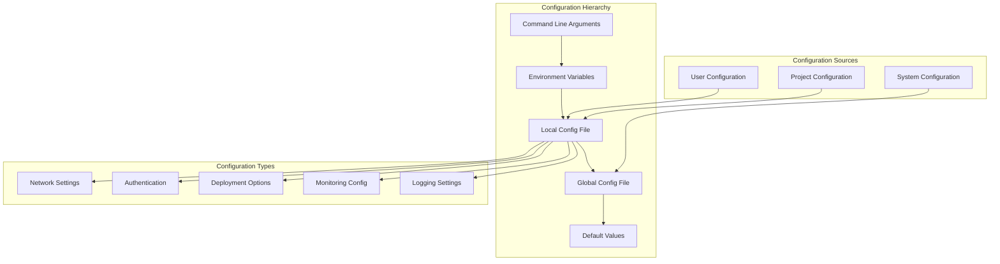

# Configuration

This document provides comprehensive guidance on configuring OSVM CLI for different environments, workflows, and deployment scenarios.

## Overview

OSVM CLI uses a hierarchical configuration system that supports global settings, environment-specific configurations, and command-line overrides. Configuration files use YAML format and can be customized for various deployment patterns and operational requirements.

## Quick Start

```bash
# Initialize default configuration
osvm config init

# Set basic configuration
osvm config set --network mainnet
osvm config set --keypair ~/.config/solana/id.json

# Show current configuration
osvm config show

# Edit configuration file
osvm config edit
```

## Configuration Architecture



## Configuration Files

### File Locations

**Global Configuration:**
- Linux/macOS: `~/.osvm/config.yaml`
- Windows: `%USERPROFILE%\.osvm\config.yaml`

**Project Configuration:**
- `.osvm/config.yaml` (in project directory)
- `osvm.yaml` (in project root)

**System Configuration:**
- Linux: `/etc/osvm/config.yaml`
- macOS: `/usr/local/etc/osvm/config.yaml`
- Windows: `C:\ProgramData\osvm\config.yaml`

### Configuration Priority

Configuration is resolved in the following order (highest to lowest priority):

1. **Command-line arguments**
2. **Environment variables**
3. **Local project configuration**
4. **User global configuration**
5. **System configuration**
6. **Default values**

## Configuration Sections

### Global Settings

Core OSVM CLI configuration options.

```yaml
# ~/.osvm/config.yaml
global:
  # Default network for operations
  network: "mainnet"
  
  # Default keypair path
  keypair: "~/.config/solana/id.json"
  
  # RPC URL override
  rpc_url: "https://api.mainnet-beta.solana.com"
  
  # Commitment level
  commitment: "confirmed"
  
  # Timeout settings
  timeout: 30
  
  # Verbose logging
  verbose: false
  
  # Disable color output
  no_color: false
```

### Network Configuration

Network-specific settings for different Solana networks.

```yaml
networks:
  mainnet:
    rpc_url: "https://api.mainnet-beta.solana.com"
    websocket_url: "wss://api.mainnet-beta.solana.com"
    commitment: "finalized"
    
  testnet:
    rpc_url: "https://api.testnet.solana.com"
    websocket_url: "wss://api.testnet.solana.com"
    commitment: "confirmed"
    
  devnet:
    rpc_url: "https://api.devnet.solana.com"
    websocket_url: "wss://api.devnet.solana.com"
    commitment: "confirmed"
    
  localnet:
    rpc_url: "http://localhost:8899"
    websocket_url: "ws://localhost:8900"
    commitment: "processed"
    
  custom:
    rpc_url: "https://custom-rpc.example.com"
    websocket_url: "wss://custom-rpc.example.com"
    commitment: "confirmed"
    auth_token: "your-auth-token"
```

### Authentication Configuration

Keypair and authentication settings.

```yaml
auth:
  # Default keypair for operations
  default_keypair: "~/.config/solana/id.json"
  
  # Environment-specific keypairs
  keypairs:
    mainnet: "~/.config/solana/mainnet-keypair.json"
    testnet: "~/.config/solana/testnet-keypair.json"
    devnet: "~/.config/solana/devnet-keypair.json"
    
  # SSH configuration
  ssh:
    default_key: "~/.ssh/id_rsa"
    agent_forwarding: true
    strict_host_checking: false
    
    # Host-specific SSH settings
    hosts:
      "validator.example.com":
        user: "solana"
        key: "~/.ssh/validator_key"
        port: 22
        
  # Hardware wallet support
  hardware_wallet:
    enabled: false
    derivation_path: "m/44'/501'/0'/0'"
```

### Deployment Configuration

Settings for validator and RPC deployments.

```yaml
deployment:
  # Default deployment settings
  defaults:
    network: "mainnet"
    monitoring: true
    backup: true
    optimization: true
    
  # Validator deployment
  validator:
    # System requirements
    min_cpu_cores: 16
    min_ram_gb: 256
    min_disk_gb: 2000
    
    # Performance settings
    cpu_governor: "performance"
    network_tuning: true
    file_descriptor_limit: 1000000
    
    # Service configuration
    service_user: "solana"
    working_directory: "/home/solana"
    log_level: "info"
    
    # Disk configuration
    disk_layout:
      os_disk: "default"
      ledger_disk: "/mnt/ledger"
      accounts_disk: "/mnt/extras"
      
  # RPC deployment
  rpc:
    # Resource requirements
    min_cpu_cores: 8
    min_ram_gb: 128
    min_disk_gb: 1000
    
    # RPC-specific settings
    enable_private_rpc: false
    rpc_port: 8899
    websocket_port: 8900
    max_connections: 1000
    request_timeout: 30
    
    # Caching settings
    cache_enabled: true
    cache_size_mb: 1024
    cache_ttl_seconds: 60
```

### Monitoring Configuration

Monitoring and alerting configuration.

```yaml
monitoring:
  # Global monitoring settings
  enabled: true
  interval_seconds: 30
  retention_days: 30
  
  # Metrics collection
  metrics:
    # System metrics
    system:
      cpu: true
      memory: true
      disk: true
      network: true
      
    # Solana metrics
    solana:
      vote_credits: true
      slot_processing: true
      transaction_rate: true
      delinquency: true
      
    # Custom metrics
    custom:
      enabled: false
      endpoint: "http://localhost:9090/metrics"
      
  # Alerting configuration
  alerts:
    # Alert thresholds
    cpu_threshold: 80
    memory_threshold: 90
    disk_threshold: 85
    delinquency_threshold: 5
    
    # Notification settings
    notifications:
      email:
        enabled: false
        smtp_host: "smtp.example.com"
        smtp_port: 587
        username: "alerts@example.com"
        password: "secret"
        recipients: ["admin@example.com"]
        
      slack:
        enabled: false
        webhook_url: "https://hooks.slack.com/services/..."
        channel: "#alerts"
        
      discord:
        enabled: false
        webhook_url: "https://discord.com/api/webhooks/..."
        
  # Dashboard configuration
  dashboard:
    enabled: true
    port: 3000
    refresh_interval: 5
    theme: "dark"
    
  # Log aggregation
  logging:
    aggregation: true
    max_log_size_mb: 100
    max_log_files: 10
    log_format: "json"
```

### Self-Repair Configuration

Automated repair and maintenance settings.

```yaml
self_repair:
  # Global self-repair settings
  enabled: true
  auto_repair: false
  max_repair_attempts: 3
  
  # Safety settings
  safety:
    create_backups: true
    require_confirmation: true
    dangerous_repairs: false
    rollback_on_failure: true
    
  # Component-specific settings
  components:
    system_packages:
      auto_update: true
      update_schedule: "weekly"
      
    rust_toolchain:
      auto_update: false
      required_version: ">=1.70.0"
      
    solana_cli:
      auto_update: false
      version_check: true
      
  # Repair patterns
  patterns:
    network_limits:
      enabled: true
      auto_fix: true
      
    file_descriptors:
      enabled: true
      auto_fix: true
      
    memory_issues:
      enabled: true
      auto_fix: false
      
  # Emergency recovery
  emergency_recovery:
    enabled: true
    backup_location: "~/.osvm/emergency-backup"
    recovery_mode: "safe"
```

## Environment-Specific Configuration

### Development Environment

Configuration optimized for development and testing.

```yaml
# .osvm/config.yaml (development)
environment: "development"

global:
  network: "devnet"
  verbose: true
  
networks:
  devnet:
    rpc_url: "https://api.devnet.solana.com"
    commitment: "confirmed"
    
deployment:
  defaults:
    monitoring: false
    backup: false
    optimization: false
    
  validator:
    log_level: "debug"
    min_cpu_cores: 4
    min_ram_gb: 16
    
monitoring:
  enabled: false
  
self_repair:
  auto_repair: true
  safety:
    require_confirmation: false
```

### Staging Environment

Configuration for staging and pre-production testing.

```yaml
# .osvm/config.yaml (staging)
environment: "staging"

global:
  network: "testnet"
  
networks:
  testnet:
    rpc_url: "https://api.testnet.solana.com"
    commitment: "finalized"
    
deployment:
  defaults:
    monitoring: true
    backup: true
    optimization: true
    
  validator:
    log_level: "info"
    min_cpu_cores: 12
    min_ram_gb: 128
    
monitoring:
  enabled: true
  alerts:
    cpu_threshold: 70
    memory_threshold: 80
    
self_repair:
  auto_repair: true
  safety:
    require_confirmation: false
    dangerous_repairs: false
```

### Production Environment

Configuration for production deployments.

```yaml
# .osvm/config.yaml (production)
environment: "production"

global:
  network: "mainnet"
  
networks:
  mainnet:
    rpc_url: "https://api.mainnet-beta.solana.com"
    commitment: "finalized"
    
deployment:
  defaults:
    monitoring: true
    backup: true
    optimization: true
    
  validator:
    log_level: "warn"
    min_cpu_cores: 16
    min_ram_gb: 256
    cpu_governor: "performance"
    
monitoring:
  enabled: true
  retention_days: 90
  alerts:
    cpu_threshold: 80
    memory_threshold: 90
    notifications:
      email:
        enabled: true
      slack:
        enabled: true
        
self_repair:
  auto_repair: false
  safety:
    require_confirmation: true
    dangerous_repairs: false
    create_backups: true
```

## Configuration Management

### Configuration Commands

#### Basic Configuration

```bash
# Initialize configuration
osvm config init

# Show current configuration
osvm config show

# Show specific section
osvm config show --section networks

# Edit configuration file
osvm config edit

# Validate configuration
osvm config validate
```

#### Setting Values

```bash
# Set global values
osvm config set --network mainnet
osvm config set --keypair ~/.config/solana/id.json
osvm config set --verbose true

# Set network-specific values
osvm config set-network mainnet --rpc-url https://custom-rpc.com
osvm config set-network devnet --commitment confirmed

# Set deployment defaults
osvm config set-deployment --monitoring true
osvm config set-deployment --backup true
```

#### Environment Management

```bash
# Create environment-specific configuration
osvm config create-env production
osvm config create-env staging
osvm config create-env development

# Switch between environments
osvm config use-env production
osvm config use-env development

# List available environments
osvm config list-envs

# Copy configuration between environments
osvm config copy-env production staging
```

### Configuration Templates

#### Validator Template

```yaml
# validator-template.yaml
environment: "validator-production"

global:
  network: "mainnet"
  
deployment:
  validator:
    cpu_governor: "performance"
    network_tuning: true
    file_descriptor_limit: 1000000
    
    disk_layout:
      ledger_disk: "/mnt/ledger"
      accounts_disk: "/mnt/extras"
      
monitoring:
  enabled: true
  metrics:
    system: true
    solana: true
    
  alerts:
    cpu_threshold: 80
    memory_threshold: 90
    delinquency_threshold: 5
    
self_repair:
  enabled: true
  auto_repair: false
  
  components:
    system_packages:
      auto_update: true
    rust_toolchain:
      auto_update: false
```

#### RPC Template

```yaml
# rpc-template.yaml
environment: "rpc-production"

global:
  network: "mainnet"
  
deployment:
  rpc:
    enable_private_rpc: false
    max_connections: 1000
    request_timeout: 30
    
    cache_enabled: true
    cache_size_mb: 2048
    cache_ttl_seconds: 30
    
monitoring:
  enabled: true
  metrics:
    system: true
    custom: true
    
  dashboard:
    enabled: true
    port: 3000
    
alerts:
  notifications:
    slack:
      enabled: true
      channel: "#rpc-alerts"
```

#### Development Template

```yaml
# development-template.yaml
environment: "development"

global:
  network: "devnet"
  verbose: true
  
deployment:
  defaults:
    monitoring: false
    backup: false
    
monitoring:
  enabled: false
  
self_repair:
  auto_repair: true
  safety:
    require_confirmation: false
```

### Using Templates

```bash
# Apply configuration template
osvm config apply-template validator-template.yaml

# Create configuration from template
osvm config create --template rpc-template.yaml

# List available templates
osvm config list-templates

# Generate template from current config
osvm config export-template --output my-template.yaml
```

## Advanced Configuration

### Environment Variables

Override configuration using environment variables.

```bash
# Network settings
export OSVM_NETWORK=mainnet
export OSVM_RPC_URL=https://api.mainnet-beta.solana.com
export OSVM_COMMITMENT=finalized

# Authentication
export OSVM_KEYPAIR=~/.config/solana/id.json
export OSVM_SSH_KEY=~/.ssh/validator_key

# Deployment settings
export OSVM_MONITORING=true
export OSVM_BACKUP=true
export OSVM_VERBOSE=true

# Use in commands
osvm svm list  # Uses environment variables
```

### Configuration Profiles

Create and manage configuration profiles for different scenarios.

```bash
# Create profiles
osvm config create-profile validator-mainnet
osvm config create-profile rpc-cluster
osvm config create-profile development

# Switch profiles
osvm config use-profile validator-mainnet

# List profiles
osvm config list-profiles

# Export/import profiles
osvm config export-profile validator-mainnet > validator.yaml
osvm config import-profile staging < staging.yaml
```

### Dynamic Configuration

Configuration that adapts based on context or runtime conditions.

```yaml
# Conditional configuration
dynamic:
  # Network-based settings
  network_conditions:
    mainnet:
      commitment: "finalized"
      timeout: 60
    devnet:
      commitment: "confirmed"
      timeout: 30
      
  # Resource-based settings
  resource_conditions:
    high_memory:
      condition: "memory > 512GB"
      settings:
        cache_size_mb: 4096
    low_memory:
      condition: "memory < 128GB"
      settings:
        cache_size_mb: 512
        
  # Time-based settings
  time_conditions:
    business_hours:
      condition: "hour >= 9 && hour <= 17"
      settings:
        monitoring:
          interval_seconds: 15
    off_hours:
      condition: "hour < 9 || hour > 17"
      settings:
        monitoring:
          interval_seconds: 60
```

## Configuration Validation

### Schema Validation

OSVM CLI validates configuration files against a predefined schema.

```bash
# Validate current configuration
osvm config validate

# Validate specific file
osvm config validate --file custom-config.yaml

# Show validation schema
osvm config schema

# Generate example configuration
osvm config example > example-config.yaml
```

### Configuration Testing

```bash
# Test configuration with dry run
osvm --config test-config.yaml deploy-validator --dry-run

# Test network connectivity with config
osvm --config custom-config.yaml test-network

# Validate deployment configuration
osvm config test-deployment --config deployment-config.yaml
```

## Migration and Backup

### Configuration Backup

```bash
# Backup current configuration
osvm config backup

# Backup to specific location
osvm config backup --output ~/.osvm/backups/config-$(date +%Y%m%d).yaml

# List available backups
osvm config list-backups

# Restore from backup
osvm config restore --backup config-20231201.yaml
```

### Migration

```bash
# Migrate from older version
osvm config migrate --from-version 1.1.0

# Export configuration for migration
osvm config export --format v2 > config-v2.yaml

# Import configuration
osvm config import config-v2.yaml

# Validate after migration
osvm config validate --strict
```

## Troubleshooting Configuration

### Common Issues

#### Configuration File Not Found

```bash
# Check configuration file location
osvm config show --paths

# Create default configuration
osvm config init --force

# Verify file permissions
ls -la ~/.osvm/config.yaml
chmod 600 ~/.osvm/config.yaml
```

#### Invalid Configuration

```bash
# Validate configuration syntax
osvm config validate --verbose

# Check for syntax errors
yamllint ~/.osvm/config.yaml

# Reset to defaults
osvm config reset --section deployment
osvm config reset --all
```

#### Environment Issues

```bash
# Check environment variables
env | grep OSVM

# Clear conflicting environment variables
unset OSVM_NETWORK OSVM_RPC_URL

# Debug configuration resolution
osvm config debug --show-resolution
```

### Debug Commands

```bash
# Show configuration resolution order
osvm config debug --show-hierarchy

# Show effective configuration
osvm config debug --show-effective

# Test configuration merge
osvm config debug --test-merge local-config.yaml

# Validate configuration schema
osvm config debug --validate-schema
```

## Best Practices

### Configuration Organization

1. **Environment Separation**
   - Use separate configurations for dev/staging/production
   - Store sensitive data in environment variables
   - Use configuration templates for consistency

2. **Version Control**
   - Store configuration templates in version control
   - Exclude sensitive data from repositories
   - Document configuration changes

3. **Security**
   - Protect configuration files with appropriate permissions
   - Use environment variables for secrets
   - Regularly rotate credentials

### Configuration Maintenance

1. **Regular Review**
   - Review configuration periodically
   - Update deprecated settings
   - Validate against current schema

2. **Backup Strategy**
   - Regular configuration backups
   - Test restore procedures
   - Document configuration dependencies

3. **Monitoring**
   - Monitor configuration changes
   - Alert on invalid configurations
   - Track configuration drift

## Related Documentation

- [Installation](installation.md) - Installation and initial setup
- [Examples](examples.md) - Configuration examples
- [Self-Repair System](self-repair-system.md) - Self-repair configuration
- [Monitoring](monitoring.md) - Monitoring configuration