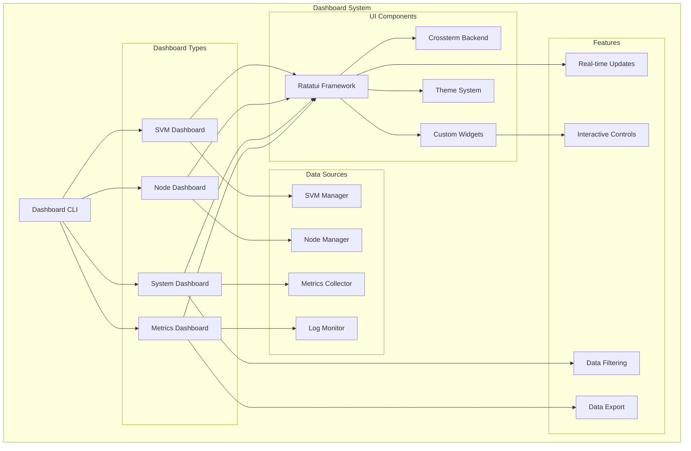
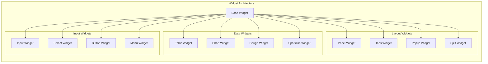

# Dashboard

The OSVM CLI Dashboard provides interactive terminal-based user interfaces (TUI) for real-time monitoring and management of SVMs, nodes, and system health.

## Overview

OSVM CLI includes multiple dashboard interfaces built with ratatui for responsive terminal-based monitoring. The dashboards offer real-time metrics, interactive controls, and comprehensive system visualization.

## Quick Start

```bash
# Launch SVM monitoring dashboard
osvm svm dashboard

# Launch node monitoring dashboard
osvm node dashboard

# Launch comprehensive system dashboard
osvm dashboard --all

# Launch with specific refresh rate
osvm dashboard --refresh 5
```

## Architecture



## Dashboard Types

### SVM Dashboard

Interactive monitoring for Solana Virtual Machine installations.

```bash
osvm svm dashboard
```

**Features:**
- Real-time SVM status display
- Version and compatibility information
- Network configuration details
- Installation health metrics
- Interactive SVM selection

**Display Panels:**
- **SVM List:** All installed SVMs with status
- **Details Panel:** Selected SVM detailed information
- **Metrics Panel:** Performance and usage statistics
- **Logs Panel:** Recent SVM-related logs

### Node Dashboard

Comprehensive node monitoring and management interface.

```bash
osvm node dashboard
```

**Features:**
- Multi-node status overview
- Real-time performance metrics
- Health status indicators
- Interactive node management
- Log streaming and analysis

**Display Panels:**
- **Node Overview:** Grid view of all managed nodes
- **Performance Metrics:** CPU, memory, disk, network usage
- **Health Status:** Service health and connectivity
- **Activity Log:** Real-time event streaming

### System Dashboard

Unified view of entire OSVM CLI managed infrastructure.

```bash
osvm dashboard --all
```

**Features:**
- System-wide health overview
- Resource utilization summary
- Alert and notification center
- Cross-component dependencies
- System performance trends

## User Interface Components

### Navigation Controls

**Global Hotkeys:**
- `q` or `Ctrl+C` - Quit dashboard
- `Tab` - Switch between panels
- `↑/↓` - Navigate lists
- `Enter` - Select/activate item
- `r` - Refresh data manually
- `h` - Show help overlay

**Panel-specific Controls:**
- `f` - Filter/search
- `s` - Sort options
- `e` - Export data
- `d` - Detailed view
- `a` - Action menu

### Widget System



### Theme System

**Built-in Themes:**
- **Default:** Standard terminal colors
- **Dark:** Dark mode optimized
- **Light:** Light terminal friendly
- **High Contrast:** Accessibility optimized
- **Custom:** User-configurable colors

**Theme Configuration:**
```yaml
dashboard:
  theme: "dark"
  colors:
    primary: "#00ff00"
    secondary: "#ffff00"
    error: "#ff0000"
    warning: "#ff8800"
    info: "#0088ff"
    success: "#00ff00"
  
  layout:
    refresh_rate: 1000
    max_log_lines: 100
    show_borders: true
    compact_mode: false
```

## Data Visualization

### Performance Metrics

Real-time visualization of system performance data.

**Chart Types:**
- **Line Charts:** Time-series data (CPU, memory over time)
- **Bar Charts:** Comparative data (node performance comparison)
- **Gauge Charts:** Current values (disk usage, network load)
- **Sparklines:** Compact trend visualization

**Metrics Categories:**
- **System Resources:** CPU, memory, disk, network
- **Solana Metrics:** TPS, slot processing, vote credits
- **Application Metrics:** Request rates, error counts
- **Health Metrics:** Service status, connectivity

### Interactive Data Exploration

```mermaid
sequenceDiagram
    participant U as User
    participant DASH as Dashboard
    participant DATA as Data Source
    participant VIZ as Visualization
    
    U->>DASH: Navigate to metrics panel
    DASH->>DATA: Request metric data
    DATA->>DASH: Return time series data
    DASH->>VIZ: Render chart
    VIZ->>U: Display visualization
    
    U->>DASH: Apply filter
    DASH->>DATA: Request filtered data
    DATA->>DASH: Return filtered results
    DASH->>VIZ: Update chart
    VIZ->>U: Display updated view
    
    U->>DASH: Zoom into time range
    DASH->>DATA: Request detailed data
    DATA->>DASH: Return high-resolution data
    DASH->>VIZ: Render detailed chart
    VIZ->>U: Display zoomed view
    
    classDef techDebt fill:#f6f6f6,stroke:#d9534f,color:#d9534f,font-family:Consolas,monospace,font-weight:bold
```

## Real-time Updates

### Multi-threaded Architecture

The dashboard uses a multi-threaded architecture for responsive UI:

**Thread Structure:**
- **UI Thread:** Handles user input and rendering
- **Data Thread:** Collects metrics and updates
- **Network Thread:** Handles remote data sources
- **Background Thread:** Performs maintenance tasks

**Update Strategy:**
- **Push Updates:** Real-time data streaming
- **Pull Updates:** Periodic data collection
- **Event-driven Updates:** Triggered by system events
- **Batched Updates:** Efficient bulk data processing

### Data Refresh Modes

**Automatic Refresh:**
```bash
# Default 1-second refresh
osvm dashboard

# Custom refresh rate (5 seconds)
osvm dashboard --refresh 5

# Minimal refresh for low-resource environments
osvm dashboard --refresh 30 --minimal
```

**Manual Refresh:**
```bash
# Disable automatic refresh
osvm dashboard --no-auto-refresh

# On-demand refresh with 'r' key
```

## Interactive Features

### Filtering and Search

**Global Search:**
- Search across all displayed data
- Filter by node names, types, status
- Regular expression support
- Case-insensitive matching

**Column Filtering:**
- Filter table columns by value
- Range filtering for numeric data
- Date range filtering for timestamps
- Boolean filtering for status fields

### Action Menus

Context-sensitive action menus for interactive management:

**SVM Actions:**
- Install new SVM version
- Switch active SVM
- View detailed information
- Export SVM configuration

**Node Actions:**
- Start/stop services
- View logs
- SSH to node
- Export node configuration
- Trigger health checks

### Data Export

**Export Formats:**
- **JSON:** Machine-readable data export
- **CSV:** Spreadsheet-compatible format
- **Text:** Human-readable reports
- **HTML:** Web-friendly reports

**Export Options:**
```bash
# Export current view to JSON
# (Interactive: press 'e' in dashboard)

# Export specific time range
osvm dashboard --export --start "2023-12-01" --end "2023-12-31"

# Export with filtering
osvm dashboard --export --filter "status=running"
```

## Configuration Management

### Dashboard Configuration

```yaml
dashboard:
  # Refresh settings
  refresh_rate_ms: 1000
  auto_refresh: true
  lazy_loading: true
  
  # Display settings
  max_items_per_page: 50
  show_timestamps: true
  time_format: "2006-01-02 15:04:05"
  
  # Performance settings
  max_history_points: 1000
  buffer_size: 10000
  gc_interval_ms: 30000
  
  # UI settings
  mouse_support: true
  vim_keys: false
  show_help: true
```

### Panel Configuration

```yaml
panels:
  svm_list:
    enabled: true
    position: "left"
    width: 30
    sortby: "name"
    
  metrics:
    enabled: true
    position: "right"
    height: 50
    charts: ["cpu", "memory", "network"]
    
  logs:
    enabled: true
    position: "bottom"
    height: 20
    max_lines: 100
    follow: true
```

## Advanced Features

### Custom Dashboards

Create custom dashboard layouts for specific monitoring needs:

```yaml
custom_dashboards:
  validator_monitoring:
    title: "Validator Performance"
    panels:
      - type: "node_list"
        filter: "type=validator"
      - type: "performance_chart"
        metrics: ["vote_credits", "skip_rate"]
      - type: "network_status"
        
  rpc_monitoring:
    title: "RPC Performance"
    panels:
      - type: "rpc_metrics"
      - type: "request_rate_chart"
      - type: "error_log"
```

### Alert Integration

Dashboard integration with alert systems:

**Visual Alerts:**
- Color-coded status indicators
- Blinking alerts for critical issues
- Popup notifications for urgent events
- Sound alerts (where supported)

**Alert Configuration:**
```yaml
alerts:
  visual:
    critical_color: "red"
    warning_color: "yellow"
    blink_rate_ms: 500
    
  notifications:
    show_popups: true
    auto_dismiss_ms: 5000
    sound_enabled: false
```

### Scripting Integration

Dashboard automation and scripting support:

```bash
# Headless dashboard for monitoring
osvm dashboard --headless --output metrics.json

# Dashboard with predefined filters
osvm dashboard --preset validator_health

# Dashboard with custom layout
osvm dashboard --layout custom_validator.yaml
```

## Performance Optimization

### Memory Management

**Efficient Data Handling:**
- Circular buffers for time-series data
- Lazy loading for large datasets
- Garbage collection optimization
- Memory pooling for frequent allocations

**Configuration Options:**
```yaml
performance:
  max_memory_mb: 512
  gc_threshold_mb: 256
  buffer_cleanup_interval: 60
  lazy_load_threshold: 1000
```

### Network Optimization

**Efficient Data Transfer:**
- Delta updates for changed data only
- Compression for large datasets
- Connection pooling for remote sources
- Caching for frequently accessed data

## Troubleshooting

### Common Issues

**Dashboard Won't Start:**
```bash
# Check terminal capabilities
echo $TERM

# Test terminal color support
tput colors

# Verify ratatui dependencies
osvm --version
```

**Performance Issues:**
```bash
# Reduce refresh rate
osvm dashboard --refresh 5

# Enable minimal mode
osvm dashboard --minimal

# Check resource usage
top -p $(pgrep osvm)
```

**Display Problems:**
```bash
# Reset terminal
reset

# Check terminal size
stty size

# Force specific terminal type
TERM=xterm-256color osvm dashboard
```

### Debug Mode

Enable debug mode for troubleshooting:

```bash
# Enable debug logging
RUST_LOG=debug osvm dashboard

# Debug with specific components
RUST_LOG=osvm::dashboard=debug osvm dashboard

# Save debug output
osvm dashboard --debug > debug.log 2>&1
```

## Best Practices

### Dashboard Usage

1. **Monitor Responsively**
   - Use appropriate refresh rates
   - Enable filtering for large datasets
   - Utilize multiple dashboards for different concerns

2. **Customize for Workflow**
   - Configure panels for specific roles
   - Set up custom themes for readability
   - Create presets for common monitoring tasks

3. **Performance Considerations**
   - Monitor dashboard resource usage
   - Use minimal mode for resource-constrained environments
   - Consider headless mode for automated monitoring

### Integration Strategy

1. **Monitoring Workflow**
   - Use dashboards for real-time monitoring
   - Export data for historical analysis
   - Integrate with external monitoring systems

2. **Team Collaboration**
   - Share dashboard configurations
   - Document custom dashboard layouts
   - Train team members on interactive features

## Related Documentation

- [Node Management](node-management.md) - Node monitoring features
- [SVM Management](svm-management.md) - SVM monitoring capabilities
- [Log Monitoring](log-monitoring.md) - Log analysis integration
- [Configuration](configuration.md) - Dashboard configuration options