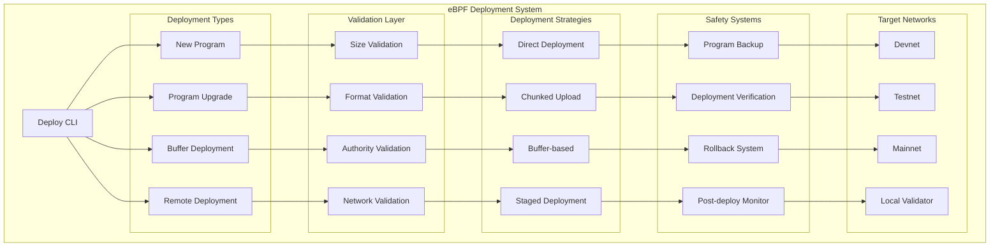
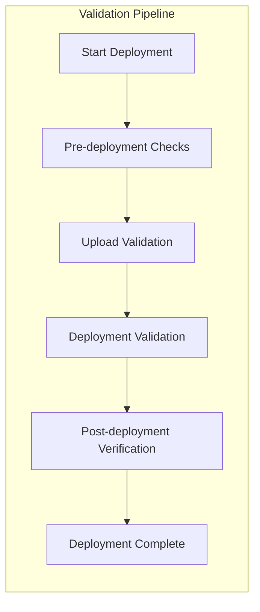
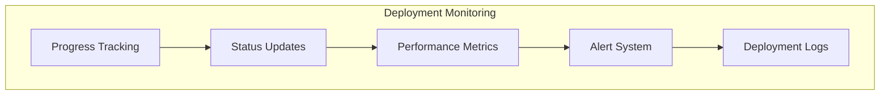

# eBPF Deployment

The eBPF Deployment module provides comprehensive tools for deploying, upgrading, and managing Solana programs (smart contracts) across different networks and environments.

## Overview

OSVM CLI offers advanced eBPF program deployment capabilities with support for large programs, buffer accounts, upgrade procedures, and comprehensive validation. It handles the complexity of Solana program deployment while providing safety mechanisms and deployment strategies.

## Quick Start

```bash
# Deploy a new program
osvm deploy-program --program myprogram.so --keypair authority.json

# Upgrade existing program
osvm deploy-program --program myprogram.so --keypair authority.json --upgrade

# Deploy to remote host
osvm deploy-program --host user@example.com --program myprogram.so --keypair authority.json

# Deploy with buffer account (for large programs)
osvm deploy-program --program myprogram.so --keypair authority.json --use-buffer
```

## Architecture



## Deployment Commands

### Basic Program Deployment

Deploy a new Solana program to the network.

```bash
osvm deploy-program [OPTIONS]
```

**Required Options:**
- `--program <PROGRAM>` - Path to program binary (.so file)
- `--keypair <KEYPAIR>` - Program authority keypair

**Common Options:**
- `--network <NETWORK>` - Target network (devnet, testnet, mainnet)
- `--upgrade` - Upgrade existing program
- `--buffer-keypair <KEYPAIR>` - Use specific buffer keypair
- `--max-sign-attempts <NUM>` - Maximum signing attempts
- `--use-buffer` - Use buffer account for deployment

**Examples:**
```bash
# Deploy to devnet
osvm deploy-program \
  --program target/deploy/myprogram.so \
  --keypair ~/.config/solana/id.json \
  --network devnet

# Upgrade existing program
osvm deploy-program \
  --program target/deploy/myprogram.so \
  --keypair ~/.config/solana/id.json \
  --upgrade \
  --network mainnet

# Deploy large program with buffer
osvm deploy-program \
  --program target/deploy/large_program.so \
  --keypair ~/.config/solana/id.json \
  --use-buffer \
  --buffer-keypair buffer.json
```

### Remote Deployment

Deploy programs via SSH to remote hosts with access to target networks.

```bash
osvm deploy-program --host <HOST> [OPTIONS]
```

**Remote Deployment Features:**
- Transfer program binary to remote host
- Execute deployment from remote environment
- Handle network connectivity from remote location
- Manage keypairs securely during remote deployment

### Buffer-based Deployment

For programs larger than the transaction size limit, use buffer accounts.

```mermaid
sequenceDiagram
    participant DEV as Developer
    participant CLI as OSVM CLI
    participant BUF as Buffer Account
    participant SOL as Solana Network
    participant PROG as Program Account
    
    DEV->>CLI: deploy-program --use-buffer
    CLI->>BUF: Create buffer account
    BUF->>CLI: Buffer account created
    CLI->>BUF: Upload program data in chunks
    BUF->>CLI: All chunks uploaded
    CLI->>SOL: Deploy from buffer
    SOL->>PROG: Program deployed
    PROG->>CLI: Deployment confirmed
    CLI->>BUF: Close buffer account
    CLI->>DEV: Deployment complete
    
    classDef techDebt fill:#f6f6f6,stroke:#d9534f,color:#d9534f,font-family:Solana,monospace,font-weight:bold
```

## Deployment Strategies

### Direct Deployment

For small programs that fit within transaction limits.

**Characteristics:**
- Single transaction deployment
- Immediate deployment
- Lower cost
- Simple process

**Best for:**
- Small programs (<100KB)
- Testing and development
- Simple smart contracts

### Chunked Deployment

For medium-sized programs requiring multiple transactions.

**Process:**
1. Split program into chunks
2. Upload chunks sequentially
3. Verify chunk integrity
4. Finalize deployment

**Best for:**
- Medium programs (100KB-1MB)
- Production deployments
- Programs with size constraints

### Buffer Account Deployment

For large programs exceeding transaction limits.

**Process:**
1. Create dedicated buffer account
2. Upload program data to buffer
3. Deploy from buffer to program account
4. Close buffer account

**Best for:**
- Large programs (>1MB)
- Complex applications
- Enterprise deployments

## Program Validation

### Pre-deployment Validation

Comprehensive validation before deployment execution.

**Validation Checks:**
- **Binary Format:** ELF format validation
- **Program Size:** Size limit verification
- **Authority:** Keypair validation
- **Network Access:** Network connectivity check
- **SOL Balance:** Sufficient balance for deployment
- **Program Account:** Account state verification

### Runtime Validation

Validation during deployment process.



### Post-deployment Verification

Verification after successful deployment.

**Verification Steps:**
- Program account state validation
- Executable data verification
- Authority confirmation
- Upgrade authority check
- Program ID validation

## Upgrade Management

### Program Upgrades

Safe upgrade procedures for existing programs.

**Upgrade Process:**
1. Validate upgrade authority
2. Create program backup
3. Upload new program data
4. Verify upgrade success
5. Update program metadata

**Upgrade Options:**
```bash
# Standard upgrade
osvm deploy-program --upgrade --program new_version.so --keypair authority.json

# Upgrade with backup
osvm deploy-program --upgrade --program new_version.so --keypair authority.json --backup

# Staged upgrade (test first)
osvm deploy-program --upgrade --program new_version.so --keypair authority.json --stage-test
```

### Version Management

Track and manage program versions.

```yaml
program_versions:
  myprogram:
    current: "v1.2.0"
    deployed: "2023-12-01T10:00:00Z"
    authority: "11111111111111111111111111111111"
    network: "mainnet"
    
  versions:
    - version: "v1.0.0"
      deployed: "2023-10-01T10:00:00Z"
      program_id: "PROG1111111111111111111111111111111"
    - version: "v1.1.0"
      deployed: "2023-11-01T10:00:00Z"
      program_id: "PROG2222222222222222222222222222222"
```

### Rollback Capabilities

Emergency rollback procedures for failed upgrades.

**Rollback Types:**
- **Immediate Rollback:** Revert to previous version
- **Staged Rollback:** Gradual rollback with validation
- **Emergency Rollback:** Fast rollback for critical issues

## Security Features

### Authority Management

Secure handling of program authorities and keypairs.

**Authority Types:**
- **Deploy Authority:** Can deploy new programs
- **Upgrade Authority:** Can upgrade existing programs
- **Close Authority:** Can close program accounts

**Security Practices:**
- Keypair encryption at rest
- Secure keypair transfer for remote deployment
- Authority validation before operations
- Multi-signature support for critical operations

### Deployment Safety

Safety mechanisms to prevent deployment failures.

**Safety Features:**
- **Dry Run Mode:** Test deployment without execution
- **Backup Creation:** Automatic backup before upgrades
- **Verification Checks:** Comprehensive post-deployment validation
- **Rollback Procedures:** Emergency rollback capabilities

### Network Security

Secure communication for remote deployments.

**Security Measures:**
- SSH key authentication
- Encrypted data transfer
- Secure keypair handling
- Network connectivity validation

## Configuration Management

### Deployment Configuration

```yaml
deployment:
  # Default settings
  network: "devnet"
  confirmation_commitment: "confirmed"
  max_retries: 3
  retry_delay_ms: 1000
  
  # Buffer settings
  buffer_size_limit: 1048576  # 1MB
  chunk_size: 1000
  use_buffer_threshold: 100000  # 100KB
  
  # Safety settings
  create_backups: true
  verify_deployment: true
  require_confirmation: false
  
  # Performance settings
  parallel_uploads: true
  max_concurrent_chunks: 5
  timeout_seconds: 300
```

### Network-specific Configuration

```yaml
networks:
  devnet:
    rpc_url: "https://api.devnet.solana.com"
    commitment: "confirmed"
    max_program_size: 1000000
    
  testnet:
    rpc_url: "https://api.testnet.solana.com"
    commitment: "finalized"
    max_program_size: 1000000
    
  mainnet:
    rpc_url: "https://api.mainnet-beta.solana.com"
    commitment: "finalized"
    max_program_size: 1000000
    backup_required: true
    confirmation_required: true
```

## Advanced Features

### Deployment Analytics

Track deployment metrics and performance.

**Metrics Collected:**
- Deployment success rates
- Average deployment time
- Network-specific performance
- Error patterns and frequencies
- Resource utilization

### CI/CD Integration

Integration with continuous integration and deployment pipelines.

```yaml
# GitHub Actions example
name: Deploy Program
on:
  push:
    branches: [main]

jobs:
  deploy:
    runs-on: ubuntu-latest
    steps:
    - uses: actions/checkout@v2
    
    - name: Build Program
      run: cargo build-bpf
      
    - name: Deploy to Devnet
      run: |
        osvm deploy-program \
          --program target/deploy/program.so \
          --keypair ${{ secrets.DEPLOY_KEYPAIR }} \
          --network devnet
          
    - name: Verify Deployment
      run: |
        osvm verify-program \
          --program-id ${{ env.PROGRAM_ID }} \
          --network devnet
```

### Batch Deployment

Deploy multiple programs in coordinated batches.

```bash
# Batch deployment configuration
osvm deploy-batch --config batch-config.yaml
```

```yaml
# batch-config.yaml
batch_deployment:
  programs:
    - name: "token_program"
      path: "target/deploy/token.so"
      authority: "token_authority.json"
      
    - name: "nft_program"
      path: "target/deploy/nft.so"
      authority: "nft_authority.json"
      dependencies: ["token_program"]
      
  settings:
    network: "devnet"
    parallel: false
    verify_each: true
```

## Monitoring and Logging

### Deployment Monitoring

Real-time monitoring of deployment progress and status.



**Monitoring Features:**
- Real-time progress updates
- Performance metrics collection
- Error detection and alerting
- Deployment log aggregation
- Success/failure notifications

### Logging Configuration

```yaml
logging:
  level: "info"
  output: "osvm-deployment.log"
  format: "json"
  
  components:
    deployment: "debug"
    validation: "info"
    network: "warn"
    
  retention:
    max_files: 10
    max_size_mb: 100
```

## Troubleshooting

### Common Issues

**Deployment Fails - Insufficient Funds:**
```bash
# Check SOL balance
solana balance

# Get rent estimate
solana program-size target/deploy/program.so

# Fund account if needed
solana airdrop 2  # devnet only
```

**Program Too Large:**
```bash
# Check program size
ls -lh target/deploy/program.so

# Use buffer deployment
osvm deploy-program --use-buffer --program target/deploy/program.so

# Optimize program size
cargo build-bpf --release
```

**Authority Issues:**
```bash
# Verify keypair
solana-keygen verify authority.json

# Check program authority
solana program show <PROGRAM_ID>

# Update authority if needed
solana program set-upgrade-authority <PROGRAM_ID> <NEW_AUTHORITY>
```

**Network Connectivity:**
```bash
# Test network connection
solana cluster-version

# Check RPC endpoint
curl -X POST -H "Content-Type: application/json" \
  -d '{"jsonrpc":"2.0","id":1,"method":"getHealth"}' \
  https://api.devnet.solana.com

# Switch to different RPC
solana config set --url https://api.devnet.solana.com
```

### Debug Commands

**Deployment Testing:**
```bash
# Dry run deployment
osvm deploy-program --dry-run --program myprogram.so

# Validate program binary
osvm validate-program --program myprogram.so

# Test authority
osvm test-authority --keypair authority.json --program-id <ID>
```

**Network Testing:**
```bash
# Test network connectivity
osvm test-network --network devnet

# Check program deployment limits
osvm network-limits --network devnet

# Verify RPC endpoint
osvm test-rpc --url https://api.devnet.solana.com
```

## Best Practices

### Development Workflow

1. **Testing Strategy**
   - Always test on devnet first
   - Use testnet for staging
   - Deploy to mainnet only after thorough testing

2. **Program Optimization**
   - Optimize program size for deployment
   - Use release builds for production
   - Consider program upgradability

3. **Authority Management**
   - Use separate keypairs for different environments
   - Implement multi-signature for mainnet
   - Regularly rotate authorities

### Production Deployment

1. **Safety Procedures**
   - Create backups before upgrades
   - Implement staged deployments
   - Monitor post-deployment performance

2. **Monitoring Setup**
   - Set up deployment monitoring
   - Configure alerting for failures
   - Track deployment metrics

3. **Emergency Procedures**
   - Prepare rollback procedures
   - Document emergency contacts
   - Test disaster recovery plans

## Related Documentation

- [SSH Deployment](ssh-deployment.md) - Remote deployment capabilities
- [Node Management](node-management.md) - Node deployment integration
- [Configuration](configuration.md) - Deployment configuration
- [Examples](examples.md) - Deployment examples and patterns