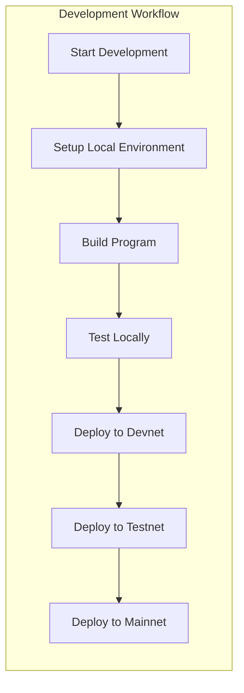

# Examples

This document provides comprehensive usage examples and command patterns for OSVM CLI across different workflows and use cases.

## Overview

OSVM CLI examples are organized by category to help users quickly find relevant command patterns for their specific needs. Examples range from basic operations to complex deployment workflows.

## Quick Reference

```bash
# Show all available examples
osvm examples

# Show examples by category
osvm examples --category basic

# List all categories
osvm examples --list-categories
```

## Example Categories

### Basic Operations

Fundamental OSVM CLI operations for getting started.

#### Version and Help

```bash
# Show version information
osvm version
osvm --version
osvm v

# Show help for main command
osvm --help

# Show help for specific subcommand
osvm svm --help
osvm deploy-validator --help
```

#### Configuration

```bash
# Set global configuration
osvm config set --network mainnet
osvm config set --keypair ~/.config/solana/id.json

# Show current configuration
osvm config show

# Use custom configuration file
osvm --config ~/.osvm/custom.yaml svm list
```

### SVM Management Examples

Examples for managing Solana Virtual Machines.

#### SVM Installation and Management

```bash
# List all installed SVMs
osvm svm list

# Install latest stable SVM
osvm svm install --version 1.18.0

# Install specific client type
osvm svm install --version 1.18.0 --client-type jito
osvm svm install --version 1.18.0 --client-type agave

# Install experimental clients
osvm svm install --version latest --client-type firedancer
osvm svm install --version latest --client-type sig

# Get detailed SVM information
osvm svm get 1.18.0

# Launch SVM monitoring dashboard
osvm svm dashboard
```

#### SVM Switching and Version Management

```bash
# Switch between SVM versions
osvm use 1.17.0
osvm use 1.18.0

# Remove old SVM version
osvm svm remove 1.16.0

# Update SVM to latest version
osvm svm update --version 1.18.0

# Force reinstall SVM
osvm svm install --version 1.18.0 --force
```

### Node Management Examples

Examples for deploying and managing validator and RPC nodes.

#### Basic Node Operations

```bash
# List all managed nodes
osvm node list

# Filter nodes by status
osvm node list --status running
osvm node list --status stopped

# Get detailed node status
osvm node status validator-001

# Launch node monitoring dashboard
osvm node dashboard
```

#### Node Deployment Patterns

```bash
# Deploy basic validator
osvm deploy-validator \
  --host validator@example.com \
  --keypair identity.json \
  --vote-keypair vote.json

# Deploy validator with disk optimization
osvm deploy-validator \
  --host validator@example.com \
  --keypair identity.json \
  --vote-keypair vote.json \
  --ledger-disk /dev/nvme0n1 \
  --accounts-disk /dev/nvme1n1

# Deploy RPC node
osvm deploy-rpc \
  --host rpc@example.com \
  --network mainnet \
  --enable-private-rpc
```

### RPC Manager Examples

Examples for different RPC node types and configurations.

#### Sonic RPC Deployment

```bash
# Deploy single Sonic RPC instance
osvm rpc sonic \
  --host rpc@example.com \
  --network mainnet

# Deploy Sonic RPC cluster
osvm rpc sonic \
  --host rpc@example.com \
  --network mainnet \
  --replicas 3 \
  --monitoring

# Deploy with custom configuration
osvm rpc sonic \
  --host rpc@example.com \
  --network mainnet \
  --config sonic-config.yaml
```

#### Local Development RPC

```bash
# Start local test validator
osvm rpc test

# Start with custom settings
osvm rpc test \
  --faucet-sol 1000 \
  --reset

# Start local RPC server
osvm rpc local \
  --port 8899 \
  --websocket-port 8900
```

#### Network Query Examples

```bash
# Query network information
osvm rpc query-solana --network mainnet

# Continuous monitoring
osvm rpc query-solana \
  --network mainnet \
  --continuous

# Save query results
osvm rpc query-solana \
  --network mainnet \
  --save-to network-info.json
```

### SSH Deployment Examples

Examples for remote deployment scenarios.

#### Basic Remote Deployment

```bash
# Deploy validator to remote host
osvm deploy-validator \
  --host solana@validator.example.com \
  --keypair identity.json \
  --vote-keypair vote.json \
  --network mainnet

# Deploy with SSH key authentication
osvm deploy-validator \
  --host solana@validator.example.com \
  --keypair identity.json \
  --ssh-key ~/.ssh/validator_key
```

#### Advanced Remote Deployment

```bash
# Deploy with full optimization
osvm deploy-validator \
  --host solana@validator.example.com \
  --keypair identity.json \
  --vote-keypair vote.json \
  --ledger-disk /dev/nvme0n1 \
  --accounts-disk /dev/nvme1n1 \
  --enable-rpc \
  --monitoring \
  --optimize-system

# Deploy with hot-swap capability
osvm deploy-validator \
  --host solana@validator.example.com \
  --keypair identity.json \
  --vote-keypair vote.json \
  --hot-swap-keypair backup-identity.json \
  --enable-hot-swap
```

#### Multi-host Deployment

```bash
# Deploy to multiple validators
for host in validator1 validator2 validator3; do
  osvm deploy-validator \
    --host solana@${host}.example.com \
    --keypair identity-${host}.json \
    --vote-keypair vote-${host}.json \
    --network mainnet
done

# Deploy RPC cluster
osvm deploy-rpc \
  --hosts rpc1.example.com,rpc2.example.com,rpc3.example.com \
  --network mainnet \
  --load-balance
```

### eBPF Program Deployment Examples

Examples for deploying and managing Solana programs.

#### Basic Program Deployment

```bash
# Deploy new program to devnet
osvm deploy-program \
  --program target/deploy/myprogram.so \
  --keypair ~/.config/solana/id.json \
  --network devnet

# Deploy to mainnet
osvm deploy-program \
  --program target/deploy/myprogram.so \
  --keypair ~/.config/solana/id.json \
  --network mainnet
```

#### Program Upgrades

```bash
# Upgrade existing program
osvm deploy-program \
  --program target/deploy/myprogram_v2.so \
  --keypair ~/.config/solana/id.json \
  --upgrade \
  --network mainnet

# Upgrade with backup
osvm deploy-program \
  --program target/deploy/myprogram_v2.so \
  --keypair ~/.config/solana/id.json \
  --upgrade \
  --backup \
  --network mainnet
```

#### Large Program Deployment

```bash
# Deploy large program using buffer
osvm deploy-program \
  --program target/deploy/large_program.so \
  --keypair ~/.config/solana/id.json \
  --use-buffer \
  --buffer-keypair buffer.json \
  --network mainnet

# Deploy with custom chunk size
osvm deploy-program \
  --program target/deploy/large_program.so \
  --keypair ~/.config/solana/id.json \
  --use-buffer \
  --chunk-size 800 \
  --network mainnet
```

#### Remote Program Deployment

```bash
# Deploy via remote host
osvm deploy-program \
  --host deployer@example.com \
  --program target/deploy/myprogram.so \
  --keypair ~/.config/solana/id.json \
  --network mainnet

# Deploy to multiple networks via remote
osvm deploy-program \
  --host deployer@example.com \
  --program target/deploy/myprogram.so \
  --keypair ~/.config/solana/id.json \
  --networks devnet,testnet,mainnet
```

### Monitoring and Dashboard Examples

Examples for monitoring and visualization.

#### Dashboard Usage

```bash
# Launch comprehensive dashboard
osvm dashboard --all

# Launch with custom refresh rate
osvm dashboard --refresh 5

# Launch specific dashboard type
osvm svm dashboard
osvm node dashboard

# Launch with filtering
osvm node dashboard --filter "status=running"
```

#### Metrics and Monitoring

```bash
# Export metrics to file
osvm metrics export --format json --output metrics.json

# Monitor specific node
osvm monitor --node validator-001 --follow

# Setup monitoring alerts
osvm alerts configure \
  --node validator-001 \
  --cpu-threshold 80 \
  --memory-threshold 90
```

### Self-Repair and Maintenance Examples

Examples for automated maintenance and repair.

#### Health Checks and Diagnostics

```bash
# Run comprehensive health check
osvm doctor

# Run with auto-repair enabled
osvm doctor --auto-repair

# Detailed diagnostic report
osvm doctor --detailed --verbose

# Check specific component
osvm doctor --component rust-toolchain
```

#### Log Monitoring

```bash
# Monitor validator logs with auto-repair
osvm monitor-logs validator.log --auto-repair

# Follow logs in real-time
osvm monitor-logs --follow validator.log

# Monitor with custom patterns
osvm monitor-logs validator.log \
  --patterns custom-patterns.yaml
```

#### System Repair

```bash
# Manual repair for specific issue
osvm repair \
  --issue dependency-missing \
  --component rust-toolchain

# Emergency recovery mode
osvm emergency-recovery

# System optimization
osvm optimize-system --profile production
```

### Workflow Examples

Complete workflow examples for common scenarios.

#### Development Workflow



```bash
# 1. Setup local development environment
osvm rpc test --reset
osvm config set --url http://localhost:8899

# 2. Build and test program
cargo build-bpf
osvm deploy-program \
  --program target/deploy/myprogram.so \
  --keypair ~/.config/solana/id.json

# 3. Deploy to devnet for testing
osvm config set --url https://api.devnet.solana.com
osvm deploy-program \
  --program target/deploy/myprogram.so \
  --keypair ~/.config/solana/id.json \
  --network devnet

# 4. Deploy to testnet for staging
osvm config set --url https://api.testnet.solana.com
osvm deploy-program \
  --program target/deploy/myprogram.so \
  --keypair ~/.config/solana/id.json \
  --network testnet

# 5. Deploy to mainnet for production
osvm config set --url https://api.mainnet-beta.solana.com
osvm deploy-program \
  --program target/deploy/myprogram.so \
  --keypair ~/.config/solana/id.json \
  --network mainnet \
  --backup
```

#### Validator Setup Workflow

```bash
# 1. Setup validator infrastructure
osvm deploy-validator \
  --host validator@example.com \
  --keypair identity.json \
  --vote-keypair vote.json \
  --ledger-disk /dev/nvme0n1 \
  --accounts-disk /dev/nvme1n1 \
  --network mainnet \
  --monitoring

# 2. Configure hot-swap capability
osvm configure-hotswap \
  --node validator-001 \
  --primary-keypair identity.json \
  --backup-keypair backup-identity.json

# 3. Setup monitoring and alerts
osvm deploy-monitoring \
  --node validator-001 \
  --enable-grafana \
  --enable-influxdb

# 4. Enable auto-repair
osvm doctor --enable-monitoring --node validator-001
osvm monitor-logs /var/log/solana-validator.log --auto-repair

# 5. Verify setup
osvm node status validator-001
osvm hotswap status --node validator-001
```

#### RPC Infrastructure Workflow

```bash
# 1. Deploy RPC cluster
osvm rpc sonic \
  --host rpc@example.com \
  --network mainnet \
  --replicas 3 \
  --load-balance

# 2. Setup monitoring
osvm deploy-monitoring \
  --service rpc-cluster \
  --enable-grafana

# 3. Configure load balancer
osvm configure-lb \
  --service rpc-cluster \
  --algorithm round-robin \
  --health-checks

# 4. Test RPC endpoints
osvm test-rpc --url http://rpc.example.com:8899
osvm benchmark-rpc --url http://rpc.example.com:8899

# 5. Setup alerts
osvm alerts configure \
  --service rpc-cluster \
  --response-time-threshold 1000ms \
  --error-rate-threshold 1%
```

### CI/CD Integration Examples

Examples for continuous integration and deployment.

#### GitHub Actions

```yaml
name: OSVM Deploy
on:
  push:
    branches: [main]

jobs:
  deploy:
    runs-on: ubuntu-latest
    steps:
    - uses: actions/checkout@v2
    
    - name: Setup OSVM CLI
      run: |
        curl -sSfL https://install.osvm.dev | sh
        echo "$HOME/.osvm/bin" >> $GITHUB_PATH
    
    - name: Build Program
      run: cargo build-bpf
    
    - name: Deploy to Devnet
      run: |
        osvm deploy-program \
          --program target/deploy/program.so \
          --keypair ${{ secrets.DEPLOY_KEYPAIR }} \
          --network devnet
    
    - name: Run Health Check
      run: osvm doctor --auto-repair
```

#### GitLab CI

```yaml
stages:
  - build
  - test
  - deploy

variables:
  OSVM_CONFIG: ".osvm/config.yaml"

build:
  stage: build
  script:
    - cargo build-bpf
  artifacts:
    paths:
      - target/deploy/

deploy_devnet:
  stage: deploy
  script:
    - osvm deploy-program --program target/deploy/program.so --network devnet
  only:
    - develop

deploy_mainnet:
  stage: deploy
  script:
    - osvm deploy-program --program target/deploy/program.so --network mainnet --backup
  only:
    - main
```

### Troubleshooting Examples

Common troubleshooting scenarios and solutions.

#### Connection Issues

```bash
# Test network connectivity
osvm test-network --network mainnet

# Check RPC endpoint health
curl -X POST -H "Content-Type: application/json" \
  -d '{"jsonrpc":"2.0","id":1,"method":"getHealth"}' \
  https://api.mainnet-beta.solana.com

# Test SSH connectivity
ssh -v solana@validator.example.com

# Check firewall settings
osvm check-firewall --node validator-001
```

#### Performance Issues

```bash
# Run performance diagnostics
osvm benchmark --node validator-001

# Check resource usage
osvm monitor-resources --node validator-001

# Analyze performance metrics
osvm performance-report --node validator-001 --period 24h

# Optimize system settings
osvm optimize-system --node validator-001 --profile production
```

#### Service Issues

```bash
# Check service status
osvm service-status --node validator-001

# Restart services
osvm service-restart --node validator-001 --service solana-validator

# Check logs for errors
osvm logs --node validator-001 --level error --tail 100

# Run system health check
osvm doctor --node validator-001 --detailed
```

## Best Practices Examples

### Security Best Practices

```bash
# Use dedicated keypairs for different environments
osvm keygen --output devnet-keypair.json
osvm keygen --output testnet-keypair.json
osvm keygen --output mainnet-keypair.json

# Setup secure SSH access
ssh-keygen -t ed25519 -f ~/.ssh/validator_key
ssh-copy-id -i ~/.ssh/validator_key.pub solana@validator.example.com

# Configure firewall
osvm configure-firewall --node validator-001 --profile secure

# Enable monitoring and alerting
osvm alerts configure --security-alerts
```

### Performance Best Practices

```bash
# Optimize system for validator workload
osvm optimize-system --profile validator-production

# Configure appropriate disk layout
osvm configure-disks \
  --ledger-disk /dev/nvme0n1 \
  --accounts-disk /dev/nvme1n1 \
  --optimize-mounts

# Setup performance monitoring
osvm deploy-monitoring --performance-focused

# Regular performance health checks
osvm performance-check --schedule daily
```

### Maintenance Best Practices

```bash
# Setup automated backups
osvm backup schedule \
  --frequency daily \
  --retention 30d \
  --verify-backups

# Enable auto-repair for common issues
osvm doctor --enable-auto-repair --safe-mode

# Setup log rotation
osvm configure-logging \
  --max-size 100MB \
  --max-files 10 \
  --compress

# Regular system updates
osvm system-update --schedule weekly --maintenance-window "02:00-04:00"
```

## Related Documentation

- [SVM Management](svm-management.md) - SVM management details
- [Node Management](node-management.md) - Node management features
- [SSH Deployment](ssh-deployment.md) - Remote deployment guide
- [RPC Manager](rpc.md) - RPC node management
- [Configuration](configuration.md) - Configuration options