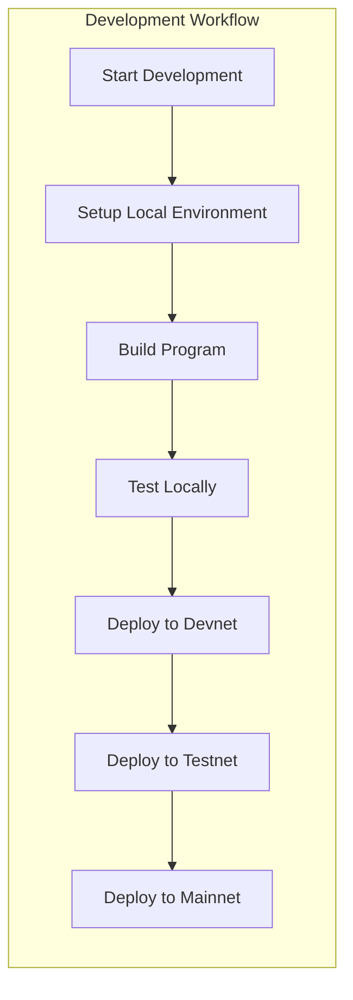

# Examples

This document provides comprehensive usage examples and command patterns for OSVM CLI across different workflows and use cases.

## Overview

OSVM CLI examples are organized by category to help users quickly find relevant command patterns for their specific needs. Examples range from basic operations to complex deployment workflows.

## Quick Reference

```bash
# Show all available examples
osvm examples

# Show examples by category
osvm examples --category basic

# List all categories
osvm examples --list-categories
```

## Example Categories

### Basic Operations

Fundamental OSVM CLI operations for getting started.

#### Version and Help

```bash
# Show version information
osvm version
osvm --version
osvm v

# Show help for main command
osvm --help

# Show help for specific subcommand
osvm svm --help
osvm deploy-validator --help
```

#### Configuration

```bash
# Set global configuration
osvm config set --network mainnet
osvm config set --keypair ~/.config/solana/id.json

# Show current configuration
osvm config show

# Use custom configuration file
osvm --config ~/.osvm/custom.yaml svm list
```

### SVM Management Examples

Examples for managing Solana Virtual Machines.

#### SVM Installation and Management

```bash
# List all installed SVMs
osvm svm list

# Install latest stable SVM
osvm svm install --version 1.18.0

# Install specific client type
osvm svm install --version 1.18.0 --client-type jito
osvm svm install --version 1.18.0 --client-type agave

# Install experimental clients
osvm svm install --version latest --client-type firedancer
osvm svm install --version latest --client-type sig

# Get detailed SVM information
osvm svm get 1.18.0

# Launch SVM monitoring dashboard
osvm svm dashboard
```

#### SVM Switching and Version Management

```bash
# Switch between SVM versions
osvm use 1.17.0
osvm use 1.18.0

# Remove old SVM version
osvm svm remove 1.16.0

# Update SVM to latest version
osvm svm update --version 1.18.0

# Force reinstall SVM
osvm svm install --version 1.18.0 --force
```

### Node Management Examples

Examples for deploying and managing validator and RPC nodes.

#### Basic Node Operations

```bash
# List all managed nodes
osvm node list

# Filter nodes by status
osvm node list --status running
osvm node list --status stopped

# Get detailed node status
osvm node status validator-001

# Launch node monitoring dashboard
osvm node dashboard
```

#### Node Deployment Patterns

```bash
# Deploy basic validator
osvm deploy-validator \
  --host validator@example.com \
  --keypair identity.json \
  --vote-keypair vote.json

# Deploy validator with disk optimization
osvm deploy-validator \
  --host validator@example.com \
  --keypair identity.json \
  --vote-keypair vote.json \
  --ledger-disk /dev/nvme0n1 \
  --accounts-disk /dev/nvme1n1

# Deploy RPC node
osvm deploy-rpc \
  --host rpc@example.com \
  --network mainnet \
  --enable-private-rpc
```

### RPC Manager Examples

Examples for different RPC node types and configurations.

#### Sonic RPC Deployment

```bash
# Deploy single Sonic RPC instance
osvm rpc-manager sonic \
  --host rpc@example.com \
  --network mainnet

# Deploy Sonic RPC cluster
osvm rpc-manager sonic \
  --host rpc@example.com \
  --network mainnet \
  --replicas 3 \
  --monitoring

# Deploy with custom configuration
osvm rpc-manager sonic \
  --host rpc@example.com \
  --network mainnet \
  --config sonic-config.yaml
```

#### Local Development RPC

```bash
# Start local test validator
osvm rpc-manager test

# Start with custom settings
osvm rpc-manager test \
  --faucet-sol 1000 \
  --reset

# Start local RPC server
osvm rpc-manager local \
  --port 8899 \
  --websocket-port 8900
```

#### Network Query Examples

```bash
# Query network information
osvm rpc-manager query-solana --network mainnet

# Continuous monitoring
osvm rpc-manager query-solana \
  --network mainnet \
  --continuous

# Save query results
osvm rpc-manager query-solana \
  --network mainnet \
  --save-to network-info.json
```

### SSH Deployment Examples

Examples for remote deployment scenarios.

#### Basic Remote Deployment

```bash
# Deploy validator to remote host
osvm deploy-validator \
  --host solana@validator.example.com \
  --keypair identity.json \
  --vote-keypair vote.json \
  --network mainnet

# Deploy with SSH key authentication
osvm deploy-validator \
  --host solana@validator.example.com \
  --keypair identity.json \
  --ssh-key ~/.ssh/validator_key
```

#### Advanced Remote Deployment

```bash
# Deploy with full optimization
osvm deploy-validator \
  --host solana@validator.example.com \
  --keypair identity.json \
  --vote-keypair vote.json \
  --ledger-disk /dev/nvme0n1 \
  --accounts-disk /dev/nvme1n1 \
  --enable-rpc \
  --monitoring \
  --optimize-system

# Deploy with hot-swap capability
osvm deploy-validator \
  --host solana@validator.example.com \
  --keypair identity.json \
  --vote-keypair vote.json \
  --hot-swap-keypair backup-identity.json \
  --enable-hot-swap
```

#### Multi-host Deployment

```bash
# Deploy to multiple validators
for host in validator1 validator2 validator3; do
  osvm deploy-validator \
    --host solana@${host}.example.com \
    --keypair identity-${host}.json \
    --vote-keypair vote-${host}.json \
    --network mainnet
done

# Deploy RPC cluster
osvm deploy-rpc \
  --hosts rpc1.example.com,rpc2.example.com,rpc3.example.com \
  --network mainnet \
  --load-balance
```

### eBPF Program Deployment Examples

Examples for deploying and managing Solana programs.

#### Basic Program Deployment

```bash
# Deploy new program to devnet
osvm deploy-program \
  --program target/deploy/myprogram.so \
  --keypair ~/.config/solana/id.json \
  --network devnet

# Deploy to mainnet
osvm deploy-program \
  --program target/deploy/myprogram.so \
  --keypair ~/.config/solana/id.json \
  --network mainnet
```

#### Program Upgrades

```bash
# Upgrade existing program
osvm deploy-program \
  --program target/deploy/myprogram_v2.so \
  --keypair ~/.config/solana/id.json \
  --upgrade \
  --network mainnet

# Upgrade with backup
osvm deploy-program \
  --program target/deploy/myprogram_v2.so \
  --keypair ~/.config/solana/id.json \
  --upgrade \
  --backup \
  --network mainnet
```

#### Large Program Deployment

```bash
# Deploy large program using buffer
osvm deploy-program \
  --program target/deploy/large_program.so \
  --keypair ~/.config/solana/id.json \
  --use-buffer \
  --buffer-keypair buffer.json \
  --network mainnet

# Deploy with custom chunk size
osvm deploy-program \
  --program target/deploy/large_program.so \
  --keypair ~/.config/solana/id.json \
  --use-buffer \
  --chunk-size 800 \
  --network mainnet
```

#### Remote Program Deployment

```bash
# Deploy via remote host
osvm deploy-program \
  --host deployer@example.com \
  --program target/deploy/myprogram.so \
  --keypair ~/.config/solana/id.json \
  --network mainnet

# Deploy to multiple networks via remote
osvm deploy-program \
  --host deployer@example.com \
  --program target/deploy/myprogram.so \
  --keypair ~/.config/solana/id.json \
  --networks devnet,testnet,mainnet
```

### Monitoring and Dashboard Examples

Examples for monitoring and visualization.

#### Dashboard Usage

```bash
# Launch comprehensive dashboard
osvm dashboard --all

# Launch with custom refresh rate
osvm dashboard --refresh 5

# Launch specific dashboard type
osvm svm dashboard
osvm node dashboard

# Launch with filtering
osvm node dashboard --filter "status=running"
```

#### Metrics and Monitoring

```bash
# Export metrics to file
osvm metrics export --format json --output metrics.json

# Monitor specific node
osvm monitor --node validator-001 --follow

# Setup monitoring alerts
osvm alerts configure \
  --node validator-001 \
  --cpu-threshold 80 \
  --memory-threshold 90
```

### Self-Repair and Maintenance Examples

Examples for automated maintenance and repair.

#### Health Checks and Diagnostics

```bash
# Run comprehensive health check
osvm doctor

# Run with auto-repair enabled
osvm doctor --auto-repair

# Detailed diagnostic report
osvm doctor --detailed --verbose

# Check specific component
osvm doctor --component rust-toolchain
```

#### Log Monitoring

```bash
# Monitor validator logs with auto-repair
osvm monitor-logs validator.log --auto-repair

# Follow logs in real-time
osvm monitor-logs --follow validator.log

# Monitor with custom patterns
osvm monitor-logs validator.log \
  --patterns custom-patterns.yaml
```

#### System Repair

```bash
# Manual repair for specific issue
osvm repair \
  --issue dependency-missing \
  --component rust-toolchain

# Emergency recovery mode
osvm emergency-recovery

# System optimization
osvm optimize-system --profile production
```

### Workflow Examples

Complete workflow examples for common scenarios.

#### Development Workflow



```bash
# 1. Setup local development environment
osvm rpc-manager test --reset
osvm config set --url http://localhost:8899

# 2. Build and test program
cargo build-bpf
osvm deploy-program \
  --program target/deploy/myprogram.so \
  --keypair ~/.config/solana/id.json

# 3. Deploy to devnet for testing
osvm config set --url https://api.devnet.solana.com
osvm deploy-program \
  --program target/deploy/myprogram.so \
  --keypair ~/.config/solana/id.json \
  --network devnet

# 4. Deploy to testnet for staging
osvm config set --url https://api.testnet.solana.com
osvm deploy-program \
  --program target/deploy/myprogram.so \
  --keypair ~/.config/solana/id.json \
  --network testnet

# 5. Deploy to mainnet for production
osvm config set --url https://api.mainnet-beta.solana.com
osvm deploy-program \
  --program target/deploy/myprogram.so \
  --keypair ~/.config/solana/id.json \
  --network mainnet \
  --backup
```

#### Validator Setup Workflow

```bash
# 1. Setup validator infrastructure
osvm deploy-validator \
  --host validator@example.com \
  --keypair identity.json \
  --vote-keypair vote.json \
  --ledger-disk /dev/nvme0n1 \
  --accounts-disk /dev/nvme1n1 \
  --network mainnet \
  --monitoring

# 2. Configure hot-swap capability
osvm configure-hotswap \
  --node validator-001 \
  --primary-keypair identity.json \
  --backup-keypair backup-identity.json

# 3. Setup monitoring and alerts
osvm deploy-monitoring \
  --node validator-001 \
  --enable-grafana \
  --enable-influxdb

# 4. Enable auto-repair
osvm doctor --enable-monitoring --node validator-001
osvm monitor-logs /var/log/solana-validator.log --auto-repair

# 5. Verify setup
osvm node status validator-001
osvm hotswap status --node validator-001
```

#### RPC Infrastructure Workflow

```bash
# 1. Deploy RPC cluster
osvm rpc-manager sonic \
  --host rpc@example.com \
  --network mainnet \
  --replicas 3 \
  --load-balance

# 2. Setup monitoring
osvm deploy-monitoring \
  --service rpc-cluster \
  --enable-grafana

# 3. Configure load balancer
osvm configure-lb \
  --service rpc-cluster \
  --algorithm round-robin \
  --health-checks

# 4. Test RPC endpoints
osvm test-rpc --url http://rpc.example.com:8899
osvm benchmark-rpc --url http://rpc.example.com:8899

# 5. Setup alerts
osvm alerts configure \
  --service rpc-cluster \
  --response-time-threshold 1000ms \
  --error-rate-threshold 1%
```

### AI Integration Examples

Examples for leveraging AI-powered analysis and assistance.

#### AI Configuration

```bash
# Configure OpenAI endpoint
export OPENAI_URL="https://api.openai.com/v1/chat/completions"
export OPENAI_KEY="sk-your-api-key-here"

# Configure local Ollama endpoint
export OPENAI_URL="http://localhost:11434/v1/chat/completions"
export OPENAI_KEY="ollama"

# Verify AI configuration
osvm chat --test

# Expected output:
# ✅ AI endpoint configured
# ✅ Connection successful
# Model: gpt-4 / llama2
```

#### Natural Language Queries

```bash
# Ask about network status
osvm "What is the current slot height on mainnet?"

# Analyze transaction
osvm "Analyze transaction 5J8sFH3kGxNy2Bbv7vPo8hKqM9dRT4yL5KzPr6DqM2Wx"

# Get optimization advice
osvm "How can I optimize my validator for better performance?"

# Query account information
osvm "Show me the balance and history of account DezXAZ..."

# Get deployment guidance
osvm "What are the best practices for deploying to mainnet?"
```

#### Interactive AI Chat

```bash
# Start interactive chat session
osvm chat

# Chat interface:
# You: What's the difference between devnet and mainnet?
# AI: Devnet is Solana's development network where...
# 
# You: How do I deploy a program?
# AI: To deploy a Solana program, follow these steps...
# 
# You: exit

# Advanced chat mode with code execution
osvm chat --advanced

# Test mode for debugging
osvm chat --test
```

#### AI-Powered Security Audit

```bash
# Basic security audit
osvm audit ./my-program

# Expected output:
# 🔍 DeepLogic AI Security Audit
# ==============================
# Target: ./my-program
# 
# 🔴 HIGH SEVERITY (2 issues):
#   [H1] Missing signer validation
#        File: src/lib.rs:45
#        Code: let user = &ctx.accounts.user;
#        Fix: Add: require!(user.is_signer, ErrorCode::Unauthorized);
# 
#   [H2] Integer overflow risk
#        File: src/lib.rs:78
#        Code: balance += amount;
#        Fix: Use checked_add(): balance.checked_add(amount)?
# 
# 🟡 MEDIUM SEVERITY (5 issues):
#   [M1] Reentrancy vulnerability
#   [M2] Unvalidated account owner
#   ...
# 
# 📊 Summary:
#   Total Issues: 12
#   Risk Score: 7.5/10
#   Confidence: 95%

# Audit with specific severity filter
osvm audit ./my-program --severity high

# Audit specific file
osvm audit ./my-program/src/lib.rs

# Export audit report
osvm audit ./my-program --output audit-report.json

# Continuous audit mode
osvm audit ./my-program --watch
```

#### AI Code Analysis

```bash
# Analyze code quality
osvm "Analyze the code quality of my Anchor program at ./src/lib.rs"

# Get refactoring suggestions
osvm "Suggest improvements for my program's security"

# Explain complex code
osvm "Explain what this program does" --file ./program.rs

# Generate documentation
osvm "Generate documentation for my program" --file ./src/lib.rs
```

### MCP Server Integration Examples

Examples for Model Context Protocol server integration with hardware isolation.

#### MCP Server Management

```bash
# List available MCP servers
osvm mcp list

# Expected output:
# Available MCP Servers:
# ✅ github-mcp-server (Running, Port: 3000)
# ⏸️  filesystem-server (Stopped)
# ✅ database-server (Running, Port: 3001)
# ⏸️  solana-tools-server (Stopped)

# Start MCP server (hardware-isolated)
osvm mcp start filesystem-server

# Expected output:
# 🚀 Starting MCP server: filesystem-server
# 🔒 Mode: Unikernel (50KB footprint)
# ⚡ Boot time: 47ms
# ✅ Status: Running
# 🔐 Isolation: Hardware-enforced (VT-x)
# 📡 Communication: vsock (0.3ms latency)

# Stop MCP server
osvm mcp stop filesystem-server

# Restart MCP server
osvm mcp restart github-mcp-server

# Check MCP server status
osvm mcp status github-mcp-server
```

#### MCP Tool Discovery

```bash
# List all tools from a server
osvm mcp tools github-mcp-server

# Expected output:
# Available Tools (github-mcp-server):
# 
# Repository Operations:
#   - search_repositories: Search GitHub repositories
#   - get_file_contents: Read file from repository
#   - list_commits: List commits in repository
#   - create_issue: Create new issue
# 
# Code Analysis:
#   - search_code: Search for code across GitHub
#   - get_pull_request: Get PR details
#   - list_branches: List repository branches
# 
# Total: 15 tools available

# List tools with detailed descriptions
osvm mcp tools github-mcp-server --detailed

# Search for specific tool
osvm mcp tools github-mcp-server --search "search"
```

#### MCP Tool Execution

```bash
# Call MCP tool with parameters
osvm mcp call github-mcp-server search_repositories \
  --query "solana smart contracts" \
  --language rust \
  --sort stars

# Expected output:
# 🔍 Calling tool: search_repositories
# Server: github-mcp-server
# 
# Results:
# 1. solana-labs/solana-program-library
#    ⭐ 2,145 stars | 🍴 1,089 forks
#    Description: Collection of Solana program examples
# 
# 2. coral-xyz/anchor
#    ⭐ 1,876 stars | 🍴 987 forks
#    Description: Framework for Solana programs
# 
# [... more results ...]

# Get file contents from GitHub
osvm mcp call github-mcp-server get_file_contents \
  --owner solana-labs \
  --repo solana-program-library \
  --path token/program/src/lib.rs

# Create GitHub issue
osvm mcp call github-mcp-server create_issue \
  --owner myorg \
  --repo myproject \
  --title "Bug: Transaction fails" \
  --body "Description of the issue..."

# Complex tool call with JSON parameters
osvm mcp call database-server query \
  --params '{"sql": "SELECT * FROM accounts WHERE balance > 1000", "limit": 100}'
```

#### MCP Server Configuration

```bash
# Configure new MCP server
osvm mcp configure my-custom-server \
  --command "node server.js" \
  --port 3002 \
  --isolation unikernel

# Deploy MCP server with monitoring
osvm mcp deploy weather-api-server \
  --command "python weather_server.py" \
  --monitoring \
  --auto-restart

# Update MCP server configuration
osvm mcp update github-mcp-server \
  --memory 512MB \
  --cpu 2

# Remove MCP server
osvm mcp remove old-server
```

### OVSM Research Query Examples

Examples for using the OVSM (Open Versatile Seeker Mind) research language.

#### Basic OVSM Queries

```bash
# Execute OVSM query for transaction analysis
osvm ovsm execute --query "What is the average transaction fee?"

# Expected output:
# 🔬 OVSM Research Query
# Query: "What is the average transaction fee?"
# 
# [TIME: ~45s] [COST: ~0.002 SOL] [CONFIDENCE: 85%]
# 
# **Execution Plan:**
# 1. Collecting last 100 blocks
# 2. Extracting all transactions
# 3. Filtering for standard transfers
# 4. Computing statistical metrics
# 
# **Results:**
# Average Fee: 0.000005 SOL (5,000 lamports)
# 
# Detailed Statistics:
# - Mean: 0.000005 SOL
# - Median: 0.000005 SOL
# - 95th percentile: 0.000008 SOL
# - Std deviation: 0.000002 SOL
# - Sample size: 10,234 transactions
# - Timeframe: Last 100 blocks
# 
# **Confidence Assessment:**
# - Data quality: High (100% successful parses)
# - Sample size: Adequate (>10,000 samples)
# - Confidence: 85%

# Analyze account activity
osvm ovsm execute --query "Show transaction history for DezXAZ..."

# Query validator performance
osvm ovsm execute --query "Compare validator performance across last epoch"

# Network congestion analysis
osvm ovsm execute --query "Is the network congested right now?"
```

#### Advanced OVSM Queries

```bash
# MEV opportunity detection
osvm ovsm execute --query "Find arbitrage opportunities in DEX swaps"

# Expected output:
# 🔬 OVSM Research Query
# Query: "Find arbitrage opportunities in DEX swaps"
# 
# [TIME: ~120s] [COST: ~0.005 SOL] [CONFIDENCE: 78%]
# 
# **Analysis:**
# Found 23 potential arbitrage opportunities in last 50 blocks
# 
# Top Opportunities:
# 1. SOL/USDC arbitrage (Orca → Raydium)
#    Potential profit: 0.15 SOL (~$15)
#    Price difference: 0.3%
#    Block: 245,123,456
# 
# 2. mSOL/SOL arbitrage (Marinade → Jupiter)
#    Potential profit: 0.08 SOL (~$8)
#    Price difference: 0.18%
#    Block: 245,123,458
# 
# [... more opportunities ...]

# Whale activity tracking
osvm ovsm execute --query "Track wallets moving more than 1000 SOL in last hour"

# Smart money analysis
osvm ovsm execute --query "Identify profitable trader patterns"

# Token launch detection
osvm ovsm execute --query "Detect new token launches with high volume"
```

#### OVSM Script Execution

```bash
# Execute OVSM script from file
osvm ovsm execute --file analyze_fees.ovsm

# Example OVSM script (analyze_fees.ovsm):
# ## Q: "Analyze transaction fees across different networks"
# 
# **Main Branch:**
# $mainnet_fees = analyzeNetwork(network: "mainnet")
# $devnet_fees = analyzeNetwork(network: "devnet")
# $testnet_fees = analyzeNetwork(network: "testnet")
# 
# **Action:**
# RETURN {
#   mainnet: $mainnet_fees,
#   devnet: $devnet_fees,
#   testnet: $testnet_fees,
#   comparison: compareNetworks($mainnet_fees, $devnet_fees, $testnet_fees)
# }

# Execute with parameters
osvm ovsm execute --file analyze_account.ovsm \
  --params '{"account": "DezXAZ...", "depth": 10}'

# Validate OVSM script
osvm ovsm validate --file my_query.ovsm

# List available OVSM tools
osvm ovsm tools --list
```

#### OVSM Interactive Mode

```bash
# Start OVSM interactive shell
osvm ovsm shell

# Interactive shell:
# ovsm> $slot = getSlot()
# ovsm> $block = getBlock(slot: $slot)
# ovsm> $txs = $block.transactions
# ovsm> PRINT("Block has " + COUNT($txs) + " transactions")
# Block has 1234 transactions
# 
# ovsm> exit

# Execute OVSM with custom tools
osvm ovsm execute \
  --query "Custom analysis" \
  --custom-tools ./my_tools.yaml
```

### Snapshot Analysis Examples

Examples for analyzing Solana account snapshots.

#### Snapshot Export

```bash
# Export snapshot to JSON
osvm snapshot export \
  --snapshot-dir /path/to/snapshot \
  --output accounts.json \
  --format json

# Expected output:
# 📦 Exporting snapshot...
# 🔍 Scanning snapshot directory
# 📊 Found 1,234,567 account files
# ⚙️  Processing accounts (parallel)...
# [████████████████████] 100% (1,234,567/1,234,567)
# 
# ✅ Export complete!
# 📄 Output file: accounts.json
# 💾 File size: 245 MB
# ⏱️  Processing time: 12.3s
# 📊 Accounts exported: 1,234,567

# Export to CSV format
osvm snapshot export \
  --snapshot-dir /path/to/snapshot \
  --output accounts.csv \
  --format csv

# Export with filters
osvm snapshot export \
  --snapshot-dir /path/to/snapshot \
  --output token_accounts.json \
  --filter-owner TokenkegQfeZyiNwAJbNbGKPFXCWuBvf9Ss623VQ5DA

# Export high-value accounts only
osvm snapshot export \
  --snapshot-dir /path/to/snapshot \
  --output whales.json \
  --filter-min-balance 1000
```

#### Snapshot Statistics

```bash
# Compute snapshot statistics
osvm snapshot stats --snapshot-dir /path/to/snapshot

# Expected output:
# 📊 Snapshot Statistics
# =====================
# 
# Overview:
# - Total accounts: 1,234,567
# - Total lamports: 567,890,123,456,789
# - Total SOL: 567,890,123.456789
# 
# Account Distribution:
# - Zero balance: 123,456 (10%)
# - Non-zero balance: 1,111,111 (90%)
# - High value (>1000 SOL): 4,567 (0.37%)
# 
# By Owner Program:
# - System Program: 456,789 accounts
# - Token Program: 345,678 accounts
# - Stake Program: 123,456 accounts
# - Vote Program: 2,345 accounts
# - Other: 306,299 accounts
# 
# Data Size:
# - Total data size: 45.6 GB
# - Average per account: 38.4 KB
# - Largest account: 10 MB
# 
# Top Programs by Account Count:
# 1. 11111111111111111111111111111111: 456,789 accounts
# 2. TokenkegQfeZyiNwAJbNbGKPFXCWuBvf9Ss623VQ5DA: 345,678 accounts
# 3. Stake11111111111111111111111111111111111111: 123,456 accounts

# Statistics with detailed analysis
osvm snapshot stats \
  --snapshot-dir /path/to/snapshot \
  --detailed

# Export statistics to file
osvm snapshot stats \
  --snapshot-dir /path/to/snapshot \
  --output stats.json
```

#### Whale Hunting

```bash
# Find high-value accounts
osvm snapshot read \
  --snapshot-dir /path/to/snapshot \
  --filter-min-balance 1000 \
  --limit 100

# Expected output:
# 🐋 Top 100 Accounts by Balance
# ==============================
# 
# 1. 7xKxY...abc123
#    Balance: 1,234,567.890123 SOL
#    Owner: System Program
#    Data: 0 bytes
# 
# 2. 9zXpL...def456
#    Balance: 987,654.321098 SOL
#    Owner: Stake Program
#    Data: 200 bytes
# 
# 3. 5mNqR...ghi789
#    Balance: 765,432.109876 SOL
#    Owner: Vote Program
#    Data: 3731 bytes
# 
# [... more accounts ...]
# 
# Summary:
# - Total accounts: 100
# - Total balance: 45,678,901.234567 SOL
# - Average balance: 456,789.012345 SOL

# Find whales with data (smart contracts)
osvm snapshot read \
  --filter-min-balance 1000 \
  --filter-min-size 100

# Find token whales
osvm snapshot read \
  --filter-owner TokenkegQfeZyiNwAJbNbGKPFXCWuBvf9Ss623VQ5DA \
  --filter-min-balance 1000
```

#### Account Search

```bash
# Find specific account
osvm snapshot find \
  DezXAZ... \
  --snapshot-dir /path/to/snapshot

# Expected output:
# 🔍 Account Found
# ===============
# 
# Pubkey: DezXAZ...abc123
# Balance: 123.456789 SOL
# Owner: TokenkegQfeZyiNwAJbNbGKPFXCWuBvf9Ss623VQ5DA
# Data size: 165 bytes
# Executable: false
# Rent epoch: 325
# 
# Token Account Data (decoded):
# - Mint: EPjFWdd5AufqSSqeM2qN1xzybapC8G4wEGGkZwyTDt1v
# - Owner: 7xKxY...def456
# - Amount: 1,234.567890 tokens
# - Delegate: None
# - State: Initialized

# Search by owner
osvm snapshot read \
  --filter-owner TokenkegQfeZyiNwAJbNbGKPFXCWuBvf9Ss623VQ5DA \
  --limit 100

# Search by data size
osvm snapshot read \
  --filter-min-size 1000000 \
  --limit 50
```

#### Snapshot Comparison

```bash
# Compare two snapshots
osvm snapshot compare \
  /path/to/snapshot1 \
  /path/to/snapshot2

# Expected output:
# 📊 Snapshot Comparison
# =====================
# 
# Snapshot 1: /path/to/snapshot1 (Block 245,123,000)
# Snapshot 2: /path/to/snapshot2 (Block 245,456,000)
# Blocks apart: 333,000 (~1.5 days)
# 
# Account Changes:
# - New accounts: 12,345 (+1.0%)
# - Deleted accounts: 8,901 (-0.72%)
# - Modified accounts: 456,789 (37%)
# - Unchanged accounts: 767,532 (62.2%)
# 
# Balance Changes:
# - Total lamports change: +123,456,789,000 (+0.022%)
# - Accounts with increased balance: 234,567
# - Accounts with decreased balance: 222,222
# 
# Top Growing Accounts:
# 1. 7xKxY...abc123: +10,000 SOL
# 2. 9zXpL...def456: +8,500 SOL
# 3. 5mNqR...ghi789: +7,200 SOL
# 
# Top Shrinking Accounts:
# 1. 2aB3c...xyz789: -15,000 SOL
# 2. 4dE5f...uvw456: -12,000 SOL

# Compare with JSON output
osvm snapshot compare \
  /path/to/snapshot1 \
  /path/to/snapshot2 \
  --json > comparison.json
```

#### Snapshot Validation

```bash
# Validate snapshot integrity
osvm snapshot validate --snapshot-dir /path/to/snapshot
```

### CI/CD Integration Examples

Examples for continuous integration and deployment.

#### GitHub Actions

```yaml
name: OSVM Deploy
on:
  push:
    branches: [main]

jobs:
  deploy:
    runs-on: ubuntu-latest
    steps:
    - uses: actions/checkout@v2
    
    - name: Setup OSVM CLI
      run: |
        curl -sSfL https://install.osvm.dev | sh
        echo "$HOME/.osvm/bin" >> $GITHUB_PATH
    
    - name: Build Program
      run: cargo build-bpf
    
    - name: Deploy to Devnet
      run: |
        osvm deploy-program \
          --program target/deploy/program.so \
          --keypair ${{ secrets.DEPLOY_KEYPAIR }} \
          --network devnet
    
    - name: Run Health Check
      run: osvm doctor --auto-repair
```

#### GitLab CI

```yaml
stages:
  - build
  - test
  - deploy

variables:
  OSVM_CONFIG: ".osvm/config.yaml"

build:
  stage: build
  script:
    - cargo build-bpf
  artifacts:
    paths:
      - target/deploy/

deploy_devnet:
  stage: deploy
  script:
    - osvm deploy-program --program target/deploy/program.so --network devnet
  only:
    - develop

deploy_mainnet:
  stage: deploy
  script:
    - osvm deploy-program --program target/deploy/program.so --network mainnet --backup
  only:
    - main
```

### Troubleshooting Examples

Common troubleshooting scenarios and solutions.

#### Connection Issues

```bash
# Test network connectivity
osvm test-network --network mainnet

# Check RPC endpoint health
curl -X POST -H "Content-Type: application/json" \
  -d '{"jsonrpc":"2.0","id":1,"method":"getHealth"}' \
  https://api.mainnet-beta.solana.com

# Test SSH connectivity
ssh -v solana@validator.example.com

# Check firewall settings
osvm check-firewall --node validator-001
```

#### Performance Issues

```bash
# Run performance diagnostics
osvm benchmark --node validator-001

# Check resource usage
osvm monitor-resources --node validator-001

# Analyze performance metrics
osvm performance-report --node validator-001 --period 24h

# Optimize system settings
osvm optimize-system --node validator-001 --profile production
```

#### Service Issues

```bash
# Check service status
osvm service-status --node validator-001

# Restart services
osvm service-restart --node validator-001 --service solana-validator

# Check logs for errors
osvm logs --node validator-001 --level error --tail 100

# Run system health check
osvm doctor --node validator-001 --detailed
```

## Best Practices Examples

### Security Best Practices

```bash
# Use dedicated keypairs for different environments
osvm keygen --output devnet-keypair.json
osvm keygen --output testnet-keypair.json
osvm keygen --output mainnet-keypair.json

# Setup secure SSH access
ssh-keygen -t ed25519 -f ~/.ssh/validator_key
ssh-copy-id -i ~/.ssh/validator_key.pub solana@validator.example.com

# Configure firewall
osvm configure-firewall --node validator-001 --profile secure

# Enable monitoring and alerting
osvm alerts configure --security-alerts
```

### Performance Best Practices

```bash
# Optimize system for validator workload
osvm optimize-system --profile validator-production

# Configure appropriate disk layout
osvm configure-disks \
  --ledger-disk /dev/nvme0n1 \
  --accounts-disk /dev/nvme1n1 \
  --optimize-mounts

# Setup performance monitoring
osvm deploy-monitoring --performance-focused

# Regular performance health checks
osvm performance-check --schedule daily
```

### Maintenance Best Practices

```bash
# Setup automated backups
osvm backup schedule \
  --frequency daily \
  --retention 30d \
  --verify-backups

# Enable auto-repair for common issues
osvm doctor --enable-auto-repair --safe-mode

# Setup log rotation
osvm configure-logging \
  --max-size 100MB \
  --max-files 10 \
  --compress

# Regular system updates
osvm system-update --schedule weekly --maintenance-window "02:00-04:00"
```

## Related Documentation

- [SVM Management](svm-management.md) - SVM management details
- [Node Management](node-management.md) - Node management features
- [SSH Deployment](ssh-deployment.md) - Remote deployment guide
- [RPC Manager](rpc-manager.md) - RPC node management
- [Configuration](configuration.md) - Configuration options