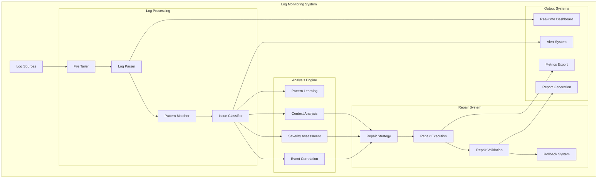
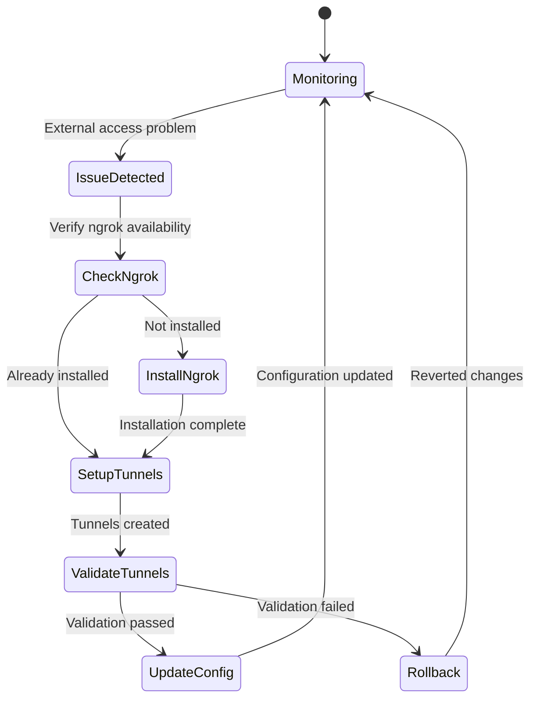
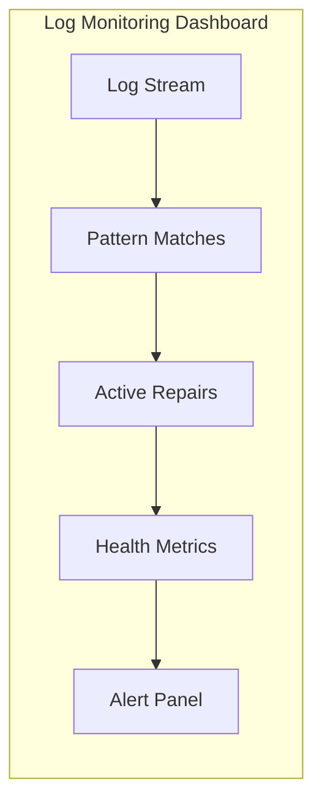

# Log Monitoring

The Log Monitoring system provides real-time log analysis, pattern detection, and automated repair capabilities for OSVM CLI managed infrastructure.

## Overview

OSVM CLI includes an intelligent log monitoring system that continuously analyzes log files, detects issues through pattern matching, and automatically applies fixes with comprehensive safety mechanisms.

## Quick Start

```bash
# Monitor validator logs with auto-repair
osvm monitor-logs validator.log --auto-repair

# Follow logs in real-time
osvm monitor-logs --follow validator.log

# Monitor with custom repair configuration
osvm monitor-logs validator.log --config repair-config.yaml

# Show recent devnet logs
osvm logs --devnet --lines 100
```

## Architecture



## Log Sources

### Validator Logs

Monitoring of Solana validator log files for performance and error detection.

**Log File Locations:**
- `agave-validator-*.log` - Main validator logs
- `solana-validator.log` - Standard validator logs
- `validator-*.log` - Custom validator logs

**Key Patterns Monitored:**
- Performance warnings
- Network connectivity issues
- Disk I/O problems
- Memory constraints
- Consensus failures

### RPC Node Logs

Specialized monitoring for RPC node operations and client interactions.

**Monitored Patterns:**
- Request rate limiting
- API endpoint errors
- Database connection issues
- Cache performance
- Client timeout problems

### System Logs

Integration with system-level logging for comprehensive monitoring.

**System Log Sources:**
- `journalctl` - Systemd service logs
- `/var/log/syslog` - System messages
- `/var/log/auth.log` - Authentication logs
- Application-specific logs

## Pattern Detection Engine

### Intelligent Pattern Matching

Advanced regular expression and machine learning based pattern detection.

```mermaid
sequenceDiagram
    participant LOG as Log Entry
    participant PARSER as Log Parser
    participant PATTERN as Pattern Engine
    participant ML as ML Classifier
    participant ACTION as Action Engine
    
    LOG->>PARSER: New log line
    PARSER->>PATTERN: Extract structured data
    PATTERN->>ML: Apply pattern matching
    ML->>ACTION: Classify issue type
    ACTION->>LOG: Determine repair action
    
    Note over PATTERN,ML: Pattern Learning
    ML->>ML: Update pattern weights
    ML->>PATTERN: Refine matching rules
    
    classDef techDebt fill:#f6f6f6,stroke:#d9534f,color:#d9534f,font-family:Consolas,monospace,font-weight:bold
```

### Supported Issue Types

**System Tuning Issues:**
- Network parameter problems
- File descriptor limits
- Memory allocation issues
- Disk I/O optimization needs

**Connectivity Problems:**
- RPC endpoint failures
- Peer connection issues
- Network timeout problems
- Port binding conflicts

**Performance Degradation:**
- Slow transaction processing
- High CPU utilization
- Memory leaks
- Disk space issues

**Service Failures:**
- Process crashes
- Service startup failures
- Configuration errors
- Dependency issues

## Auto-Repair Capabilities

### System-Level Repairs

Automatic fixes for system configuration and tuning issues.

**Network Tuning:**
```bash
# Detected: "OS network limits test failed"
# Auto-repair action:
echo 'net.core.rmem_default = 134217728' >> /etc/sysctl.conf
sysctl -p
```

**File Descriptor Limits:**
```bash
# Detected: "Too many open files"
# Auto-repair action:
echo '* soft nofile 1000000' >> /etc/security/limits.conf
echo '* hard nofile 1000000' >> /etc/security/limits.conf
```

**Memory Optimization:**
```bash
# Detected: "Memory pressure detected"
# Auto-repair action:
echo 'vm.swappiness = 1' >> /etc/sysctl.conf
sysctl vm.swappiness=1
```

### Service Management

Automatic service restart and recovery procedures.

**Service Restart:**
```bash
# Detected: "Service stopped unexpectedly"
# Auto-repair action:
systemctl restart solana-validator
systemctl status solana-validator
```

**Configuration Reload:**
```bash
# Detected: "Configuration mismatch"
# Auto-repair action:
systemctl reload solana-validator
```

### External Accessibility

Automatic setup of external access using ngrok tunnels.



**Ngrok Integration:**
```bash
# Detected: "RPC endpoint not externally accessible"
# Auto-repair action:
1. Install ngrok if not present
2. Setup tunnel for RPC port
3. Update configuration with tunnel URL
4. Validate external connectivity
```

## Configuration

### Monitor Configuration

```yaml
log_monitor:
  # File monitoring settings
  follow_mode: true
  buffer_size: 8192
  polling_interval_ms: 100
  
  # Pattern detection
  case_sensitive: false
  multiline_support: true
  max_context_lines: 5
  
  # Auto-repair settings
  auto_repair_enabled: true
  max_repair_attempts: 3
  repair_timeout_seconds: 300
  create_backups: true
  
  # Safety settings
  require_confirmation: false
  dangerous_repairs_enabled: false
  rollback_on_failure: true
```

### Pattern Configuration

```yaml
patterns:
  network_limits:
    regex: "OS network limits test failed"
    severity: "high"
    repair_action: "tune_network_parameters"
    confirmation_required: false
    
  file_descriptors:
    regex: "Too many open files"
    severity: "critical"
    repair_action: "increase_fd_limits"
    confirmation_required: false
    
  external_access:
    regex: "RPC.*not.*accessible"
    severity: "medium"
    repair_action: "setup_ngrok_tunnel"
    confirmation_required: true
```

### Repair Actions

```yaml
repair_actions:
  tune_network_parameters:
    commands:
      - "echo 'net.core.rmem_default = 134217728' >> /etc/sysctl.conf"
      - "sysctl -p"
    validation:
      - "sysctl net.core.rmem_default"
    rollback:
      - "sed -i '/net.core.rmem_default/d' /etc/sysctl.conf"
      
  setup_ngrok_tunnel:
    commands:
      - "install_ngrok.sh"
      - "ngrok http 8899 --log=stdout"
    validation:
      - "curl -s http://tunnel-url/health"
    rollback:
      - "pkill ngrok"
```

## Real-time Monitoring

### Live Log Streaming

Continuous monitoring with real-time pattern analysis.

**Streaming Features:**
- **Live Tail:** Real-time log following
- **Pattern Highlighting:** Visual pattern matching
- **Issue Detection:** Immediate issue identification
- **Auto-Repair Triggers:** Automatic repair initiation
- **Status Updates:** Real-time repair status

### Dashboard Integration

Integration with OSVM CLI dashboard system for visual monitoring.



**Dashboard Panels:**
- **Log Stream:** Real-time log display with syntax highlighting
- **Pattern Matches:** Detected patterns and classifications
- **Repair Status:** Active and completed repair operations
- **Health Metrics:** System health indicators
- **Alert Summary:** Recent alerts and their resolution

## Advanced Features

### Machine Learning Integration

Adaptive pattern recognition that improves over time.

**Learning Components:**
- **Pattern Accuracy:** Track pattern match accuracy
- **Repair Success:** Monitor repair effectiveness
- **False Positive Reduction:** Minimize incorrect detections
- **Context Learning:** Improve contextual understanding

**Training Data:**
```yaml
learning:
  training_mode: true
  feedback_collection: true
  model_updates: weekly
  confidence_threshold: 0.8
```

### Historical Analysis

Comprehensive analysis of historical log data for trend identification.

**Analysis Features:**
- **Pattern Trends:** Track pattern frequency over time
- **Repair Effectiveness:** Analyze repair success rates
- **System Health Trends:** Monitor system health evolution
- **Predictive Analysis:** Predict potential issues

### Multi-Log Correlation

Correlation analysis across multiple log sources for comprehensive issue detection.

```mermaid
sequenceDiagram
    participant SYS as System Log
    participant VAL as Validator Log
    participant RPC as RPC Log
    participant CORR as Correlator
    participant ACTION as Action Engine
    
    SYS->>CORR: High CPU usage detected
    VAL->>CORR: Slow slot processing
    RPC->>CORR: Increased response times
    CORR->>ACTION: Correlated performance issue
    ACTION->>CORR: Initiate system optimization
    
    classDef techDebt fill:#f6f6f6,stroke:#d9534f,color:#d9534f,font-family:Consolas,monospace,font-weight:bold
```

## Safety and Security

### Repair Validation

Comprehensive validation of repair actions before and after execution.

**Pre-repair Validation:**
- System state verification
- Backup creation
- Risk assessment
- User confirmation (if required)

**Post-repair Validation:**
- Service health checks
- Performance verification
- Error rate monitoring
- Rollback triggers

### Backup and Rollback

Automatic backup creation and rollback capabilities.

**Backup Strategy:**
- Configuration file backups
- System state snapshots
- Service configurations
- Environment variables

**Rollback Procedures:**
- Automatic rollback on validation failure
- Manual rollback commands
- Partial rollback capabilities
- Emergency recovery modes

### Security Considerations

**Access Control:**
- Log file permission validation
- Repair action authorization
- User privilege verification
- Audit trail generation

**Command Injection Prevention:**
- Input sanitization
- Command validation
- Restricted command sets
- Sandboxed execution

## Performance Optimization

### Efficient Log Processing

Optimized log processing for minimal system impact.

**Processing Optimizations:**
- **Buffered Reading:** Efficient file I/O
- **Pattern Compilation:** Pre-compiled regex patterns
- **Memory Management:** Efficient memory usage
- **CPU Optimization:** Minimal CPU overhead

### Scalability Features

Support for high-volume log processing.

**Scalability Options:**
- **Multi-threading:** Parallel log processing
- **Load Balancing:** Distributed processing
- **Caching:** Pattern and result caching
- **Resource Limits:** Configurable resource usage

## Integration Options

### External Monitoring Systems

Integration with popular monitoring and alerting platforms.

**Supported Integrations:**
- **Prometheus:** Metrics export
- **Grafana:** Dashboard integration
- **ELK Stack:** Log aggregation
- **Slack/Discord:** Alert notifications

**Integration Configuration:**
```yaml
integrations:
  prometheus:
    enabled: true
    port: 9090
    metrics_path: "/metrics"
    
  slack:
    enabled: true
    webhook_url: "https://hooks.slack.com/..."
    channels: ["#alerts", "#monitoring"]
    
  grafana:
    enabled: true
    dashboard_url: "http://grafana.example.com"
    api_key: "secret-key"
```

### CI/CD Integration

Integration with continuous integration and deployment pipelines.

```yaml
# GitHub Actions example
- name: Monitor Logs
  run: |
    osvm monitor-logs --timeout 300 validator.log
    if [ $? -ne 0 ]; then
      echo "Log monitoring detected issues"
      exit 1
    fi
```

## Troubleshooting

### Common Issues

**Pattern Not Detecting:**
```bash
# Test pattern manually
osvm test-pattern "OS network limits test failed" validator.log

# Enable debug logging
RUST_LOG=debug osvm monitor-logs validator.log

# Validate pattern configuration
osvm validate-config monitor-config.yaml
```

**Repair Actions Failing:**
```bash
# Check repair action logs
osvm repair-logs --action tune_network_parameters

# Test repair action manually
osvm test-repair --action tune_network_parameters --dry-run

# Check system permissions
sudo -l
```

**Performance Issues:**
```bash
# Monitor resource usage
top -p $(pgrep osvm)

# Reduce monitoring frequency
osvm monitor-logs --interval 5000 validator.log

# Enable lightweight mode
osvm monitor-logs --lightweight validator.log
```

### Debug Commands

**Pattern Testing:**
```bash
# Test specific pattern
osvm test-pattern --pattern "network_limits" --file validator.log

# List all patterns
osvm list-patterns

# Validate pattern syntax
osvm validate-pattern "OS.*test.*failed"
```

**Repair Testing:**
```bash
# Dry run repair action
osvm test-repair --action tune_network_parameters --dry-run

# List available repair actions
osvm list-repairs

# Test repair validation
osvm test-validation --action tune_network_parameters
```

## Best Practices

### Monitoring Strategy

1. **Start Conservative**
   - Begin with pattern detection only
   - Gradually enable auto-repair for safe actions
   - Monitor repair success rates

2. **Pattern Management**
   - Regularly review and update patterns
   - Remove outdated or ineffective patterns
   - Add new patterns based on emerging issues

3. **Safety First**
   - Always create backups before repairs
   - Test repair actions in staging first
   - Monitor system stability after repairs

### Performance Considerations

1. **Resource Management**
   - Monitor log processing overhead
   - Adjust buffer sizes for performance
   - Use appropriate polling intervals

2. **Log Rotation**
   - Implement proper log rotation
   - Monitor disk space usage
   - Archive old logs appropriately

3. **Pattern Optimization**
   - Optimize regex patterns for performance
   - Use specific patterns over broad matches
   - Cache compiled patterns

## Related Documentation

- [Self-Repair System](self-repair-system.md) - Automated system repair
- [Node Management](node-management.md) - Node monitoring integration
- [Dashboard](dashboard.md) - Log monitoring dashboard
- [Configuration](configuration.md) - Log monitoring configuration