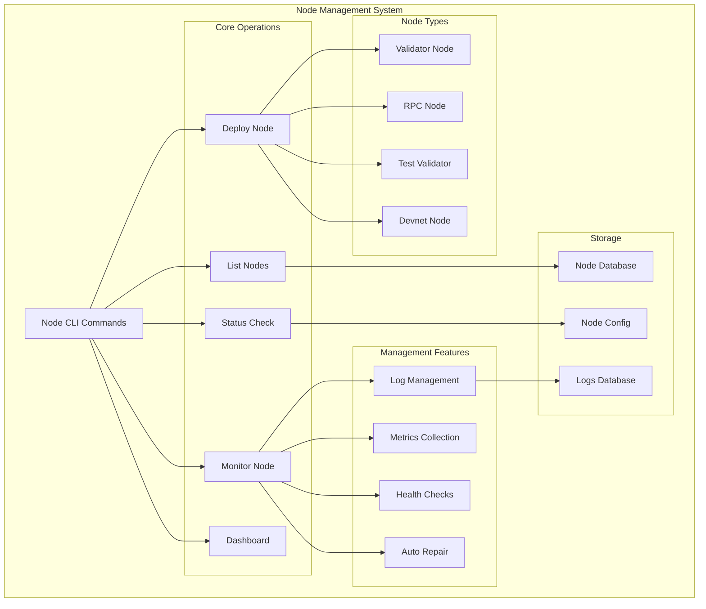
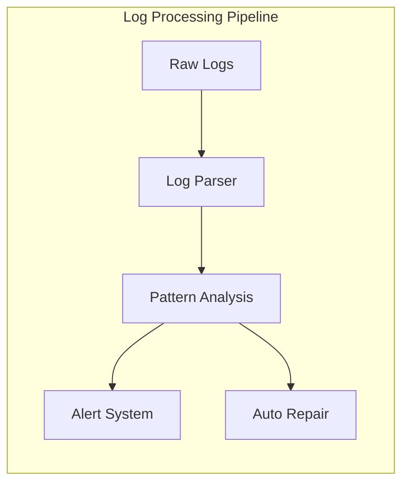
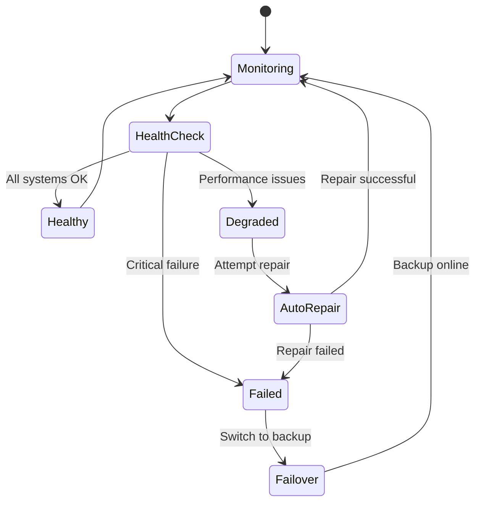

# Node Management

The Node Management module provides comprehensive tools for deploying, monitoring, and controlling Solana validator and RPC nodes across different environments.

## Overview

OSVM CLI supports deployment and management of various node types including validators, RPC nodes, and specialized configurations. It provides automated deployment, monitoring, and maintenance capabilities.

## Quick Start

```bash
# List all managed nodes
osvm node list

# Get node status
osvm node status <NODE_ID>

# Launch node monitoring dashboard
osvm node dashboard

# Deploy a new validator node
osvm deploy-validator --host <HOST> --keypair <KEYPAIR>
```

## Architecture



## Commands

### `osvm node list`

Lists all nodes managed by OSVM CLI.

```bash
osvm node list [OPTIONS]
```

**Options:**
- `--status <STATUS>` - Filter by status (running, stopped, error, unknown, all)
- `--json` - Output as JSON format

**Example Output:**
```
NODE ID          TYPE        STATUS    HOST            NETWORK
val-001         validator    running   192.168.1.100   mainnet
rpc-002         rpc         running   192.168.1.101   mainnet
test-003        test        stopped   localhost       devnet
```

### `osvm node status`

Checks the detailed status of a specific node.

```bash
osvm node status <NODE_ID> [--json]
```

**Output includes:**
- Node health status
- Resource usage (CPU, memory, disk)
- Network connectivity
- Sync status
- Error conditions
- Performance metrics

### `osvm node dashboard`

Launches an interactive terminal-based dashboard for monitoring all nodes.

```bash
osvm node dashboard
```

**Features:**
- Real-time node status
- Performance metrics visualization
- Log streaming
- Interactive controls
- Alert notifications

## Node Types

### Validator Nodes

Production Solana validators that participate in consensus.

```bash
osvm deploy-validator [OPTIONS]
```

**Key Features:**
- Stake management
- Identity keypair handling
- Performance optimization
- Automated monitoring
- Hot-swap capabilities

### RPC Nodes

Solana RPC nodes that serve client requests.

```bash
osvm deploy-rpc [OPTIONS]
```

**Key Features:**
- High availability configuration
- Load balancing support
- API endpoint management
- Request rate limiting
- Health monitoring

### Test Validators

Local development validators for testing.

**Key Features:**
- Instant startup
- Built-in faucet
- Reset capabilities
- Development tools integration

## Node Deployment Workflow

```mermaid
sequenceDiagram
    participant U as User
    participant CLI as OSVM CLI
    participant SSH as SSH Manager
    participant HOST as Target Host
    participant MON as Monitor
    
    U->>CLI: deploy-validator --host example.com
    CLI->>SSH: Establish connection
    SSH->>HOST: Connect via SSH
    HOST->>SSH: Connection established
    SSH->>HOST: Install dependencies
    HOST->>SSH: Dependencies installed
    SSH->>HOST: Deploy SVM binaries
    HOST->>SSH: Binaries deployed
    SSH->>HOST: Configure services
    HOST->>SSH: Services configured
    SSH->>HOST: Start validator
    HOST->>SSH: Validator started
    SSH->>MON: Setup monitoring
    MON->>CLI: Monitoring active
    CLI->>U: Deployment complete
    
    classDef techDebt fill:#f6f6f6,stroke:#d9534f,color:#d9534f,font-family:Consolas,monospace,font-weight:bold
```

## Monitoring Features

### Real-time Metrics

The node management system collects and displays:

- **Performance Metrics**
  - CPU usage
  - Memory consumption
  - Disk I/O
  - Network throughput

- **Solana-specific Metrics**
  - Slot processing rate
  - Transaction throughput
  - Stake weight
  - Vote credits

- **Health Indicators**
  - RPC endpoint availability
  - Catchup status
  - Error rates
  - Delinquency status

### Log Analysis



## Configuration Management

### Node Configuration

Each node maintains a configuration file:

```yaml
node:
  id: "validator-001"
  type: "validator"
  network: "mainnet"
  host: "192.168.1.100"
  
validator:
  identity_keypair: "/path/to/identity.json"
  vote_keypair: "/path/to/vote.json"
  ledger_path: "/mnt/ledger"
  accounts_path: "/mnt/accounts"
  
monitoring:
  enabled: true
  metrics_interval: 30
  log_level: "info"
  auto_repair: true
```

### Service Configuration

```yaml
service:
  name: "solana-validator"
  user: "solana"
  working_directory: "/home/solana"
  environment:
    RUST_LOG: "info"
    SOLANA_METRICS_CONFIG: "host=metrics.example.com:8086,db=solana"
```

## Advanced Features

### Hot-Swap Capability

Seamlessly switch between staked and unstaked validator identities:

```bash
# Configure hot-swap
osvm configure-hotswap --node val-001 \
  --primary-keypair primary.json \
  --backup-keypair backup.json

# Perform hot-swap
osvm hotswap --node val-001 --to backup
```

### Automated Failover



## Best Practices

### Resource Planning

1. **Hardware Requirements**
   - Validator: 256GB RAM, 2TB NVMe SSD
   - RPC: 128GB RAM, 1TB NVMe SSD
   - Test: 16GB RAM, 100GB SSD

2. **Network Configuration**
   - Dedicated network interfaces
   - Firewall configuration
   - Port management

3. **Storage Layout**
   - Separate disks for OS, ledger, and accounts
   - Regular snapshots
   - Backup strategies

### Monitoring Strategy

1. **Alerting Thresholds**
   - CPU usage > 80%
   - Memory usage > 90%
   - Disk space < 10%
   - Delinquency > 5%

2. **Health Checks**
   - RPC endpoint availability
   - Vote submission rate
   - Catchup status
   - Error log patterns

### Maintenance Procedures

1. **Regular Updates**
   - Schedule maintenance windows
   - Test updates in staging
   - Coordinate with stake pool operators

2. **Performance Optimization**
   - Monitor metrics trends
   - Adjust configuration parameters
   - Optimize system settings

## Troubleshooting

### Common Issues

**Node Won't Start**
```bash
# Check service status
systemctl status solana-validator

# Check logs
journalctl -u solana-validator -f

# Verify configuration
osvm node status <NODE_ID>
```

**Performance Degradation**
```bash
# Check resource usage
htop
iostat -x 1

# Analyze logs for errors
osvm logs --node <NODE_ID> --follow
```

**Network Issues**
```bash
# Test connectivity
solana gossip

# Check firewall
ufw status

# Verify ports
netstat -tlnp | grep solana
```

## Related Documentation

- [SSH Deployment](ssh-deployment.md) - Deploy nodes to remote servers
- [RPC Manager](rpc-manager.md) - Specialized RPC node management
- [Log Monitoring](log-monitoring.md) - Advanced log analysis
- [Self-Repair System](self-repair-system.md) - Automated maintenance