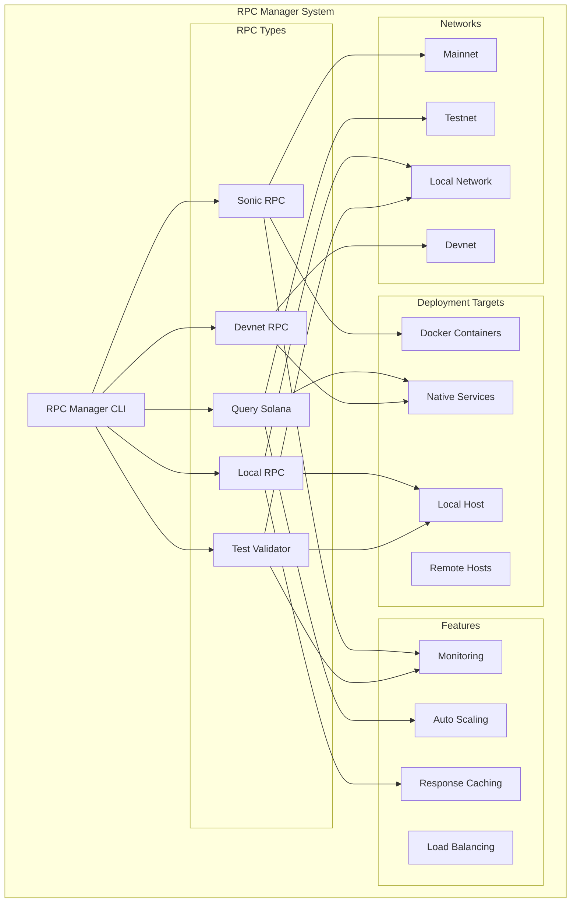
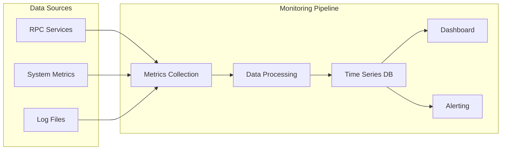

# RPC Manager

The RPC Manager provides comprehensive tools for deploying and managing different types of Solana RPC nodes, including specialized implementations like Sonic, query services, local development nodes, and test validators.

## Overview

OSVM CLI's RPC Manager supports multiple RPC node types optimized for different use cases, from high-performance production RPC services to local development environments.

## Quick Start

```bash
# Deploy Sonic RPC node
osvm rpc-manager sonic --host user@example.com --network mainnet

# Start local test validator
osvm rpc-manager test

# Query Solana network information
osvm rpc-manager query-solana --network mainnet

# Start local RPC development environment
osvm rpc-manager local --port 8899
```

## Architecture



## RPC Node Types

### Sonic RPC

High-performance RPC nodes using Docker containers with optimized configurations.

```bash
osvm rpc-manager sonic [OPTIONS]
```

**Features:**
- Docker-based deployment
- High throughput optimization
- Automatic scaling capabilities
- Built-in monitoring
- Load balancing support

**Options:**
- `--host <HOST>` - Remote deployment host
- `--network <NETWORK>` - Target Solana network
- `--replicas <NUM>` - Number of RPC replicas
- `--enable-private-rpc` - Enable private RPC methods
- `--monitoring` - Setup monitoring stack

**Example:**
```bash
# Deploy Sonic RPC cluster
osvm rpc-manager sonic \
  --host rpc@example.com \
  --network mainnet \
  --replicas 3 \
  --monitoring
```

### Query Solana

Network query service for retrieving Solana network information and statistics.

```bash
osvm rpc-manager query-solana [OPTIONS]
```

**Features:**
- Network statistics collection
- Real-time data querying
- Historical data access
- Performance analytics
- Custom query support

**Options:**
- `--network <NETWORK>` - Target network
- `--output <FORMAT>` - Output format (json, table, csv)
- `--save-to <FILE>` - Save results to file
- `--continuous` - Continuous monitoring mode

### Local RPC

Local development RPC server for testing and development.

```bash
osvm rpc-manager local [OPTIONS]
```

**Features:**
- Lightweight local server
- Fast startup time
- Development tools integration
- Custom endpoint configuration
- Hot reload capabilities

**Options:**
- `--port <PORT>` - RPC server port (default: 8899)
- `--websocket-port <PORT>` - WebSocket port (default: 8900)
- `--log-level <LEVEL>` - Logging verbosity
- `--enable-cors` - Enable CORS headers

### Test Validator

Local test validator with built-in RPC functionality.

```bash
osvm rpc-manager test [OPTIONS]
```

**Features:**
- Instant startup
- Built-in faucet
- Reset capabilities
- Account preloading
- Program deployment support

**Options:**
- `--reset` - Reset validator state
- `--faucet-sol <AMOUNT>` - Faucet SOL amount
- `--bpf-program <ID> <PATH>` - Load BPF program
- `--account <PUBKEY> <PATH>` - Load account data

### Devnet RPC

Production devnet RPC node with auto-repair capabilities.

```bash
osvm rpc-manager devnet [OPTIONS]
```

**Features:**
- Real devnet synchronization
- Auto-repair system
- Performance monitoring
- Log analysis
- External accessibility via ngrok

## RPC Service Workflow

```mermaid
sequenceDiagram
    participant U as User
    participant CLI as RPC Manager
    participant DEPLOY as Deployment Engine
    participant SERVICE as RPC Service
    participant MON as Monitoring
    participant NET as Solana Network
    
    U->>CLI: rpc-manager sonic --network mainnet
    CLI->>DEPLOY: Prepare deployment
    DEPLOY->>SERVICE: Configure RPC service
    SERVICE->>NET: Connect to network
    NET->>SERVICE: Network sync started
    SERVICE->>MON: Setup monitoring
    MON->>SERVICE: Health checks active
    SERVICE->>DEPLOY: Service ready
    DEPLOY->>CLI: Deployment complete
    CLI->>U: RPC service available
    
    loop Health Monitoring
        MON->>SERVICE: Check health
        SERVICE->>MON: Status report
        MON->>CLI: Update metrics
    end
    
    classDef techDebt fill:#f6f6f6,stroke:#d9534f,color:#d9534f,font-family:Consolas,monospace,font-weight:bold
```

## Configuration Management

### RPC Service Configuration

Each RPC service type maintains specific configuration:

**Sonic RPC Configuration:**
```yaml
sonic_rpc:
  network: "mainnet"
  replicas: 3
  resources:
    cpu: "2000m"
    memory: "8Gi"
  ports:
    rpc: 8899
    websocket: 8900
  features:
    private_rpc: false
    monitoring: true
    metrics_endpoint: "/metrics"
```

**Local RPC Configuration:**
```yaml
local_rpc:
  port: 8899
  websocket_port: 8900
  log_level: "info"
  cors_enabled: true
  development_mode: true
  features:
    hot_reload: true
    debug_info: true
```

**Test Validator Configuration:**
```yaml
test_validator:
  faucet_sol: 100
  reset_on_start: false
  programs:
    - id: "TokenkegQfeZyiNwAJbNbGKPFXCWuBvf9Ss623VQ5DA"
      path: "./programs/token.so"
  accounts:
    - pubkey: "11111111111111111111111111111111"
      path: "./accounts/system.json"
```

## Monitoring and Analytics

### Performance Metrics

RPC services collect comprehensive performance metrics:

**Request Metrics:**
- Requests per second (RPS)
- Average response time
- Error rates by method
- Concurrent connections

**Resource Metrics:**
- CPU utilization
- Memory usage
- Network throughput
- Disk I/O

**Solana-specific Metrics:**
- Slot processing rate
- Transaction confirmation time
- Account lookup performance
- Block synchronization status

### Real-time Monitoring Dashboard



## Load Balancing and Scaling

### Automatic Scaling

Sonic RPC nodes support automatic scaling based on demand:

```yaml
autoscaling:
  enabled: true
  min_replicas: 2
  max_replicas: 10
  metrics:
    - type: "cpu"
      target: 70
    - type: "rps"
      target: 1000
```

### Load Balancer Configuration

```yaml
load_balancer:
  type: "nginx"
  algorithm: "round_robin"
  health_checks:
    enabled: true
    interval: 30
    timeout: 5
    healthy_threshold: 2
    unhealthy_threshold: 3
```

## Network-specific Features

### Mainnet RPC

Optimized for production mainnet access:
- High availability configuration
- Rate limiting and quotas
- Advanced caching strategies
- Priority request handling

### Testnet RPC

Testing environment features:
- Relaxed rate limits
- Debug endpoints enabled
- Extended logging
- Development tools integration

### Devnet RPC

Development network capabilities:
- Real-time auto-repair
- Performance optimization
- External accessibility
- Comprehensive monitoring

## Security and Access Control

### Authentication Methods

**API Key Authentication:**
```bash
# Generate API key for RPC access
osvm rpc-manager generate-key --service sonic-rpc

# Use API key in requests
curl -H "Authorization: Bearer <API_KEY>" \
  http://rpc.example.com:8899 \
  -d '{"jsonrpc":"2.0","id":1,"method":"getHealth"}'
```

**IP Allowlisting:**
```yaml
access_control:
  ip_allowlist:
    - "192.168.1.0/24"
    - "10.0.0.0/8"
  rate_limits:
    per_ip: 100
    per_key: 1000
    burst: 50
```

### SSL/TLS Configuration

```yaml
ssl:
  enabled: true
  certificate: "/path/to/certificate.crt"
  private_key: "/path/to/private.key"
  protocols: ["TLSv1.2", "TLSv1.3"]
```

## Advanced Features

### Response Caching

Intelligent caching for improved performance:

```yaml
caching:
  enabled: true
  backend: "redis"
  ttl_seconds: 30
  cached_methods:
    - "getAccountInfo"
    - "getBalance"
    - "getBlockHeight"
  cache_conditions:
    - finalized_blocks_only: true
```

### Request Routing

Smart request routing based on method types:

```yaml
routing:
  read_replicas: 3
  write_node: "primary"
  method_routing:
    heavy_queries:
      - "getProgramAccounts"
      - "getTokenAccounts"
    light_queries:
      - "getBalance"
      - "getAccountInfo"
```

## Troubleshooting

### Common Issues

**RPC Service Won't Start:**
```bash
# Check Docker status (for Sonic RPC)
docker ps -a

# Check service logs
docker logs sonic-rpc-1

# Verify network connectivity
curl http://localhost:8899/health
```

**Poor Performance:**
```bash
# Check resource usage
docker stats

# Monitor request patterns
curl http://localhost:8899/metrics

# Analyze logs for bottlenecks
tail -f /var/log/rpc-service.log
```

**Connection Issues:**
```bash
# Test RPC connectivity
solana config set --url http://localhost:8899
solana cluster-version

# Check firewall settings
sudo ufw status

# Verify port bindings
netstat -tlnp | grep 8899
```

### Performance Optimization

**Memory Optimization:**
```yaml
optimization:
  heap_size: "8g"
  garbage_collection: "G1GC"
  connection_pool_size: 100
  request_timeout: 30
```

**Network Optimization:**
```yaml
network:
  tcp_nodelay: true
  keep_alive: true
  buffer_size: 65536
  max_connections: 1000
```

## Best Practices

### Production Deployment

1. **Resource Planning**
   - CPU: 8+ cores for high-load RPC
   - Memory: 16GB+ for mainnet RPC
   - Storage: SSD for better I/O performance
   - Network: High bandwidth for synchronization

2. **Monitoring Setup**
   - Enable comprehensive metrics collection
   - Setup alerting for critical thresholds
   - Monitor both system and application metrics
   - Implement log aggregation

3. **Security Configuration**
   - Use API keys for authentication
   - Implement rate limiting
   - Enable SSL/TLS encryption
   - Restrict access by IP when possible

### Development Workflow

1. **Local Development**
   - Use test validator for rapid iteration
   - Enable debug endpoints for troubleshooting
   - Configure hot reload for faster development
   - Use local RPC for integration testing

2. **Testing Strategy**
   - Test against testnet before mainnet
   - Validate performance under load
   - Test failover and recovery procedures
   - Verify monitoring and alerting

## Related Documentation

- [Node Management](node-management.md) - General node management
- [SSH Deployment](ssh-deployment.md) - Remote RPC deployment
- [Log Monitoring](log-monitoring.md) - RPC log analysis
- [Configuration](configuration.md) - RPC configuration options