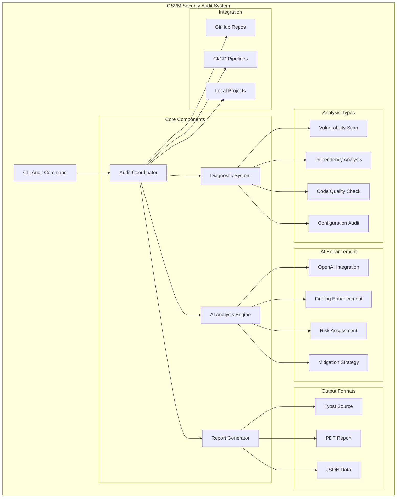
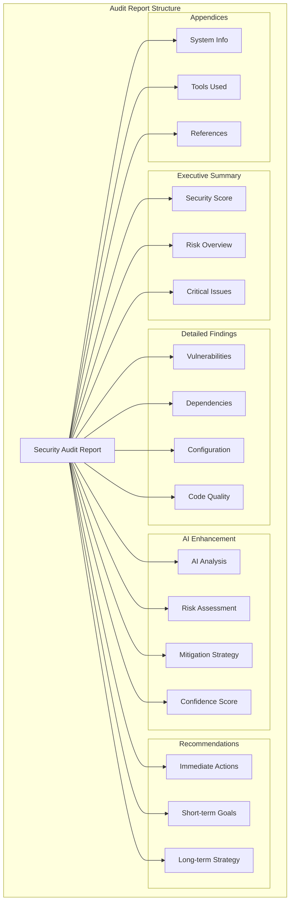
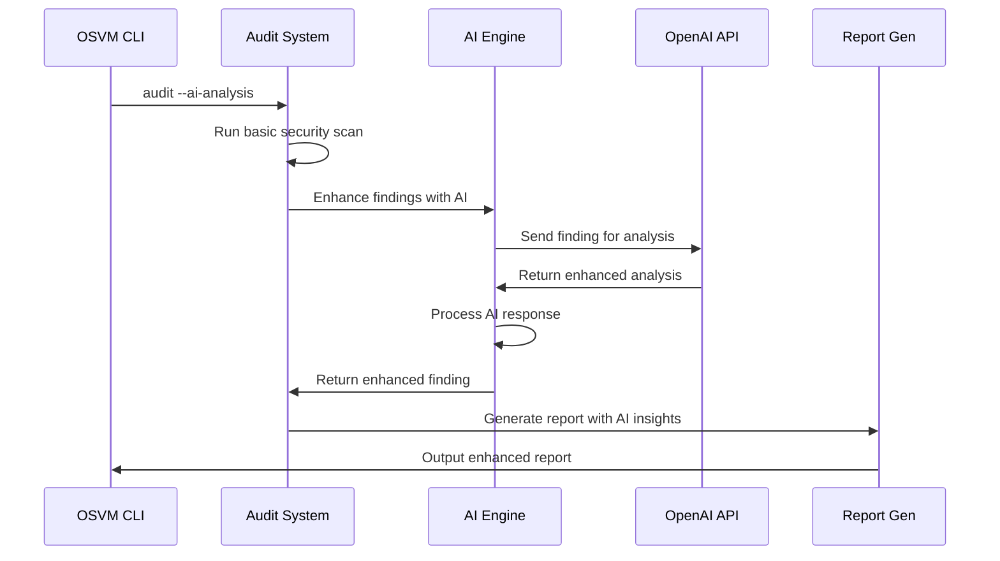
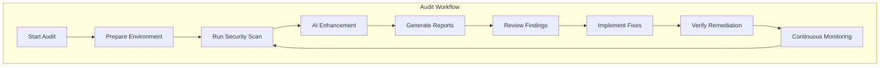

# Security Audit System

OSVM CLI includes a comprehensive security audit system that performs vulnerability analysis, generates detailed reports, and integrates with CI/CD pipelines for continuous security monitoring. The system now includes **23 enhanced Solana-specific security vulnerability checks** based on the comprehensive Solana Program Vulnerabilities Guide.

## Enhanced Solana Security Coverage

The audit system now includes comprehensive detection for all major Solana vulnerability categories:

### Critical Solana Vulnerabilities
- **Account Data Matching** - Validates account keys against expected values
- **Arbitrary CPI** - Ensures program ID verification before cross-program invocations
- **Insecure Initialization** - Validates upgrade authority during program initialization
- **Type Cosplay** - Prevents account type confusion via discriminator checks

### High-Severity Checks
- **Account Reloading** - Detects missing reload() calls after CPI operations
- **Bump Seed Canonicalization** - Ensures canonical PDA creation
- **Frontrunning Protection** - Validates price/slippage protection in trades
- **Financial Math Precision** - Prevents floating-point errors in token calculations
- **Missing Ownership/Signer Checks** - Validates account ownership and signing
- **Overflow/Underflow** - Comprehensive checked arithmetic validation

### Medium-Severity Patterns
- **Authority Transfer** - Validates two-step authority transfer processes
- **Account Data Reallocation** - Ensures safe realloc usage
- **Duplicate Mutable Accounts** - Prevents same account used multiple times
- **PDA Sharing** - Ensures unique PDA seeds per functionality
- **Remaining Accounts** - Validates processing of remaining accounts
- **Rust-Specific Errors** - Detects unsafe blocks, array bounds, unwrap usage

## Quick Start

```bash
# Generate a basic security audit report
osvm audit

# Audit with AI-powered analysis (requires OPENAI_API_KEY)
osvm audit --ai-analysis

# Audit a specific GitHub repository
osvm audit --gh opensvm/osvm-cli#main --ai-analysis

# Generate test report for demonstration
osvm audit --test --format both
```

## Recent Improvements (v0.3.9+)

The security audit system has been significantly enhanced based on comprehensive code review feedback:

### 🔧 **Enhanced Reliability**
- **UUID-based Finding IDs**: Eliminated collision risks with cryptographically unique identifiers
- **Dependency Optimization**: Updated 51+ packages to reduce conflicts and improve stability
- **AI Error Rate Limiting**: Prevents log flooding with intelligent 30-second throttling

### 🎯 **Improved Accuracy**
- **Context-Aware Solana Detection**: Reduced false positives in base58 key detection
- **Enhanced Security Patterns**: Improved regex patterns for command injection and path traversal
- **Smart Environment Validation**: Better API key handling with user-friendly guidance

### 📊 **Extended Format Support**
- **JSON Reports**: Machine-readable format for integration and automation
- **HTML Reports**: Interactive web-based audit reports
- **Markdown Summaries**: Perfect for documentation and GitHub integration
- **Legacy Support**: Typst and PDF formats remain fully supported

### 🤖 **Better AI Integration**
- **Intelligent Fallback**: Clear user communication when AI analysis is unavailable
- **Status Transparency**: Real-time feedback on AI enhancement success/failure rates
- **Graceful Degradation**: Audit continues seamlessly even with AI service issues

### ⚡ **Performance Optimizations**
- **Single-Pass Parsing**: Optimized code analysis with shared parsed data
- **Efficient Pattern Matching**: Cached regex compilation for faster scanning
- **Reduced Resource Usage**: Minimized redundant operations across audit checks

## Architecture Overview



## Command Reference

### Basic Audit Commands

```bash
# Generate audit report in current directory
osvm audit

# Specify output directory
osvm audit --output ./security-reports

# Choose output format
osvm audit --format pdf          # PDF only
osvm audit --format typst        # Typst source only
osvm audit --format both         # Both formats (default)

# Verbose output for debugging
osvm audit --verbose             # Basic verbosity
osvm audit -vv                   # More verbose
osvm audit -vvv                  # Maximum verbosity
```

### AI-Enhanced Analysis

```bash
# Enable AI analysis (requires OPENAI_API_KEY environment variable)
export OPENAI_API_KEY="your-api-key"
osvm audit --ai-analysis

# AI analysis with GitHub repository
osvm audit --gh solana-labs/solana#master --ai-analysis

# AI analysis with custom output
osvm audit --ai-analysis --output ./ai-enhanced-audit
```

### GitHub Repository Auditing

```bash
# Audit main branch of a repository
osvm audit --gh owner/repo#main

# Audit specific branch
osvm audit --gh opensvm/osvm-cli#develop

# Audit with comprehensive analysis
osvm audit --gh solana-labs/solana#master --ai-analysis --format both -vv
```

### Test and Development

```bash
# Generate test report with sample data
osvm audit --test

# Test with AI analysis
osvm audit --test --ai-analysis

# Test with custom output location
osvm audit --test --output ./test-audit --format both
```

## Report Structure

### Audit Report Components



### Severity Levels

| Severity | Description | Color Code | Action Required |
|----------|-------------|------------|-----------------|
| Critical | Immediate security risk | 🔴 Red | Fix immediately |
| High | Significant security concern | 🟠 Orange | Fix within 24-48 hours |
| Medium | Moderate security issue | 🟡 Yellow | Fix within 1 week |
| Low | Minor security concern | 🟢 Green | Fix when convenient |
| Info | Informational finding | 🔵 Blue | Consider for future |

## Configuration

### Environment Variables

```bash
# Required for AI analysis
export OPENAI_API_KEY="your-openai-api-key"

# Optional: Custom audit configuration
export OSVM_AUDIT_CONFIG="/path/to/audit-config.toml"

# Optional: GitHub token for private repositories
export GITHUB_TOKEN="your-github-token"
```

### Audit Configuration File

Create `audit-config.toml` for custom audit settings:

```toml
[audit]
# Default output directory
output_dir = "./audit_reports"

# Default format
format = "both"

# Verbosity level (0-3)
verbose = 1

# Enable test mode by default
test_mode = false

[ai]
# Enable AI analysis by default
enabled = false

# OpenAI model to use
model = "gpt-4"

# Maximum retries for API calls
max_retries = 3

# Base delay between retries (seconds)
base_delay = 1

[github]
# Default branch to audit
default_branch = "main"

# Clone timeout (seconds)
clone_timeout = 300

# Maximum repository size (MB)
max_repo_size = 1000

[report]
# Include system information
include_system_info = true

# Include diagnostic details
include_diagnostics = true

# Generate JSON output alongside reports
generate_json = true
```

## AI-Powered Analysis

### OpenAI Integration

The audit system integrates with OpenAI to provide enhanced security analysis:



### AI Enhancement Features

- **Risk Assessment**: AI-powered risk scoring and prioritization
- **Mitigation Strategies**: Specific, actionable remediation steps
- **Context Analysis**: Understanding of vulnerability impact in context
- **CWE Mapping**: Common Weakness Enumeration identification
- **Confidence Scoring**: AI confidence in its analysis

### AI Analysis Example

```json
{
  "ai_analysis": {
    "enhanced_description": "This dependency vulnerability allows remote code execution through deserialization of untrusted input, particularly dangerous in Solana validator environments where it could compromise consensus.",
    "risk_assessment": "Critical risk due to network exposure and potential for validator manipulation. Could lead to consensus attacks or fund loss.",
    "mitigation_strategy": "1. Immediately update to version 2.1.4+ 2. Implement input validation 3. Add network-level filtering 4. Monitor for exploitation attempts",
    "confidence_score": 0.95,
    "additional_cwe_ids": ["CWE-502", "CWE-94"]
  }
}
```

## GitHub Integration

### Automated Repository Auditing

```bash
# Audit a public repository
osvm audit --gh opensvm/osvm-cli#main

# Audit with authentication for private repos
export GITHUB_TOKEN="your-token"
osvm audit --gh myorg/private-repo#develop
```

### CI/CD Integration

#### GitHub Actions Workflow

```yaml
name: Security Audit

on:
  schedule:
    - cron: '0 2 * * 1'  # Weekly on Mondays
  workflow_dispatch:

jobs:
  security-audit:
    runs-on: ubuntu-latest
    steps:
    - uses: actions/checkout@v4
    
    - name: Setup Rust
      uses: actions-rust-lang/setup-rust-toolchain@v1
      
    - name: Install OSVM CLI
      run: |
        cargo install --git https://github.com/openSVM/osvm-cli
        
    - name: Run Security Audit
      env:
        OPENAI_API_KEY: ${{ secrets.OPENAI_API_KEY }}
      run: |
        osvm audit --ai-analysis --format both --verbose
        
    - name: Upload Audit Report
      uses: actions/upload-artifact@v4
      with:
        name: security-audit-report
        path: audit_reports/
        
    - name: Comment on PR
      if: github.event_name == 'pull_request'
      run: |
        # Add audit summary to PR comments
        echo "Security audit completed. Check artifacts for full report."
```

### Audit Branch Creation

When auditing GitHub repositories, the system:

1. **Clones** the specified repository and branch
2. **Creates** a new audit branch with timestamp: `osvm-audit-YYYYMMDD-HHMMSS`
3. **Runs** comprehensive security analysis
4. **Generates** Typst and PDF reports
5. **Commits** results to the audit branch
6. **Pushes** the branch to the repository

## Output Formats

The audit system supports multiple output formats to suit different use cases:

### Typst Reports (`--format typst`)

Typst source files provide:
- Professional formatting
- Mathematical expressions
- Code syntax highlighting
- Custom styling and themes
- Reproducible builds

### PDF Reports (`--format pdf`)

PDF outputs include:
- Executive summary
- Detailed findings table
- Risk assessment matrix
- Mitigation roadmap
- Technical appendices

### JSON Reports (`--format json`)

Machine-readable format for:
- CI/CD integration
- Custom reporting tools
- Automated processing
- Data analysis and metrics

### HTML Reports (`--format html`)

Interactive web-based reports featuring:
- Responsive design for all devices
- Searchable and filterable findings
- Syntax-highlighted code samples
- Collapsible sections for better navigation
- Direct links to external references

### Markdown Summaries (`--format markdown`)

GitHub-friendly format ideal for:
- README documentation
- Pull request summaries
- Issue tracking integration
- Wiki documentation
- Developer-friendly review process

### Combined Output (`--format both`)

Generates both Typst source and compiled PDF for maximum flexibility.

## Best Practices

### Security Audit Workflow



### Recommended Practices

1. **Regular Auditing**
   - Schedule weekly automated audits
   - Run audits before major releases
   - Audit after dependency updates

2. **AI Enhancement Usage**
   - Use AI analysis for complex findings
   - Review AI recommendations critically
   - Validate AI suggestions through testing

3. **Report Management**
   - Archive audit reports for compliance
   - Track remediation progress
   - Share findings with security teams

4. **Integration Patterns**
   - Integrate with CI/CD pipelines
   - Set up automated alerts
   - Create remediation workflows

## Troubleshooting

### Common Issues

#### OpenAI API Errors

```bash
# Error: Missing API key
export OPENAI_API_KEY="your-api-key"

# Error: Rate limiting
osvm audit --ai-analysis --verbose  # Shows retry attempts

# Error: Invalid API key
# Check your OpenAI account and regenerate key
```

#### GitHub Access Issues

```bash
# Error: Repository not found
# Check repository name and permissions

# Error: Branch not found
osvm audit --gh owner/repo#correct-branch-name

# Error: Permission denied
export GITHUB_TOKEN="your-token-with-repo-access"
```

#### Output Generation Errors

```bash
# Error: Typst not found
# Install Typst: https://typst.app/

# Error: Permission denied writing reports
osvm audit --output ./writable-directory

# Error: Disk space full
df -h  # Check available space
```

### Debug Mode

```bash
# Maximum verbosity for debugging
osvm audit -vvv --test

# Check environment
osvm audit --verbose --test | grep -E "(Environment|Config|Error)"

# Validate configuration
osvm audit --test --format typst -v
```

## Examples

### Basic Security Audit

```bash
# Generate a basic audit report
osvm audit

# Output:
# 🔍 Starting comprehensive security audit...
# 📊 Analyzing system dependencies...
# 🔧 Scanning configuration files...
# 📋 Generating audit report...
# ✅ Audit complete! Reports saved to: audit_reports/
```

### Enhanced GitHub Audit

```bash
# Comprehensive GitHub repository audit
export OPENAI_API_KEY="your-key"
osvm audit --gh solana-labs/solana#master --ai-analysis --format both -vv

# Output includes:
# - Dependency vulnerability analysis
# - AI-enhanced finding descriptions
# - Risk assessments and mitigation strategies
# - Professional PDF report
# - Typst source for customization
```

### CI/CD Integration Example

```bash
#!/bin/bash
# security-audit.sh - CI/CD integration script

set -e

echo "🔍 Running OSVM Security Audit"

# Run audit with error handling
if osvm audit --ai-analysis --format both --verbose; then
    echo "✅ Security audit passed"
    exit 0
else
    echo "❌ Security audit found issues"
    echo "📋 Check audit_reports/ for details"
    exit 1
fi
```

## Related Documentation

- [Installation Guide](installation.md) - Set up OSVM CLI
- [Configuration Management](configuration.md) - Configure audit settings
- [Self-Repair System](self-repair-system.md) - Automated issue remediation
- [Log Monitoring](log-monitoring.md) - Continuous security monitoring

For advanced security workflows and integration patterns, see the [Examples](examples.md) documentation.
