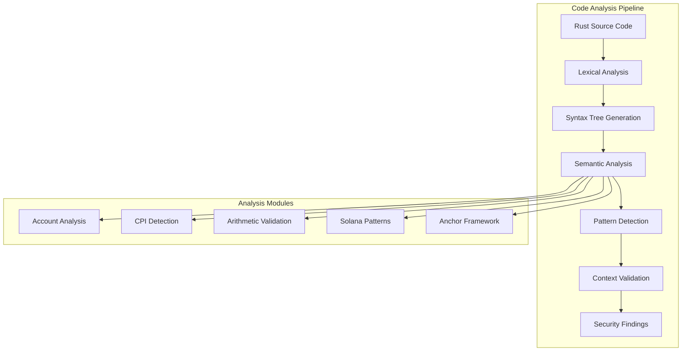
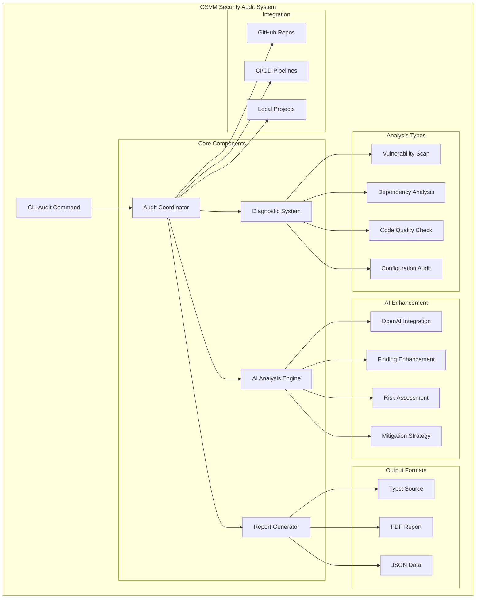
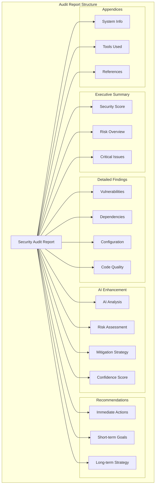
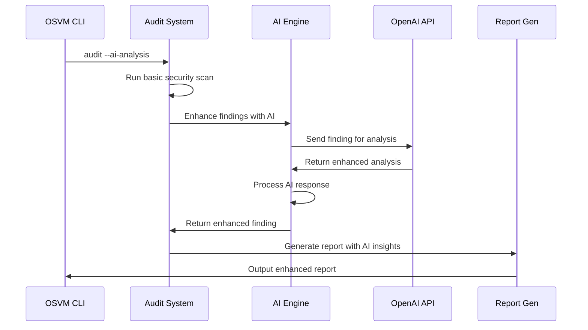
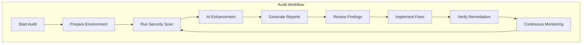

# OSVM Security Audit System

OSVM CLI includes a comprehensive security audit system specifically designed for Solana program analysis, vulnerability detection, and blockchain security assessment. The system performs deep static analysis of Rust/Anchor code to identify security vulnerabilities, generates detailed reports with AI-enhanced insights, and integrates seamlessly with CI/CD pipelines for continuous security monitoring.

## How OSVM Verifies Solana Programs

The OSVM security audit system uses a multi-layered approach to analyze Solana programs:

### 1. Code Parsing & AST Analysis
The system employs a sophisticated Rust code parser that:
- **Parses Rust source code** into Abstract Syntax Trees (AST) for structural analysis
- **Identifies Solana/Anchor patterns** including account structures, instruction handlers, and CPI calls
- **Extracts semantic information** about account relationships, signer requirements, and data flow
- **Analyzes cross-program invocations** and account dependency chains

### 2. Pattern-Based Vulnerability Detection
Advanced regex patterns and semantic analysis detect:
- **Account validation patterns** - Missing signer checks, ownership validation, key matching
- **CPI security patterns** - Program ID verification, account passing validation
- **Arithmetic operations** - Overflow/underflow protection, precision loss detection
- **Data handling patterns** - Reallocation safety, discriminator checking, type validation

### 3. Context-Aware Analysis
The system understands Solana-specific contexts:
- **Anchor framework patterns** - Account constraints, has_one relationships, custom validations
- **Native Solana patterns** - Manual account parsing, system program interactions
- **Token program interactions** - SPL token operations, mint authority validation
- **Oracle integrations** - Price feed validation, staleness checks

### 4. AI-Enhanced Security Assessment
When enabled, AI analysis provides:
- **Vulnerability impact assessment** - Real-world attack scenario analysis
- **Context-sensitive recommendations** - Solana ecosystem-specific remediation strategies
- **Risk prioritization** - Business impact evaluation based on program functionality
- **Attack vector identification** - Multi-step attack chain detection

## Comprehensive Solana Security Checks (23+ Categories)

The audit system includes **23+ specialized security vulnerability checks** covering all major Solana security categories:

### 🔴 Critical Vulnerabilities

#### Account Data Matching (CWE-345)
**What it detects:** Missing validation that account keys match expected values
```rust
// ❌ Vulnerable - No key validation
let user_account = &ctx.accounts.user_account;
user_account.balance += amount;

// ✅ Secure - Key validation
require!(ctx.accounts.user_account.key() == expected_user_key, ErrorCode::InvalidUser);
```
**Impact:** Malicious accounts can be substituted, leading to unauthorized access or fund manipulation.

#### Arbitrary CPI (CWE-345)
**What it detects:** Cross-program invocations without target program verification
```rust
// ❌ Vulnerable - No program ID check
invoke(&instruction, &account_infos)?;

// ✅ Secure - Program ID verification
require!(target_program.key() == &expected_program::ID, ErrorCode::InvalidProgram);
invoke(&instruction, &account_infos)?;
```
**Impact:** Malicious programs can be invoked, compromising entire program security.

#### Insecure Initialization (CWE-665)
**What it detects:** Program initialization without proper upgrade authority validation
```rust
// ❌ Vulnerable - No upgrade authority check
pub fn initialize(ctx: Context<Initialize>) -> Result<()> {
    ctx.accounts.central_state.authority = ctx.accounts.authority.key();
}

// ✅ Secure - Upgrade authority validation
require!(ctx.accounts.upgrade_authority.key() == EXPECTED_UPGRADE_AUTHORITY, ErrorCode::Unauthorized);
```
**Impact:** Unauthorized initialization can lead to permanent program compromise.

#### Type Cosplay (CWE-20)
**What it detects:** Account deserialization without discriminator validation
```rust
// ❌ Vulnerable - No discriminator check
let account_data = MyAccount::try_from_slice(&account_info.data.borrow())?;

// ✅ Secure - Discriminator validation
let account_data = MyAccount::try_deserialize(&mut &account_info.data.borrow()[..])?;
```
**Impact:** Wrong account types accepted, leading to type confusion attacks.

### 🟠 High-Severity Checks

#### Account Reloading (CWE-362)
**What it detects:** Missing account.reload() calls after CPI operations
```rust
// ❌ Vulnerable - Account not reloaded after CPI
cpi::transfer(cpi_ctx, amount)?;
let balance = ctx.accounts.user_account.balance; // Stale data

// ✅ Secure - Account reloaded
cpi::transfer(cpi_ctx, amount)?;
ctx.accounts.user_account.reload()?;
let balance = ctx.accounts.user_account.balance; // Fresh data
```

#### Bump Seed Canonicalization (CWE-20)
**What it detects:** Non-canonical bump seed usage in PDA generation
```rust
// ❌ Vulnerable - Any bump accepted
let (pda, _bump) = Pubkey::find_program_address(&[b"vault"], &program_id);

// ✅ Secure - Canonical bump enforced
let (pda, canonical_bump) = Pubkey::find_program_address(&[b"vault"], &program_id);
require!(bump == canonical_bump, ErrorCode::InvalidBump);
```

#### Frontrunning Protection (CWE-362)
**What it detects:** Trading operations vulnerable to MEV attacks
```rust
// ❌ Vulnerable - No price protection
let sale_price = oracle.get_price();
transfer_tokens(sale_price);

// ✅ Secure - Price bounds validation
require!(sale_price <= max_expected_price, ErrorCode::PriceTooHigh);
require!(sale_price >= min_expected_price, ErrorCode::PriceTooLow);
```

#### Financial Math Precision (CWE-681)
**What it detects:** Floating-point arithmetic in financial calculations
```rust
// ❌ Vulnerable - Floating point precision loss
let fee = (amount as f64) * 0.025;

// ✅ Secure - Integer-based math
let fee = amount.checked_mul(25).unwrap().checked_div(1000).unwrap();
```

#### Missing Ownership/Signer Checks (CWE-285)
**What it detects:** Operations without proper authorization validation
```rust
// ❌ Vulnerable - No signer check
pub fn withdraw(ctx: Context<Withdraw>, amount: u64) -> Result<()> {
    ctx.accounts.vault.balance -= amount;
}

// ✅ Secure - Signer validation
#[account(mut, has_one = authority)]
pub struct Withdraw {
    #[account(signer)]
    pub authority: Signer<'info>,
    pub vault: Account<'info, Vault>,
}
```

#### Overflow/Underflow (CWE-190, CWE-191)
**What it detects:** Arithmetic operations without overflow protection
```rust
// ❌ Vulnerable - Unchecked arithmetic
user.balance = user.balance + deposit_amount;

// ✅ Secure - Checked arithmetic
user.balance = user.balance.checked_add(deposit_amount)
    .ok_or(ErrorCode::Overflow)?;
```

### 🟡 Medium-Severity Patterns

#### Authority Transfer (CWE-269)
**What it detects:** Direct authority transfers without two-step nomination process
```rust
// ❌ Vulnerable - Direct transfer
state.authority = new_authority;

// ✅ Secure - Two-step process
state.pending_authority = Some(new_authority);
// Later: require!(ctx.accounts.pending_authority.key() == state.pending_authority);
```

#### Account Data Reallocation (CWE-665)
**What it detects:** Unsafe account resizing exposing stale data
```rust
// ❌ Vulnerable - Stale data exposure
account_info.realloc(new_size, false)?;

// ✅ Secure - Zero initialization
account_info.realloc(new_size, true)?;
```

#### Duplicate Mutable Accounts (CWE-663)
**What it detects:** Same account used multiple times in single transaction
```rust
// ❌ Vulnerable - No duplicate check
pub struct Transfer {
    pub from: Account<'info, TokenAccount>,
    pub to: Account<'info, TokenAccount>,
}

// ✅ Secure - Constraint validation
#[account(mut, constraint = from.key() != to.key())]
pub from: Account<'info, TokenAccount>,
```

#### PDA Sharing (CWE-345)
**What it detects:** Non-unique PDA seeds enabling unauthorized access
```rust
// ❌ Vulnerable - Shared seeds
#[account(mut, seeds = [b"vault"], bump)]
pub vault: Account<'info, Vault>,

// ✅ Secure - Unique seeds
#[account(mut, seeds = [b"vault", user.key().as_ref()], bump)]
pub vault: Account<'info, Vault>,
```

#### Remaining Accounts (CWE-20)
**What it detects:** Improper handling of remaining_accounts
```rust
// ❌ Vulnerable - Unchecked remaining accounts
for account in ctx.remaining_accounts {
    // Process without validation
}

// ✅ Secure - Proper validation
for account in ctx.remaining_accounts {
    require!(account.owner == &token_program::ID, ErrorCode::InvalidOwner);
}
```

#### Rust-Specific Errors (CWE-119, CWE-476)
**What it detects:** Unsafe Rust patterns and potential panics
```rust
// ❌ Vulnerable - Panic on failure
let value = data[index]; // Array bounds panic
let result = operation().unwrap(); // Panic on None/Err

// ✅ Secure - Safe access
let value = data.get(index).ok_or(ErrorCode::IndexOutOfBounds)?;
let result = operation().map_err(|_| ErrorCode::OperationFailed)?;
```

### 🔵 Additional Specialized Checks

The system also includes specialized detection for:
- **Oracle Price Manipulation** - Stale price feeds, price deviation attacks
- **Governance Attacks** - Vote manipulation, proposal spam, delegation issues  
- **Token Program Security** - Mint authority validation, freeze authority checks
- **Rent Exemption Issues** - Account closure vulnerabilities, rent payment validation
- **Timestamp Dependencies** - Block timestamp manipulation, time-based vulnerabilities
- **Cross-Program Invocation Chains** - Complex CPI attack vectors
- **Account Closure Attacks** - Premature account closure, data persistence issues

## Advanced Analysis Features

### Semantic Code Analysis
The parser extracts semantic meaning from code:
```rust
pub struct SolanaOperation {
    pub operation_type: String,    // "transfer", "mint", "burn", etc.
    pub accounts_involved: Vec<String>,
    pub signer_check: bool,        // Validates is_signer usage
    pub owner_check: bool,         // Validates account ownership
    pub key_validation: bool,      // Validates key() comparisons
    pub arithmetic_operations: Vec<String>,
    pub cpi_calls: Vec<String>,
}
```

### Context-Aware Validation
The system understands different Solana program contexts:
- **Native Solana Programs** - Direct account manipulation, system program calls
- **Anchor Framework** - Constraint validation, macro usage, account relationships
- **SPL Token Programs** - Token operations, mint/burn validation, authority checks
- **Custom Program Types** - Domain-specific validation patterns

### AI-Enhanced Analysis
When AI analysis is enabled, the system provides:
- **Attack Scenario Modeling** - Real-world exploit path analysis
- **Business Impact Assessment** - Financial risk quantification
- **Remediation Prioritization** - Fix recommendations based on exploitability
- **Ecosystem Context** - Solana-specific security best practices

## Security Check Categories

The audit system organizes security checks into logical categories for comprehensive coverage:

### 🔐 **Authentication & Authorization**
- Signer validation patterns
- Account ownership verification
- Authority transfer mechanisms
- Permission escalation detection

### 🌐 **Cross-Program Invocation (CPI)**
- Program ID verification
- Account passing validation
- CPI authority checks
- Invoke chain analysis

### 💰 **Financial & Token Security**
- Arithmetic overflow/underflow
- Precision loss detection
- Token authority validation
- Balance calculation errors

### 🏗️ **Account Management**
- Account data validation
- Reallocation safety
- Account closure attacks
- Discriminator checking

### 🔄 **State Management**
- Account reloading patterns
- State transition validation
- Race condition detection
- Atomic operation requirements

### 🎯 **Program-Specific Patterns**
- PDA generation security
- Seed uniqueness validation
- Canonical bump usage
- Remaining accounts handling

## Technical Implementation Details

### Code Parser Architecture

The audit system uses a sophisticated multi-pass parsing approach:



### Pattern Detection Engine

The system employs multiple detection mechanisms:

#### 1. Regex-Based Pattern Matching
High-performance compiled regex patterns for common vulnerability signatures:
```rust
// Command injection detection
r#"(?:Command::new|process::Command::new)\s*\(\s*(?:[^)]*(?:format!|concat!|user_input)[^)]*)"#

// Path traversal detection  
r#"(?:\.\.[\\/]|%2e%2e[\\/]|%252e%252e[\\/])"#

// Solana signer validation
r#"AccountInfo.*without.*is_signer"#
```

#### 2. AST-Based Semantic Analysis
Deep structural analysis of code for complex patterns:
```rust
pub struct ParsedCodeAnalysis {
    pub functions: Vec<FunctionInfo>,
    pub structs: Vec<StructInfo>,
    pub solana_operations: Vec<SolanaOperation>,
    pub cpi_calls: Vec<CPICall>,
    pub arithmetic_operations: Vec<ArithmeticOp>,
}
```

#### 3. Context-Aware Validation
Understanding of Solana ecosystem patterns:
- **Anchor Framework Recognition** - Identifies account constraints, macros, and framework-specific patterns
- **Native Solana Patterns** - Detects manual account parsing and system program interactions
- **Token Program Integration** - Validates SPL token operations and authority patterns

### Security Vulnerability Database

The system maintains a comprehensive database of known Solana vulnerabilities:

#### Vulnerability Classification
Each vulnerability is classified with:
- **CWE ID** - Common Weakness Enumeration identifier
- **CVSS Score** - Common Vulnerability Scoring System rating
- **Severity Level** - Critical, High, Medium, Low, Info
- **Attack Vector** - How the vulnerability can be exploited
- **Business Impact** - Potential financial and operational consequences

#### Example Vulnerability Entry
```json
{
  "id": "OSVM-SOL-001",
  "title": "Missing Account Key Validation",
  "cwe_id": "CWE-345",
  "cvss_score": 7.5,
  "severity": "High",
  "category": "Account Security",
  "description": "Program accepts accounts without validating keys match expected values",
  "impact": "Malicious accounts can be substituted, leading to unauthorized operations",
  "remediation": "Validate account keys using ctx.accounts.account.key() == expected_key",
  "references": [
    "https://book.anchor-lang.com/anchor_bts/security.html",
    "https://github.com/coral-xyz/sealevel-attacks"
  ]
}
```

## Analysis Process Flow

### 1. Pre-Analysis Phase
- **Environment Validation** - Checks for required tools and API keys
- **Code Discovery** - Identifies Rust source files and project structure
- **Framework Detection** - Determines if using Anchor, native Solana, or other frameworks

### 2. Parsing Phase
- **Lexical Analysis** - Tokenizes source code into meaningful elements
- **Syntax Tree Generation** - Creates Abstract Syntax Tree (AST) representation
- **Semantic Analysis** - Extracts meaning from code structures

### 3. Vulnerability Detection Phase
- **Pattern Matching** - Applies 200+ security patterns across all categories
- **Context Validation** - Validates findings within Solana ecosystem context
- **False Positive Filtering** - Reduces noise through intelligent filtering

### 4. Enhancement Phase (AI-Enabled)
- **Finding Enrichment** - AI analyzes each finding for enhanced context
- **Risk Assessment** - Evaluates real-world exploitability and impact
- **Remediation Guidance** - Provides specific, actionable fix recommendations

### 5. Report Generation Phase
- **Finding Aggregation** - Consolidates and prioritizes security findings
- **Report Formatting** - Generates reports in multiple formats (PDF, HTML, JSON, Markdown)
- **Visualization** - Creates charts and graphs for executive summaries

## Solana Program Verification Workflow

### Step 1: Program Structure Analysis
```rust
// The system identifies and catalogs:
pub struct ProgramAnalysis {
    pub program_id: String,
    pub instruction_handlers: Vec<InstructionHandler>,
    pub account_structures: Vec<AccountStructure>,
    pub state_definitions: Vec<StateDefinition>,
    pub cpi_destinations: Vec<String>,
}
```

### Step 2: Account Relationship Mapping
The system creates a graph of account relationships:
- **Ownership chains** - Tracks account ownership hierarchies
- **Authority relationships** - Maps authority and permission structures
- **Data dependencies** - Identifies accounts that share or depend on common data

### Step 3: Instruction Flow Analysis
For each instruction, the system analyzes:
- **Input validation** - Checks for proper account and data validation
- **State transitions** - Validates safe state changes
- **Authorization checks** - Ensures proper permission validation
- **Error handling** - Verifies graceful error recovery

### Step 4: Cross-Program Interaction Analysis
Advanced analysis of CPI patterns:
- **Target program validation** - Ensures CPI targets are verified
- **Account passing security** - Validates accounts passed to other programs
- **Authority delegation** - Checks for proper authority delegation patterns

## Real-World Security Examples

### Example 1: Account Substitution Attack
**Vulnerable Code:**
```rust
pub fn transfer_tokens(ctx: Context<TransferTokens>, amount: u64) -> Result<()> {
    // ❌ No validation that from_account belongs to authority
    let from_account = &mut ctx.accounts.from_account;
    let to_account = &mut ctx.accounts.to_account;
    
    from_account.balance -= amount;
    to_account.balance += amount;
    
    Ok(())
}
```

**OSVM Detection:**
- **Pattern Matched:** Missing account key validation
- **Severity:** High (CVSS 7.5)
- **CWE ID:** CWE-345 (Insufficient Verification of Data Authenticity)

**AI-Enhanced Analysis:**
- **Attack Vector:** Attacker substitutes victim's account with their own
- **Financial Impact:** Complete drain of victim's token balance
- **Remediation:** Add constraint validation or manual key checks

### Example 2: Arbitrary CPI Vulnerability
**Vulnerable Code:**
```rust
pub fn execute_cpi(ctx: Context<ExecuteCPI>) -> Result<()> {
    // ❌ No validation of target program
    let instruction = create_instruction();
    invoke(&instruction, &ctx.accounts.accounts)?;
    Ok(())
}
```

**OSVM Detection:**
- **Pattern Matched:** CPI without program ID verification
- **Severity:** Critical (CVSS 9.0)
- **CWE ID:** CWE-345 (Insufficient Verification of Data Authenticity)

**AI-Enhanced Analysis:**
- **Attack Vector:** Malicious program substitution via account manipulation
- **System Impact:** Complete compromise of program logic and user funds
- **Remediation:** Validate target program ID before invoke calls

## Performance Optimization

The audit system is optimized for large-scale analysis:

### Caching Strategy
- **Regex Compilation** - Pre-compiled patterns stored in static cache
- **AST Parsing** - Parsed syntax trees cached for reuse across checks
- **Pattern Results** - Intermediate results cached to avoid redundant analysis

### Parallel Processing
- **File-Level Parallelism** - Multiple files analyzed concurrently
- **Check-Level Parallelism** - Different security checks run in parallel
- **AI Processing** - Asynchronous AI enhancement with rate limiting

### Memory Management
- **Streaming Analysis** - Large files processed in chunks
- **Garbage Collection** - Proactive cleanup of temporary data structures
- **Resource Limits** - Configurable memory and time limits for analysis

## Integration with Solana Ecosystem

### Framework Support
- **Anchor Framework** - Native support for Anchor macros, constraints, and patterns
- **Native Solana** - Direct system program interaction analysis
- **Custom Frameworks** - Extensible pattern matching for custom frameworks

### Tool Integration
- **Solana CLI** - Integrates with existing Solana development workflows
- **Anchor CLI** - Compatible with Anchor project structures
- **IDEs** - Supports VS Code, IntelliJ, and other development environments

### Ecosystem Compatibility
- **Solana Versions** - Supports all major Solana runtime versions
- **SPL Programs** - Specialized analysis for SPL Token, Governance, and other programs
- **Metaplex** - NFT and metadata program security analysis

## Output Formats and Solana-Specific Reporting

The audit system provides specialized reporting formats optimized for Solana development workflows:

### JSON Format (`--format json`)
Machine-readable format perfect for CI/CD integration and automated analysis:
```json
{
  "audit_metadata": {
    "solana_version": "1.17.0",
    "anchor_version": "0.29.0",
    "framework": "anchor",
    "program_count": 3
  },
  "findings": [
    {
      "id": "OSVM-SOL-001",
      "title": "Missing Account Key Validation",
      "severity": "High",
      "solana_specific": {
        "account_type": "TokenAccount",
        "instruction_handler": "transfer_tokens",
        "anchor_constraint_suggestion": "#[account(constraint = from.key() == expected_from)]"
      }
    }
  ]
}
```

### HTML Format (`--format html`)
Interactive reports with Solana-specific visualizations:
- **Account Relationship Graphs** - Visual representation of account dependencies
- **CPI Flow Diagrams** - Interactive cross-program invocation mapping
- **Code Navigation** - Click-through from findings to source code locations
- **Severity Heatmaps** - Visual representation of security hotspots

### Markdown Format (`--format markdown`)
GitHub-friendly summaries optimized for Solana development:
```markdown
## 🔍 Solana Program Security Analysis

### Program Overview
- **Framework:** Anchor 0.29.0
- **Programs Analyzed:** 3 
- **Total Instructions:** 23
- **CPI Calls:** 7

### 🔴 Critical Findings (2)
1. **Arbitrary CPI in `transfer_handler`** - Missing program ID verification
2. **Type Cosplay in `deserialize_account`** - No discriminator validation

### Recommended Actions
1. Add program ID checks before all CPI calls
2. Use Anchor's automatic deserialization instead of manual parsing
3. Implement two-step authority transfer pattern
```

### PDF Format (`--format pdf`)
Executive-ready reports with comprehensive Solana program analysis:
- **Executive Summary** - High-level security posture for Solana programs
- **Technical Deep Dive** - Detailed vulnerability analysis with code examples
- **Remediation Roadmap** - Prioritized action plan for security improvements
- **Compliance Checklist** - Solana security best practices validation

## Command Examples for Solana Programs

### Basic Solana Program Audit
```bash
# Audit current Anchor project
osvm audit --format html

# Audit with AI-enhanced Solana analysis
export OPENAI_API_KEY="your-key"
osvm audit --ai-analysis --format both
```

### GitHub Repository Analysis
```bash
# Audit popular Solana program
osvm audit --gh solana-labs/solana-program-library#master --ai-analysis

# Audit Anchor program with comprehensive reporting
osvm audit --gh coral-xyz/anchor#master --format html --verbose
```

### CI/CD Integration for Solana Development
```bash
# Generate machine-readable report for pipeline
osvm audit --format json --output ./security-reports/

# Comprehensive audit for release pipeline
osvm audit --ai-analysis --format markdown --verbose > SECURITY_REPORT.md
```

## Solana-Specific AI Enhancement Features

When AI analysis is enabled, the system provides specialized Solana insights:

### Program Context Understanding
- **DeFi Protocol Analysis** - Understanding of AMM, lending, and staking patterns
- **NFT Program Validation** - Metaplex and custom NFT security patterns
- **Governance Security** - DAO and governance program vulnerability assessment
- **Oracle Integration** - Price feed manipulation and staleness detection

### Attack Vector Analysis
- **MEV Vulnerability Assessment** - Frontrunning and sandwich attack detection
- **Flash Loan Attack Patterns** - Cross-program attack vector identification
- **Governance Attacks** - Vote manipulation and proposal spam detection
- **Oracle Manipulation** - Price feed attack vector analysis

### Remediation Strategies
- **Anchor-Specific Fixes** - Constraint recommendations and macro usage
- **Native Solana Solutions** - System program interaction best practices
- **Framework Migration** - Recommendations for framework upgrades
- **Security Pattern Implementation** - Code examples for secure patterns

## Getting Started with Solana Program Analysis

### 1. Install OSVM CLI
```bash
# Install from source (recommended for latest features)
cargo install --git https://github.com/openSVM/osvm-cli

# Or use pre-built installer
curl -sSf https://install.osvm.dev | sh
```

### 2. Set Up Environment
```bash
# Optional: Enable AI-enhanced analysis
export OPENAI_API_KEY="your-openai-api-key"

# Optional: GitHub token for private repositories
export GITHUB_TOKEN="your-github-token"
```

### 3. Analyze Your First Solana Program
```bash
# Navigate to your Anchor project
cd my-solana-program

# Run comprehensive security audit
osvm audit --ai-analysis --format html --verbose

# Check the generated report
open audit_reports/security-audit.html
```

### 4. Review and Remediate
1. **Critical Issues First** - Address any Critical or High severity findings immediately
2. **Validate Fixes** - Re-run audit after implementing fixes
3. **Continuous Monitoring** - Integrate into your CI/CD pipeline
4. **Team Training** - Use findings to educate team on Solana security patterns

## Advanced Usage Patterns

### Custom Security Policies
Create custom audit configurations for specific Solana program types:
```toml
# solana-audit-config.toml
[solana]
framework = "anchor"
version = "0.29.0"
strict_mode = true

[checks]
enforce_canonical_bumps = true
require_signer_validation = true
detect_pda_sharing = true
validate_cpi_programs = true

[ai]
focus_areas = ["defi", "governance", "nft"]
risk_tolerance = "low"
```

### Multi-Program Analysis
Analyze entire Solana project ecosystems:
```bash
# Analyze all programs in workspace
find . -name "Cargo.toml" -path "*/programs/*" | \
  xargs -I {} dirname {} | \
  xargs -I {} osvm audit --path {} --format json

# Aggregate results for ecosystem-wide analysis
osvm audit --workspace --ai-analysis --format html
```

### Integration with Solana Development Tools
```bash
# Pre-commit hook for continuous security
echo "osvm audit --format json --quiet" > .git/hooks/pre-commit
chmod +x .git/hooks/pre-commit

# Integration with anchor build process
anchor build && osvm audit --format markdown > SECURITY.md
```

## Conclusion

The OSVM security audit system provides the most comprehensive Solana program security analysis available, combining deep static analysis, AI-enhanced insights, and extensive vulnerability detection to help developers build secure, reliable Solana programs. With 23+ specialized security checks, multiple output formats, and seamless CI/CD integration, it's an essential tool for any serious Solana development team.

For advanced security workflows and integration patterns, see the [Examples](examples.md) documentation.

## Quick Start

```bash
# Generate a basic security audit report
osvm audit

# Audit with AI-powered analysis (requires OPENAI_API_KEY)
osvm audit --ai-analysis

# Audit a specific GitHub repository
osvm audit --gh opensvm/osvm-cli#main --ai-analysis

# Generate test report for demonstration
osvm audit --test --format both
```

## Recent Improvements (v0.3.9+)

The security audit system has been significantly enhanced based on comprehensive code review feedback:

### 🔧 **Enhanced Reliability**
- **UUID-based Finding IDs**: Eliminated collision risks with cryptographically unique identifiers
- **Dependency Optimization**: Updated 51+ packages to reduce conflicts and improve stability
- **AI Error Rate Limiting**: Prevents log flooding with intelligent 30-second throttling

### 🎯 **Improved Accuracy**
- **Context-Aware Solana Detection**: Reduced false positives in base58 key detection
- **Enhanced Security Patterns**: Improved regex patterns for command injection and path traversal
- **Smart Environment Validation**: Better API key handling with user-friendly guidance

### 📊 **Extended Format Support**
- **JSON Reports**: Machine-readable format for integration and automation
- **HTML Reports**: Interactive web-based audit reports
- **Markdown Summaries**: Perfect for documentation and GitHub integration
- **Legacy Support**: Typst and PDF formats remain fully supported

### 🤖 **Better AI Integration**
- **Intelligent Fallback**: Clear user communication when AI analysis is unavailable
- **Status Transparency**: Real-time feedback on AI enhancement success/failure rates
- **Graceful Degradation**: Audit continues seamlessly even with AI service issues

### ⚡ **Performance Optimizations**
- **Single-Pass Parsing**: Optimized code analysis with shared parsed data
- **Efficient Pattern Matching**: Cached regex compilation for faster scanning
- **Reduced Resource Usage**: Minimized redundant operations across audit checks

## Architecture Overview



## Command Reference

### Basic Audit Commands

```bash
# Generate audit report in current directory
osvm audit

# Specify output directory
osvm audit --output ./security-reports

# Choose output format
osvm audit --format pdf          # PDF only
osvm audit --format typst        # Typst source only
osvm audit --format both         # Both formats (default)

# Verbose output for debugging
osvm audit --verbose             # Basic verbosity
osvm audit -vv                   # More verbose
osvm audit -vvv                  # Maximum verbosity
```

### AI-Enhanced Analysis

```bash
# Enable AI analysis (requires OPENAI_API_KEY environment variable)
export OPENAI_API_KEY="your-api-key"
osvm audit --ai-analysis

# AI analysis with GitHub repository
osvm audit --gh solana-labs/solana#master --ai-analysis

# AI analysis with custom output
osvm audit --ai-analysis --output ./ai-enhanced-audit
```

### GitHub Repository Auditing

```bash
# Audit main branch of a repository
osvm audit --gh owner/repo#main

# Audit specific branch
osvm audit --gh opensvm/osvm-cli#develop

# Audit with comprehensive analysis
osvm audit --gh solana-labs/solana#master --ai-analysis --format both -vv
```

### Test and Development

```bash
# Generate test report with sample data
osvm audit --test

# Test with AI analysis
osvm audit --test --ai-analysis

# Test with custom output location
osvm audit --test --output ./test-audit --format both
```

## Report Structure

### Audit Report Components



### Severity Levels

| Severity | Description | Color Code | Action Required |
|----------|-------------|------------|-----------------|
| Critical | Immediate security risk | 🔴 Red | Fix immediately |
| High | Significant security concern | 🟠 Orange | Fix within 24-48 hours |
| Medium | Moderate security issue | 🟡 Yellow | Fix within 1 week |
| Low | Minor security concern | 🟢 Green | Fix when convenient |
| Info | Informational finding | 🔵 Blue | Consider for future |

## Configuration

### Environment Variables

```bash
# Required for AI analysis
export OPENAI_API_KEY="your-openai-api-key"

# Optional: Custom audit configuration
export OSVM_AUDIT_CONFIG="/path/to/audit-config.toml"

# Optional: GitHub token for private repositories
export GITHUB_TOKEN="your-github-token"
```

### Audit Configuration File

Create `audit-config.toml` for custom audit settings:

```toml
[audit]
# Default output directory
output_dir = "./audit_reports"

# Default format
format = "both"

# Verbosity level (0-3)
verbose = 1

# Enable test mode by default
test_mode = false

[ai]
# Enable AI analysis by default
enabled = false

# OpenAI model to use
model = "gpt-4"

# Maximum retries for API calls
max_retries = 3

# Base delay between retries (seconds)
base_delay = 1

[github]
# Default branch to audit
default_branch = "main"

# Clone timeout (seconds)
clone_timeout = 300

# Maximum repository size (MB)
max_repo_size = 1000

[report]
# Include system information
include_system_info = true

# Include diagnostic details
include_diagnostics = true

# Generate JSON output alongside reports
generate_json = true
```

## AI-Powered Analysis

### OpenAI Integration

The audit system integrates with OpenAI to provide enhanced security analysis:



### AI Enhancement Features

- **Risk Assessment**: AI-powered risk scoring and prioritization
- **Mitigation Strategies**: Specific, actionable remediation steps
- **Context Analysis**: Understanding of vulnerability impact in context
- **CWE Mapping**: Common Weakness Enumeration identification
- **Confidence Scoring**: AI confidence in its analysis

### AI Analysis Example

```json
{
  "ai_analysis": {
    "enhanced_description": "This dependency vulnerability allows remote code execution through deserialization of untrusted input, particularly dangerous in Solana validator environments where it could compromise consensus.",
    "risk_assessment": "Critical risk due to network exposure and potential for validator manipulation. Could lead to consensus attacks or fund loss.",
    "mitigation_strategy": "1. Immediately update to version 2.1.4+ 2. Implement input validation 3. Add network-level filtering 4. Monitor for exploitation attempts",
    "confidence_score": 0.95,
    "additional_cwe_ids": ["CWE-502", "CWE-94"]
  }
}
```

## GitHub Integration

### Automated Repository Auditing

```bash
# Audit a public repository
osvm audit --gh opensvm/osvm-cli#main

# Audit with authentication for private repos
export GITHUB_TOKEN="your-token"
osvm audit --gh myorg/private-repo#develop
```

### CI/CD Integration

#### GitHub Actions Workflow

```yaml
name: Security Audit

on:
  schedule:
    - cron: '0 2 * * 1'  # Weekly on Mondays
  workflow_dispatch:

jobs:
  security-audit:
    runs-on: ubuntu-latest
    steps:
    - uses: actions/checkout@v4
    
    - name: Setup Rust
      uses: actions-rust-lang/setup-rust-toolchain@v1
      
    - name: Install OSVM CLI
      run: |
        cargo install --git https://github.com/openSVM/osvm-cli
        
    - name: Run Security Audit
      env:
        OPENAI_API_KEY: ${{ secrets.OPENAI_API_KEY }}
      run: |
        osvm audit --ai-analysis --format both --verbose
        
    - name: Upload Audit Report
      uses: actions/upload-artifact@v4
      with:
        name: security-audit-report
        path: audit_reports/
        
    - name: Comment on PR
      if: github.event_name == 'pull_request'
      run: |
        # Add audit summary to PR comments
        echo "Security audit completed. Check artifacts for full report."
```

### Audit Branch Creation

When auditing GitHub repositories, the system:

1. **Clones** the specified repository and branch
2. **Creates** a new audit branch with timestamp: `osvm-audit-YYYYMMDD-HHMMSS`
3. **Runs** comprehensive security analysis
4. **Generates** Typst and PDF reports
5. **Commits** results to the audit branch
6. **Pushes** the branch to the repository

## Output Formats

The audit system supports multiple output formats to suit different use cases:

### Typst Reports (`--format typst`)

Typst source files provide:
- Professional formatting
- Mathematical expressions
- Code syntax highlighting
- Custom styling and themes
- Reproducible builds

### PDF Reports (`--format pdf`)

PDF outputs include:
- Executive summary
- Detailed findings table
- Risk assessment matrix
- Mitigation roadmap
- Technical appendices

### JSON Reports (`--format json`)

Machine-readable format for:
- CI/CD integration
- Custom reporting tools
- Automated processing
- Data analysis and metrics

### HTML Reports (`--format html`)

Interactive web-based reports featuring:
- Responsive design for all devices
- Searchable and filterable findings
- Syntax-highlighted code samples
- Collapsible sections for better navigation
- Direct links to external references

### Markdown Summaries (`--format markdown`)

GitHub-friendly format ideal for:
- README documentation
- Pull request summaries
- Issue tracking integration
- Wiki documentation
- Developer-friendly review process

### Combined Output (`--format both`)

Generates both Typst source and compiled PDF for maximum flexibility.

## Best Practices

### Security Audit Workflow



### Recommended Practices

1. **Regular Auditing**
   - Schedule weekly automated audits
   - Run audits before major releases
   - Audit after dependency updates

2. **AI Enhancement Usage**
   - Use AI analysis for complex findings
   - Review AI recommendations critically
   - Validate AI suggestions through testing

3. **Report Management**
   - Archive audit reports for compliance
   - Track remediation progress
   - Share findings with security teams

4. **Integration Patterns**
   - Integrate with CI/CD pipelines
   - Set up automated alerts
   - Create remediation workflows

## Troubleshooting

### Common Issues

#### OpenAI API Errors

```bash
# Error: Missing API key
export OPENAI_API_KEY="your-api-key"

# Error: Rate limiting
osvm audit --ai-analysis --verbose  # Shows retry attempts

# Error: Invalid API key
# Check your OpenAI account and regenerate key
```

#### GitHub Access Issues

```bash
# Error: Repository not found
# Check repository name and permissions

# Error: Branch not found
osvm audit --gh owner/repo#correct-branch-name

# Error: Permission denied
export GITHUB_TOKEN="your-token-with-repo-access"
```

#### Output Generation Errors

```bash
# Error: Typst not found
# Install Typst: https://typst.app/

# Error: Permission denied writing reports
osvm audit --output ./writable-directory

# Error: Disk space full
df -h  # Check available space
```

### Debug Mode

```bash
# Maximum verbosity for debugging
osvm audit -vvv --test

# Check environment
osvm audit --verbose --test | grep -E "(Environment|Config|Error)"

# Validate configuration
osvm audit --test --format typst -v
```

## Examples

### Basic Security Audit

```bash
# Generate a basic audit report
osvm audit

# Output:
# 🔍 Starting comprehensive security audit...
# 📊 Analyzing system dependencies...
# 🔧 Scanning configuration files...
# 📋 Generating audit report...
# ✅ Audit complete! Reports saved to: audit_reports/
```

### Enhanced GitHub Audit

```bash
# Comprehensive GitHub repository audit
export OPENAI_API_KEY="your-key"
osvm audit --gh solana-labs/solana#master --ai-analysis --format both -vv

# Output includes:
# - Dependency vulnerability analysis
# - AI-enhanced finding descriptions
# - Risk assessments and mitigation strategies
# - Professional PDF report
# - Typst source for customization
```

### CI/CD Integration Example

```bash
#!/bin/bash
# security-audit.sh - CI/CD integration script

set -e

echo "🔍 Running OSVM Security Audit"

# Run audit with error handling
if osvm audit --ai-analysis --format both --verbose; then
    echo "✅ Security audit passed"
    exit 0
else
    echo "❌ Security audit found issues"
    echo "📋 Check audit_reports/ for details"
    exit 1
fi
```

## Related Documentation

- [Installation Guide](installation.md) - Set up OSVM CLI
- [Configuration Management](configuration.md) - Configure audit settings
- [Self-Repair System](self-repair-system.md) - Automated issue remediation
- [Log Monitoring](log-monitoring.md) - Continuous security monitoring

For advanced security workflows and integration patterns, see the [Examples](examples.md) documentation.
