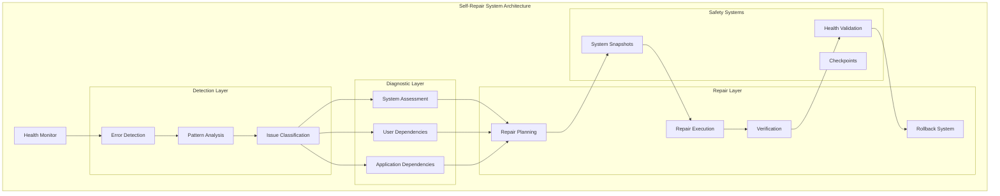
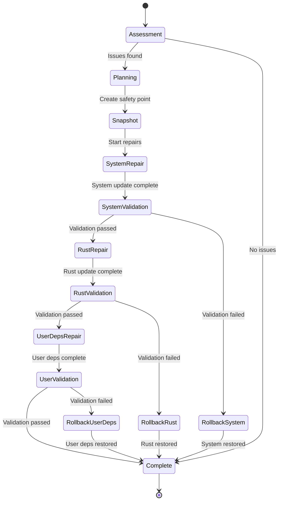
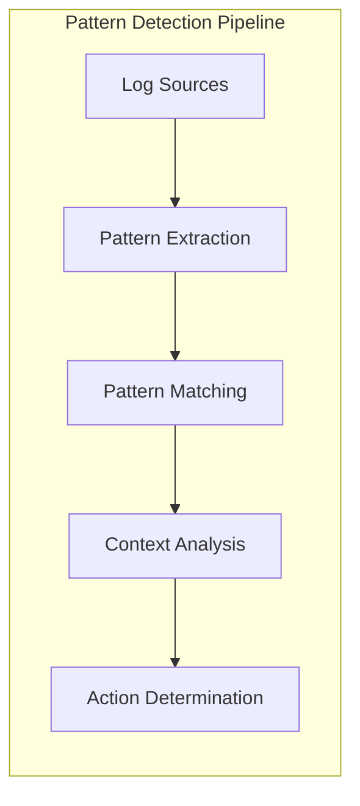

# Self-Repair System

The Self-Repair System provides automated error detection, diagnosis, and repair capabilities for OSVM CLI managed infrastructure. It continuously monitors system health and automatically resolves common issues.

## Overview

The OSVM Self-Repair System is a comprehensive automated maintenance solution that monitors multi-level dependencies, detects issues through pattern analysis, and applies targeted fixes with full rollback capabilities.

## Quick Start

```bash
# Run system health check
osvm doctor

# Enable automatic repair mode
osvm doctor --auto-repair

# Detailed diagnostic with verbose output
osvm doctor --detailed --verbose

# Manual repair for specific issue
osvm repair --issue dependency-missing --component rust-toolchain
```

## Architecture



## Core Components

### Health Monitor

Continuous monitoring of system components and dependencies.

**Monitored Components:**
- System packages and dependencies
- Rust toolchain and cargo
- Solana CLI and tools
- Network connectivity
- Configuration files
- Service status

### Error Detection Engine

Intelligent error pattern recognition and classification.

```mermaid
sequenceDiagram
    participant CMD as Command
    participant DETECT as Error Detector
    participant ANALYZE as Pattern Analyzer
    participant CLASSIFY as Classifier
    participant REPAIR as Repair Engine
    
    CMD->>DETECT: Command execution error
    DETECT->>ANALYZE: Extract error patterns
    ANALYZE->>CLASSIFY: Categorize issue type
    CLASSIFY->>REPAIR: Determine repair strategy
    REPAIR->>CMD: Apply fix automatically
    
    classDef techDebt fill:#f6f6f6,stroke:#d9534f,color:#d9534f,font-family:Consolas,monospace,font-weight:bold
```

### Repair Strategies

Multi-level repair approach with safety checkpoints.

**System Level Repairs:**
- Package manager updates
- Dependency installation
- Environment configuration
- Service restarts

**User Level Repairs:**
- Solana CLI updates
- Configuration fixes
- Keypair validation
- Network settings

**Application Level Repairs:**
- Binary updates
- Configuration validation
- Cache clearing
- State reset

## Doctor Command

The doctor command provides comprehensive system diagnostics and repair capabilities.

### Basic Usage

```bash
# Quick health check
osvm doctor

# Detailed diagnostic report
osvm doctor --detailed

# Auto-repair mode
osvm doctor --auto-repair

# Verbose output with debug information
osvm doctor --verbose

# Check specific component
osvm doctor --component rust-toolchain

# Dry run to see what would be repaired
osvm doctor --dry-run --auto-repair
```

### Command Options

```bash
osvm doctor [OPTIONS]
```

**Options:**
- `--auto-repair` - Automatically apply repairs
- `--detailed` - Show detailed diagnostic information
- `--verbose` - Enable verbose logging
- `--component <COMPONENT>` - Check specific component
- `--dry-run` - Show repair plan without executing
- `--force` - Force repairs even if risky
- `--backup` - Create backup before repairs

## Supported Issue Types

### System Dependencies

**Missing Packages:**
- Build tools (gcc, make, cmake)
- System libraries
- Development headers
- Package manager issues

**Detection:**
```bash
Error: linker `cc` not found
```

**Automatic Fix:**
```bash
# Ubuntu/Debian
sudo apt update && sudo apt install build-essential

# CentOS/RHEL
sudo yum groupinstall "Development Tools"

# macOS
xcode-select --install
```

### Rust Toolchain Issues

**Outdated Toolchain:**
- Rust version compatibility
- Missing components
- Corrupted installation

**Detection:**
```bash
error: rustc 1.60.0 is too old for this crate
```

**Automatic Fix:**
```bash
rustup update stable
rustup component add rustfmt clippy
```

### Solana CLI Problems

**Version Mismatches:**
- CLI version incompatibility
- Missing features
- Configuration errors

**Detection:**
```bash
Error: Unknown subcommand 'feature'
```

**Automatic Fix:**
```bash
solana-install update
solana config set --url https://api.mainnet-beta.solana.com
```

### Network Connectivity

**RPC Endpoint Issues:**
- Unreachable endpoints
- Timeout problems
- Authentication failures

**Detection:**
```bash
Error: RPC request failed: Connection timeout
```

**Automatic Fix:**
```bash
# Test alternative endpoints
# Update configuration
# Setup ngrok tunnels if needed
```

## Multi-Stage Repair Process



## Safety Systems

### System Snapshots

Automatic creation of system state snapshots before repairs.

**Snapshot Contents:**
- Package versions
- Configuration files
- Environment variables
- Service states

**Snapshot Management:**
```bash
# List available snapshots
osvm doctor --list-snapshots

# Restore from snapshot
osvm doctor --restore-snapshot <SNAPSHOT_ID>

# Clean old snapshots
osvm doctor --cleanup-snapshots
```

### Rollback Capabilities

Comprehensive rollback system for failed repairs.

**Rollback Triggers:**
- Repair verification failure
- System instability detection
- User-initiated rollback
- Timeout during repair

**Rollback Process:**
1. Stop current repair process
2. Restore previous package versions
3. Revert configuration changes
4. Restart affected services
5. Validate system health

### Health Validation

Post-repair validation ensures system stability.

**Validation Tests:**
- Basic command execution
- Network connectivity
- Service functionality
- Performance benchmarks

## Error Pattern Detection

### Log Pattern Analysis

Intelligent analysis of error logs and output patterns.



**Supported Patterns:**
- Compilation errors
- Runtime exceptions
- Network timeouts
- Permission issues
- Configuration problems

### Machine Learning Integration

Advanced pattern recognition using historical data.

**Learning Components:**
- Error classification
- Repair success prediction
- Performance impact analysis
- Risk assessment

## Configuration

### Auto-Repair Settings

```yaml
self_repair:
  enabled: true
  auto_repair: false
  backup_before_repair: true
  max_repair_attempts: 3
  rollback_on_failure: true
  
monitoring:
  interval_seconds: 300
  health_check_timeout: 30
  log_analysis: true
  
safety:
  create_snapshots: true
  max_snapshots: 10
  require_confirmation: true
  dangerous_repairs_allowed: false
```

### Component-Specific Settings

```yaml
components:
  rust_toolchain:
    auto_update: true
    required_version: ">=1.70.0"
    components: ["rustfmt", "clippy"]
    
  solana_cli:
    auto_update: false
    version_check: true
    config_validation: true
    
  system_packages:
    auto_install: true
    package_manager: "auto"
    update_repos: true
```

## Emergency Recovery Mode

Special recovery mode for severe system issues.

### Activation

```bash
# Enter emergency recovery mode
osvm emergency-recovery

# Recovery with minimal dependencies
osvm emergency-recovery --minimal

# Factory reset mode
osvm emergency-recovery --reset
```

### Recovery Capabilities

**Minimal Bootstrap:**
- Clean Rust installation
- Basic Solana CLI setup
- Essential system dependencies
- Default configurations

**State Recovery:**
- Restore from backups
- Rebuild corrupted state
- Reset to known good configuration
- Preserve user data

## Monitoring and Alerting

### Health Metrics

Continuous collection of health indicators:

- **System Health Score:** Overall system status (0-100)
- **Component Status:** Individual component health
- **Repair Success Rate:** Historical repair effectiveness
- **Performance Impact:** System performance after repairs

### Alert Configuration

```yaml
alerts:
  health_score_threshold: 70
  component_failure_threshold: 2
  repair_failure_threshold: 3
  
notifications:
  email:
    enabled: true
    recipients: ["admin@example.com"]
  slack:
    enabled: false
    webhook_url: ""
  logs:
    enabled: true
    level: "warn"
```

## Best Practices

### Preventive Maintenance

1. **Regular Health Checks**
   ```bash
   # Schedule daily health checks
   crontab -e
   0 9 * * * /usr/local/bin/osvm doctor --auto-repair
   ```

2. **Monitoring Setup**
   ```bash
   # Enable continuous monitoring
   osvm doctor --enable-monitoring
   ```

3. **Backup Strategy**
   ```bash
   # Configure automatic backups
   osvm doctor --configure-backups
   ```

### Repair Strategy

1. **Start Conservative**
   - Begin with detailed diagnostics
   - Use dry-run mode first
   - Enable manual confirmation

2. **Gradual Automation**
   - Enable auto-repair for safe issues
   - Monitor repair success rates
   - Gradually increase automation scope

3. **Safety First**
   - Always create snapshots
   - Enable rollback capabilities
   - Monitor system stability

## Troubleshooting

### Common Issues

**Auto-Repair Fails:**
```bash
# Check repair logs
osvm doctor --show-logs

# Manual diagnostic
osvm doctor --detailed --verbose

# Force repair with override
osvm doctor --auto-repair --force
```

**Rollback Issues:**
```bash
# List available snapshots
osvm doctor --list-snapshots

# Manual rollback
osvm doctor --rollback --snapshot <ID>

# Emergency recovery
osvm emergency-recovery
```

**Performance Degradation:**
```bash
# Check system health
osvm doctor --performance-check

# Analyze repair impact
osvm doctor --repair-analysis

# Optimize configuration
osvm doctor --optimize
```

## Integration with Other Systems

### CI/CD Integration

```yaml
# GitHub Actions example
- name: OSVM Health Check
  run: |
    osvm doctor --auto-repair
    if [ $? -ne 0 ]; then
      echo "Health check failed"
      exit 1
    fi
```

### Monitoring Integration

```bash
# Prometheus metrics endpoint
curl http://localhost:9090/metrics | grep osvm_health

# Grafana dashboard integration
osvm doctor --export-metrics --format grafana
```

## Related Documentation

- [Log Monitoring](log-monitoring.md) - Real-time log analysis
- [Node Management](node-management.md) - Node health monitoring
- [Configuration](configuration.md) - System configuration
- [Installation](installation.md) - Initial system setup