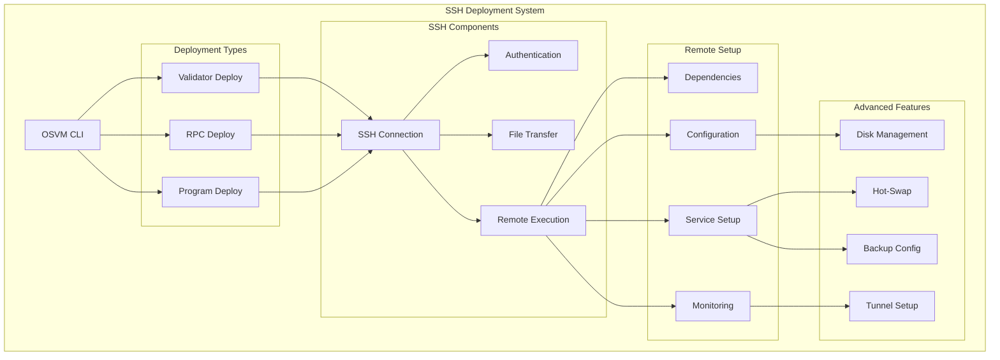
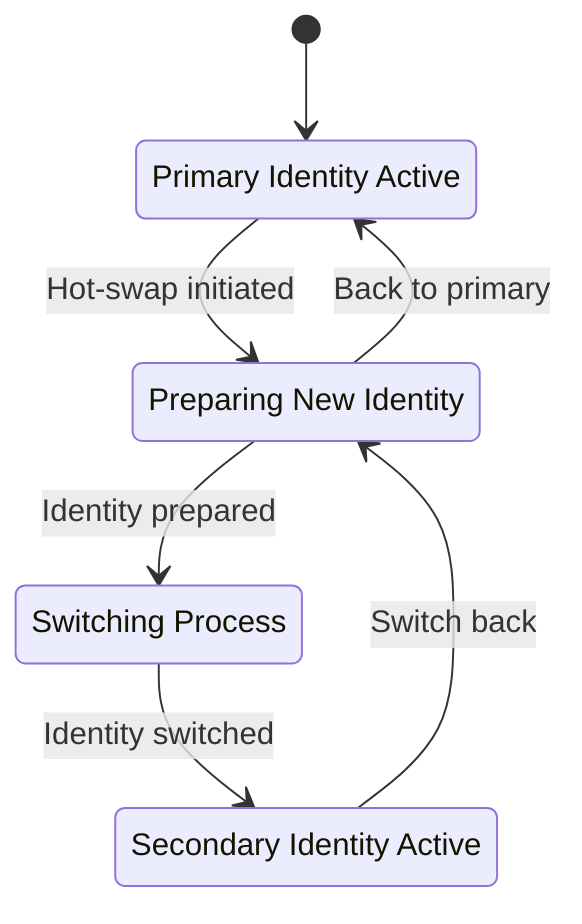

# SSH Deployment

The SSH Deployment module enables remote deployment and management of Solana validators, RPC nodes, and eBPF programs across distributed infrastructure.

## Overview

OSVM CLI provides comprehensive SSH-based deployment capabilities that handle everything from initial server setup to advanced features like hot-swap configurations, disk management, and automated monitoring.

## Quick Start

```bash
# Deploy a validator to remote host
osvm deploy-validator --host user@example.com --keypair validator.json

# Deploy an RPC node
osvm deploy-rpc --host user@example.com --network mainnet

# Deploy an eBPF program
osvm deploy-program --host user@example.com --program program.so --keypair authority.json
```

## Architecture



## Deployment Commands

### Validator Deployment

Deploy a Solana validator to a remote host with comprehensive configuration.

```bash
osvm deploy-validator [OPTIONS]
```

**Required Options:**
- `--host <HOST>` - SSH connection string (user@hostname)
- `--keypair <KEYPAIR>` - Path to identity keypair file

**Common Options:**
- `--network <NETWORK>` - Network (mainnet, testnet, devnet)
- `--ledger-disk <DEVICE>` - Ledger disk device path
- `--accounts-disk <DEVICE>` - Accounts disk device path
- `--vote-keypair <KEYPAIR>` - Vote account keypair
- `--enable-rpc` - Enable RPC endpoint
- `--monitoring` - Setup monitoring stack

**Examples:**
```bash
# Basic validator deployment
osvm deploy-validator \
  --host solana@validator.example.com \
  --keypair identity.json \
  --vote-keypair vote.json

# Advanced deployment with disk configuration
osvm deploy-validator \
  --host solana@validator.example.com \
  --keypair identity.json \
  --vote-keypair vote.json \
  --ledger-disk /dev/nvme0n1 \
  --accounts-disk /dev/nvme1n1 \
  --enable-rpc \
  --monitoring

# Hot-swap enabled deployment
osvm deploy-validator \
  --host solana@validator.example.com \
  --keypair identity.json \
  --vote-keypair vote.json \
  --hot-swap-keypair backup-identity.json \
  --enable-hot-swap
```

### RPC Node Deployment

Deploy specialized RPC nodes for serving client requests.

```bash
osvm deploy-rpc [OPTIONS]
```

**Options:**
- `--host <HOST>` - SSH connection string
- `--network <NETWORK>` - Target network
- `--rpc-port <PORT>` - RPC service port (default: 8899)
- `--websocket-port <PORT>` - WebSocket port (default: 8900)
- `--enable-private-rpc` - Enable private RPC methods
- `--accounts-db-caching` - Enable accounts database caching

### eBPF Program Deployment

Deploy Solana programs to the network via remote hosts.

```bash
osvm deploy-program [OPTIONS]
```

**Required Options:**
- `--host <HOST>` - SSH connection string
- `--program <PROGRAM>` - Path to program binary (.so file)
- `--keypair <KEYPAIR>` - Program authority keypair

**Optional Features:**
- `--upgrade` - Upgrade existing program
- `--buffer-keypair <KEYPAIR>` - Use buffer account for large programs
- `--max-sign-attempts <NUM>` - Maximum signing attempts

## Deployment Workflow

```mermaid
sequenceDiagram
    participant U as User
    participant CLI as OSVM CLI
    participant SSH as SSH Manager
    participant HOST as Remote Host
    participant SOL as Solana Network
    
    U->>CLI: deploy-validator command
    CLI->>SSH: Establish SSH connection
    SSH->>HOST: Authenticate and connect
    
    Note over SSH,HOST: System Preparation
    SSH->>HOST: Install system dependencies
    SSH->>HOST: Setup user accounts
    SSH->>HOST: Configure firewall
    
    Note over SSH,HOST: Disk Configuration
    SSH->>HOST: Detect and format disks
    SSH->>HOST: Mount ledger/accounts disks
    SSH->>HOST: Create directory structure
    
    Note over SSH,HOST: Solana Setup
    SSH->>HOST: Install Solana binaries
    SSH->>HOST: Transfer keypairs
    SSH->>HOST: Configure validator
    SSH->>HOST: Setup systemd service
    
    Note over SSH,HOST: Monitoring Setup
    SSH->>HOST: Install monitoring tools
    SSH->>HOST: Configure log rotation
    SSH->>HOST: Setup metrics collection
    
    SSH->>HOST: Start validator service
    HOST->>SOL: Connect to network
    SOL->>HOST: Begin sync process
    HOST->>SSH: Service status
    SSH->>CLI: Deployment complete
    CLI->>U: Success notification
    
    classDef techDebt fill:#f6f6f6,stroke:#d9534f,color:#d9534f,font-family:Consolas,monospace,font-weight:bold
```

## Advanced Features

### Disk Management

OSVM CLI supports automated disk configuration for optimal validator performance.

**Supported Configuration:**
- **OS Disk:** System and binaries (~500GB SSD)
- **Ledger Disk:** High-performance NVMe (≥2TB) at `/mnt/ledger`
- **Accounts Disk:** High-performance NVMe (≥2TB) at `/mnt/extras`

**Automatic Setup:**
1. Disk detection and validation
2. Filesystem creation (ext4)
3. Mount point configuration
4. Directory structure creation
5. Permission setup

```bash
# Example with disk configuration
osvm deploy-validator \
  --host validator@example.com \
  --keypair identity.json \
  --ledger-disk /dev/nvme0n1 \
  --accounts-disk /dev/nvme1n1
```

### Hot-Swap Configuration

Enable seamless validator identity switching for maintenance operations.



### Monitoring Integration

Automatic setup of comprehensive monitoring stack:

- **System Monitoring:** CPU, memory, disk, network
- **Solana Metrics:** Validator performance, vote credits, delinquency
- **Log Analysis:** Real-time log parsing and alerting
- **Dashboards:** Grafana dashboards with pre-configured panels

## SSH Connection Management

### Authentication Methods

**SSH Key Authentication (Recommended):**
```bash
# Setup SSH key for password-less access
ssh-copy-id solana@validator.example.com

# Deploy with SSH key
osvm deploy-validator --host solana@validator.example.com --keypair identity.json
```

**SSH Agent Support:**
```bash
# Add key to SSH agent
ssh-add ~/.ssh/id_rsa

# Use agent for deployment
osvm deploy-validator --host solana@validator.example.com --keypair identity.json
```

### Connection Configuration

**SSH Config File (~/.ssh/config):**
```
Host validator-1
  HostName validator1.example.com
  User solana
  IdentityFile ~/.ssh/validator_key
  Port 22
  
Host validator-2
  HostName validator2.example.com
  User solana
  IdentityFile ~/.ssh/validator_key
  Port 22
```

## Security Considerations

### Access Control

1. **Dedicated User Accounts**
   - Create dedicated `solana` user
   - Restrict sudo access
   - Use SSH key authentication

2. **Firewall Configuration**
   - Close unnecessary ports
   - Allow Solana network ports (8000-8020)
   - Restrict SSH access

3. **Keypair Management**
   - Store keypairs securely
   - Use hardware security modules when possible
   - Implement key rotation procedures

### Network Security

```bash
# Firewall configuration example
ufw default deny incoming
ufw default allow outgoing
ufw allow ssh
ufw allow 8000:8020/tcp  # Solana ports
ufw allow 8899/tcp       # RPC port (if needed)
ufw enable
```

## Configuration Files

### Deployment Configuration

Create a deployment configuration file for complex setups:

```yaml
# deployment-config.yaml
deployment:
  type: "validator"
  network: "mainnet"
  host: "solana@validator.example.com"
  
keypairs:
  identity: "identity.json"
  vote: "vote.json"
  
disks:
  ledger: "/dev/nvme0n1"
  accounts: "/dev/nvme1n1"
  
features:
  rpc_enabled: true
  monitoring: true
  hot_swap: true
  
system:
  optimization: true
  log_rotation: true
  metrics_collection: true
```

**Use configuration file:**
```bash
osvm deploy --config deployment-config.yaml
```

## Troubleshooting

### Connection Issues

**SSH Connection Fails:**
```bash
# Test SSH connection manually
ssh -v solana@validator.example.com

# Check SSH key permissions
chmod 600 ~/.ssh/id_rsa
chmod 644 ~/.ssh/id_rsa.pub
```

**Permission Denied:**
```bash
# Verify SSH key is added to authorized_keys
ssh-copy-id solana@validator.example.com

# Check user permissions on remote host
sudo usermod -aG sudo solana
```

### Deployment Failures

**Disk Setup Fails:**
```bash
# Check disk availability
lsblk

# Verify disk permissions
sudo fdisk -l /dev/nvme0n1
```

**Service Won't Start:**
```bash
# Check service status
systemctl status solana-validator

# Check logs
journalctl -u solana-validator -f
```

### Performance Issues

**Slow Sync:**
```bash
# Check network connectivity
ping api.mainnet-beta.solana.com

# Monitor resource usage
htop
iostat -x 1
```

## Best Practices

### Pre-deployment Checklist

1. **Server Preparation**
   - [ ] SSH access configured
   - [ ] Sudo privileges granted
   - [ ] Firewall configured
   - [ ] Disks available and unmounted

2. **Keypair Preparation**
   - [ ] Identity keypair generated
   - [ ] Vote account created
   - [ ] Keypairs backed up securely
   - [ ] Sufficient SOL for rent exemption

3. **Network Planning**
   - [ ] Network selection confirmed
   - [ ] RPC endpoints identified
   - [ ] Monitoring endpoints configured

### Post-deployment Verification

1. **Service Health**
   ```bash
   # Check validator is running
   systemctl status solana-validator
   
   # Verify network connectivity
   solana gossip
   
   # Check vote submission
   solana vote-account <VOTE_PUBKEY>
   ```

2. **Performance Monitoring**
   ```bash
   # Monitor sync progress
   solana catchup <VALIDATOR_PUBKEY>
   
   # Check resource usage
   htop
   df -h
   ```

## Related Documentation

- [Node Management](node-management.md) - Managing deployed nodes
- [Self-Repair System](self-repair-system.md) - Automated maintenance
- [Log Monitoring](log-monitoring.md) - Real-time log analysis
- [Validator Enhancements](validator-enhancements.md) - Advanced validator features