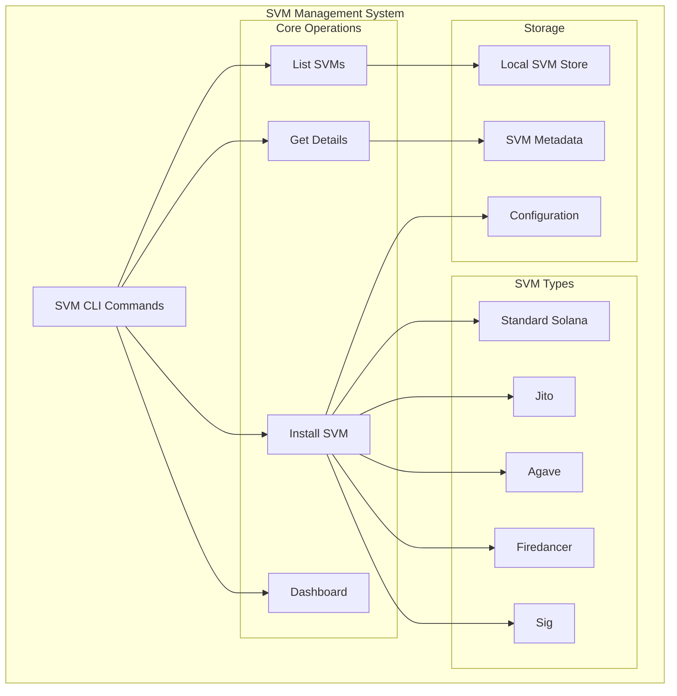

# SVM Management

The SVM (Solana Virtual Machine) management module provides comprehensive tools for listing, installing, and managing Solana Virtual Machines in your development and production environments.

## Overview

OSVM CLI supports multiple SVM implementations and provides unified management across different Solana client types including standard Solana, Jito, Agave, Firedancer, and Sig.

## Quick Start

```bash
# List all available SVMs
osvm svm list

# Install a specific SVM
osvm svm install --version 1.18.0

# Get details about an SVM
osvm svm get 1.18.0

# Launch interactive SVM dashboard
osvm svm dashboard
```

## Architecture



## Commands

### `osvm svm list`

Lists all SVMs installed in the chain.

```bash
osvm svm list
```

**Output:**
- SVM version
- Installation status
- Network compatibility
- Last used timestamp

### `osvm svm install`

Installs a new SVM with the specified version and configuration.

```bash
osvm svm install [OPTIONS]
```

**Options:**
- `--version <VERSION>` - SVM version to install
- `--client-type <TYPE>` - Client implementation (standard, jito, agave, firedancer, sig)
- `--force` - Force reinstallation if already exists

**Examples:**
```bash
# Install standard Solana 1.18.0
osvm svm install --version 1.18.0

# Install Jito client
osvm svm install --version 1.18.0 --client-type jito

# Install Agave client
osvm svm install --version 1.18.0 --client-type agave

# Install Firedancer (experimental)
osvm svm install --version latest --client-type firedancer

# Install Sig (experimental)
osvm svm install --version latest --client-type sig
```

### `osvm svm get`

Retrieves detailed information about a specific SVM installation.

```bash
osvm svm get <VERSION>
```

**Output includes:**
- Installation path
- Binary locations
- Configuration files
- Network endpoints
- Performance metrics
- Compatibility information

### `osvm svm dashboard`

Launches an interactive terminal-based dashboard for monitoring SVMs.

```bash
osvm svm dashboard
```

**Features:**
- Real-time SVM status
- Performance metrics
- Network connectivity
- Resource usage
- Interactive navigation

## SVM Types

### Standard Solana
The official Solana Labs implementation.
- Stable and well-tested
- Full feature support
- Recommended for production

### Jito
High-performance Solana client with MEV optimizations.
- Enhanced block production
- MEV extraction capabilities
- Optimized for validators

### Agave
Community-driven Solana client implementation.
- Independent development
- Focus on performance improvements
- Alternative to official client

### Firedancer (Experimental)
Jump Crypto's high-performance Solana client.
- Written in C for maximum performance
- Significant throughput improvements
- Experimental status

### Sig (Experimental)
Zig-based Solana client implementation.
- Memory-safe implementation
- Performance-focused design
- Early development stage

## Installation Workflow

```mermaid
sequenceDiagram
    participant U as User
    participant CLI as OSVM CLI
    participant DL as Downloader
    participant V as Validator
    participant S as Storage
    
    U->>CLI: osvm svm install --version 1.18.0
    CLI->>V: Validate version
    V->>CLI: Version valid
    CLI->>DL: Download SVM binaries
    DL->>CLI: Binaries downloaded
    CLI->>V: Verify signatures
    V->>CLI: Signatures valid
    CLI->>S: Store SVM
    S->>CLI: Storage complete
    CLI->>U: Installation successful
    
    classDef techDebt fill:#f6f6f6,stroke:#d9534f,color:#d9534f,font-family:Consolas,monospace,font-weight:bold
```

## Configuration

SVM installations can be customized through configuration files:

### Global Configuration
Located at `~/.config/osvm/config.yaml`

```yaml
svm:
  default_version: "1.18.0"
  default_client: "standard"
  auto_update: false
  network: "mainnet"
```

### Per-SVM Configuration
Each SVM installation maintains its own configuration:

```yaml
version: "1.18.0"
client_type: "standard"
install_date: "2023-12-01T10:00:00Z"
network_config:
  rpc_url: "https://api.mainnet-beta.solana.com"
  websocket_url: "wss://api.mainnet-beta.solana.com"
```

## Troubleshooting

### Common Issues

**Installation Fails**
```bash
# Check network connectivity
curl -I https://github.com/solana-labs/solana/releases

# Verify disk space
df -h

# Check permissions
ls -la ~/.osvm/
```

**SVM Not Found**
```bash
# List installed SVMs
osvm svm list

# Reinstall if necessary
osvm svm install --version 1.18.0 --force
```

**Version Conflicts**
```bash
# Check current active SVM
osvm svm list

# Switch to different version
osvm use 1.17.0
```

## Best Practices

1. **Version Management**
   - Keep multiple SVM versions for testing
   - Use specific versions in production
   - Test new versions in development first

2. **Client Selection**
   - Use standard Solana for production
   - Consider Jito for validator operations
   - Test experimental clients in development

3. **Monitoring**
   - Use the dashboard for real-time monitoring
   - Set up alerts for critical issues
   - Monitor resource usage regularly

## Related Documentation

- [Node Management](node-management.md) - Deploy nodes using installed SVMs
- [SSH Deployment](ssh-deployment.md) - Deploy SVMs to remote servers
- [Configuration](configuration.md) - Advanced configuration options