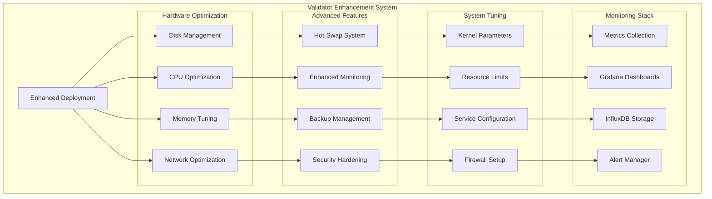
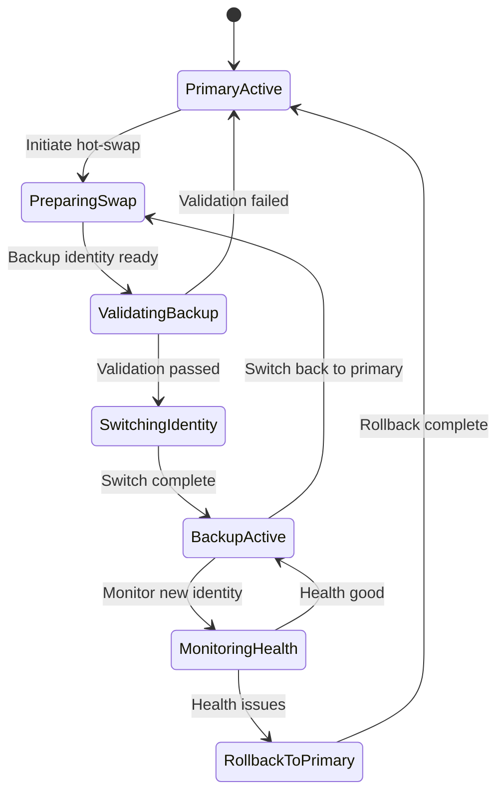
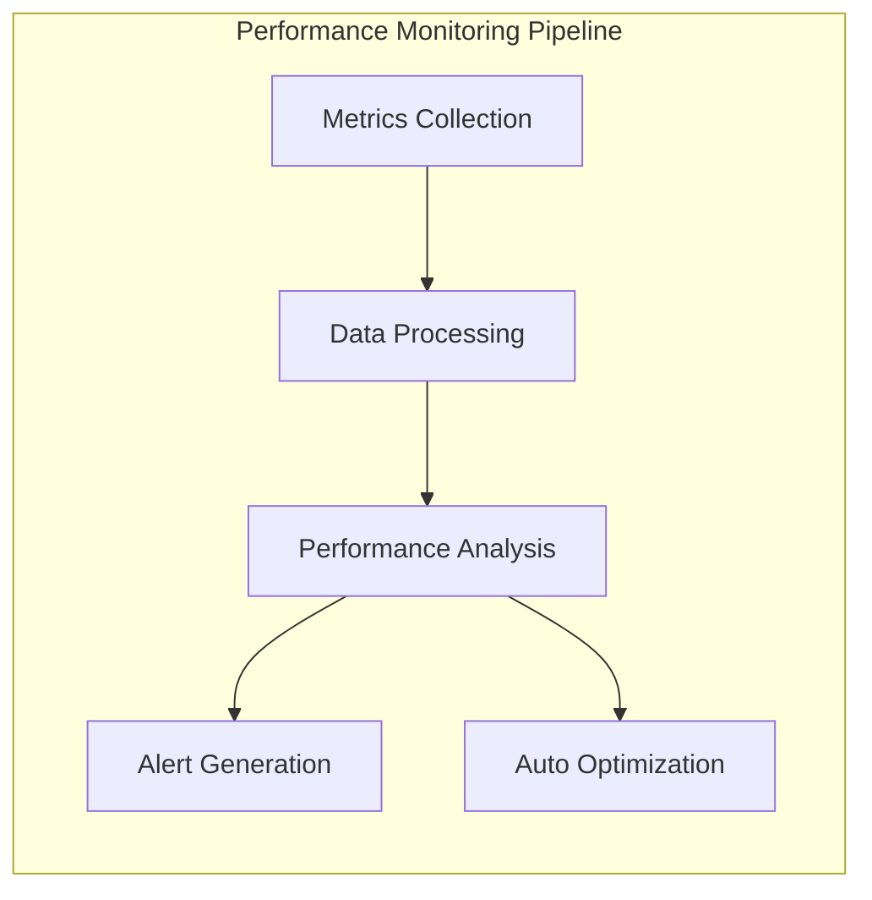

# Validator Enhancements

The Validator Enhancements module provides advanced configuration, optimization, and management features for Solana validators, including hardware optimization, disk management, hot-swap capabilities, and comprehensive monitoring.

## Overview

OSVM CLI includes extensive validator enhancement capabilities based on industry best practices and the Validator Jumpstart repository. These enhancements optimize validator performance, reliability, and maintainability through automated configuration and advanced features.

## Quick Start

```bash
# Deploy enhanced validator with disk configuration
osvm deploy-validator \
  --host validator@example.com \
  --keypair identity.json \
  --ledger-disk /dev/nvme0n1 \
  --accounts-disk /dev/nvme1n1 \
  --enable-monitoring

# Enable hot-swap capability
osvm configure-hotswap \
  --node validator-001 \
  --primary-keypair primary.json \
  --backup-keypair backup.json

# Apply system optimizations
osvm optimize-system --node validator-001 --profile production
```

## Architecture



## Hardware Optimization

### Disk Configuration

Advanced disk setup for optimal validator performance with 3-disk configuration.

**Recommended Disk Layout:**
- **OS Disk:** 500GB SSD for operating system and binaries
- **Ledger Disk:** ≥2TB NVMe SSD for ledger data at `/mnt/ledger`
- **Accounts Disk:** ≥2TB NVMe SSD for accounts and snapshots at `/mnt/extras`

```bash
# Deploy with optimized disk configuration
osvm deploy-validator \
  --host validator@example.com \
  --keypair identity.json \
  --ledger-disk /dev/nvme0n1 \
  --accounts-disk /dev/nvme1n1 \
  --optimize-disks
```

**Disk Management Features:**
- Automatic disk detection and validation
- Filesystem creation and optimization
- Mount point configuration
- Directory structure setup
- Performance tuning

### System Performance Tuning

Comprehensive system optimization for validator workloads.

```mermaid
sequenceDiagram
    participant DEPLOY as Deployment
    participant SYS as System Tuner
    participant KERNEL as Kernel Config
    participant NET as Network Stack
    participant STORAGE as Storage Stack
    
    DEPLOY->>SYS: Initialize system tuning
    SYS->>KERNEL: Configure kernel parameters
    KERNEL->>SYS: Kernel optimized
    SYS->>NET: Tune network stack
    NET->>SYS: Network optimized
    SYS->>STORAGE: Optimize storage subsystem
    STORAGE->>SYS: Storage optimized
    SYS->>DEPLOY: System tuning complete
    
    classDef techDebt fill:#f6f6f6,stroke:#d9534f,color:#d9534f,font-family:Consolas,monospace,font-weight:bold
```

**Performance Optimizations:**

**CPU Governor Settings:**
```bash
# Set performance governor
echo 'performance' | sudo tee /sys/devices/system/cpu/cpu*/cpufreq/scaling_governor
```

**Kernel Parameters:**
```bash
# Network optimization
net.core.rmem_default = 134217728
net.core.rmem_max = 134217728
net.core.wmem_default = 134217728
net.core.wmem_max = 134217728

# File descriptor limits
fs.file-max = 2000000

# Memory management
vm.max_map_count = 1000000
vm.swappiness = 1
```

**File Descriptor Limits:**
```bash
# /etc/security/limits.conf
solana soft nofile 1000000
solana hard nofile 1000000
```

## Hot-Swap Capability

Advanced hot-swap system for seamless validator identity transitions.

### Hot-Swap Configuration

Setup and configuration of hot-swap capability for production validators.

```bash
# Configure hot-swap system
osvm configure-hotswap \
  --node validator-001 \
  --primary-keypair identity-primary.json \
  --backup-keypair identity-backup.json \
  --stake-pool-authority stake-authority.json
```

**Hot-Swap Features:**
- Seamless identity switching
- Automatic stake management
- Vote account preservation
- Minimal downtime transitions
- Automated monitoring

### Hot-Swap Process



**Hot-Swap Workflow:**
1. **Preparation:** Validate backup identity and stake
2. **Pre-switch:** Create system snapshot
3. **Identity Switch:** Replace identity keypair
4. **Service Restart:** Restart validator with new identity
5. **Monitoring:** Monitor validator health
6. **Validation:** Confirm successful transition

### Hot-Swap Management

```bash
# Perform hot-swap to backup identity
osvm hotswap --node validator-001 --to backup

# Check hot-swap status
osvm hotswap status --node validator-001

# Switch back to primary
osvm hotswap --node validator-001 --to primary

# Emergency rollback
osvm hotswap rollback --node validator-001
```

## Enhanced Monitoring

Comprehensive monitoring stack with metrics collection, visualization, and alerting.

### Monitoring Stack Components

**InfluxDB + Grafana Setup:**
- **InfluxDB:** Time-series database for metrics storage
- **Grafana:** Visualization dashboards
- **Telegraf:** Metrics collection agent
- **Alert Manager:** Alert processing and notification

```bash
# Deploy monitoring stack
osvm deploy-monitoring \
  --node validator-001 \
  --enable-grafana \
  --enable-influxdb \
  --configure-alerts
```

### Metrics Collection

**System Metrics:**
- CPU utilization and load
- Memory usage and pressure
- Disk I/O and space utilization
- Network throughput and errors

**Solana Metrics:**
- Vote credits and performance
- Slot processing rate
- Transaction confirmation times
- Delinquency status

**Custom Metrics:**
- Hot-swap status
- Disk health indicators
- Service availability
- Performance benchmarks

### Dashboard Configuration

```yaml
monitoring:
  influxdb:
    host: "localhost"
    port: 8086
    database: "solana_metrics"
    retention: "30d"
    
  grafana:
    host: "localhost"
    port: 3000
    admin_password: "secure_password"
    dashboards:
      - "validator_performance"
      - "system_health"
      - "network_metrics"
      
  alerts:
    cpu_threshold: 80
    memory_threshold: 90
    disk_threshold: 85
    delinquency_threshold: 5
```

## Security Enhancements

Advanced security configuration and hardening for production validators.

### Firewall Configuration

Automated firewall setup with Solana-specific rules.

```bash
# Configure validator firewall
osvm configure-firewall --node validator-001 --profile validator

# Firewall rules applied:
# - Allow SSH (port 22)
# - Allow Solana gossip (8000-8020)
# - Allow RPC if enabled (8899, 8900)
# - Deny all other incoming connections
```

**Firewall Rules:**
```bash
# UFW configuration
ufw default deny incoming
ufw default allow outgoing
ufw allow ssh
ufw allow 8000:8020/tcp  # Solana network ports
ufw allow 8000:8020/udp  # Solana network ports
ufw enable
```

### Service Hardening

Security hardening for validator services.

**Service Configuration:**
```ini
[Unit]
Description=Solana Validator
After=network.target

[Service]
Type=simple
User=solana
Group=solana
WorkingDirectory=/home/solana
ExecStart=/home/solana/.local/share/solana/install/active_release/bin/solana-validator
Restart=always
RestartSec=3
LimitNOFILE=1000000

# Security settings
NoNewPrivileges=true
ProtectSystem=strict
ProtectHome=true
ReadWritePaths=/mnt/ledger /mnt/extras /home/solana
PrivateTmp=true

[Install]
WantedBy=multi-user.target
```

### Access Control

Advanced access control and authentication.

**SSH Hardening:**
```bash
# /etc/ssh/sshd_config optimizations
PermitRootLogin no
PasswordAuthentication no
PubkeyAuthentication yes
MaxAuthTries 3
LoginGraceTime 30
```

**User Management:**
```bash
# Create dedicated solana user
useradd -m -s /bin/bash solana
usermod -aG sudo solana  # If sudo access needed

# Setup SSH keys
sudo -u solana mkdir -p /home/solana/.ssh
sudo -u solana chmod 700 /home/solana/.ssh
```

## Automated Backup Management

Comprehensive backup and recovery system for validator data.

### Backup Configuration

```yaml
backup:
  # Backup schedule
  schedule:
    snapshots: "0 */6 * * *"  # Every 6 hours
    incremental: "0 */1 * * *"  # Every hour
    
  # Backup targets
  targets:
    - type: "keypairs"
      path: "/home/solana/keypairs"
      retention: "30d"
      
    - type: "configuration"
      path: "/home/solana/config"
      retention: "7d"
      
    - type: "snapshots"
      path: "/mnt/extras/snapshot"
      retention: "3d"
      
  # Storage backends
  storage:
    local:
      enabled: true
      path: "/backup"
      
    s3:
      enabled: false
      bucket: "validator-backups"
      region: "us-east-1"
```

### Backup Operations

```bash
# Create manual backup
osvm backup create --node validator-001 --type full

# List available backups
osvm backup list --node validator-001

# Restore from backup
osvm backup restore --node validator-001 --backup-id 20231201-120000

# Schedule automated backups
osvm backup schedule --node validator-001 --config backup-config.yaml
```

## Advanced Configuration

### Environment-Specific Optimization

Different optimization profiles for various deployment scenarios.

**Production Profile:**
```yaml
optimization_profiles:
  production:
    cpu_governor: "performance"
    network_tuning: "aggressive"
    memory_overcommit: false
    swap_enabled: false
    log_level: "warn"
    
  development:
    cpu_governor: "ondemand"
    network_tuning: "moderate"
    memory_overcommit: true
    swap_enabled: true
    log_level: "debug"
    
  testing:
    cpu_governor: "powersave"
    network_tuning: "conservative"
    memory_overcommit: true
    swap_enabled: true
    log_level: "trace"
```

### Client Type Selection

Support for different Solana client implementations.

**Supported Clients:**
- **Standard Solana:** Official Solana Labs implementation
- **Jito:** MEV-optimized validator client
- **Agave:** Community-driven implementation
- **Firedancer:** High-performance C implementation (experimental)
- **Sig:** Zig-based implementation (experimental)

```bash
# Deploy with specific client
osvm deploy-validator \
  --host validator@example.com \
  --keypair identity.json \
  --client-type jito \
  --version 1.18.0
```

## Performance Monitoring

### Real-time Performance Analysis

Continuous monitoring of validator performance metrics.



**Performance Metrics:**
- Slot processing efficiency
- Vote credit accumulation rate
- Transaction confirmation latency
- Resource utilization trends
- Network peer connectivity

### Performance Optimization

Automated performance tuning based on metrics analysis.

**Optimization Actions:**
- Adjust CPU governor settings
- Tune network buffer sizes
- Optimize disk I/O parameters
- Configure memory allocation
- Update service parameters

```bash
# Run performance analysis
osvm analyze-performance --node validator-001

# Apply automatic optimizations
osvm optimize --node validator-001 --auto

# Generate performance report
osvm performance-report --node validator-001 --period 7d
```

## Troubleshooting

### Common Issues

**Disk Performance Problems:**
```bash
# Check disk I/O stats
iostat -x 1

# Test disk performance
fio --name=test --ioengine=libaio --iodepth=64 --rw=randwrite --bs=4k --direct=1 --size=1G --numjobs=4 --runtime=60 --group_reporting

# Check disk health
smartctl -a /dev/nvme0n1
```

**Hot-Swap Issues:**
```bash
# Check hot-swap status
osvm hotswap status --node validator-001

# Validate backup identity
solana-keygen verify backup-identity.json

# Check stake account status
solana stake-account <STAKE_ACCOUNT>
```

**Monitoring Problems:**
```bash
# Check InfluxDB status
systemctl status influxdb

# Test metrics collection
curl http://localhost:8086/ping

# Verify Grafana dashboard
curl http://localhost:3000/api/health
```

### Debug Commands

**System Diagnostics:**
```bash
# System health check
osvm system-health --node validator-001

# Disk diagnostics
osvm disk-check --node validator-001

# Network diagnostics
osvm network-test --node validator-001
```

**Performance Diagnostics:**
```bash
# Performance baseline
osvm benchmark --node validator-001

# Resource monitoring
osvm monitor-resources --node validator-001 --duration 300

# Service diagnostics
osvm service-check --node validator-001
```

## Best Practices

### Hardware Planning

1. **CPU Requirements**
   - Minimum: 16 cores, 2.8GHz
   - Recommended: 32+ cores, 3.0GHz+
   - Consider AMD EPYC or Intel Xeon

2. **Memory Requirements**
   - Minimum: 256GB RAM
   - Recommended: 512GB+ RAM
   - ECC memory preferred

3. **Storage Requirements**
   - OS: 500GB SSD
   - Ledger: 2TB+ NVMe SSD
   - Accounts: 2TB+ NVMe SSD
   - Consider NVMe over SATA

### Deployment Strategy

1. **Pre-deployment**
   - Test hardware configuration
   - Validate network connectivity
   - Prepare keypairs and stake
   - Setup monitoring infrastructure

2. **Deployment**
   - Use staging environment first
   - Deploy during low-traffic periods
   - Monitor deployment progress
   - Validate all systems post-deployment

3. **Post-deployment**
   - Monitor performance metrics
   - Setup automated backups
   - Configure alerting
   - Document configuration

### Maintenance Procedures

1. **Regular Maintenance**
   - Monitor disk space usage
   - Check system performance metrics
   - Update system packages
   - Rotate log files

2. **Emergency Procedures**
   - Document emergency contacts
   - Prepare rollback procedures
   - Test disaster recovery plans
   - Maintain spare hardware

## Related Documentation

- [SSH Deployment](ssh-deployment.md) - Remote deployment capabilities
- [Node Management](node-management.md) - Node management features
- [Self-Repair System](self-repair-system.md) - Automated maintenance
- [Log Monitoring](log-monitoring.md) - Advanced log analysis